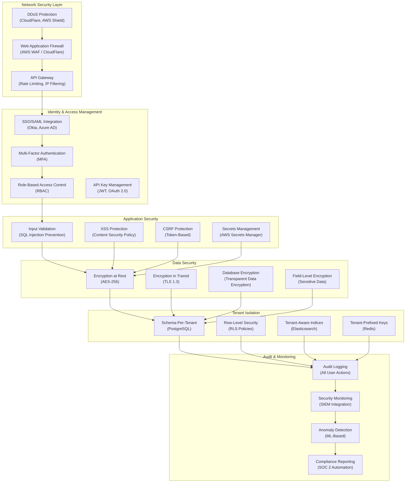

# Security, Data Privacy, and Enterprise Compliance Requirements

**Date**: 2025-11-18
**Sprint**: 06 - Digital Transformation Consulting Research Enablement
**Task**: 03 - Solution Architecture
**Author**: Solution Architect Skill

---

## Executive Summary

This document details the comprehensive security architecture designed to meet enterprise requirements including SOC 2 Type II compliance, GDPR data privacy regulations, and industry-standard security controls. The architecture implements defense-in-depth principles with multiple security layers: network security, application security, data security, identity and access management, and operational security.

Key security controls include encryption at-rest (AES-256) and in-transit (TLS 1.3), role-based access control (RBAC) with granular permissions, tenant data isolation (schema-per-tenant with row-level security), comprehensive audit logging, automated backup and disaster recovery, and SOC 2 evidence collection automation.

The security architecture addresses consulting-specific risks including client data confidentiality, competitive intelligence protection, and secure CRM integration with credential encryption and token management.

---

## Security Architecture Overview



---

## Data Encryption

### Encryption at Rest

**Database Encryption (PostgreSQL TDE)**:

```sql
-- Enable Transparent Data Encryption (TDE) at database level
-- Requires PostgreSQL with TDE support or AWS RDS encryption

-- Create encrypted database
CREATE DATABASE platform_db
    WITH ENCODING 'UTF8'
    ENCRYPTED = TRUE;

-- Verify encryption status
SELECT datname, datisencrypted
FROM pg_database
WHERE datname = 'platform_db';

-- Encrypted tablespaces for sensitive data
CREATE TABLESPACE encrypted_data
    LOCATION '/var/lib/postgresql/encrypted'
    WITH (encrypted = true);

-- Store sensitive tables in encrypted tablespace
CREATE TABLE tenant_12345.crm_credentials (
    id UUID PRIMARY KEY,
    user_id UUID NOT NULL,
    crm_provider VARCHAR(50),
    access_token_encrypted BYTEA NOT NULL,
    refresh_token_encrypted BYTEA NOT NULL,
    created_at TIMESTAMP DEFAULT NOW()
) TABLESPACE encrypted_data;
```

**Field-Level Encryption (Application Layer)**:

```python
from cryptography.fernet import Fernet
from cryptography.hazmat.primitives import hashes
from cryptography.hazmat.primitives.kdf.pbkdf2 import PBKDF2
import base64
import os

class FieldEncryptionService:
    def __init__(self, master_key: str):
        """Initialize with master encryption key from AWS Secrets Manager"""
        self.master_key = master_key.encode()

    def _derive_key(self, tenant_id: str) -> bytes:
        """Derive tenant-specific encryption key from master key"""

        kdf = PBKDF2(
            algorithm=hashes.SHA256(),
            length=32,
            salt=tenant_id.encode(),
            iterations=100000,
        )

        key = base64.urlsafe_b64encode(kdf.derive(self.master_key))
        return key

    def encrypt_field(self, tenant_id: str, plaintext: str) -> str:
        """Encrypt sensitive field data"""

        key = self._derive_key(tenant_id)
        cipher = Fernet(key)

        encrypted = cipher.encrypt(plaintext.encode())
        return base64.b64encode(encrypted).decode()

    def decrypt_field(self, tenant_id: str, ciphertext: str) -> str:
        """Decrypt sensitive field data"""

        key = self._derive_key(tenant_id)
        cipher = Fernet(key)

        decoded = base64.b64decode(ciphertext.encode())
        decrypted = cipher.decrypt(decoded)
        return decrypted.decode()

    def rotate_tenant_keys(self, tenant_id: str):
        """Re-encrypt tenant data with new keys (key rotation)"""

        # Fetch all encrypted fields for tenant
        query = """
            SELECT id, access_token_encrypted, refresh_token_encrypted
            FROM crm_credentials
            WHERE tenant_id = %s
        """

        records = self.db.execute(query, (tenant_id,)).fetchall()

        # Decrypt with old key, re-encrypt with new key
        for record in records:
            access_token = self.decrypt_field(tenant_id, record['access_token_encrypted'])
            refresh_token = self.decrypt_field(tenant_id, record['refresh_token_encrypted'])

            # Generate new tenant key
            new_key = self._generate_new_key(tenant_id)

            # Re-encrypt
            new_access_token = self.encrypt_field(tenant_id, access_token)
            new_refresh_token = self.encrypt_field(tenant_id, refresh_token)

            # Update database
            update_query = """
                UPDATE crm_credentials
                SET access_token_encrypted = %s,
                    refresh_token_encrypted = %s,
                    key_rotation_date = NOW()
                WHERE id = %s
            """

            self.db.execute(update_query, (new_access_token, new_refresh_token, record['id']))
```

**S3 Encryption**:

```python
import boto3

class SecureS3Manager:
    def __init__(self):
        self.s3 = boto3.client('s3')

    def upload_encrypted_file(
        self,
        tenant_id: str,
        file_data: bytes,
        filename: str
    ) -> str:
        """Upload file to S3 with server-side encryption"""

        bucket = 'platform-documents'
        key = f"tenants/{tenant_id}/{filename}"

        # Upload with server-side encryption (AES-256)
        self.s3.put_object(
            Bucket=bucket,
            Key=key,
            Body=file_data,
            ServerSideEncryption='AES256',
            # Alternative: Use AWS KMS for envelope encryption
            # ServerSideEncryption='aws:kms',
            # SSEKMSKeyId='arn:aws:kms:us-east-1:123456789:key/...',
            Metadata={
                'tenant_id': tenant_id,
                'encrypted': 'true',
                'classification': 'confidential'
            }
        )

        return f"s3://{bucket}/{key}"

    def enable_bucket_encryption(self, bucket_name: str):
        """Enable default encryption for S3 bucket"""

        self.s3.put_bucket_encryption(
            Bucket=bucket_name,
            ServerSideEncryptionConfiguration={
                'Rules': [{
                    'ApplyServerSideEncryptionByDefault': {
                        'SSEAlgorithm': 'AES256'
                    },
                    'BucketKeyEnabled': True
                }]
            }
        )
```

### Encryption in Transit

**TLS 1.3 Configuration (NGINX)**:

```nginx
# /etc/nginx/nginx.conf

server {
    listen 443 ssl http2;
    server_name api.platform.com;

    # TLS 1.3 only (disable older versions)
    ssl_protocols TLSv1.3;

    # Strong cipher suites
    ssl_ciphers 'TLS_AES_256_GCM_SHA384:TLS_CHACHA20_POLY1305_SHA256:TLS_AES_128_GCM_SHA256';
    ssl_prefer_server_ciphers off;

    # SSL certificates (managed by Let's Encrypt or AWS Certificate Manager)
    ssl_certificate /etc/ssl/certs/platform.crt;
    ssl_certificate_key /etc/ssl/private/platform.key;

    # OCSP stapling
    ssl_stapling on;
    ssl_stapling_verify on;
    ssl_trusted_certificate /etc/ssl/certs/ca-bundle.crt;

    # Security headers
    add_header Strict-Transport-Security "max-age=31536000; includeSubDomains; preload" always;
    add_header X-Content-Type-Options "nosniff" always;
    add_header X-Frame-Options "DENY" always;
    add_header X-XSS-Protection "1; mode=block" always;
    add_header Content-Security-Policy "default-src 'self'; script-src 'self' 'unsafe-inline' https://cdn.platform.com; style-src 'self' 'unsafe-inline';" always;

    # Reverse proxy to application
    location / {
        proxy_pass http://api-service:8000;
        proxy_set_header Host $host;
        proxy_set_header X-Real-IP $remote_addr;
        proxy_set_header X-Forwarded-For $proxy_add_x_forwarded_for;
        proxy_set_header X-Forwarded-Proto $scheme;
    }
}

# Redirect HTTP to HTTPS
server {
    listen 80;
    server_name api.platform.com;
    return 301 https://$server_name$request_uri;
}
```

**Database Connection Encryption**:

```python
import asyncpg
import ssl

class SecureDatabaseConnection:
    def __init__(self, database_url: str):
        self.database_url = database_url

    async def create_secure_pool(self):
        """Create connection pool with TLS encryption"""

        # SSL context for database connections
        ssl_context = ssl.create_default_context(ssl.Purpose.SERVER_AUTH)
        ssl_context.check_hostname = True
        ssl_context.verify_mode = ssl.CERT_REQUIRED

        # Load CA certificate for database server verification
        ssl_context.load_verify_locations('/etc/ssl/certs/rds-ca-bundle.pem')

        # Create connection pool with SSL
        pool = await asyncpg.create_pool(
            dsn=self.database_url,
            ssl=ssl_context,
            min_size=10,
            max_size=100,
            command_timeout=60,
        )

        return pool
```

---

## Identity and Access Management

### Role-Based Access Control (RBAC)

**Permission Model**:

```yaml
roles:
  - name: Admin
    permissions:
      - tenant:manage
      - user:create
      - user:delete
      - user:update
      - billing:view
      - billing:update
      - template:create
      - template:delete
      - audit_log:view

  - name: Consultant
    permissions:
      - technology:view
      - technology:search
      - case_study:view
      - case_study:search
      - business_case:create
      - business_case:update
      - document:generate
      - crm:integrate

  - name: Viewer
    permissions:
      - technology:view
      - case_study:view
      - document:view

  - name: Power User
    inherits_from: Consultant
    additional_permissions:
      - case_study:create  # Can contribute case studies
      - template:update  # Can modify templates
      - benchmark:export  # Can export raw benchmark data
```

**RBAC Implementation**:

```python
from enum import Enum
from typing import List, Set
from functools import wraps

class Permission(Enum):
    TECHNOLOGY_VIEW = "technology:view"
    TECHNOLOGY_EDIT = "technology:edit"
    CASE_STUDY_VIEW = "case_study:view"
    CASE_STUDY_CREATE = "case_study:create"
    BUSINESS_CASE_CREATE = "business_case:create"
    DOCUMENT_GENERATE = "document:generate"
    USER_MANAGE = "user:manage"
    TENANT_MANAGE = "tenant:manage"
    AUDIT_LOG_VIEW = "audit_log:view"

class RBACService:
    def __init__(self, db_connection):
        self.db = db_connection

    def get_user_permissions(self, user_id: str, tenant_id: str) -> Set[str]:
        """Retrieve all permissions for user in tenant"""

        query = """
            SELECT DISTINCT p.permission_name
            FROM users u
            JOIN user_roles ur ON u.id = ur.user_id
            JOIN roles r ON ur.role_id = r.id
            JOIN role_permissions rp ON r.id = rp.role_id
            JOIN permissions p ON rp.permission_id = p.id
            WHERE u.id = %s AND u.tenant_id = %s
        """

        results = self.db.execute(query, (user_id, tenant_id)).fetchall()

        return {row['permission_name'] for row in results}

    def check_permission(
        self,
        user_id: str,
        tenant_id: str,
        required_permission: Permission
    ) -> bool:
        """Check if user has specific permission"""

        user_permissions = self.get_user_permissions(user_id, tenant_id)

        return required_permission.value in user_permissions

def require_permission(permission: Permission):
    """Decorator to enforce permission checks on API endpoints"""

    def decorator(func):
        @wraps(func)
        async def wrapper(*args, **kwargs):
            # Extract user context from request
            request = kwargs.get('request')
            user_id = request.state.user_id
            tenant_id = request.state.tenant_id

            # Check permission
            rbac = RBACService(db_connection)
            if not rbac.check_permission(user_id, tenant_id, permission):
                raise HTTPException(
                    status_code=403,
                    detail=f"Permission denied: {permission.value} required"
                )

            return await func(*args, **kwargs)

        return wrapper
    return decorator

# Usage example
from fastapi import FastAPI, Request

app = FastAPI()

@app.post("/api/v1/business-cases")
@require_permission(Permission.BUSINESS_CASE_CREATE)
async def create_business_case(request: Request, data: dict):
    """Create business case (requires business_case:create permission)"""
    # Implementation
    pass
```

### Multi-Factor Authentication (MFA)

**TOTP-Based MFA**:

```python
import pyotp
import qrcode
from io import BytesIO

class MFAService:
    def __init__(self, issuer_name: str = "Platform"):
        self.issuer_name = issuer_name

    def generate_mfa_secret(self, user_id: str, email: str) -> dict:
        """Generate MFA secret for user"""

        # Generate secret key
        secret = pyotp.random_base32()

        # Create TOTP URI
        totp_uri = pyotp.totp.TOTP(secret).provisioning_uri(
            name=email,
            issuer_name=self.issuer_name
        )

        # Generate QR code
        qr = qrcode.QRCode(version=1, box_size=10, border=5)
        qr.add_data(totp_uri)
        qr.make(fit=True)

        img = qr.make_image(fill_color="black", back_color="white")
        buffer = BytesIO()
        img.save(buffer, format='PNG')
        qr_code_base64 = base64.b64encode(buffer.getvalue()).decode()

        # Store secret in database (encrypted)
        self._store_mfa_secret(user_id, secret)

        return {
            'secret': secret,
            'qr_code': qr_code_base64,
            'totp_uri': totp_uri,
        }

    def verify_mfa_token(self, user_id: str, token: str) -> bool:
        """Verify TOTP token"""

        # Retrieve user's MFA secret
        secret = self._get_mfa_secret(user_id)

        if not secret:
            return False

        # Verify token
        totp = pyotp.TOTP(secret)
        valid = totp.verify(token, valid_window=1)  # Allow 30-second window

        # Log verification attempt
        self._log_mfa_attempt(user_id, valid)

        return valid

    def _store_mfa_secret(self, user_id: str, secret: str):
        """Store encrypted MFA secret"""

        encrypted_secret = self.encryption_service.encrypt_field(user_id, secret)

        query = """
            UPDATE users
            SET mfa_secret = %s,
                mfa_enabled = true,
                mfa_setup_at = NOW()
            WHERE id = %s
        """

        self.db.execute(query, (encrypted_secret, user_id))

    def _get_mfa_secret(self, user_id: str) -> str:
        """Retrieve and decrypt MFA secret"""

        query = "SELECT mfa_secret FROM users WHERE id = %s AND mfa_enabled = true"
        result = self.db.execute(query, (user_id,)).fetchone()

        if not result or not result['mfa_secret']:
            return None

        return self.encryption_service.decrypt_field(user_id, result['mfa_secret'])
```

---

## Tenant Data Isolation

### Row-Level Security (PostgreSQL)

**RLS Policy Implementation**:

```sql
-- Enable row-level security on tenant tables
ALTER TABLE case_studies ENABLE ROW LEVEL SECURITY;
ALTER TABLE business_cases ENABLE ROW LEVEL SECURITY;
ALTER TABLE documents ENABLE ROW LEVEL SECURITY;

-- Create policy: Users can only access data from their tenant
CREATE POLICY tenant_isolation_policy ON case_studies
    USING (tenant_id = current_setting('app.current_tenant_id')::UUID);

CREATE POLICY tenant_isolation_policy ON business_cases
    USING (tenant_id = current_setting('app.current_tenant_id')::UUID);

-- Create policy: Admin role can access all tenant data (for support)
CREATE POLICY admin_access_policy ON case_studies
    TO admin_role
    USING (true);

-- Set tenant context in application connection
-- Application code sets this before executing queries:
SET app.current_tenant_id = '550e8400-e29b-41d4-a716-446655440000';
```

**Application-Level Tenant Context**:

```python
from contextvars import ContextVar
from typing import Optional
import uuid

# Context variable to store tenant ID for current request
tenant_context: ContextVar[Optional[uuid.UUID]] = ContextVar('tenant_id', default=None)

class TenantContextMiddleware:
    """Middleware to set tenant context from authenticated user"""

    async def __call__(self, request: Request, call_next):
        # Extract tenant ID from authenticated user
        user = request.state.user
        tenant_id = user.get('tenant_id')

        if tenant_id:
            # Set tenant context for this request
            token = tenant_context.set(tenant_id)

            try:
                # Set PostgreSQL session variable
                async with request.app.state.db_pool.acquire() as conn:
                    await conn.execute(
                        f"SET app.current_tenant_id = '{tenant_id}'"
                    )

                response = await call_next(request)
                return response
            finally:
                # Reset context
                tenant_context.reset(token)
        else:
            raise HTTPException(status_code=403, detail="Tenant context required")

# Add middleware to FastAPI app
app.add_middleware(TenantContextMiddleware)
```

### Cross-Tenant Data Leakage Prevention

**Automated Testing**:

```python
import pytest
from uuid import uuid4

class TenantIsolationTests:
    """Automated tests to verify tenant data isolation"""

    def test_case_study_isolation(self):
        """Verify users cannot access other tenants' case studies"""

        tenant_a_id = uuid4()
        tenant_b_id = uuid4()

        # Create case study for Tenant A
        case_study_a = self.create_case_study(tenant_a_id, "Tenant A Case Study")

        # Attempt to access from Tenant B context
        tenant_context.set(tenant_b_id)

        with pytest.raises(PermissionError):
            self.get_case_study(case_study_a['id'])

    def test_document_generation_isolation(self):
        """Verify generated documents are isolated by tenant"""

        tenant_a_id = uuid4()
        tenant_b_id = uuid4()

        # Generate document for Tenant A
        doc_a = self.generate_document(tenant_a_id, "Business Case A")

        # Attempt to access from Tenant B
        tenant_context.set(tenant_b_id)

        with pytest.raises(HTTPException):
            self.download_document(doc_a['document_id'])

    def test_cache_isolation(self):
        """Verify Redis cache keys are tenant-isolated"""

        tenant_a_id = uuid4()
        tenant_b_id = uuid4()

        # Set cache for Tenant A
        self.cache.set(tenant_a_id, "benchmark:salesforce", {"avg_roi": 150})

        # Verify Tenant B cannot access Tenant A's cache
        tenant_b_cache = self.cache.get(tenant_b_id, "benchmark:salesforce")

        assert tenant_b_cache is None
```

---

## Audit Logging

### Comprehensive Audit Trail

**Audit Log Schema**:

```sql
CREATE TABLE audit_logs (
    id UUID PRIMARY KEY DEFAULT gen_random_uuid(),
    tenant_id UUID NOT NULL,
    user_id UUID NOT NULL,
    action VARCHAR(100) NOT NULL,  -- e.g., 'case_study.view', 'document.generate'
    resource_type VARCHAR(50) NOT NULL,  -- e.g., 'case_study', 'business_case'
    resource_id UUID,
    ip_address INET,
    user_agent TEXT,
    request_method VARCHAR(10),
    request_path TEXT,
    request_body JSONB,
    response_status INTEGER,
    metadata JSONB,  -- Additional context
    created_at TIMESTAMP DEFAULT NOW()
);

-- Indexes for audit log queries
CREATE INDEX idx_audit_logs_tenant ON audit_logs(tenant_id, created_at DESC);
CREATE INDEX idx_audit_logs_user ON audit_logs(user_id, created_at DESC);
CREATE INDEX idx_audit_logs_action ON audit_logs(action);
CREATE INDEX idx_audit_logs_resource ON audit_logs(resource_type, resource_id);

-- Partition by month for performance
ALTER TABLE audit_logs PARTITION BY RANGE (created_at);

CREATE TABLE audit_logs_2025_11 PARTITION OF audit_logs
    FOR VALUES FROM ('2025-11-01') TO ('2025-12-01');
```

**Audit Logging Service**:

```python
from typing import Dict, Optional
import json

class AuditLogger:
    def __init__(self, db_connection):
        self.db = db_connection

    async def log_action(
        self,
        tenant_id: str,
        user_id: str,
        action: str,
        resource_type: str,
        resource_id: Optional[str] = None,
        metadata: Optional[Dict] = None,
        request: Optional[Request] = None
    ):
        """Log user action to audit trail"""

        # Extract request details
        ip_address = None
        user_agent = None
        request_method = None
        request_path = None

        if request:
            ip_address = request.client.host
            user_agent = request.headers.get('user-agent')
            request_method = request.method
            request_path = request.url.path

        # Insert audit log
        query = """
            INSERT INTO audit_logs (
                tenant_id, user_id, action, resource_type, resource_id,
                ip_address, user_agent, request_method, request_path, metadata
            )
            VALUES (%s, %s, %s, %s, %s, %s, %s, %s, %s, %s)
        """

        await self.db.execute(query, (
            tenant_id,
            user_id,
            action,
            resource_type,
            resource_id,
            ip_address,
            user_agent,
            request_method,
            request_path,
            json.dumps(metadata) if metadata else None
        ))

    async def query_audit_logs(
        self,
        tenant_id: str,
        filters: Dict,
        page: int = 1,
        page_size: int = 50
    ) -> Dict:
        """Query audit logs with filters"""

        # Build query dynamically based on filters
        conditions = ["tenant_id = %s"]
        params = [tenant_id]

        if filters.get('user_id'):
            conditions.append("user_id = %s")
            params.append(filters['user_id'])

        if filters.get('action'):
            conditions.append("action = %s")
            params.append(filters['action'])

        if filters.get('resource_type'):
            conditions.append("resource_type = %s")
            params.append(filters['resource_type'])

        if filters.get('date_from'):
            conditions.append("created_at >= %s")
            params.append(filters['date_from'])

        if filters.get('date_to'):
            conditions.append("created_at <= %s")
            params.append(filters['date_to'])

        where_clause = " AND ".join(conditions)

        query = f"""
            SELECT id, user_id, action, resource_type, resource_id,
                   ip_address, created_at, metadata
            FROM audit_logs
            WHERE {where_clause}
            ORDER BY created_at DESC
            LIMIT %s OFFSET %s
        """

        params.extend([page_size, (page - 1) * page_size])

        results = await self.db.fetch_all(query, params)

        # Get total count
        count_query = f"SELECT COUNT(*) as total FROM audit_logs WHERE {where_clause}"
        total = await self.db.fetch_val(count_query, params[:-2])

        return {
            "total": total,
            "page": page,
            "page_size": page_size,
            "results": [dict(row) for row in results]
        }
```

**Audit Log Decorator (Automatic Logging)**:

```python
from functools import wraps

def audit_log(action: str, resource_type: str):
    """Decorator to automatically log API endpoint actions"""

    def decorator(func):
        @wraps(func)
        async def wrapper(*args, **kwargs):
            # Extract request and user context
            request = kwargs.get('request')
            tenant_id = request.state.tenant_id
            user_id = request.state.user_id

            # Execute function
            result = await func(*args, **kwargs)

            # Extract resource ID from result if available
            resource_id = None
            if isinstance(result, dict):
                resource_id = result.get('id') or result.get('case_study_id')

            # Log action
            audit_logger = AuditLogger(db_connection)
            await audit_logger.log_action(
                tenant_id=tenant_id,
                user_id=user_id,
                action=action,
                resource_type=resource_type,
                resource_id=resource_id,
                request=request
            )

            return result

        return wrapper
    return decorator

# Usage example
@app.post("/api/v1/case-studies")
@audit_log(action="case_study.create", resource_type="case_study")
async def create_case_study(request: Request, data: dict):
    """Create case study (automatically logged)"""
    # Implementation
    pass
```

---

## Backup and Disaster Recovery

### Automated Backup Strategy

**PostgreSQL Backup Configuration**:

```yaml
backup_strategy:
  continuous_backup:
    method: Write-Ahead Log (WAL) Archiving
    retention: 35 days
    frequency: Continuous (every WAL segment)
    storage: AWS S3 (encrypted)

  snapshots:
    frequency: Daily at 2 AM UTC
    retention: 30 daily, 12 monthly
    storage: AWS RDS automated snapshots

  point_in_time_recovery:
    enabled: true
    retention_period: 35 days
    recovery_window: 5 minutes RPO

  cross_region_replication:
    enabled: true
    replica_region: us-west-2 (primary in us-east-1)
    replication_lag: < 10 seconds
```

**Backup Automation Script**:

```python
import boto3
from datetime import datetime, timedelta

class BackupManager:
    def __init__(self):
        self.rds = boto3.client('rds')
        self.s3 = boto3.client('s3')

    def create_database_snapshot(self, db_instance_id: str) -> str:
        """Create manual RDS snapshot"""

        snapshot_id = f"{db_instance_id}-{datetime.now().strftime('%Y%m%d-%H%M%S')}"

        response = self.rds.create_db_snapshot(
            DBSnapshotIdentifier=snapshot_id,
            DBInstanceIdentifier=db_instance_id,
            Tags=[
                {'Key': 'Type', 'Value': 'Manual'},
                {'Key': 'CreatedBy', 'Value': 'BackupAutomation'},
                {'Key': 'Retention', 'Value': '30days'}
            ]
        )

        return snapshot_id

    def cleanup_old_snapshots(self, db_instance_id: str, retention_days: int = 30):
        """Delete snapshots older than retention period"""

        cutoff_date = datetime.now() - timedelta(days=retention_days)

        # List all snapshots
        snapshots = self.rds.describe_db_snapshots(
            DBInstanceIdentifier=db_instance_id,
            SnapshotType='manual'
        )['DBSnapshots']

        # Delete old snapshots
        for snapshot in snapshots:
            if snapshot['SnapshotCreateTime'].replace(tzinfo=None) < cutoff_date:
                print(f"Deleting old snapshot: {snapshot['DBSnapshotIdentifier']}")
                self.rds.delete_db_snapshot(
                    DBSnapshotIdentifier=snapshot['DBSnapshotIdentifier']
                )

    def export_snapshot_to_s3(self, snapshot_id: str, s3_bucket: str):
        """Export RDS snapshot to S3 for long-term archival"""

        export_task_id = f"export-{snapshot_id}"

        response = self.rds.start_export_task(
            ExportTaskIdentifier=export_task_id,
            SourceArn=f"arn:aws:rds:us-east-1:123456789:snapshot:{snapshot_id}",
            S3BucketName=s3_bucket,
            S3Prefix=f"database-exports/{datetime.now().year}/",
            IamRoleArn='arn:aws:iam::123456789:role/rds-snapshot-export',
            KmsKeyId='arn:aws:kms:us-east-1:123456789:key/...',  # KMS encryption
            ExportOnly=[]  # Export all tables
        )

        return export_task_id
```

### Disaster Recovery Plan

**Recovery Time Objective (RTO) and Recovery Point Objective (RPO)**:

| Scenario | RPO | RTO | Recovery Method |
|----------|-----|-----|-----------------|
| Database failure (primary) | < 5 minutes | < 15 minutes | Automatic failover to read replica |
| Application pod failure | 0 (no data loss) | < 1 minute | Kubernetes auto-restart |
| Availability zone failure | < 5 minutes | < 30 minutes | Multi-AZ deployment with auto-failover |
| Region failure | < 1 hour | < 4 hours | Cross-region replica promotion |
| Data corruption | < 24 hours | < 2 hours | Point-in-time recovery from snapshot |
| Ransomware attack | < 24 hours | < 8 hours | Restore from immutable S3 backup |

**Disaster Recovery Runbook**:

```yaml
disaster_recovery_procedures:
  - scenario: Database Primary Failure
    detection: RDS CloudWatch alarm triggers (connection failures)
    steps:
      - Verify read replica health status
      - Promote read replica to primary (aws rds promote-read-replica)
      - Update DNS records to point to new primary
      - Restart application pods to use new connection string
      - Create new read replica from new primary
    estimated_time: 15 minutes

  - scenario: Region Failure (us-east-1 down)
    detection: AWS Service Health Dashboard + automated health checks
    steps:
      - Activate disaster recovery plan
      - Promote cross-region read replica (us-west-2) to primary
      - Update Route53 DNS records for global traffic shift
      - Scale up Kubernetes cluster in us-west-2
      - Deploy latest application version to us-west-2
      - Verify all services operational
      - Notify customers of temporary service degradation
    estimated_time: 4 hours

  - scenario: Data Corruption Detected
    detection: Data validation checks + user reports
    steps:
      - Identify corruption scope (tables, time range)
      - Determine last known good snapshot
      - Create clone database from snapshot (point-in-time recovery)
      - Export affected tables from clone database
      - Restore clean data to production database
      - Verify data integrity with checksums
      - Resume normal operations
    estimated_time: 2 hours
```

---

## SOC 2 Compliance Automation

### Evidence Collection

**Automated SOC 2 Evidence Gathering**:

```python
from typing import List, Dict
from datetime import datetime, timedelta

class SOC2ComplianceService:
    """Automate SOC 2 evidence collection"""

    def __init__(self):
        self.evidence_bucket = 's3://platform-compliance-evidence'

    def collect_access_control_evidence(self, period_start: datetime, period_end: datetime):
        """CC6.1 - Logical Access Control"""

        evidence = {
            'control': 'CC6.1',
            'description': 'Logical and physical access controls restrict access to systems',
            'period': f"{period_start.date()} to {period_end.date()}",
            'evidence_items': []
        }

        # 1. User access reviews
        user_access_report = self._generate_user_access_report(period_start, period_end)
        evidence['evidence_items'].append({
            'type': 'user_access_review',
            'file': self._upload_evidence(user_access_report, 'user_access_review.pdf')
        })

        # 2. Failed login attempts
        failed_logins = self._query_failed_login_attempts(period_start, period_end)
        evidence['evidence_items'].append({
            'type': 'failed_login_log',
            'count': len(failed_logins),
            'file': self._upload_evidence(failed_logins, 'failed_logins.csv')
        })

        # 3. MFA enrollment report
        mfa_report = self._generate_mfa_enrollment_report()
        evidence['evidence_items'].append({
            'type': 'mfa_enrollment',
            'enrollment_rate': f"{mfa_report['enrollment_percentage']}%",
            'file': self._upload_evidence(mfa_report, 'mfa_enrollment.pdf')
        })

        return evidence

    def collect_encryption_evidence(self):
        """CC6.7 - Encryption in Transit and at Rest"""

        evidence = {
            'control': 'CC6.7',
            'description': 'Data is encrypted in transit and at rest',
            'evidence_items': []
        }

        # 1. TLS configuration scan
        tls_scan = self._scan_tls_configuration()
        evidence['evidence_items'].append({
            'type': 'tls_configuration',
            'tls_version': tls_scan['version'],
            'cipher_suites': tls_scan['cipher_suites'],
            'file': self._upload_evidence(tls_scan, 'tls_scan_report.json')
        })

        # 2. Database encryption verification
        db_encryption = self._verify_database_encryption()
        evidence['evidence_items'].append({
            'type': 'database_encryption',
            'status': 'Enabled' if db_encryption['encrypted'] else 'Disabled',
            'file': self._upload_evidence(db_encryption, 'db_encryption_status.json')
        })

        # 3. S3 bucket encryption check
        s3_encryption = self._verify_s3_encryption()
        evidence['evidence_items'].append({
            'type': 's3_encryption',
            'encrypted_buckets': s3_encryption['encrypted_count'],
            'total_buckets': s3_encryption['total_count'],
            'file': self._upload_evidence(s3_encryption, 's3_encryption_report.csv')
        })

        return evidence

    def collect_monitoring_evidence(self, period_start: datetime, period_end: datetime):
        """CC7.2 - System Monitoring"""

        evidence = {
            'control': 'CC7.2',
            'description': 'System monitoring detects and alerts on security events',
            'evidence_items': []
        }

        # 1. Security alerts triggered
        security_alerts = self._query_security_alerts(period_start, period_end)
        evidence['evidence_items'].append({
            'type': 'security_alerts',
            'alert_count': len(security_alerts),
            'critical_alerts': sum(1 for a in security_alerts if a['severity'] == 'critical'),
            'file': self._upload_evidence(security_alerts, 'security_alerts.csv')
        })

        # 2. Intrusion detection logs
        ids_logs = self._export_ids_logs(period_start, period_end)
        evidence['evidence_items'].append({
            'type': 'intrusion_detection',
            'events_detected': len(ids_logs),
            'file': self._upload_evidence(ids_logs, 'ids_logs.json')
        })

        return evidence

    def generate_quarterly_compliance_report(self, quarter: int, year: int):
        """Generate comprehensive SOC 2 compliance report"""

        # Determine quarter date range
        period_start, period_end = self._get_quarter_dates(quarter, year)

        report = {
            'period': f"Q{quarter} {year}",
            'generated_at': datetime.now().isoformat(),
            'controls': [
                self.collect_access_control_evidence(period_start, period_end),
                self.collect_encryption_evidence(),
                self.collect_monitoring_evidence(period_start, period_end),
                # ... more controls
            ]
        }

        # Upload report
        report_file = f"soc2_compliance_report_Q{quarter}_{year}.pdf"
        self._generate_pdf_report(report, report_file)

        return report
```

---

## References

1. OWASP. (2024). *Top Ten Web Application Security Risks*. Retrieved from https://owasp.org/www-project-top-ten/

2. NIST. (2024). *Cybersecurity Framework*. Retrieved from https://www.nist.gov/cyberframework

3. AWS Security. (2024). *Best Practices for Security, Identity, & Compliance*. Retrieved from https://aws.amazon.com/security/

4. PostgreSQL Documentation. (2024). *Row Security Policies*. Retrieved from https://www.postgresql.org/docs/current/ddl-rowsecurity.html

5. SOC 2 Academy. (2024). *SOC 2 Compliance Guide*. Retrieved from https://www.aicpa.org/soc4so

6. GDPR. (2024). *General Data Protection Regulation*. Retrieved from https://gdpr.eu/

7. Cryptography Python Library. (2024). *Fernet (Symmetric Encryption)*. Retrieved from https://cryptography.io/en/latest/fernet/

8. Let's Encrypt. (2024). *Free SSL/TLS Certificates*. Retrieved from https://letsencrypt.org/

9. PyOTP Documentation. (2024). *Python One-Time Password Library*. Retrieved from https://pyauth.github.io/pyotp/

10. AWS RDS. (2024). *Backup and Restore*. Retrieved from https://docs.aws.amazon.com/AmazonRDS/latest/UserGuide/CHAP_CommonTasks.BackupRestore.html
