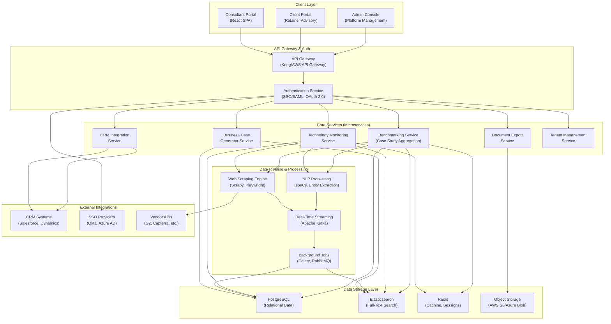
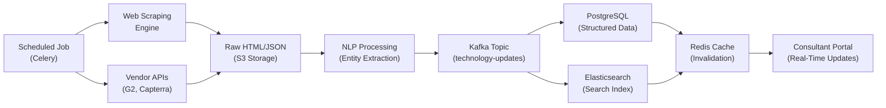
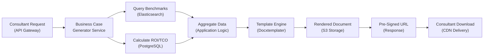
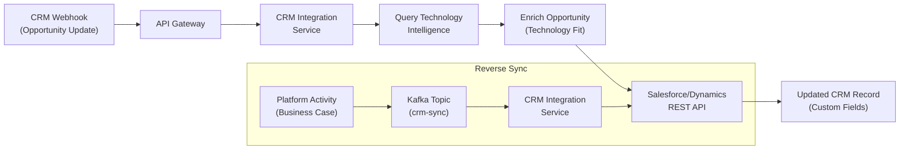
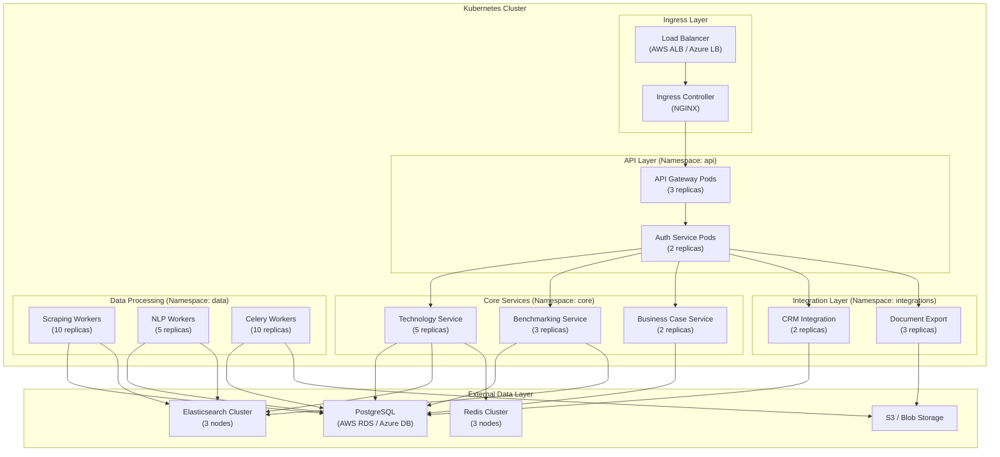

# System Architecture Overview - Continuous Intelligence Platform for Digital Transformation Consulting

**Date**: 2025-11-18
**Sprint**: 06 - Digital Transformation Consulting Research Enablement
**Task**: 03 - Solution Architecture
**Author**: Solution Architect Skill

---

## Executive Summary

This document presents the high-level system architecture for a multi-tenant SaaS platform that enables digital transformation consultants with continuous technology intelligence, implementation benchmarking, and automated business case generation. The platform is designed to support 500-1,000 concurrent consultant users with real-time technology landscape updates, sub-second query response times, and seamless integration with existing consulting workflows (CRM systems, SSO, document export).

The architecture follows cloud-native SaaS best practices with a microservices approach, event-driven data pipelines, multi-tenant database design, and horizontal scalability. Key technology choices include PostgreSQL for relational data, Elasticsearch for full-text search, Redis for caching, and containerized deployments with Kubernetes orchestration.

---

## System Architecture Overview

### High-Level Component Diagram



### Core System Components

#### 1. Client Layer

**Consultant Portal (React SPA)**<br/>
Primary interface for consultants to access technology intelligence, benchmarking data, and business case generation tools<br/>
Features: Technology comparison matrices, case study search, ROI calculators, client report builder<br/>
Performance: Sub-second page loads with lazy loading, client-side caching

**Client Portal (Retainer Advisory)**<br/>
White-labeled portal for consultants to share insights with retainer clients<br/>
Features: Curated technology briefings, custom dashboards, scheduled reports<br/>
Access control: Per-client permissions, branded experience

**Admin Console**<br/>
Platform management interface for system administrators and tenant admins<br/>
Features: User management, data source configuration, monitoring dashboards, billing management

#### 2. API Gateway & Authentication

**API Gateway (Kong/AWS API Gateway)**<br/>
Centralized entry point for all API requests with rate limiting, request routing, and monitoring<br/>
Rate limits: 1,000 requests/minute per user, 10,000 requests/minute per tenant<br/>
Features: API versioning, request/response transformation, analytics

**Authentication Service (SSO/SAML, OAuth 2.0)**<br/>
Centralized authentication supporting enterprise SSO providers (Okta, Azure AD, OneLogin)<br/>
Protocols: SAML 2.0 for SSO, OAuth 2.0 for API access, JWT for session management<br/>
Multi-tenancy: Tenant-specific SSO configurations, role-based access control (RBAC)

#### 3. Core Microservices

**Technology Monitoring Service**<br/>
Tracks 500+ digital transformation technologies with automated feature/pricing comparison<br/>
Data sources: Vendor websites, review platforms (G2, Capterra), API integrations<br/>
Update frequency: Real-time for pricing, weekly for features, monthly for vendor landscape<br/>
Performance: Sub-100ms query response with Redis caching

**Benchmarking Service (Case Study Aggregation)**<br/>
Aggregates and synthesizes 1,000+ implementation case studies from public sources<br/>
Data sources: Vendor case studies, analyst reports, news articles, conference presentations<br/>
NLP processing: Entity extraction (company, technology, timeline, budget), success factor identification<br/>
Query capabilities: Full-text search, similarity matching, industry filtering

**Business Case Generator Service**<br/>
Auto-generates stakeholder-specific business cases (CFO, CTO, CMO perspectives)<br/>
Modules: ROI calculator, TCO analysis, technical architecture diagrams, market impact assessment<br/>
Data inputs: Benchmark data, industry averages, client-specific parameters<br/>
Output formats: PowerPoint, PDF, Word with customizable templates

**CRM Integration Service**<br/>
Bi-directional sync with Salesforce and Microsoft Dynamics CRM<br/>
Sync capabilities: Opportunity enrichment, account intelligence, activity tracking<br/>
Integration patterns: REST API, webhook listeners, scheduled batch sync<br/>
Performance: Real-time for critical updates, hourly batch for bulk sync

**Document Export Service**<br/>
Generates branded consultant deliverables from platform data<br/>
Template engine: Docxtemplater for Office formats, custom PDF renderer<br/>
Output formats: PowerPoint presentations, PDF reports, Word documents, HTML<br/>
Features: Brand customization, template library, bulk generation

**Tenant Management Service**<br/>
Manages multi-tenant configuration, onboarding, and billing<br/>
Features: Tenant provisioning, subscription management, usage metering, feature flags<br/>
Multi-tenancy: Schema-based isolation for PostgreSQL, tenant-aware Elasticsearch indices

#### 4. Data Pipeline & Processing

**Web Scraping Engine (Scrapy, Playwright)**<br/>
Distributed scraping infrastructure for vendor websites and technology review platforms<br/>
Technologies: Scrapy for static content, Playwright for dynamic JavaScript-rendered pages<br/>
Scale: 500+ target websites, 10,000+ pages scraped daily<br/>
Change detection: Hash-based content comparison, automated alerts for significant updates

**NLP Processing (spaCy, Entity Extraction)**<br/>
Natural language processing pipeline for unstructured content extraction<br/>
Capabilities: Named entity recognition (companies, products, metrics), sentiment analysis, topic modeling<br/>
Models: Custom-trained NER models for DX technology taxonomy, pre-trained spaCy models<br/>
Performance: Batch processing with Celery workers, 1,000+ documents/hour

**Real-Time Streaming (Apache Kafka)**<br/>
Event streaming platform for data pipeline orchestration and real-time updates<br/>
Topics: Technology updates, case study ingestion, user activity, CRM sync events<br/>
Consumers: PostgreSQL writers, Elasticsearch indexers, notification service<br/>
Scalability: Horizontal scaling with partitioned topics

**Background Jobs (Celery, RabbitMQ)**<br/>
Asynchronous task processing for long-running operations<br/>
Use cases: Bulk document generation, scheduled data refreshes, email notifications<br/>
Queue architecture: Priority queues for user-initiated tasks, scheduled queues for maintenance<br/>
Monitoring: Flower dashboard for task monitoring

#### 5. Data Storage Layer

**PostgreSQL (Relational Data)**<br/>
Primary relational database for structured data with multi-tenant schema isolation<br/>
Data models: Tenants, users, technologies, case studies, business cases, CRM mappings<br/>
Multi-tenancy: Schema-per-tenant for data isolation, shared schema with tenant_id for lookup tables<br/>
Performance: Connection pooling (PgBouncer), read replicas, partitioning for time-series data

**Elasticsearch (Full-Text Search)**<br/>
Distributed search engine for technology comparison and case study similarity matching<br/>
Indices: Technologies index, case studies index, vendor profiles index (tenant-aware)<br/>
Query capabilities: Full-text search, faceted filtering, relevance scoring, aggregations<br/>
Performance: Cluster with 3+ nodes, replica shards for high availability

**Redis (Caching, Sessions)**<br/>
In-memory cache for frequently accessed data and user sessions<br/>
Cache patterns: Read-through for technology data, write-back for user preferences<br/>
Session storage: JWT token validation, user session state<br/>
Performance: Sub-millisecond latency, 85% faster than PostgreSQL for cached data

**Object Storage (AWS S3/Azure Blob)**<br/>
Scalable storage for generated documents, scraped raw data, and user uploads<br/>
Organization: Tenant-specific prefixes, versioning enabled, lifecycle policies<br/>
Access patterns: Pre-signed URLs for secure document delivery, CDN integration for static assets

#### 6. External Integrations

**CRM Systems (Salesforce, Dynamics)**<br/>
Bi-directional integration for opportunity enrichment and activity tracking<br/>
Integration patterns: REST APIs, webhook listeners, OAuth 2.0 authentication<br/>
Data sync: Real-time for critical updates, scheduled batch for historical data

**SSO Providers (Okta, Azure AD, OneLogin)**<br/>
Enterprise identity providers for single sign-on authentication<br/>
Protocol: SAML 2.0 for web SSO, OAuth 2.0 for API access<br/>
Configuration: Per-tenant SSO settings, Just-In-Time (JIT) user provisioning

**Vendor APIs (G2, Capterra, etc.)**<br/>
Third-party APIs for technology reviews, pricing data, and market intelligence<br/>
Rate limiting: Respect vendor API limits, implement backoff strategies<br/>
Data refresh: Daily for review scores, weekly for feature matrices

---

## Data Flow Architecture

### Technology Monitoring Data Flow



### Business Case Generation Data Flow



### CRM Integration Data Flow



---

## Key Architectural Decisions

### 1. Microservices Architecture

**Decision**: Adopt microservices pattern for core services (Technology Monitoring, Benchmarking, Business Case Generator, CRM Integration, Document Export)

**Rationale**:
- **Scalability**: Independent scaling of resource-intensive services (scraping, NLP processing, document generation)
- **Fault isolation**: Failures in one service (e.g., scraping) don't impact others (e.g., business case generation)
- **Technology flexibility**: Use optimal technologies per service (Python for NLP, Node.js for API gateway)
- **Team autonomy**: Independent development and deployment of services

**Trade-offs**:
- **Complexity**: Increased operational overhead with service orchestration, monitoring, and inter-service communication
- **Network latency**: Cross-service calls add latency compared to monolithic architecture
- **Data consistency**: Distributed data requires eventual consistency patterns

### 2. Multi-Tenant Database Strategy

**Decision**: Hybrid multi-tenancy with schema-per-tenant for core data (PostgreSQL) and tenant-aware indices (Elasticsearch)

**Rationale**:
- **Data isolation**: Schema-per-tenant provides strong isolation for compliance (GDPR, SOC 2)
- **Performance**: Tenant-specific query optimization without cross-tenant data filtering
- **Backup/restore**: Per-tenant backup and recovery without affecting other tenants
- **Scalability**: Ability to migrate large tenants to dedicated database instances

**Implementation**:
- PostgreSQL: Schema-per-tenant for transactional data, shared schema for lookup tables (technology taxonomy)
- Elasticsearch: Tenant-aware index naming convention (`technologies_tenant_123`)
- Redis: Tenant-prefixed keys for cache isolation

**Trade-offs**:
- **Schema management**: Database migrations must apply to all tenant schemas
- **Cross-tenant analytics**: Aggregated reporting requires querying multiple schemas
- **Resource utilization**: More schemas than shared tables, but better isolation

### 3. Event-Driven Data Pipeline

**Decision**: Use Apache Kafka for event streaming between data ingestion (scraping, NLP) and storage layers (PostgreSQL, Elasticsearch)

**Rationale**:
- **Decoupling**: Data producers (scrapers) and consumers (database writers) operate independently
- **Replay capability**: Re-process events for data corrections or new indices
- **Real-time updates**: Stream processing enables sub-second updates to consultant portal
- **Scalability**: Partitioned topics support parallel processing

**Trade-offs**:
- **Operational complexity**: Kafka cluster management, monitoring, and tuning
- **Latency**: Minimal overhead (10-50ms) for event processing
- **Cost**: Infrastructure costs for Kafka cluster (mitigated by cloud-managed services like AWS MSK)

### 4. Technology Stack Selection

**Decision**: Python for data processing (scraping, NLP), Node.js for API gateway, React for frontend

**Rationale**:
- **Python**: Rich ecosystem for web scraping (Scrapy, Playwright), NLP (spaCy, NLTK), data science libraries
- **Node.js**: Non-blocking I/O for API gateway, strong ecosystem (Express, Kong)
- **React**: Component-based UI, strong ecosystem, optimal for SPA performance

**Trade-offs**:
- **Polyglot challenges**: Multiple language runtimes increase deployment complexity
- **Team expertise**: Requires developers skilled in both Python and Node.js ecosystems

### 5. Caching Strategy

**Decision**: Multi-layer caching with Redis for application cache and Elasticsearch for search cache

**Rationale**:
- **Performance**: 85% latency reduction for frequently accessed technology data
- **Database offloading**: Reduce PostgreSQL load for read-heavy queries
- **Session storage**: Centralized user session management for horizontal scaling

**Cache invalidation**:
- **Technology data**: TTL-based (1 hour) + event-driven invalidation on updates
- **Search results**: Query-based cache with LRU eviction
- **User sessions**: 24-hour TTL with sliding expiration

### 6. Document Generation Architecture

**Decision**: Template-based generation with Docxtemplater for Office formats and custom PDF renderer

**Rationale**:
- **Consultant familiarity**: Templates authored in Microsoft Office (PowerPoint, Word)
- **Brand customization**: Per-tenant template libraries with logo, colors, fonts
- **Performance**: Pre-rendered templates with variable substitution faster than programmatic generation
- **Format support**: Native PowerPoint, Word, PDF output without format conversion artifacts

**Trade-offs**:
- **Template maintenance**: Changes require updating templates across all tenants
- **Complex layouts**: Programmatic generation (charts, diagrams) requires custom code

---

## Scalability Considerations

### Horizontal Scaling Strategies

**Application Services**:
- Stateless microservices deployed as Docker containers on Kubernetes
- Auto-scaling based on CPU/memory utilization and request queue depth
- Target: 500-1,000 concurrent users with 10-50 services per microservice type

**Database Scaling**:
- PostgreSQL: Read replicas for query offloading, PgBouncer connection pooling
- Elasticsearch: Cluster with 3+ nodes, replica shards for high availability
- Redis: Cluster mode for horizontal scaling, read replicas for cache offloading

**Background Jobs**:
- Celery workers with auto-scaling based on queue depth
- Priority queues: High-priority for user-initiated tasks, low-priority for scheduled jobs

### Performance Targets

| Metric | Target | Measurement |
|--------|--------|-------------|
| API Response Time | < 200ms (p95) | API Gateway metrics |
| Search Query | < 500ms (p95) | Elasticsearch query time |
| Document Generation | < 5 seconds | End-to-end generation time |
| Concurrent Users | 500-1,000 | Active WebSocket connections |
| Technology Updates | Real-time (< 1 min) | Scraping to UI display |
| Uptime | 99.9% | Monthly availability |

---

## Technology Stack Summary

### Backend Services

| Component | Technology | Justification |
|-----------|-----------|---------------|
| API Gateway | Kong / AWS API Gateway | Rate limiting, authentication, monitoring |
| Authentication | Auth0 / Custom (JWT) | SAML 2.0, OAuth 2.0, multi-tenant |
| Microservices | Python (FastAPI) | NLP libraries, scraping ecosystem |
| Background Jobs | Celery + RabbitMQ | Distributed task processing |
| Event Streaming | Apache Kafka | Real-time data pipeline |

### Data Storage

| Component | Technology | Justification |
|-----------|-----------|---------------|
| Relational DB | PostgreSQL 15+ | Multi-tenant schemas, JSONB support |
| Search Engine | Elasticsearch 8+ | Full-text search, aggregations |
| Cache | Redis 7+ | Sub-millisecond latency, sessions |
| Object Storage | AWS S3 / Azure Blob | Scalable document storage |

### Frontend

| Component | Technology | Justification |
|-----------|-----------|---------------|
| Web App | React 18+ | Component-based, strong ecosystem |
| State Management | Redux Toolkit | Centralized state, DevTools |
| UI Framework | Material-UI / Tailwind | Professional components, customizable |
| Data Fetching | React Query | Caching, auto-refresh, optimistic updates |

### Infrastructure

| Component | Technology | Justification |
|-----------|-----------|---------------|
| Container Orchestration | Kubernetes (EKS/AKS) | Auto-scaling, service mesh |
| CI/CD | GitHub Actions | Automated testing, deployment |
| Monitoring | Datadog / Grafana | APM, logs, metrics, alerts |
| CDN | CloudFront / Azure CDN | Document delivery, static assets |

---

## Integration Specifications

### CRM Integration (Salesforce)

**Integration Pattern**: REST API + Webhook listeners

**Data Sync**:
- **Outbound**: Opportunity enrichment with technology intelligence (REST API)
- **Inbound**: Opportunity updates trigger platform alerts (webhook)

**Authentication**: OAuth 2.0 with refresh tokens

**API Endpoints**:
- `GET /services/data/v58.0/sobjects/Opportunity/{id}` - Fetch opportunity details
- `PATCH /services/data/v58.0/sobjects/Opportunity/{id}` - Update with technology insights

**Webhook Configuration**:
- Platform webhook URL: `https://api.platform.com/webhooks/salesforce`
- Events: Opportunity created/updated, Account updated

### SSO Integration (SAML 2.0)

**Identity Providers**: Okta, Azure AD, OneLogin

**SAML Flow**:
1. User navigates to platform login page
2. Platform redirects to tenant-configured IdP (SP-initiated SSO)
3. IdP authenticates user and returns SAML assertion
4. Platform validates assertion, creates JWT session token
5. User redirected to platform with authenticated session

**Configuration Requirements**:
- **ACS URL**: `https://platform.com/auth/saml/acs`
- **Entity ID**: `https://platform.com/saml/metadata`
- **Attributes**: Email (required), FirstName, LastName, Department

### Document Export API

**Template Upload**: `POST /api/v1/templates`

**Generate Document**: `POST /api/v1/documents/generate`

**Request Body**:
```json
{
  "template_id": "business-case-cfo",
  "format": "pptx",
  "data": {
    "client_name": "Acme Corp",
    "technology": "Salesforce Einstein",
    "roi_5year": 2.4,
    "implementation_cost": 500000,
    "annual_savings": 300000
  }
}
```

**Response**:
```json
{
  "document_id": "doc_abc123",
  "download_url": "https://cdn.platform.com/documents/doc_abc123.pptx",
  "expires_at": "2025-11-19T12:00:00Z"
}
```

---

## Deployment Architecture

### Kubernetes Cluster Layout



---

## References

1. AWS Architecture Blog. (2024). *Let's Architect! Building multi-tenant SaaS systems*. Retrieved from https://aws.amazon.com/blogs/architecture/lets-architect-building-multi-tenant-saas-systems/

2. Microsoft Learn. (2024). *Multitenant SaaS Patterns - Azure SQL Database*. Retrieved from https://learn.microsoft.com/en-us/azure/azure-sql/database/saas-tenancy-app-design-patterns

3. Salesforce Architects. (2024). *Integration Patterns and Designs*. Retrieved from https://architect.salesforce.com/fundamentals/integration-patterns

4. Confluent. (2024). *Real-Time Web Scraping With Data Streaming and GenAI*. Retrieved from https://www.confluent.io/blog/real-time-web-scraping/

5. Frontegg. (2024). *SaaS Multitenancy: Components, Pros and Cons and Best Practices*. Retrieved from https://frontegg.com/blog/saas-multitenancy

6. Docxtemplater. (2024). *Document Generation Using Templates in Your Application*. Retrieved from https://docxtemplater.com/

7. Airbyte. (2024). *Redis vs Elasticsearch - Key Differences*. Retrieved from https://airbyte.com/data-engineering-resources/redis-vs-elasticsearch

8. Clerk. (2024). *How to Design a Multi-Tenant SaaS Architecture*. Retrieved from https://clerk.com/blog/how-to-design-multitenant-saas-architecture

9. Romexsoft. (2024). *Essential Principles of Multi-Tenant SaaS Architecture*. Retrieved from https://www.romexsoft.com/blog/multi-tenant-saas-architecture-essential-principles/

10. TrackIt Medium. (2024). *How to Add a Redis Caching Layer to Your Elasticsearch Queries*. Retrieved from https://medium.com/trackit/how-to-add-a-redis-caching-layer-to-your-elasticsearch-queries-ca56e5e84d9b
