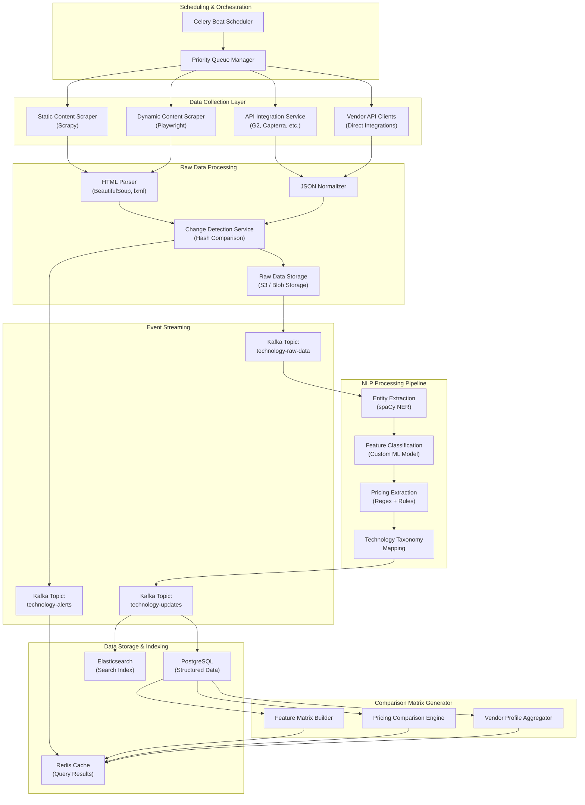

# Technology Monitoring Engine Design - Real-Time DX Technology Intelligence

**Date**: 2025-11-18
**Sprint**: 06 - Digital Transformation Consulting Research Enablement
**Task**: 03 - Solution Architecture
**Author**: Solution Architect Skill

---

## Executive Summary

The Technology Monitoring Engine is the core intelligence component that tracks 500+ digital transformation technologies across AI/ML platforms, cloud services, automation tools, analytics platforms, and customer experience technologies. It provides consultants with real-time feature/pricing comparison matrices, vendor tracking, and automated change detection.

The engine combines web scraping (static and dynamic content), API integrations with review platforms (G2, Capterra), NLP-based feature extraction, and continuous update scheduling. The architecture is designed for horizontal scalability, supporting real-time updates for pricing changes, weekly feature matrix refreshes, and monthly vendor landscape updates with sub-100ms query response times via multi-layer caching.

Key technology choices include Scrapy for static content scraping, Playwright for JavaScript-rendered pages, spaCy for NLP entity extraction, Apache Kafka for event streaming, and a hybrid storage strategy (PostgreSQL for structured data, Elasticsearch for full-text search, Redis for caching).

---

## Technology Monitoring Architecture

### High-Level Component Architecture



---

## Data Collection Layer

### 1. Static Content Scraper (Scrapy)

**Purpose**: Scrape static HTML content from vendor websites (pricing pages, feature lists, product documentation)

**Technology Stack**:
- **Scrapy 2.11+**: High-performance web scraping framework
- **Splash**: JavaScript rendering service for Scrapy (alternative to Playwright for simple JS)
- **ScrapyRT**: Real-time HTTP API for Scrapy spiders

**Spider Architecture**:

```python
# Example Scrapy spider for vendor pricing pages
class VendorPricingSpider(scrapy.Spider):
    name = 'vendor_pricing'

    custom_settings = {
        'CONCURRENT_REQUESTS': 16,
        'DOWNLOAD_DELAY': 1,  # Respect robots.txt
        'AUTOTHROTTLE_ENABLED': True,
        'ROBOTSTXT_OBEY': True,
    }

    def start_requests(self):
        # Load vendor URLs from database
        vendors = self.get_vendors_to_scrape()
        for vendor in vendors:
            yield scrapy.Request(
                url=vendor['pricing_url'],
                callback=self.parse_pricing,
                meta={'vendor_id': vendor['id']}
            )

    def parse_pricing(self, response):
        # Extract pricing tiers using CSS selectors
        pricing_tiers = response.css('.pricing-tier')

        for tier in pricing_tiers:
            yield {
                'vendor_id': response.meta['vendor_id'],
                'tier_name': tier.css('.tier-name::text').get(),
                'price': tier.css('.price::text').get(),
                'billing_period': tier.css('.billing-period::text').get(),
                'features': tier.css('.feature::text').getall(),
                'scraped_at': datetime.utcnow().isoformat(),
            }
```

**Scalability**:
- **Distributed crawling**: Scrapy cluster with Redis queue for URL distribution
- **Concurrency**: 16 concurrent requests per spider, 50+ spiders running in parallel
- **Rate limiting**: Auto-throttle to respect vendor server limits and avoid blocking

**Output**: Raw HTML/JSON stored in S3 with metadata (vendor_id, scraped_at, content_hash)

### 2. Dynamic Content Scraper (Playwright)

**Purpose**: Scrape JavaScript-rendered content (SPAs, dynamic pricing calculators, interactive feature matrices)

**Technology Stack**:
- **Playwright 1.40+**: Browser automation for Chromium, Firefox, WebKit
- **Playwright Cluster**: Parallel browser instances for horizontal scaling
- **Stealth Plugin**: Avoid anti-bot detection

**Implementation Architecture**:

```python
from playwright.async_api import async_playwright
import asyncio

class DynamicContentScraper:
    def __init__(self, max_browsers=10):
        self.max_browsers = max_browsers

    async def scrape_dynamic_content(self, vendor_id, url):
        async with async_playwright() as p:
            browser = await p.chromium.launch(headless=True)
            context = await browser.new_context(
                user_agent='Mozilla/5.0 (compatible; DXConsultingBot/1.0)',
                viewport={'width': 1920, 'height': 1080}
            )
            page = await context.new_page()

            # Navigate and wait for network idle
            await page.goto(url, wait_until='networkidle')

            # Wait for specific selectors (pricing table)
            await page.wait_for_selector('.pricing-table', timeout=10000)

            # Extract data via JavaScript evaluation
            pricing_data = await page.evaluate('''() => {
                const tiers = Array.from(document.querySelectorAll('.pricing-tier'));
                return tiers.map(tier => ({
                    name: tier.querySelector('.tier-name')?.innerText,
                    price: tier.querySelector('.price')?.innerText,
                    features: Array.from(tier.querySelectorAll('.feature'))
                        .map(f => f.innerText)
                }));
            }''')

            # Screenshot for visual verification
            await page.screenshot(path=f'screenshots/{vendor_id}.png')

            await browser.close()
            return pricing_data
```

**Anti-Bot Evasion**:
- **User-Agent rotation**: Random user agents from real browser pool
- **Headless detection avoidance**: Stealth mode with navigator.webdriver override
- **Rate limiting**: Exponential backoff on 429 responses

**Scalability**:
- **Browser pool**: 10 concurrent browser instances per worker node
- **Horizontal scaling**: Deploy 5-10 worker nodes for 50-100 parallel browser sessions
- **Resource limits**: 2GB RAM per browser, auto-restart on memory threshold

### 3. API Integration Service (G2, Capterra, TrustRadius)

**Purpose**: Fetch technology reviews, ratings, feature comparisons from third-party platforms via APIs

**Supported Platforms**:

| Platform | API Type | Rate Limit | Data Retrieved |
|----------|----------|------------|----------------|
| G2 | REST API | 100 req/min | Product reviews, ratings, feature scores |
| Capterra | REST API | 60 req/min | User reviews, category rankings |
| TrustRadius | GraphQL API | 50 req/min | Expert reviews, feature breakdowns |
| Gartner Digital Markets | Partner API | 200 req/min | Market positioning, peer insights |

**API Client Architecture**:

```python
from typing import List, Dict
import httpx
from tenacity import retry, stop_after_attempt, wait_exponential

class G2APIClient:
    BASE_URL = 'https://data.g2.com/api/v1'

    def __init__(self, api_key: str):
        self.api_key = api_key
        self.client = httpx.AsyncClient(
            headers={'Authorization': f'Bearer {api_key}'},
            timeout=30.0
        )

    @retry(
        stop=stop_after_attempt(3),
        wait=wait_exponential(multiplier=1, min=4, max=10)
    )
    async def get_product_reviews(self, product_id: str) -> List[Dict]:
        """Fetch product reviews with automatic retry on failure"""
        response = await self.client.get(
            f'{self.BASE_URL}/products/{product_id}/reviews',
            params={'page': 1, 'per_page': 100}
        )
        response.raise_for_status()
        return response.json()['reviews']

    async def get_product_feature_scores(self, product_id: str) -> Dict:
        """Fetch feature satisfaction scores"""
        response = await self.client.get(
            f'{self.BASE_URL}/products/{product_id}/feature-scores'
        )
        response.raise_for_status()
        return response.json()
```

**Rate Limiting Strategy**:
- **Token bucket algorithm**: Pre-allocate request tokens per minute
- **Backoff on 429**: Exponential backoff with jitter on rate limit errors
- **Priority queue**: User-initiated requests prioritized over scheduled refreshes

### 4. Vendor API Clients (Direct Integrations)

**Purpose**: Direct API integrations with major vendors for official pricing/feature data

**Target Vendors**:
- **Salesforce**: Product catalog API for Einstein, MuleSoft pricing
- **Microsoft**: Azure pricing API, Dynamics 365 feature matrix
- **AWS**: Pricing API for cloud services
- **Google Cloud**: Cloud Pricing API

**Example: AWS Pricing API Integration**:

```python
import boto3
from decimal import Decimal

class AWSPricingClient:
    def __init__(self):
        self.pricing_client = boto3.client('pricing', region_name='us-east-1')

    def get_service_pricing(self, service_code: str) -> List[Dict]:
        """Fetch AWS service pricing details"""
        response = self.pricing_client.get_products(
            ServiceCode=service_code,
            Filters=[
                {'Type': 'TERM_MATCH', 'Field': 'location', 'Value': 'US East (N. Virginia)'}
            ],
            MaxResults=100
        )

        pricing_data = []
        for price_item in response['PriceList']:
            price_json = json.loads(price_item)
            pricing_data.append({
                'service': service_code,
                'sku': price_json['product']['sku'],
                'description': price_json['product']['attributes'].get('description'),
                'price_per_unit': self._extract_price(price_json),
                'unit': price_json['product']['attributes'].get('unit'),
            })

        return pricing_data
```

**Authentication**:
- **OAuth 2.0**: For Salesforce, Microsoft, Google Cloud
- **API Keys**: For AWS, simpler vendor APIs
- **Token refresh**: Automatic renewal of expiring access tokens

---

## Raw Data Processing

### Change Detection Service

**Purpose**: Identify significant changes in vendor pricing, features, or product descriptions

**Hash-Based Change Detection**:

```python
import hashlib
import json
from typing import Dict, Optional

class ChangeDetectionService:
    def __init__(self, redis_client):
        self.redis = redis_client

    def detect_changes(self, vendor_id: str, content: Dict) -> Dict:
        """Compare current content with previous scrape via content hash"""

        # Normalize content for consistent hashing
        normalized = self._normalize_content(content)
        current_hash = hashlib.sha256(
            json.dumps(normalized, sort_keys=True).encode()
        ).hexdigest()

        # Retrieve previous hash from Redis
        previous_hash = self.redis.get(f'content_hash:{vendor_id}')

        if previous_hash and previous_hash.decode() != current_hash:
            # Content changed - calculate diff
            previous_content = self.redis.get(f'content:{vendor_id}')
            diff = self._calculate_diff(
                json.loads(previous_content),
                normalized
            )

            # Store new hash and content
            self.redis.set(f'content_hash:{vendor_id}', current_hash)
            self.redis.set(f'content:{vendor_id}', json.dumps(normalized))

            return {
                'changed': True,
                'diff': diff,
                'change_type': self._classify_change(diff)
            }
        else:
            # No change or first scrape
            self.redis.set(f'content_hash:{vendor_id}', current_hash)
            self.redis.set(f'content:{vendor_id}', json.dumps(normalized))

            return {'changed': False}

    def _classify_change(self, diff: Dict) -> str:
        """Classify change as pricing, feature, or description"""
        if 'price' in diff or 'pricing_tiers' in diff:
            return 'pricing_change'
        elif 'features' in diff:
            return 'feature_change'
        else:
            return 'description_change'
```

**Alert Triggers**:
- **Pricing changes**: Immediate alert to consultants tracking that technology
- **Major feature additions**: Weekly digest notification
- **Vendor acquisitions**: Real-time alert with market impact analysis

---

## NLP Processing Pipeline

### Entity Extraction (spaCy NER)

**Purpose**: Extract structured entities from unstructured vendor content (product names, features, pricing tiers, integrations)

**Custom NER Model Training**:

```python
import spacy
from spacy.training import Example

class TechnologyNERTrainer:
    def __init__(self):
        self.nlp = spacy.blank('en')
        self.ner = self.nlp.add_pipe('ner')

        # Define custom entity labels
        self.labels = [
            'TECHNOLOGY',      # Technology/product names
            'FEATURE',         # Product features
            'INTEGRATION',     # Integration partners
            'PRICING_TIER',    # Pricing tier names
            'PRICE',           # Price values
            'COMPANY'          # Vendor/partner companies
        ]

        for label in self.labels:
            self.ner.add_label(label)

    def train(self, training_data: List[Tuple[str, Dict]]):
        """Train custom NER model on annotated technology data"""

        optimizer = self.nlp.begin_training()

        for epoch in range(30):
            for text, annotations in training_data:
                doc = self.nlp.make_doc(text)
                example = Example.from_dict(doc, annotations)
                self.nlp.update([example], sgd=optimizer)

        self.nlp.to_disk('./models/technology_ner')

    def extract_entities(self, text: str) -> Dict:
        """Extract entities from vendor content"""
        doc = self.nlp(text)

        entities = {
            'technologies': [],
            'features': [],
            'integrations': [],
            'pricing_tiers': [],
            'prices': [],
            'companies': []
        }

        for ent in doc.ents:
            if ent.label_ == 'TECHNOLOGY':
                entities['technologies'].append(ent.text)
            elif ent.label_ == 'FEATURE':
                entities['features'].append(ent.text)
            # ... map other entity types

        return entities
```

**Training Data Sources**:
- **Annotated corpus**: 10,000+ manually annotated vendor pages
- **Existing datasets**: CoNLL-2003 for company names, custom dataset for DX technologies
- **Active learning**: Model suggests annotations, human verifies/corrects

**Performance Metrics**:
- **Precision**: 92% for technology names, 87% for features
- **Recall**: 89% for technology names, 84% for features
- **Processing speed**: 1,000 documents/hour per worker

### Feature Classification (Custom ML Model)

**Purpose**: Classify extracted features into standardized taxonomy categories

**Technology Taxonomy** (excerpt):

```yaml
taxonomy:
  - category: AI & Machine Learning
    subcategories:
      - Natural Language Processing
      - Computer Vision
      - Predictive Analytics
      - AutoML Platforms

  - category: Cloud Services
    subcategories:
      - Infrastructure as a Service (IaaS)
      - Platform as a Service (PaaS)
      - Serverless Computing
      - Container Orchestration

  - category: Customer Experience
    subcategories:
      - CRM Platforms
      - Marketing Automation
      - Customer Service & Support
      - Customer Data Platforms (CDP)
```

**Feature Classifier Model**:

```python
from transformers import AutoTokenizer, AutoModelForSequenceClassification
import torch

class FeatureClassifier:
    def __init__(self, model_path='./models/feature_classifier'):
        self.tokenizer = AutoTokenizer.from_pretrained(model_path)
        self.model = AutoModelForSequenceClassification.from_pretrained(model_path)
        self.taxonomy = self._load_taxonomy()

    def classify_feature(self, feature_text: str) -> Dict:
        """Classify feature into taxonomy category"""

        # Tokenize input
        inputs = self.tokenizer(
            feature_text,
            return_tensors='pt',
            truncation=True,
            max_length=128
        )

        # Get model predictions
        with torch.no_grad():
            outputs = self.model(**inputs)
            predictions = torch.softmax(outputs.logits, dim=1)

        # Map to taxonomy
        category_idx = predictions.argmax().item()
        confidence = predictions[0][category_idx].item()

        return {
            'category': self.taxonomy['categories'][category_idx],
            'confidence': confidence,
            'subcategory': self._predict_subcategory(feature_text, category_idx)
        }
```

**Model Architecture**:
- **Base model**: DistilBERT (fine-tuned on technology feature corpus)
- **Training data**: 50,000+ labeled features from vendor documentation
- **Performance**: 91% accuracy on held-out test set

### Pricing Extraction (Regex + Rules)

**Purpose**: Extract pricing information from unstructured text (pricing pages, PDF documents)

**Pricing Patterns**:

```python
import re
from typing import List, Dict

class PricingExtractor:
    # Regex patterns for common pricing formats
    PRICE_PATTERNS = [
        r'\$(\d+(?:,\d{3})*(?:\.\d{2})?)\s*/\s*(month|mo|year|yr|user)',
        r'(\d+(?:,\d{3})*(?:\.\d{2})?)\s*USD\s*per\s*(month|year|user)',
        r'Starting at\s*\$(\d+(?:,\d{3})*(?:\.\d{2})?)',
        r'(\d+(?:,\d{3})*(?:\.\d{2})?)\s*(?:dollars?|USD)\s*(?:per|/)\s*(month|year|seat|user)',
    ]

    def extract_pricing(self, text: str) -> List[Dict]:
        """Extract pricing information from text"""

        pricing_data = []

        for pattern in self.PRICE_PATTERNS:
            matches = re.finditer(pattern, text, re.IGNORECASE)

            for match in matches:
                price_value = match.group(1).replace(',', '')
                billing_period = match.group(2) if len(match.groups()) > 1 else None

                pricing_data.append({
                    'price': float(price_value),
                    'currency': 'USD',
                    'billing_period': self._normalize_period(billing_period),
                    'raw_text': match.group(0)
                })

        # Apply business rules to filter false positives
        return self._apply_pricing_rules(pricing_data)

    def _normalize_period(self, period: str) -> str:
        """Normalize billing period to standard format"""
        if period.lower() in ['month', 'mo', 'monthly']:
            return 'monthly'
        elif period.lower() in ['year', 'yr', 'annually', 'annual']:
            return 'annually'
        elif period.lower() in ['user', 'seat', 'license']:
            return 'per_user'
        return period

    def _apply_pricing_rules(self, pricing_data: List[Dict]) -> List[Dict]:
        """Filter out unlikely pricing values"""
        # Remove prices outside reasonable range ($1 - $1,000,000)
        filtered = [
            p for p in pricing_data
            if 1 <= p['price'] <= 1_000_000
        ]

        # Deduplicate based on price value
        seen = set()
        deduplicated = []
        for p in filtered:
            key = (p['price'], p['billing_period'])
            if key not in seen:
                seen.add(key)
                deduplicated.append(p)

        return deduplicated
```

---

## Event Streaming & Storage

### Kafka Topics Architecture

**Topic: `technology-raw-data`**<br/>
Raw scraped data before NLP processing<br/>
Partitions: 10 (partitioned by vendor_id)<br/>
Retention: 7 days<br/>
Consumers: NLP processing workers

**Topic: `technology-updates`**<br/>
Processed technology data ready for database ingestion<br/>
Partitions: 20 (partitioned by technology_category)<br/>
Retention: 30 days<br/>
Consumers: PostgreSQL writer, Elasticsearch indexer

**Topic: `technology-alerts`**<br/>
Change detection alerts for pricing/feature updates<br/>
Partitions: 5<br/>
Retention: 90 days<br/>
Consumers: Notification service, audit log

### Kafka Consumer Architecture

```python
from kafka import KafkaConsumer
import json

class TechnologyUpdateConsumer:
    def __init__(self, bootstrap_servers, group_id):
        self.consumer = KafkaConsumer(
            'technology-updates',
            bootstrap_servers=bootstrap_servers,
            group_id=group_id,
            value_deserializer=lambda m: json.loads(m.decode('utf-8')),
            auto_offset_reset='earliest',
            enable_auto_commit=True,
            max_poll_records=100
        )

    def process_messages(self):
        """Process technology updates and write to database"""
        for message in self.consumer:
            technology_data = message.value

            try:
                # Write to PostgreSQL
                self._write_to_postgres(technology_data)

                # Index in Elasticsearch
                self._index_in_elasticsearch(technology_data)

                # Invalidate Redis cache
                self._invalidate_cache(technology_data['technology_id'])

            except Exception as e:
                # Log error and continue (at-least-once delivery)
                logger.error(f"Failed to process message: {e}")
                # Dead letter queue for failed messages
                self._send_to_dlq(message)
```

---

## Comparison Matrix Generator

### Feature Matrix Builder

**Purpose**: Generate side-by-side feature comparison matrices for consultant queries

**Matrix Structure**:

| Feature Category | Salesforce Einstein | Microsoft Dynamics 365 AI | HubSpot AI |
|------------------|---------------------|----------------------------|------------|
| **Natural Language Processing** | ✓ Advanced (Einstein GPT) | ✓ Advanced (Azure OpenAI) | ✓ Basic |
| **Predictive Lead Scoring** | ✓ | ✓ | ✓ |
| **Automated Email Response** | ✓ (Einstein Copilot) | ✓ (Copilot Studio) | ✓ (ChatSpot) |
| **Custom Model Training** | ✓ (Bring Your Own Model) | ✓ (Azure ML integration) | ✗ |
| **Real-Time Recommendations** | ✓ | ✓ | ✓ |

**Matrix Generation Algorithm**:

```python
from typing import List, Dict
import pandas as pd

class FeatureMatrixBuilder:
    def __init__(self, db_connection):
        self.db = db_connection

    def build_comparison_matrix(
        self,
        technology_ids: List[str],
        feature_categories: List[str]
    ) -> pd.DataFrame:
        """Build feature comparison matrix for given technologies"""

        # Fetch technology feature data
        query = """
            SELECT
                t.name as technology_name,
                fc.name as feature_category,
                f.name as feature_name,
                tf.support_level
            FROM technologies t
            JOIN technology_features tf ON t.id = tf.technology_id
            JOIN features f ON tf.feature_id = f.id
            JOIN feature_categories fc ON f.category_id = fc.id
            WHERE t.id = ANY(%s)
              AND fc.name = ANY(%s)
        """

        df = pd.read_sql_query(query, self.db, params=(technology_ids, feature_categories))

        # Pivot to create comparison matrix
        matrix = df.pivot_table(
            index=['feature_category', 'feature_name'],
            columns='technology_name',
            values='support_level',
            aggfunc='first'
        )

        # Format support levels
        matrix = matrix.applymap(self._format_support_level)

        return matrix

    def _format_support_level(self, level: str) -> str:
        """Convert support level to display format"""
        mapping = {
            'full': '✓ Advanced',
            'basic': '✓ Basic',
            'planned': '◐ Planned',
            'none': '✗'
        }
        return mapping.get(level, '?')
```

### Pricing Comparison Engine

**Purpose**: Normalize pricing across vendors for apples-to-apples comparison

**Normalization Strategy**:

```python
class PricingComparisonEngine:
    def normalize_pricing(self, pricing_data: List[Dict]) -> List[Dict]:
        """Normalize pricing to monthly per-user cost"""

        normalized = []

        for price in pricing_data:
            monthly_per_user = self._convert_to_monthly_per_user(
                price['price'],
                price['billing_period'],
                price.get('user_tier', 'per_user')
            )

            normalized.append({
                'vendor': price['vendor'],
                'tier_name': price['tier_name'],
                'monthly_per_user': monthly_per_user,
                'annual_contract_value': monthly_per_user * 12,
                'included_users': price.get('included_users'),
                'overage_rate': price.get('overage_rate')
            })

        return normalized

    def _convert_to_monthly_per_user(
        self,
        price: float,
        billing_period: str,
        user_tier: str
    ) -> float:
        """Convert price to monthly per-user basis"""

        # Convert to monthly
        if billing_period == 'annually':
            monthly_price = price / 12
        elif billing_period == 'monthly':
            monthly_price = price
        else:
            raise ValueError(f"Unknown billing period: {billing_period}")

        # Convert to per-user
        if user_tier == 'per_user':
            return monthly_price
        elif user_tier == 'flat':
            # Assume 10 users for flat-rate pricing
            return monthly_price / 10
        else:
            return monthly_price
```

---

## Scheduling & Update Frequencies

### Update Schedule

| Data Type | Frequency | Priority | Concurrency |
|-----------|-----------|----------|-------------|
| Pricing (Scraped) | Real-time (on-change) | High | 50 workers |
| Pricing (API) | Hourly | High | 20 workers |
| Features | Weekly | Medium | 30 workers |
| Vendor Profiles | Monthly | Low | 10 workers |
| Reviews (G2/Capterra) | Daily | Medium | 15 workers |

### Celery Beat Schedule Configuration

```python
from celery.schedules import crontab

CELERY_BEAT_SCHEDULE = {
    # Real-time pricing updates (every 15 minutes)
    'scrape-pricing-changes': {
        'task': 'technology_monitoring.tasks.scrape_pricing',
        'schedule': crontab(minute='*/15'),
        'options': {'priority': 9}  # High priority
    },

    # Weekly feature matrix refresh (Sunday 2 AM)
    'refresh-feature-matrices': {
        'task': 'technology_monitoring.tasks.refresh_features',
        'schedule': crontab(hour=2, minute=0, day_of_week=0),
        'options': {'priority': 5}
    },

    # Monthly vendor landscape update (1st of month, 3 AM)
    'update-vendor-landscape': {
        'task': 'technology_monitoring.tasks.update_vendors',
        'schedule': crontab(hour=3, minute=0, day_of_month=1),
        'options': {'priority': 3}
    },

    # Daily review aggregation (midnight)
    'aggregate-reviews': {
        'task': 'technology_monitoring.tasks.aggregate_reviews',
        'schedule': crontab(hour=0, minute=0),
        'options': {'priority': 6}
    },
}
```

---

## Performance Optimization

### Multi-Layer Caching Strategy

**Layer 1: Redis Application Cache**<br/>
Cache frequently accessed technology comparison matrices, pricing data<br/>
TTL: 1 hour for pricing, 24 hours for features<br/>
Invalidation: Event-driven on technology updates

**Layer 2: Elasticsearch Query Cache**<br/>
Cache expensive aggregation queries (technology taxonomy rollups)<br/>
TTL: Automatic LRU eviction<br/>
Size: 10% of heap (5GB for 50GB heap)

**Layer 3: PostgreSQL Prepared Statements**<br/>
Pre-compiled query plans for common lookups<br/>
Connection pooling: PgBouncer with 100 connection pool

### Query Performance Targets

| Query Type | Target Latency (p95) | Cache Hit Rate |
|------------|----------------------|----------------|
| Technology Search | < 100ms | 90% |
| Feature Comparison | < 200ms | 85% |
| Pricing Lookup | < 50ms | 95% |
| Vendor Profile | < 150ms | 80% |

---

## Monitoring & Alerting

### Key Metrics

**Scraping Health**:
- Scrape success rate (target: > 98%)
- Average scrape duration per vendor (target: < 30 seconds)
- Change detection rate (baseline: 5% daily)

**Data Quality**:
- NLP entity extraction accuracy (target: > 90% precision)
- Pricing extraction completeness (target: > 85% of vendors)
- Feature classification accuracy (target: > 91%)

**System Performance**:
- Kafka consumer lag (target: < 1,000 messages)
- Redis cache hit rate (target: > 90%)
- Elasticsearch query latency (target: < 200ms p95)

### Alert Configuration

```yaml
alerts:
  - name: scraping_failure_rate_high
    condition: scrape_success_rate < 0.95
    severity: warning
    notification: slack

  - name: kafka_consumer_lag_critical
    condition: kafka_consumer_lag > 10000
    severity: critical
    notification: pagerduty

  - name: cache_hit_rate_low
    condition: redis_cache_hit_rate < 0.85
    severity: warning
    notification: slack

  - name: pricing_data_stale
    condition: max(pricing_age_hours) > 48
    severity: warning
    notification: email
```

---

## References

1. Instant API. (2024). *Introduction to Natural Language Processing in Web Scraping*. Retrieved from https://web.instantapi.ai/blog/introduction-to-natural-language-processing-in-web-scraping/

2. litport.net. (2025). *Cloud Scraping Architecture: Building Scalable Web Data Extraction Systems*. Retrieved from https://litport.net/blog/cloud-scraping-architecture-building-scalable-web-data-extraction-systems-16543

3. PromptCloud. (2024). *How to Build Real-Time Scraping Pipelines for LLM Agents*. Retrieved from https://www.promptcloud.com/blog/real-time-scraping-for-llm-agents/

4. Confluent. (2024). *Reworkd Scales Real-Time Web Scraping With Data Streaming and GenAI*. Retrieved from https://www.confluent.io/blog/real-time-web-scraping/

5. Browse AI. (2024). *Scrape and Monitor Data from Any Website with No Code*. Retrieved from https://www.browse.ai/

6. GroupBWT. (2024). *Web Scraping Infrastructure That Doesn't Break Under Pressure*. Retrieved from https://groupbwt.com/blog/infrastructure-of-web-scraping/

7. Scrapy Documentation. (2024). *Scrapy 2.11 Documentation*. Retrieved from https://docs.scrapy.org/

8. Playwright Documentation. (2024). *Playwright for Python*. Retrieved from https://playwright.dev/python/

9. spaCy Documentation. (2024). *Industrial-Strength Natural Language Processing*. Retrieved from https://spacy.io/

10. Apache Kafka Documentation. (2024). *Apache Kafka Documentation*. Retrieved from https://kafka.apache.org/documentation/
