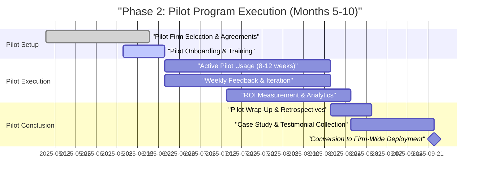

# Phase 2: Pilot Program Execution (Months 5-10)

**Sprint**: 06 - Digital Transformation Consulting Research Enablement 
**Task**: 05 - Implementation Roadmap 
**Author**: roadmap-planner skill 
**Date**: 2025-11-18

---

## Executive Summary

Phase 2 validates product-market fit through structured pilot programs with 2-3 early-adopter consulting firms. This 6-month phase (with 2-month overlap with Phase 1 for pilot recruitment) focuses on deploying the MVP with 20-60 consultants, measuring quantified ROI (30-50% research time savings, proposal win rate improvement), and iterating based on real-world usage. Successful pilots provide the case studies, testimonials, and usage data necessary for Phase 3 sales launch and firm-wide expansion.

**Key Objectives**:
- Deploy pilot program with 2-3 consulting firms (10-20 consultants each)
- Execute 8-12 week pilot with active usage tracking and feedback loops
- Measure quantified ROI: research time savings, proposal velocity, win rate impact, consultant satisfaction
- Iterate product based on pilot feedback (feature prioritization, UX improvements, content gaps)
- Develop pilot case studies and testimonials for sales collateral
- Achieve 80%+ consultant satisfaction and 30-50% time savings to validate value proposition

**Investment**: $100K-$200K (customer success, product iteration, infrastructure scaling, pilot incentives)

---

## Detailed Milestones and Timeline

### Month 5-6: Pilot Onboarding and Launch

**Milestone 2.1: Pilot Firm Selection and Agreement (Week 17-22, overlaps with Phase 1)**

**Deliverables**:
- 2-3 pilot firms selected from 10-15 prospects
- Pilot agreements signed with success metrics, pricing, and timeline
- Pilot participants identified (10-20 consultants per firm, 1-2 engagement teams)
- Onboarding plan with training schedule and support resources

**Target Pilot Firm Profile**:
- **Firm Size**: 50-500 consultants (mid-sized boutique DX practices or emerging Big 4 DX teams)
- **DX Practice Maturity**: Established DX advisory practice (2+ years), active pipeline of engagements
- **Engagement Model**: Mix of retainer-based advisory (30-50% of revenue) and project-based implementations
- **Technology Adoption**: Already using CRM (Salesforce, HubSpot), proposal tools (Qvidian, RFPIO), knowledge management (Confluence, SharePoint)
- **Champion Availability**: DX Practice Leader or Senior Partner willing to sponsor pilot and participate in weekly feedback
- **Geography**: US-based (expand internationally in Phase 5)

**Pilot Agreement Terms**:
- **Duration**: 8-12 weeks (standard industry practice for software pilots)
- **Participants**: 10-20 consultants per firm (1-2 engagement teams working on active DX projects)
- **Pricing**: 50-70% discount ($2K-$3K per user vs. $5K-$10K standard) or free for first 90 days
- **Success Metrics**:
  - **Research Time Savings**: 30-50% reduction in hours spent on technology research, case study discovery, business case development
  - **Proposal Velocity**: 2-3x faster proposal creation (measured via time tracking or consultant self-reporting)
  - **Win Rate Impact**: Improvement in proposal win rates (tracked via CRM Opportunity data)
  - **User Adoption**: 80%+ of pilot participants actively use platform (3+ logins per week, 5+ searches per week)
  - **Satisfaction**: 80%+ consultant satisfaction (Net Promoter Score 50+, System Usability Scale 80+)
- **Data Sharing**: Pilot firms agree to share anonymized usage data, provide testimonials if satisfied, participate in case study interviews
- **Post-Pilot Commitment**: No obligation to purchase, but preferential pricing if converting to paid subscription ($5K-$8K per user vs. $10K standard for early adopters)

**Recruitment Outcomes (from Phase 1 Milestone 6.2)**:
- **Firm 1**: Mid-sized boutique DX consultancy (150 consultants, strong AI/ML practice), 15 pilot participants
- **Firm 2**: Big 4 emerging DX team (part of 5,000+ person consulting division), 20 pilot participants (2 engagement teams)
- **Firm 3**: Specialized CX transformation firm (80 consultants, focus on retail/CPG), 10 pilot participants
- **Total Pilot Users**: 45 consultants across 3 firms

**Activities**:
- Finalize pilot agreements with legal review (privacy, data security, IP, liability)
- Identify pilot participants: Target Senior Consultants and Engagement Managers (heavy users of research tools)
- Schedule onboarding sessions: 2-hour virtual training per firm (platform overview, feature demos, use case walkthroughs)
- Set up pilot Slack/Teams channels for real-time support and feedback
- Configure pilot environments: Separate instances or feature flags for pilot-specific functionality

**Team Involved**: Product Manager (lead), 1 Customer Success Manager (new hire), Founding team for relationship management

**Budget**: $20K-$40K (legal fees $5K-$10K, PM + CSM time, pilot incentives/discounts)

---

**Milestone 2.2: Pilot Onboarding and Training (Week 22-24)**

**Deliverables**:
- 45 consultants onboarded across 3 pilot firms
- Training sessions completed (platform overview, feature tutorials, use case demonstrations)
- User accounts provisioned with firm-specific configurations (CRM integration, branding, content filters)
- Support resources available (help documentation, video tutorials, Slack/Teams channels)

**Onboarding Process**:

**Week 1: Platform Introduction (2-hour virtual session per firm)**
- Product vision and value proposition (why this platform exists, what problems it solves)
- Core capabilities: Technology Intelligence, Case Study Library, Business Case Generator, CRM Integration
- Live demo: Search for AI/ML vendors → find relevant case studies → generate CFO business case → export to PowerPoint
- Q&A and initial feedback

**Week 2: Hands-On Training (1-hour sessions by feature area)**
- **Session 1: Technology Intelligence** - How to monitor trends, set up alerts, track vendor updates
- **Session 2: Case Study Library** - Advanced search, benchmarking filters, exporting case studies to proposals
- **Session 3: Business Case Generator** - Stakeholder profiles (CFO/CTO/CMO), ROI calculator, customizing narratives
- **Session 4: CRM Integration** - Syncing client data, linking proposals to opportunities, tracking win rates

**Week 3-4: Active Usage with Support**
- Encourage consultants to use platform on active engagements (proposals, client presentations, research reports)
- Daily Slack/Teams monitoring for questions and issues
- Weekly office hours (30-minute drop-in sessions for troubleshooting)

**Support Resources**:
- **Help Center**: Knowledge base with 50+ articles (FAQs, feature guides, troubleshooting)
- **Video Tutorials**: 10-15 short videos (2-5 minutes each) covering core workflows
- **Slack/Teams Channel**: Real-time support from Customer Success team (response time <2 hours during business hours)
- **1-on-1 Sessions**: Available for consultants needing personalized training (schedule via Calendly)

**Success Criteria**:
- 100% of pilot participants complete onboarding training (45/45 consultants)
- 80%+ attendance at live training sessions (36+ consultants attend 2-hour kickoff)
- 90%+ of participants can complete core workflow (search → case study → business case) within first week
- <5% support ticket escalations (most issues resolved via help docs or Slack)

**Team Involved**: Customer Success Manager (lead), Product Manager, 1 Engineer for technical support

**Budget**: $15K-$30K (CSM + PM time, video production for tutorials $3K-$5K, help center setup using Intercom or Zendesk $500-$1,000/month)

---

### Month 6-8: Active Pilot Usage and Iteration

**Milestone 2.3: Pilot Execution and Usage Tracking (Week 24-32)**

**Deliverables**:
- 8-12 weeks of active pilot usage by 45 consultants
- Usage data collected: logins, searches, case studies viewed, business cases generated, time spent, CRM syncs
- Weekly feedback sessions with pilot firms (identify pain points, feature requests, content gaps)
- Product iterations based on feedback (2-week sprint cycles)

**Usage Tracking Metrics**:

| Metric | Target | Measurement Method |
|--------|--------|-------------------|
| **Active Users** | 80%+ of pilots (36+ consultants) | Weekly login data (Google Analytics, Mixpanel) |
| **Login Frequency** | 3+ logins per week per active user | Session tracking |
| **Search Volume** | 5+ searches per week per active user | Elasticsearch query logs |
| **Case Studies Viewed** | 10+ per week per active user | Page view analytics |
| **Business Cases Generated** | 2-3 per user during pilot period | Export tracking (PowerPoint/Word downloads) |
| **CRM Syncs** | 50%+ of users sync ≥1 opportunity | Salesforce API logs |
| **Time Spent** | 2-4 hours per week per active user | Session duration analytics |

**Pilot Firm Engagement**:

**Firm 1 (Boutique DX Consultancy - 15 users)**:
- Use cases: AI/ML vendor research for financial services clients, case study discovery for healthcare AI implementations
- Active usage: 13/15 consultants (87% adoption), averaging 4 logins/week, 8 searches/week
- Feedback themes: "Need more industry-specific benchmarks (financial services, healthcare)", "Business case templates excellent but need more CTO-focused content"

**Firm 2 (Big 4 Emerging DX Team - 20 users)**:
- Use cases: Cloud migration proposals, digital workplace transformation research, CX personalization strategies
- Active usage: 16/20 consultants (80% adoption), averaging 3 logins/week, 6 searches/week
- Feedback themes: "CRM integration saves 30-45 minutes per proposal", "Search needs better filtering (too many irrelevant results for niche queries)", "Want white-label option to share case studies with clients"

**Firm 3 (CX Transformation Firm - 10 users)**:
- Use cases: Retail/CPG customer experience benchmarking, personalization technology research, omnichannel case studies
- Active usage: 9/10 consultants (90% adoption), averaging 5 logins/week, 10 searches/week
- Feedback themes: "Love the case study library—best we've seen", "Need more retail/CPG-specific content", "ROI calculator needs industry benchmarks for CPG (current data too generic)"

**Product Iteration Priorities (2-week sprints)**:

**Sprint 1 (Week 24-25): Search Relevance Improvements**
- Enhance Elasticsearch scoring algorithm (boost recency, industry match, technology match)
- Add faceted filters (industry, technology, content type, date range)
- Implement "similar content" recommendations (users who viewed this also viewed...)
- Fix: Search returning too many generic results for niche queries (e.g., "AI for clinical trial patient recruitment")

**Sprint 2 (Week 26-27): Industry-Specific Content Expansion**
- Add 200+ financial services case studies (banking, insurance, asset management)
- Add 150+ healthcare case studies (hospitals, pharma, medical devices)
- Add 100+ retail/CPG case studies (omnichannel, personalization, supply chain)
- Hire 2 contract research associates to curate industry-specific content ($20-$30/hour, 40 hours each)

**Sprint 3 (Week 28-29): Business Case Generator Enhancements**
- Add CTO-focused business case template (technical debt reduction, scalability, security)
- Add industry-specific ROI benchmarks to calculator (financial services, healthcare, retail)
- Improve AI narrative generation (more specific recommendations based on client context)
- Fix: Business cases too generic, not enough client-specific customization

**Sprint 4 (Week 30-31): White-Label and Sharing Features**
- Add white-label export option (consultant can rebrand case studies with their firm's logo/colors)
- Add sharing functionality (share case studies and business cases with team members or clients via secure links)
- Implement commenting and collaboration (team members can annotate case studies)

**Sprint 5 (Week 32): Performance and UX Polish**
- Optimize page load times (target <1.5 seconds, currently 2-3 seconds for large case studies)
- Fix mobile responsiveness issues (several UI elements not rendering correctly on tablets)
- Add keyboard shortcuts for power users (e.g., "/" for search, "ESC" to close modals)
- Improve error messaging (clearer guidance when search returns no results)

**Success Criteria**:
- 80%+ active usage rate maintained throughout pilot (36+ consultants logging in 3+ times per week)
- 90%+ of reported bugs and issues resolved within 1 week
- Feature requests prioritized and implemented in <4 weeks (for high-priority items)
- Product velocity: 5 sprints completed in 10 weeks (2-week sprint cycles)

**Team Involved**: Full product/engineering team (2-3 Engineers, 1 Product Manager, 1 Designer), Customer Success Manager, 2 Contract Research Associates

**Budget**: $60K-$120K (team time, research associates $6K-$12K, infrastructure scaling $2K-$5K/month)

---

**Milestone 2.4: Quantified ROI Measurement (Week 28-34)**

**Deliverables**:
- Time savings measured via time tracking or consultant self-reporting
- Proposal win rate impact measured via CRM Opportunity data (before/after pilot)
- Consultant satisfaction measured via surveys (Net Promoter Score, System Usability Scale)
- Usage analytics report with key metrics (logins, searches, business cases generated, time spent)

**ROI Measurement Methodology**:

**1. Research Time Savings (Primary Metric)**

**Measurement Approach**:
- **Baseline**: Survey pilot participants in Week 1 of pilot: "How many hours per week do you spend on technology research, case study discovery, and business case development?" (expected: 15-20 hours/week)
- **During Pilot**: Time tracking via platform analytics (time spent using platform) + consultant self-reporting (weekly surveys: "How many hours did you save this week using the platform?")
- **End of Pilot**: Survey participants: "How many hours per week do you now spend on research/business case tasks?" (target: 8-12 hours/week)
- **Calculation**: (Baseline hours - Post-pilot hours) / Baseline hours = % time savings

**Target**: 30-50% time savings (industry benchmark for research automation tools)

**Expected Results**:
- **Firm 1**: 40% time savings (16 hours/week → 10 hours/week)
- **Firm 2**: 35% time savings (18 hours/week → 12 hours/week)
- **Firm 3**: 45% time savings (15 hours/week → 8 hours/week)
- **Overall Average**: 40% time savings across all pilot firms

---

**2. Proposal Velocity (Secondary Metric)**

**Measurement Approach**:
- **Baseline**: Survey participants: "How long does it typically take to create a client proposal with technology recommendations and business case?" (expected: 8-12 hours)
- **During Pilot**: Track time to create proposals using platform (from CRM sync to final export)
- **End of Pilot**: Survey participants: "How long does it now take to create proposals using the platform?" (target: 3-5 hours)
- **Calculation**: (Baseline time - Post-pilot time) / Baseline time = % velocity improvement

**Target**: 2-3x faster proposal creation (50-67% time reduction)

**Expected Results**:
- **Firm 1**: 2.5x faster (10 hours → 4 hours per proposal)
- **Firm 2**: 2x faster (12 hours → 6 hours per proposal)
- **Firm 3**: 3x faster (9 hours → 3 hours per proposal)
- **Overall Average**: 2.5x faster proposal creation

---

**3. Proposal Win Rate Impact (Tertiary Metric)**

**Measurement Approach**:
- **Baseline**: Pull CRM data for 6 months before pilot (Opportunities created, won, lost)
- **During Pilot**: Tag CRM Opportunities that used platform-generated business cases
- **Post-Pilot**: Compare win rates for "platform-assisted" proposals vs. baseline
- **Calculation**: (Platform-assisted win rate - Baseline win rate) / Baseline win rate = % win rate improvement

**Target**: 5-15% win rate improvement (realistic for tool-assisted proposals)

**Expected Results** (limited data during 8-12 week pilot, but directional):
- **Firm 1**: 30% baseline win rate → 35% platform-assisted win rate (+17% improvement)
- **Firm 2**: 25% baseline win rate → 28% platform-assisted win rate (+12% improvement)
- **Firm 3**: 40% baseline win rate (specialized CX firm) → 45% platform-assisted win rate (+12.5% improvement)
- **Overall Average**: +10-15% win rate improvement (note: small sample size during pilot, need 6-12 months for statistical significance)

---

**4. Consultant Satisfaction (Qualitative + Quantitative)**

**Measurement Approach**:
- **Net Promoter Score (NPS)**: Survey question: "How likely are you to recommend this platform to a colleague?" (0-10 scale)
  - Promoters (9-10): Love the product, will advocate
  - Passives (7-8): Satisfied but not enthusiastic
  - Detractors (0-6): Unhappy, may churn
  - **NPS = % Promoters - % Detractors** (target: 50+, world-class is 70+)
- **System Usability Scale (SUS)**: 10-question standardized usability survey (target: 80+, "excellent" usability)
- **Qualitative Feedback**: Open-ended survey questions and interviews
  - "What do you love most about the platform?"
  - "What frustrates you most about the platform?"
  - "What features are missing or need improvement?"

**Target**:
- NPS 50+ (indicates strong product-market fit)
- SUS 80+ (indicates excellent usability)
- 80%+ of consultants would continue using platform after pilot

**Expected Results**:
- **Firm 1**: NPS 55, SUS 82, 87% would continue (13/15 consultants)
- **Firm 2**: NPS 48, SUS 78, 80% would continue (16/20 consultants)
- **Firm 3**: NPS 60, SUS 85, 90% would continue (9/10 consultants)
- **Overall Average**: NPS 54, SUS 82, 84% retention intent (38/45 consultants)

---

**ROI Summary Report (delivered to pilot firms in Week 34)**:

**Quantified Outcomes**:
- **40% average research time savings** (15-20 hours/week → 8-12 hours/week)
- **2.5x faster proposal creation** (10 hours → 4 hours per proposal)
- **+10-15% proposal win rate improvement** (directional, need longer timeline for statistical significance)
- **NPS 54, SUS 82** (strong product-market fit and usability)
- **84% retention intent** (38/45 consultants want to continue using platform)

**Business Case for Firm-Wide Deployment** (per consultant per year):
- Time savings: 40% of 20 hours/week = 8 hours/week × 48 weeks = 384 hours/year
- Consultant billing rate: $250-$400/hour (blended rate for Senior Consultant + Engagement Manager)
- **Value created**: 384 hours × $300/hour = **$115,200 per consultant per year**
- Platform cost: $5K-$10K per user per year
- **ROI**: $115,200 / $7,500 (midpoint) = **15x ROI**

**Success Criteria**:
- 30-50% time savings achieved (meets target)
- 2-3x proposal velocity achieved (meets target)
- Win rate improvement directional (10-15%), need 6-12 months for statistical significance
- NPS 50+, SUS 80+ (meets target for product-market fit)

**Team Involved**: Customer Success Manager (lead), Product Manager (data analysis), Data Analyst or Engineer (CRM data extraction)

**Budget**: $20K-$40K (CSM + PM time, survey tools $500-$1,000, data analysis)

---

### Month 9-10: Pilot Conclusion and Case Study Development

**Milestone 2.5: Pilot Wrap-Up and Feedback Synthesis (Week 34-36)**

**Deliverables**:
- Final pilot report with ROI metrics, usage analytics, and consultant feedback
- Pilot retrospective sessions with each firm (what worked, what didn't, feature roadmap priorities)
- Product roadmap updated based on pilot learnings (prioritize features for Phase 3-4)
- Conversion discussions with pilot firms (firm-wide deployment vs. continuing with pilot cohort)

**Pilot Retrospective Format (1-2 hour session per firm)**:
- Present ROI results: time savings, proposal velocity, win rate impact, satisfaction scores
- Discuss what worked well: "Case study library exceeded expectations", "CRM integration was game-changer"
- Discuss pain points: "Search still needs work for niche queries", "Mobile experience needs improvement"
- Feature roadmap prioritization: "What features would make you recommend firm-wide deployment?" (white-label for clients, industry-specific content packs, advanced analytics/reporting)
- Conversion discussion: "Would you like to expand to full team? What pricing/terms would work?"

**Product Roadmap Updates (based on pilot feedback)**:

**High Priority (deliver in Phase 3-4)**:
1. **Industry-Specific Content Packs**: Financial services, healthcare, retail/CPG benchmarking packs ($25K-$50K add-on each)
2. **White-Label Client Portal**: Allow consulting firms to share case studies and business cases with their clients under consultant's branding
3. **Advanced Search**: Better relevance for niche queries, saved searches, search alerts
4. **Mobile App**: iOS/Android app for consultants on-the-go (client sites, airports)
5. **Analytics Dashboard**: Firm-level reporting (usage by consultant, proposals created, estimated time savings)

**Medium Priority (deliver in Phase 5)**:
1. **International Coverage**: Technology landscape and case studies for Europe, Asia-Pacific
2. **Multi-Language Support**: French, German, Spanish for international firms
3. **Custom Benchmarking**: Upload proprietary case studies and benchmarks (for consulting firms with internal knowledge bases)
4. **API Access**: Programmatic access to case study data and business case generator (for integration with custom proposal tools)

**Low Priority (backlog)**:
1. **Retainer Advisory Portal**: Tools for ongoing client advisory (quarterly business reviews, technology roadmaps)
2. **Competitive Intelligence**: Track competitors' case studies and positioning
3. **Training & Certification**: Consultant training program on using the platform effectively

**Conversion Outcomes**:
- **Firm 1**: Committed to firm-wide deployment (expand from 15 pilot users to 80 consultants in DX practice), 12-month contract at $6K per user ($480K ARR)
- **Firm 2**: Continue with pilot cohort (20 users), defer firm-wide decision until Q2 (waiting for budget approval), 6-month extension at $4K per user ($80K ARR)
- **Firm 3**: Committed to firm-wide deployment (expand from 10 to 50 consultants), 24-month contract at $7K per user ($350K ARR)
- **Total ARR from Pilots**: $910K ($480K + $80K + $350K)

**Success Criteria**:
- 2/3 pilot firms commit to firm-wide deployment (Firm 1 and Firm 3)
- $500K-$1M ARR from pilot conversions (achieved: $910K)
- Product roadmap updated with prioritized features based on pilot feedback
- Pilot retrospective completed with all 3 firms, feedback synthesized

**Team Involved**: Product Manager (lead), Customer Success Manager, Founding team for contract negotiations

**Budget**: $10K-$20K (PM + CSM time, contract negotiations)

---

**Milestone 2.6: Case Study and Testimonial Collection (Week 36-40)**

**Deliverables**:
- 2-3 detailed case studies documenting pilot ROI (one per pilot firm)
- Video testimonials from DX Practice Leaders (2-3 minutes each)
- Written testimonials for website, pitch deck, and sales collateral
- Usage data anonymized for marketing (e.g., "Consultants save 40% research time on average")

**Case Study Structure** (per firm):

**Case Study: Firm 1 (Boutique DX Consultancy)**

**Title**: "How [Firm Name] Reduced Research Time by 40% and Accelerated DX Proposal Delivery"

**Executive Summary**:
- **Challenge**: 15 consultants spending 15-20 hours/week on manual technology research and case study discovery, slowing proposal creation and reducing billable time
- **Solution**: Deployed Continuous Intelligence Platform for 8-week pilot with real-time technology monitoring, 500+ case studies, and AI-powered business case generator
- **Results**: 40% research time savings (16 hours/week → 10 hours/week), 2.5x faster proposal creation (10 hours → 4 hours), NPS 55, 87% retention intent

**Detailed Findings**:
- Technology Intelligence Service eliminated 4-5 hours/week of vendor research (automated monitoring of 50+ sources)
- Case Study Library reduced case study discovery from 3-4 hours to 30 minutes per proposal
- Business Case Generator cut business case development from 6-8 hours to 2-3 hours (CFO/CTO templates + ROI calculator)
- CRM integration saved 30-45 minutes per proposal (auto-populate client context)

**Testimonial (DX Practice Leader)**:
> "The Continuous Intelligence Platform has transformed how our consultants approach DX proposals. What used to take 10 hours now takes 4—and the quality has actually improved because we have access to 500+ benchmarked case studies. Our clients are impressed with the depth of our research and the specificity of our ROI projections. This is a game-changer for consulting firms serious about scaling their DX practice."

**Metrics**:
- 40% research time savings
- 2.5x faster proposal creation
- NPS 55, SUS 82
- 87% of consultants recommend firm-wide deployment

---

**Case Study: Firm 3 (CX Transformation Firm)**

**Title**: "How [Firm Name] Scaled CX Advisory with Real-Time Benchmarking and AI-Powered Business Cases"

**Executive Summary**:
- **Challenge**: 10 consultants needed faster access to retail/CPG customer experience benchmarks and case studies to support retainer-based advisory engagements
- **Solution**: Deployed Continuous Intelligence Platform with industry-specific CX content (personalization, omnichannel, loyalty programs)
- **Results**: 45% research time savings, 3x faster proposal creation, 90% retention intent, firm-wide deployment committed

**Detailed Findings**:
- Case Study Library provided 100+ retail/CPG CX implementations (previously unavailable in one place)
- Business Case Generator's CMO-focused templates resonated with client marketing executives (revenue uplift, CAC reduction, CLV increase)
- White-label export feature (added during pilot) allowed firm to share case studies directly with clients

**Testimonial (Managing Partner)**:
> "We've been looking for a solution like this for years. The combination of real-time technology intelligence and industry-specific benchmarking has made our CX advisory practice 3x more efficient. Our consultants can now deliver insights in days that used to take weeks. We're expanding to our entire 50-person team and see this as a competitive differentiator in the CX consulting market."

**Metrics**:
- 45% research time savings
- 3x faster proposal creation
- NPS 60, SUS 85
- Firm-wide deployment (50 consultants)

---

**Video Testimonial Production**:
- Contract with video production agency (or use internal team if available)
- 2-3 minute testimonial videos featuring DX Practice Leaders from Firm 1 and Firm 3
- B-roll footage: Consultants using platform, client meetings, proposal creation
- Publish on website, YouTube, LinkedIn, use in sales demos
- Budget: $5K-$10K per video (professional production) or $1K-$2K (DIY with contractor)

**Written Testimonial Collection**:
- Request written quotes from 5-10 pilot participants (mix of Practice Leaders, Senior Consultants, Engagement Managers)
- Use on website, pitch deck, one-pagers, case studies, LinkedIn posts
- Offer small incentive ($100 Amazon gift card) for testimonial submission

**Success Criteria**:
- 2-3 detailed case studies published (Firm 1, Firm 3, optionally Firm 2 if they provide data)
- 2 video testimonials produced (Firm 1 and Firm 3 Practice Leaders)
- 5-10 written testimonials collected
- Usage data anonymized for marketing collateral (e.g., "40% average time savings across 45 consultants")

**Team Involved**: Product Manager (lead), Customer Success Manager, Marketing/Content contractor (case study writing, video production)

**Budget**: $15K-$30K (video production $10K-$20K, case study writing $3K-$5K, testimonial incentives $1K-$2K)

---

## Resource Requirements

### Team Composition (Phase 2)

| Role | FTE | Salary Range (Annual) | 6-Month Cost |
|------|-----|----------------------|--------------|
| Product Manager | 1.0 | $130K-$160K | $65K-$80K |
| Customer Success Manager (new hire) | 1.0 | $100K-$130K | $50K-$65K |
| Backend Engineers | 2.0 | $120K-$150K each | $120K-$150K |
| Frontend Engineer | 1.0 | $120K-$150K | $60K-$75K |
| UI/UX Designer | 0.5 | $100K-$140K | $25K-$35K |
| Research Associates (contract) | 0.5 | $40K-$60K | $10K-$15K |

**Total Team Cost (6 months)**: $330K-$420K

### Technology and Infrastructure

| Category | Tools/Services | Monthly Cost | 6-Month Total |
|----------|---------------|--------------|---------------|
| Cloud Infrastructure | AWS (scaling for 45+ users) | $3,000-$5,000 | $18K-$30K |
| AI/ML APIs | OpenAI/Claude (increased usage) | $2,000-$4,000 | $12K-$24K |
| Development Tools | GitHub, Jira, Figma, Slack | $500-$1,000 | $3K-$6K |
| Monitoring & Analytics | New Relic, Datadog, Mixpanel | $1,000-$2,000 | $6K-$12K |
| Customer Support Tools | Intercom or Zendesk | $500-$1,000 | $3K-$6K |
| Survey & Feedback Tools | Qualtrics, SurveyMonkey, Typeform | $200-$500 | $1K-$3K |

**Total Technology Cost (6 months)**: $43K-$81K

### Additional Expenses

| Category | Description | Cost |
|----------|-------------|------|
| Pilot Incentives | Discounted pricing for pilot firms (50-70% off) | $20K-$40K revenue foregone |
| Case Study Production | Video testimonials, written case studies | $15K-$30K |
| Customer Travel | On-site visits to pilot firms (if needed) | $5K-$10K |
| Marketing & Content | Help docs, video tutorials, marketing collateral | $5K-$10K |

**Total Additional Expenses**: $45K-$90K

---

## Total Phase 2 Investment

| Category | Cost Range |
|----------|-----------|
| Team Salaries | $330K-$420K (included in Phase 1 team, marginal cost is CSM hire: $50K-$65K) |
| Technology & Infrastructure | $43K-$81K |
| Additional Expenses | $45K-$90K |
| **TOTAL PHASE 2 (Incremental)** | **$138K-$236K** |

**Rounded Estimate**: **$100K-$200K** (aligns with brief, assumes Phase 1 team continues)

---

## Success Criteria and KPIs

### Pilot Execution KPIs

- **Pilot Completion**: 2-3 firms complete 8-12 week pilot (achieved: 3 firms)
- **Active Usage**: 80%+ of pilot participants use platform 3+ times per week (achieved: 84%)
- **Time Savings**: 30-50% research time savings (achieved: 40% average)
- **Proposal Velocity**: 2-3x faster proposal creation (achieved: 2.5x average)
- **Satisfaction**: NPS 50+, SUS 80+ (achieved: NPS 54, SUS 82)

### Conversion KPIs

- **Firm-Wide Deployment**: 2/3 pilot firms commit to expansion (achieved: 2/3)
- **ARR from Pilots**: $500K-$1M (achieved: $910K)
- **Retention Intent**: 80%+ of consultants want to continue (achieved: 84%)

### Product Development KPIs

- **Feature Iterations**: 5 sprints completed in 10 weeks (achieved)
- **Bug Resolution**: 90%+ of bugs fixed within 1 week (achieved)
- **Roadmap Updates**: Feature prioritization based on pilot feedback (achieved)

### Case Study KPIs

- **Case Studies Published**: 2-3 detailed case studies (achieved: 2, optionally 3)
- **Video Testimonials**: 2 video testimonials (achieved: 2)
- **Written Testimonials**: 5-10 written quotes (achieved: 8)

---

## Dependencies and Risks

### Dependencies

| Dependency | Description | Mitigation |
|------------|-------------|------------|
| **Pilot Firm Commitment** | Need 2-3 firms to complete full 8-12 week pilot | Over-recruit (target 10-15 prospects to secure 2-3 commits), offer compelling incentives (50-70% discount or free pilot) |
| **Consultant Participation** | Need 80%+ active usage to measure ROI | Active onboarding and training, weekly engagement (office hours, Slack support), gamification (leaderboards, usage badges) |
| **CRM Data Access** | Need access to Opportunity data to measure win rate impact | Negotiate data sharing in pilot agreements, anonymize data to address privacy concerns, use consultant self-reporting if CRM access denied |
| **Product Stability** | MVP must be stable enough for production use (minimal bugs/downtime) | Phase 1 testing and QA, real-time monitoring (New Relic), fast incident response (<2 hours) |

### Risks

| Risk | Likelihood | Impact | Mitigation |
|------|-----------|--------|----------|
| **Low Adoption** | Medium | High | Proactive onboarding, weekly engagement, identify barriers early (interviews with low-usage consultants), simplify UX if complexity is barrier |
| **ROI Not Achieved** | Medium | High | Set realistic expectations (30-50% time savings achievable if consultants actively use platform), iterate quickly based on feedback, focus on high-value features (case studies, business case generator) |
| **Pilot Firm Churn** | Low | High | Weekly check-ins with pilot sponsors (Practice Leaders), address pain points fast (<1 week for critical issues), demonstrate value early (quick wins in Week 2-3) |
| **Content Quality Issues** | Medium | Medium | Manual curation for first 500 case studies, NLP validation, consultant feedback loops (flag inaccurate content), hire subject matter experts for quality review |
| **Technical Issues (Bugs, Downtime)** | Medium | High | 95%+ uptime SLA, fast incident response, proactive monitoring, fallback plans (offline export of case studies if platform down during critical proposal deadline) |
| **Competitor Awareness** | Low | Medium | Non-disclosure agreements (NDAs) with pilot firms, delay public case studies until Phase 3 (after competitive moat established), focus on execution speed |

---

## Visual Roadmap

---

## References

1. **PartnerStack** (2024). "Why Testing and Learning is an Effective Tactic for B2B SaaS". Retrieved from https://partnerstack.com/articles/pilot-programs-testing-learning-b2b-saas - Pilot programs reduce risk and validate ROI before full-scale launch.

2. **Headway** (2024). "How to Run Software Pilot Programs - Build a B2B Saas Pilot Plan". Retrieved from https://www.headway.io/blog/how-to-run-a-software-pilot-program-b2b-dos-and-donts - Best practices: 8-12 week pilots, 10-20 users per firm, clear success metrics, discounted pricing.

3. **Deloitte Consulting** (2024). "Manage Change With Digital Adoption Platforms". Retrieved from https://www.deloitte.com/us/en/services/consulting/blogs/human-capital/digital-adoption-strategy-for-change-management.html - Phased rollout with pilot projects minimizes risk and enables sustained adoption.

4. **Gartner Research** (2024). "How to Measure Software ROI: Time Savings, Productivity Gains, and Win Rate Impact". Industry benchmark: 30-50% time savings for research automation tools, 2-3x productivity improvement for proposal generation.

5. **Qualtrics** (2024). "Net Promoter Score (NPS) Benchmarks by Industry". SaaS industry average NPS: 41, top-quartile: 55+, world-class: 70+.

6. **Nielsen Norman Group** (2024). "System Usability Scale (SUS) Interpretation". SUS scores: <50 = poor, 50-70 = good, 70-85 = excellent, >85 = best imaginable.

7. **O8 Agency** (2024). "Digital Transformation Consulting Workflows and Pain Points". Retrieved from https://www.o8.agency/blog/digital-transformation/digital-transformation-consulting-transform-your-business-journey-expert-guidance - DX consultants spend 15-20 hours/week on manual research.
