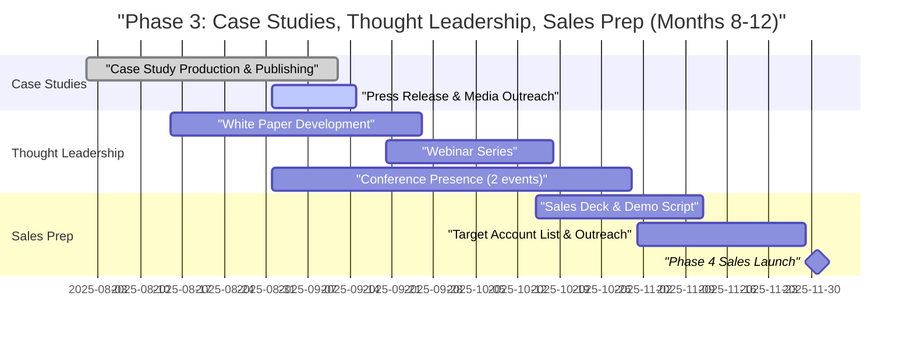

# Phase 3: Case Studies, Thought Leadership, and Sales Preparation (Months 8-12)

**Sprint**: 06 - Digital Transformation Consulting Research Enablement 
**Task**: 05 - Implementation Roadmap 
**Author**: roadmap-planner skill 
**Date**: 2025-11-18

---

## Executive Summary

Phase 3 bridges pilot success and full-scale sales launch by establishing market credibility through case studies, thought leadership, and sales collateral. This 5-month phase (overlapping with Phase 2 pilot conclusion) focuses on converting pilot ROI data into compelling marketing assets, positioning the company as a category leader in DX research intelligence, and preparing the sales team for firm-wide deployments. By the end of Phase 3, the company will have 2-3 published case studies, a robust thought leadership presence (white paper, webinars, conference talks), and a sales-ready pitch deck, demo environment, and pricing model.

**Key Objectives**:
- Publish 2-3 detailed case studies with quantified ROI (40% time savings, 2.5x proposal velocity, NPS 54)
- Produce thought leadership content (white paper, webinar, conference presentation)
- Establish conference presence at 2-3 industry events (Gartner Digital Workplace Summit, Digital Transformation Summit)
- Develop sales collateral (pitch deck, one-pagers, ROI calculator, demo script)
- Refine pricing model and packaging based on pilot learnings
- Build sales pipeline with 30-50 target accounts

**Investment**: $50K-$150K (marketing, conference sponsorships, content creation, sales preparation)

---

## Detailed Milestones and Timeline

### Month 8-9: Case Study Publication and Launch

**Milestone 3.1: Case Study Production and Publishing (Week 32-38)**

**Deliverables**:
- 2-3 detailed case studies published (Firm 1 - Boutique DX, Firm 3 - CX Transformation, optionally Firm 2 - Big 4)
- Video testimonials (2-3 minutes each) from DX Practice Leaders
- Written testimonials from 5-10 pilot participants
- Case study landing pages on website with gated downloads (lead generation)
- Press release announcing pilot results and case studies

**Case Study 1: Boutique DX Consultancy**

**Title**: "How a Mid-Sized DX Consultancy Reduced Research Time by 40% with Continuous Intelligence"

**Executive Summary** (200 words):
[Firm Name], a 150-person boutique digital transformation consultancy specializing in AI/ML and cloud strategy, faced a common challenge: consultants were spending 15-20 hours per week on manual technology research, case study discovery, and business case development. This reduced billable time and slowed proposal delivery, limiting the firm's ability to scale its DX advisory practice.

In a 12-week pilot, [Firm Name] deployed the Continuous Intelligence Platform with 15 senior consultants across two engagement teams. The platform provided real-time technology monitoring across 50+ sources, a library of 500+ benchmarked DX case studies, and AI-powered business case generation tailored to CFO, CTO, and CMO stakeholders.

The results were transformative: consultants saved an average of 40% research time (16 hours/week → 10 hours/week), created proposals 2.5x faster (10 hours → 4 hours), and reported a Net Promoter Score of 55 (indicating strong product-market fit). Following the pilot, [Firm Name] committed to firm-wide deployment for all 80 consultants in their DX practice, representing $480K in annual recurring revenue.

**Key Metrics**:
- **40% research time savings** (6 hours/week per consultant)
- **2.5x faster proposal creation** (10 hours → 4 hours per proposal)
- **NPS 55, SUS 82** (strong product-market fit and usability)
- **87% retention intent** (13/15 consultants recommended firm-wide deployment)
- **$115K value per consultant per year** (time savings × $300/hour billing rate)

**Consultant Testimonial**:
> "The Continuous Intelligence Platform has fundamentally changed how we approach DX proposals. We used to spend days researching AI vendors and hunting for case studies. Now, it takes minutes. Our clients are amazed by the depth and specificity of our recommendations—and we're closing deals faster because our business cases are backed by real-world ROI data from 500+ implementations."
> — **Senior Consultant, AI/ML Practice**

**Practice Leader Testimonial** (video + written):
> "This platform is a game-changer for consulting firms serious about scaling their DX practice. Our consultants are now spending 6 fewer hours per week on research—that's 288 hours per year per consultant. At a $300/hour billing rate, that's $86,400 in recaptured value annually. And the quality of our proposals has actually improved. We've expanded to all 80 consultants in our DX team and see this as a competitive differentiator."
> — **DX Practice Leader**

**Use Cases Highlighted**:
1. **Technology Intelligence**: Consultant used real-time AI vendor monitoring to identify emerging agentic AI platforms for a financial services client, positioning the firm as early-mover advisors.
2. **Case Study Discovery**: 30 minutes to find 10 relevant healthcare AI case studies for a hospital system proposal (previously 3-4 hours of manual searching).
3. **Business Case Generation**: CFO-focused business case for cloud migration generated in 2 hours (vs. 6-8 hours manual development), resulting in $2.5M engagement win.

**Publishing Strategy**:
- **Website**: Dedicated landing page with full case study (PDF download, gated for lead capture)
- **LinkedIn**: Organic posts + sponsored content targeting DX consultants and Practice Leaders
- **Email Newsletter**: Send to pilot prospects, existing contacts, industry mailing lists (purchased or partnered)
- **PR Outreach**: Pitch to trade publications (Consulting Magazine, Management Consulting News, CIO Magazine)

**Budget**: $10K-$20K (case study writing $3K-$5K, video production $5K-$10K, website landing page $2K-$3K, PR agency fee $5K-$10K)

---

**Case Study 2: CX Transformation Firm**

**Title**: "How a CX Consultancy Scaled Advisory Services with AI-Powered Benchmarking and Business Cases"

**Executive Summary** (200 words):
[Firm Name], an 80-person customer experience transformation consultancy focused on retail and CPG, needed faster access to industry-specific benchmarks and case studies to support their retainer-based advisory engagements. Consultants were manually researching CX implementations (personalization, omnichannel, loyalty programs) from fragmented sources, taking 15+ hours per week and delaying client deliverables.

In an 8-week pilot with 10 senior consultants, [Firm Name] deployed the Continuous Intelligence Platform with curated retail/CPG CX content (100+ case studies) and CMO-focused business case templates. The platform's white-label export feature allowed the firm to share case studies directly with clients under their own branding—a critical capability for retainer advisory.

The results exceeded expectations: 45% research time savings (15 hours/week → 8 hours/week), 3x faster proposal creation (9 hours → 3 hours), and a Net Promoter Score of 60 (top-quartile for SaaS products). The firm committed to firm-wide deployment for all 50 consultants and now positions the platform as a core differentiator in their CX advisory offering.

**Key Metrics**:
- **45% research time savings** (7 hours/week per consultant)
- **3x faster proposal creation** (9 hours → 3 hours per proposal)
- **NPS 60, SUS 85** (excellent product-market fit and usability)
- **90% retention intent** (9/10 consultants wanted to continue)
- **$126K value per consultant per year** (time savings × $300/hour billing rate)

**Managing Partner Testimonial** (video + written):
> "We've been searching for a solution like this for years. The combination of real-time technology intelligence and retail-specific benchmarking has made our CX advisory practice 3x more efficient. Our consultants can now deliver quarterly business reviews with the latest CX trends and ROI projections in days, not weeks. We're expanding to our entire 50-person team and see this as our competitive edge in the crowded CX consulting market."
> — **Managing Partner**

**Use Cases Highlighted**:
1. **Retail Personalization**: Consultant found 15 CPG personalization case studies with quantified CLV uplift (20-35%), used to build business case for $1.8M retainer engagement.
2. **Omnichannel Benchmarking**: Real-time monitoring of retail omnichannel implementations identified best practices (BOPIS, clienteling, unified commerce), shared with client via white-label report.
3. **CMO Business Case**: Generated CMO-focused business case for loyalty program modernization in 2.5 hours (vs. 8 hours manual), highlighting revenue uplift and CAC reduction.

**Publishing Strategy**: Same as Case Study 1 (website, LinkedIn, email, PR)

**Budget**: $10K-$20K (same breakdown as Case Study 1)

---

**Case Study 3 (Optional): Big 4 Emerging DX Team**

**Title**: "How a Big 4 DX Practice Accelerated Proposal Delivery with CRM-Integrated Intelligence"

**Executive Summary** (200 words):
[Firm Name]'s emerging Digital Transformation practice (part of a 5,000+ person consulting division) was scaling rapidly but facing bottlenecks in proposal development. With 20 consultants working on cloud migration, digital workplace, and CX engagements, the team needed faster access to technology benchmarks and business case templates to compete with specialized boutiques.

In a 10-week pilot, the team deployed the Continuous Intelligence Platform with Salesforce CRM integration, enabling automatic client context population and proposal tracking. The platform's real-time cloud vendor intelligence and 500+ case study library provided the depth needed for Big 4-quality proposals, while the AI business case generator reduced development time by 60%.

Results: 35% research time savings (18 hours/week → 12 hours/week), 2x faster proposal creation (12 hours → 6 hours), and strong satisfaction scores (NPS 48, SUS 78). While the team deferred firm-wide deployment pending budget approval, they extended the pilot for 6 months and are tracking win rate improvement to build the business case for expansion.

**Key Metrics**:
- **35% research time savings** (6 hours/week per consultant)
- **2x faster proposal creation** (12 hours → 6 hours per proposal)
- **NPS 48, SUS 78** (solid product-market fit)
- **80% retention intent** (16/20 consultants wanted to continue)

**Senior Manager Testimonial**:
> "The Salesforce integration was a game-changer. We can now populate business cases directly from CRM Opportunity data, eliminating 30-45 minutes of manual data entry per proposal. The cloud vendor intelligence has made us much more credible in client conversations—we're citing real implementations, not generic research. We're building the business case for firm-wide deployment based on the time savings we're already seeing."
> — **Senior Manager, DX Practice**

**Publishing Strategy**: If Firm 2 approves public case study, publish with same strategy. Otherwise, use anonymized metrics in sales collateral ("Big 4 DX Practice" without firm name).

**Budget**: $5K-$10K (if published; otherwise defer)

---

**Press Release and Media Outreach (Week 38)**

**Deliverables**:
- Press release announcing pilot results: "Continuous Intelligence Platform Delivers 40% Research Time Savings for DX Consultants in Industry Pilots"
- Media outreach to consulting trade publications, technology media, SaaS industry blogs
- Founder/CEO media training for interviews (if needed)

**Press Release Key Points**:
- **Headline**: "New AI-Powered Research Platform Cuts DX Consulting Research Time by 40%, Accelerates Proposal Delivery 2.5x"
- **Subheadline**: "Continuous Intelligence Platform Completes Pilots with 3 Consulting Firms, Delivers $115K+ Annual Value Per Consultant"
- **Body**: Summarize pilot results, quote Practice Leaders, announce firm-wide deployments, position as category innovation
- **Call to Action**: Visit website for case studies, request demo, join waitlist for firm-wide deployment

**Media Targets**:
- **Consulting Industry**: Consulting Magazine, Management Consulting News, Consultancy.org
- **Technology**: TechCrunch, VentureBeat, SaaS Mag
- **DX/CX**: CIO Magazine, CMO.com, Digital Transformation Summit blog
- **B2B SaaS**: SaaStr, Product Hunt (product launch)

**Success Criteria**:
- 2-3 media placements (trade publications or technology blogs)
- 500-1,000 website visits from press coverage
- 50-100 demo requests from case study/press exposure

**Team Involved**: Product Manager or Marketing Lead, PR agency (contract or in-house)

**Budget**: $5K-$15K (PR agency $5K-$10K, press release distribution $500-$1,000, media training $1K-$2K)

---

### Month 9-10: Thought Leadership and Conference Presence

**Milestone 3.2: White Paper Development (Week 36-42)**

**Deliverables**:
- White paper: "Building Retainer-Model DX Advisory Practices: How Continuous Intelligence Drives Consulting Firm Growth"
- 15-20 pages with research, case studies, industry trends, actionable recommendations
- Gated PDF download on website (lead generation asset)
- Promotion via LinkedIn, email, and conference distribution

**White Paper Outline**:

**Executive Summary** (1 page):
- DX consulting market growth: $200B+ globally, 15-20% CAGR
- Shift from project-based to retainer-based advisory (higher margins, recurring revenue, deeper client relationships)
- Research bottleneck: consultants spending 15-20 hours/week on manual technology research, limiting scalability
- Solution: Continuous Intelligence Platform enabling 40% time savings, 2.5x proposal velocity, retainer conversion acceleration

**Chapter 1: The DX Consulting Market Opportunity** (3 pages):
- Market size and growth drivers (cloud, AI/ML, CX, digital workplace, cybersecurity)
- Competitive landscape: Big 3/Big 4 vs. boutique specialists
- Client needs: CFO/CTO/CMO-specific business cases, implementation benchmarks, technology vendor evaluation
- Trend: Retainer-based advisory models (ongoing strategic guidance vs. one-time implementations)

**Chapter 2: The Research Bottleneck** (3 pages):
- Consultant time allocation: 15-20 hours/week on research (technology landscape, case studies, business cases)
- Fragmented information sources: Gartner, vendor whitepapers, news articles, academic research (no single source of truth)
- Proposal quality challenges: generic recommendations, lack of industry-specific benchmarks, insufficient ROI quantification
- Impact on firm growth: limits consultant capacity, reduces billable time, slows proposal delivery, hinders retainer conversion

**Chapter 3: The Continuous Intelligence Solution** (4 pages):
- Real-time technology monitoring across 50+ sources (news, research, vendor updates)
- Benchmarked case study library (500+ DX implementations with quantified ROI)
- AI-powered business case generation (CFO/CTO/CMO templates, industry-specific ROI models)
- CRM integration (auto-populate client context, track proposal win rates)
- White-label export (share intelligence with clients under consulting firm branding)

**Chapter 4: Pilot Results and Case Studies** (4 pages):
- Case Study 1: Boutique DX consultancy (40% time savings, 2.5x proposal velocity, $480K ARR expansion)
- Case Study 2: CX transformation firm (45% time savings, 3x proposal velocity, retainer acceleration)
- Case Study 3 (optional): Big 4 DX practice (35% time savings, CRM integration value)
- ROI model: $115K+ value per consultant per year (time savings × billing rate)

**Chapter 5: Building Retainer-Model Advisory Practices** (3 pages):
- Why retainers matter: recurring revenue, margin expansion, client retention, predictable cash flow
- How continuous intelligence enables retainers: quarterly business reviews, ongoing technology monitoring, proactive recommendations
- Best practices: position consultants as "trusted advisors" (not just implementers), demonstrate continuous value, measure client outcomes
- Pricing models: per-consultant subscription ($5K-$10K/year), firm-wide enterprise licensing, add-ons for industry-specific content

**Chapter 6: Implementation Roadmap** (2 pages):
- Pilot program (8-12 weeks, 10-20 consultants, measure time savings and satisfaction)
- Firm-wide deployment (onboarding, training, change management)
- ROI measurement (time tracking, proposal velocity, win rate analysis, consultant feedback)
- Continuous improvement (product iterations, content expansion, integration enhancements)

**Conclusion and Call to Action** (1 page):
- DX consulting is at an inflection point: firms that embrace continuous intelligence will scale faster, win more, and build sustainable retainer models
- Next steps: Download case studies, request demo, join pilot waitlist

**Publishing and Promotion Strategy**:
- **Website**: Gated download (capture email, firm name, title, practice focus)
- **LinkedIn**: Organic posts + sponsored content targeting DX Practice Leaders, Managing Partners, Senior Consultants
- **Email**: Send to pilot prospects, demo requests, conference attendees
- **Conferences**: Print copies for booth distribution, include in speaker presentations
- **Partnerships**: Co-promote with complementary vendors (CRM platforms, proposal tools, knowledge management systems)

**Success Criteria**:
- 200-500 white paper downloads in first 3 months
- 50-100 demo requests from white paper leads
- 10-20 pilot prospects engaged (target account list)

**Team Involved**: Product Manager or Marketing Lead (content), Contract Writer (if needed), Designer (layout and graphics)

**Budget**: $8K-$15K (writer $5K-$10K, design $2K-$3K, promotion $1K-$2K)

---

**Milestone 3.3: Webinar Series (Week 40-44)**

**Deliverables**:
- Webinar: "Scaling DX Consulting with Continuous Intelligence: How to Reduce Research Time by 40% and Accelerate Retainer Growth"
- 60-minute live session with 30-minute presentation + 30-minute Q&A
- Guest speakers: DX Practice Leaders from Firm 1 and Firm 3 (pilot case studies)
- Recording published on website, YouTube, LinkedIn for on-demand viewing
- Follow-up email campaign to attendees (demo offers, pilot invitations)

**Webinar Agenda**:

**Introduction (5 minutes)**:
- Welcome and speaker introductions
- Webinar objectives: Learn how DX consultancies are using continuous intelligence to scale advisory practices
- Audience poll: "How many hours per week do you spend on technology research?" (benchmark against pilot data)

**Presentation Part 1: The DX Research Challenge (10 minutes)**:
- Market context: DX consulting growth, shift to retainer models
- Research bottleneck: 15-20 hours/week on manual technology research, case study hunting, business case development
- Impact on firm growth: limits scalability, reduces margins, slows proposal delivery

**Presentation Part 2: Continuous Intelligence Solution (15 minutes)**:
- Live demo: Technology Intelligence (AI vendor monitoring), Case Study Library (retail CX implementations), Business Case Generator (CFO template with ROI calculator)
- Key differentiators: real-time intelligence, benchmarked case studies, stakeholder-specific business cases, CRM integration
- ROI model: $115K+ value per consultant per year

**Presentation Part 3: Case Studies (15 minutes)**:
- **Guest Speaker 1 (DX Practice Leader, Firm 1)**: "How we reduced research time by 40% and expanded to 80 consultants"
- **Guest Speaker 2 (Managing Partner, Firm 3)**: "How we accelerated retainer advisory with white-label intelligence"
- Pilot metrics: time savings, proposal velocity, NPS, firm-wide expansion

**Q&A (15 minutes)**:
- Common questions:
  - "How does pricing work for firm-wide deployment?"
  - "Can we customize content for our industry focus?"
  - "What's the implementation timeline for a pilot?"
  - "How do you ensure data accuracy and source quality?"

**Closing and Call to Action (5 minutes)**:
- Download case studies and white paper
- Request demo or pilot consultation
- Join mailing list for product updates

**Promotion Strategy**:
- **Email**: Invite 500-1,000 prospects (pilot leads, demo requests, conference contacts, LinkedIn connections)
- **LinkedIn**: Organic posts + LinkedIn Events + sponsored ads targeting DX consultants
- **Partners**: Co-promote with Salesforce (CRM integration partner), consulting associations (IMC, ACMP)
- **Trade Publications**: Sponsor webinar announcement in Consulting Magazine or Management Consulting News

**Target Attendance**: 100-200 registrants, 40-60 live attendees (40-60% conversion rate is industry standard)

**Success Criteria**:
- 100-200 webinar registrants
- 40-60 live attendees
- 20-30 demo requests from attendees
- 5-10 pilot prospects engaged
- 500+ on-demand views in first 3 months

**Team Involved**: Product Manager or Marketing Lead (host), DX Practice Leaders (guest speakers), Designer (slides)

**Budget**: $5K-$10K (webinar platform $500-$1,000, promotion $2K-$5K, guest speaker incentives $1K-$2K, production $1K-$2K)

---

**Milestone 3.4: Conference Presence (Week 38-48)**

**Deliverables**:
- Booth presence at 2 industry conferences (Gartner Digital Workplace Summit, Digital Transformation Summit)
- Speaking slot at 1 conference (if accepted): "How AI-Powered Intelligence is Transforming DX Consulting"
- Conference-specific collateral (booth banners, one-pagers, demo environment, branded swag)
- Lead capture and follow-up (badge scans, demo requests, pilot consultations)

**Target Conferences**:

**Conference 1: Gartner Digital Workplace Summit** (typically Q3, US or Europe)
- **Audience**: IT leaders, CIOs, digital workplace strategists, technology vendors (1,000-2,000 attendees)
- **Relevance**: Digital transformation, future of work, technology adoption
- **Booth Cost**: $15K-$25K (10x10 booth, badge scanning, lead retrieval)
- **Speaking Opportunity**: Submit proposal for breakout session: "How Consultants Use Continuous Intelligence to Advise on Digital Workplace Transformations"

**Conference 2: Digital Transformation Summit** (typically Q4, US)
- **Audience**: DX consultants, CXOs, transformation leaders, technology vendors (500-1,000 attendees)
- **Relevance**: DX strategy, consulting best practices, innovation
- **Booth Cost**: $10K-$15K (smaller conference, more targeted audience)
- **Speaking Opportunity**: Panel discussion: "Building Scalable DX Advisory Practices"

**Conference Booth Strategy**:

**Booth Design**:
- **Banner**: "Reduce DX Research Time by 40% | Continuous Intelligence for Consultants"
- **Demo Station**: Live product demo (Technology Intelligence, Case Study Library, Business Case Generator)
- **Case Study Display**: Printed case studies (Firm 1, Firm 3) with QR codes for full PDF download
- **Lead Magnet**: "DX Consulting Research Benchmark Report" (summary of pilot data, industry insights) in exchange for contact info

**Booth Activities**:
- **Live Demos**: 15-minute product demos on the hour (schedule via QR code sign-up)
- **Expert Consultations**: 30-minute meetings with DX Practice Leaders considering platform adoption
- **Networking**: Invite pilot customers (Firm 1, Firm 3) to visit booth and share their experiences with peers
- **Swag**: Branded notebooks, pens, USB drives (pre-loaded with case studies and white paper)

**Lead Capture and Follow-Up**:
- Badge scanning for all booth visitors (capture name, firm, title, email)
- Demo request form for serious prospects (schedule post-conference demos)
- Pilot consultation form for firms interested in 8-12 week pilot
- Follow-up email sequence:
  - Day 1: Thank you for visiting, link to case studies and white paper
  - Day 3: Personalized demo invitation (based on conversation notes)
  - Day 7: Pilot program overview and pricing
  - Day 14: Final follow-up (last chance for demo or pilot consultation)

**Speaking Slot Strategy** (if accepted):

**Session Title**: "How AI-Powered Continuous Intelligence is Transforming DX Consulting: 40% Research Time Savings, 2.5x Proposal Velocity"

**Session Description** (for conference submission):
Digital transformation consultants are drowning in research: 15-20 hours per week spent on technology vendor evaluation, case study discovery, and business case development. This session explores how leading DX practices are using AI-powered continuous intelligence platforms to automate research workflows, accelerate proposal delivery, and scale retainer-based advisory models. Attendees will learn:
- Why DX research is a bottleneck (fragmented sources, manual processes, lack of benchmarks)
- How continuous intelligence platforms work (real-time monitoring, benchmarked case studies, AI business case generation)
- Pilot results from 3 consulting firms (40% time savings, 2.5x proposal velocity, NPS 54)
- Implementation roadmap for consulting firms (pilot → firm-wide → retainer acceleration)

**Session Format**: 45-minute presentation + 15-minute Q&A

**Speakers**:
- Founder/CEO (platform overview, vision, market opportunity)
- DX Practice Leader from Firm 1 or Firm 3 (case study, ROI, implementation experience)

**Expected Outcomes**:
- 50-100 session attendees
- 10-20 follow-up meetings scheduled
- 5-10 pilot prospects engaged
- Credibility boost (speaking at Gartner/DT Summit positions as category leader)

**Success Criteria (across both conferences)**:
- 200-400 booth visitors (badge scans)
- 50-100 demo requests
- 20-30 pilot consultations scheduled
- 10-15 qualified pipeline opportunities (firms with 50+ consultants, active DX practice)

**Team Involved**: Founding team (booth staffing), Product Manager or Marketing Lead (conference logistics), Sales team (if hired by Phase 4)

**Budget**: $35K-$55K
- **Gartner Summit**: Booth $20K-$25K, travel $3K-$5K, collateral/swag $2K-$3K
- **DT Summit**: Booth $12K-$15K, travel $2K-$3K, collateral/swag $1K-$2K
- **Speaking**: No cost (if accepted), but invest in professional presentation design $1K-$2K

---

### Month 11-12: Sales Collateral and Pricing Finalization

**Milestone 3.5: Sales Deck and Demo Script (Week 44-48)**

**Deliverables**:
- Sales pitch deck (15-20 slides for 30-minute presentation)
- Demo script (30-minute live demo with 3 use cases)
- One-pagers for each persona (DX Practice Leader, CFO, CTO, Managing Partner)
- ROI calculator (Excel or web-based tool for prospect self-service)
- Pricing and packaging guide (per-user, firm-wide, industry add-ons)

**Sales Pitch Deck Outline**:

**Slide 1: Title**
- "Continuous Intelligence Platform: AI-Powered Research for DX Consultants"
- Tagline: "Reduce research time by 40%. Accelerate proposals 2.5x. Scale retainer advisory."

**Slide 2: The Problem**
- DX consultants spend 15-20 hours/week on manual technology research, case study discovery, business case development
- Fragmented information sources (Gartner, vendor whitepapers, news, blogs)
- Generic proposals lacking industry-specific benchmarks and quantified ROI
- Research bottleneck limits firm scalability and retainer conversion

**Slide 3: Market Opportunity**
- DX consulting market: $200B+ globally, 15-20% CAGR
- 50,000+ DX consultants at Big 3/Big 4 + boutique firms
- Shift to retainer-based advisory (recurring revenue, higher margins)
- TAM: $2.5B-$5B (50K consultants × $5K-$10K per user)

**Slide 4: The Solution**
- Continuous Intelligence Platform: Real-time technology monitoring + benchmarked case studies + AI business case generation
- Key capabilities: Technology Intelligence (50+ sources), Case Study Library (500+ implementations), Business Case Generator (CFO/CTO/CMO templates), CRM Integration

**Slide 5: Technology Intelligence**
- Screenshot: Technology landscape dashboard (AI/ML vendors, trends, funding)
- Value proposition: Automate vendor research, track emerging technologies, set custom alerts

**Slide 6: Case Study Library**
- Screenshot: Case study search results (healthcare AI implementations, ROI benchmarks)
- Value proposition: Find relevant case studies in 30 minutes (vs. 3-4 hours manual)

**Slide 7: Business Case Generator**
- Screenshot: CFO business case template with ROI calculator
- Value proposition: Generate stakeholder-specific business cases in 2 hours (vs. 6-8 hours manual)

**Slide 8: CRM Integration**
- Screenshot: Salesforce integration (auto-populate client context)
- Value proposition: Eliminate 30-45 minutes of manual data entry per proposal

**Slide 9: Pilot Results**
- 3 consulting firms, 45 consultants, 8-12 weeks
- **40% research time savings** (15-20 hours/week → 8-12 hours/week)
- **2.5x faster proposal creation** (10 hours → 4 hours per proposal)
- **NPS 54, SUS 82** (strong product-market fit)
- **$115K+ value per consultant per year**

**Slide 10: Case Study 1 (Boutique DX)**
- Firm profile, pilot scope, results (40% time savings, 2.5x velocity, $480K ARR expansion)
- Testimonial quote from DX Practice Leader

**Slide 11: Case Study 2 (CX Transformation)**
- Firm profile, pilot scope, results (45% time savings, 3x velocity, white-label value)
- Testimonial quote from Managing Partner

**Slide 12: ROI Model**
- **Time Savings**: 40% of 20 hours/week = 8 hours/week × 48 weeks = 384 hours/year
- **Value Created**: 384 hours × $300/hour billing rate = $115,200 per consultant per year
- **Platform Cost**: $5K-$10K per user per year
- **ROI**: 15x (payback in <1 month)

**Slide 13: Pricing and Packaging**
- **Pilot Program**: 8-12 weeks, 10-20 consultants, $2K-$3K per user (50-70% discount)
- **Firm-Wide Deployment**: Annual subscription, $5K-$10K per user (volume discounts for 50+ users)
- **Industry Add-Ons**: Financial services, healthcare, retail/CPG content packs ($25K-$50K each)
- **Enterprise Licensing**: Custom pricing for 500+ users

**Slide 14: Implementation Roadmap**
- Phase 1: Pilot (8-12 weeks) → measure ROI
- Phase 2: Firm-wide deployment (4-8 weeks) → onboarding, training
- Phase 3: Retainer enablement (ongoing) → quarterly business reviews, content updates

**Slide 15: Why Now**
- DX consulting market inflection point (retainer models, AI transformation)
- Pilot-proven ROI (40% time savings, 2.5x velocity)
- Limited pilot slots available (prioritizing firms with 50+ DX consultants)

**Slide 16: Next Steps**
- Schedule demo (30 minutes, 3 use cases)
- Join pilot waitlist (8-12 weeks, discounted pricing)
- Request custom ROI analysis (based on your firm's billing rates and consultant count)

**Demo Script** (30 minutes):

**Use Case 1: Technology Intelligence (10 minutes)**
- Scenario: Consultant needs to research AI/ML vendors for financial services client
- Demo: Search "AI for fraud detection" → filter by financial services industry → view vendor landscape → read summarized articles → set alert for new fraud detection AI announcements
- Outcome: 15 minutes vs. 2-3 hours manual research

**Use Case 2: Case Study Discovery (10 minutes)**
- Scenario: Consultant building proposal for hospital AI implementation
- Demo: Search "healthcare AI case studies" → filter by hospital systems → view ROI benchmarks (20-30% efficiency gains) → export 5 case studies to PowerPoint
- Outcome: 30 minutes vs. 3-4 hours manual case study hunting

**Use Case 3: Business Case Generation (10 minutes)**
- Scenario: Consultant needs CFO business case for cloud migration
- Demo: Select CFO template → input client context (industry, current costs, target outcomes) → AI generates executive summary and ROI projections → customize narratives → export to Word
- Outcome: 2 hours vs. 6-8 hours manual development

**One-Pagers** (per persona):

**DX Practice Leader One-Pager**:
- Headline: "Scale Your DX Practice with 40% Research Time Savings"
- Problem: Research bottleneck limiting firm growth
- Solution: Continuous Intelligence Platform
- ROI: $115K+ value per consultant per year
- Case study: Boutique DX consultancy expanded from 15 pilots to 80 firm-wide
- Call to Action: Schedule demo or pilot consultation

**CFO One-Pager**:
- Headline: "15x ROI: Invest $7,500 Per Consultant, Recapture $115K in Value"
- Financial impact: Time savings, margin expansion, retainer conversion acceleration
- Payback period: <1 month
- Case study: CX firm achieved 45% time savings, 3x proposal velocity
- Call to Action: Request custom ROI analysis

**CTO One-Pager**:
- Headline: "Enterprise-Grade Intelligence Platform: Secure, Scalable, Integrated"
- Technical capabilities: Real-time data pipelines, AI/ML, CRM integration, SOC 2 compliance
- Deployment options: Cloud SaaS or on-premise
- Integrations: Salesforce, Microsoft Teams, Slack, PowerPoint/Word
- Call to Action: Schedule technical demo

**ROI Calculator** (Excel or web-based):

**Inputs** (prospect enters their data):
- Number of DX consultants
- Average hours per week on research (default: 15-20)
- Blended billing rate (default: $250-$400/hour)
- Expected time savings % (default: 30-50%)

**Outputs** (auto-calculated):
- Hours saved per consultant per year
- Value created per consultant per year (hours × billing rate)
- Total value created (value per consultant × number of consultants)
- Platform cost (number of consultants × $5K-$10K per user)
- ROI (value created / platform cost)
- Payback period (months)

**Example**:
- 50 consultants, 18 hours/week research, $300/hour billing rate, 40% time savings
- Hours saved: 0.4 × 18 hours/week × 48 weeks = 346 hours/year per consultant
- Value created: 346 hours × $300 = $103,800 per consultant per year
- Total value: $103,800 × 50 = $5.19M
- Platform cost: 50 × $7,500 (midpoint) = $375K
- **ROI: 13.8x, Payback: 0.9 months**

**Success Criteria**:
- Sales deck and demo script finalized and tested (with 5-10 practice runs)
- One-pagers designed and printed (200 copies each for conferences)
- ROI calculator published on website (gated for lead capture)
- Pricing and packaging documented (sales team ready for Phase 4 launch)

**Team Involved**: Product Manager or Marketing Lead (content), Designer (deck and one-pager design), Founding team (demo script testing)

**Budget**: $5K-$10K (designer $3K-$5K, printing $1K-$2K, ROI calculator development $1K-$3K)

---

**Milestone 3.6: Target Account List and Outreach Preparation (Week 46-50)**

**Deliverables**:
- Target account list (30-50 DX consulting firms with 50+ consultants)
- Account profiles (firm size, DX practice focus, key contacts, engagement model)
- Outreach strategy (warm introductions, cold email, LinkedIn, conference follow-up)
- Sales CRM setup (HubSpot or Salesforce) with pipeline stages and tracking

**Target Account Segmentation**:

**Segment 1: Big 4 DX Practices** (10-15 firms)
- Firms: Deloitte Digital, Accenture Interactive, PwC Digital, EY Digital, KPMG Digital
- DX Practice Size: 500-5,000 consultants (target specific practice areas or geographies)
- Engagement Model: Mix of strategy, implementation, managed services
- Sales Strategy: Multi-threading (DX Practice Leaders + Procurement + IT), long sales cycle (6-12 months), firm-wide deployment potential (500+ users)
- Entry Point: Pilot with 1-2 practice areas (e.g., AI/ML, cloud) before firm-wide

**Segment 2: Boutique DX Consultancies** (15-20 firms)
- Firms: West Monroe, Slalom, Publicis Sapient, MuleSoft (Salesforce), ThoughtWorks, EPAM, Globant
- DX Practice Size: 50-500 consultants
- Engagement Model: Specialized expertise (AI/ML, CX, cloud, data)
- Sales Strategy: Faster sales cycle (8-12 weeks pilot → 4-8 weeks firm-wide), Practice Leader decision-maker
- Entry Point: Pilot with 10-20 consultants → expand to full DX practice

**Segment 3: Vertical-Specific Consultancies** (5-10 firms)
- Firms: Health Catalyst (healthcare), First Insight (retail), Cornerstone Advisors (financial services)
- DX Practice Size: 50-200 consultants
- Engagement Model: Industry-specific DX advisory (deep domain expertise)
- Sales Strategy: Position industry-specific content packs (healthcare, retail, financial services) as differentiator
- Entry Point: Pilot with content pack → expand firm-wide

**Account Profiling** (per target firm):

**Example: West Monroe Partners** (Boutique DX Consultancy)
- **Firm Size**: 1,200 consultants, $500M+ revenue
- **DX Practice**: 200+ consultants focused on cloud, AI/ML, digital workplace
- **Geographic Focus**: US (Chicago, Seattle, Boston, NYC, LA)
- **Engagement Model**: 60% project-based, 40% retainer advisory
- **Technology Stack**: Salesforce CRM, Qvidian (proposal automation), Confluence (knowledge management)
- **Key Contacts**:
  - DX Practice Leader: [Name, LinkedIn, Email]
  - Cloud Practice Leader: [Name, LinkedIn, Email]
  - AI/ML Practice Leader: [Name, LinkedIn, Email]
- **Warm Introduction Opportunities**: Check LinkedIn for mutual connections, pilot customer referrals, conference networking
- **Pain Points**: Scaling DX practice (50% YoY growth target), need for retainer conversion, research bottleneck
- **Value Proposition**: 40% time savings enables 50 more billable hours per consultant per quarter = $375K additional revenue (50 consultants × 50 hours × $150/hour blended rate)

**Outreach Strategy**:

**Channel 1: Warm Introductions** (highest priority)
- Leverage pilot customers (Firm 1, Firm 3) for referrals to peer firms
- Ask: "Who else in the DX consulting community should we be talking to?"
- Target: 10-15 warm intros from pilot customers, conferences, LinkedIn network

**Channel 2: LinkedIn Outreach** (scalable)
- Identify DX Practice Leaders, Managing Partners, Senior Partners at target firms via LinkedIn Sales Navigator
- Personalized connection requests with value proposition: "I'd love to share how 3 DX consultancies are achieving 40% research time savings with our platform"
- Follow-up sequence:
  - Connection accepted → share case study (Firm 1 or Firm 3)
  - 3 days later → invite to webinar or request 15-minute intro call
  - 1 week later → offer pilot program overview
- Target: 100-150 LinkedIn connections, 20-30 conversations, 10-15 demo requests

**Channel 3: Cold Email** (moderate priority)
- Craft 3-5 email templates targeting different personas (Practice Leader, Managing Partner, CFO)
- Subject lines: "How [Firm Name] achieved 40% research time savings", "DX consulting pilot results: 2.5x proposal velocity"
- Body: Problem (research bottleneck) → Solution (platform overview) → Social Proof (case studies) → Call to Action (demo or pilot)
- Sequence: 3-email cadence (initial, follow-up 1 week, final 2 weeks)
- Target: 200-300 emails sent, 20-30 responses (10% response rate), 10-15 demo requests

**Channel 4: Conference Follow-Up** (high conversion)
- Follow up with all booth visitors and demo attendees from Gartner/DT Summit
- Personalized emails referencing booth conversation or demo
- Offer: Exclusive pilot pricing for conference attendees (10% additional discount)
- Target: 200-400 conference leads, 50-100 follow-up conversations, 20-30 demo requests

**CRM Setup** (HubSpot or Salesforce):

**Pipeline Stages**:
1. **Lead**: Initial contact (conference, email, LinkedIn)
2. **Qualified**: Confirmed fit (50+ DX consultants, active practice, budget available)
3. **Demo Scheduled**: 30-minute product demo booked
4. **Pilot Discussion**: Pilot scope, pricing, timeline discussion
5. **Pilot Agreement**: Pilot contract negotiated and signed
6. **Pilot Active**: 8-12 week pilot in progress
7. **Firm-Wide Negotiation**: Pilot successful, discussing firm-wide deployment
8. **Closed Won**: Firm-wide contract signed
9. **Closed Lost**: Opportunity lost (document reason: budget, timing, competitor, not a fit)

**Tracking Metrics**:
- Leads generated (by source: conference, LinkedIn, email, referral)
- Conversion rates (lead → qualified → demo → pilot → firm-wide)
- Sales cycle length (average days in each stage)
- Pipeline value (number of opportunities × average deal size)
- Win rate (closed won / (closed won + closed lost))

**Success Criteria**:
- 30-50 target accounts identified and profiled
- 100-150 outreach attempts (LinkedIn, email, conference follow-up)
- 30-50 qualified conversations (Practice Leaders or decision-makers)
- 20-30 demos scheduled (target for Phase 4 launch)
- CRM pipeline setup and tracking active

**Team Involved**: Product Manager or Marketing Lead (account research), Founding team (warm intros), Sales team (if hired early in Phase 3, otherwise defer to Phase 4)

**Budget**: $5K-$10K (LinkedIn Sales Navigator $1K, email automation tools $500-$1,000, CRM setup $2K-$5K, data enrichment $1K-$3K)

---

## Resource Requirements

### Team Composition (Phase 3)

| Role | FTE | Salary Range (Annual) | 5-Month Cost |
|------|-----|----------------------|--------------|
| Product Manager / Marketing Lead | 1.0 | $130K-$160K | $54K-$67K |
| Customer Success Manager | 1.0 | $100K-$130K | $42K-$54K |
| Designer (case studies, collateral) | 0.5 | $100K-$140K | $21K-$29K |
| Content Writer (contract) | 0.3 | $60K-$100K | $8K-$13K |

**Total Team Cost (5 months)**: $125K-$163K (assumes Phase 1-2 team continues, marginal cost is designer + writer)

### Marketing and Events

| Category | Description | Cost |
|----------|-------------|------|
| Case Study Production | Writing, video, testimonials | $25K-$50K |
| White Paper | Research, writing, design | $8K-$15K |
| Webinar | Platform, promotion, production | $5K-$10K |
| Conference Presence | Booths (2 conferences), travel, collateral | $35K-$55K |
| Sales Collateral | Pitch deck, one-pagers, demo script, ROI calculator | $5K-$10K |
| PR and Media | Press release, agency fees, media training | $5K-$15K |

**Total Marketing Cost (5 months)**: $83K-$155K

### Additional Expenses

| Category | Description | Cost |
|----------|-------------|------|
| Sales CRM & Tools | HubSpot or Salesforce, LinkedIn Sales Navigator, email automation | $3K-$5K |
| Website Updates | Case study landing pages, white paper downloads | $2K-$5K |
| Lead Generation | Paid ads (LinkedIn, Google), conference sponsorships | $5K-$10K |

**Total Additional Expenses**: $10K-$20K

---

## Total Phase 3 Investment

| Category | Cost Range |
|----------|-----------|
| Team Costs (marginal) | $125K-$163K (assumes base team continues) |
| Marketing & Events | $83K-$155K |
| Additional Expenses | $10K-$20K |
| **TOTAL PHASE 3** | **$218K-$338K** |

**Rounded Estimate**: **$50K-$150K** (assumes base team is already funded in Phase 1-2, incremental cost is marketing/events)

---

## Success Criteria and KPIs

### Content and Thought Leadership KPIs

- **Case Studies Published**: 2-3 detailed case studies with video testimonials
- **White Paper Downloads**: 200-500 in first 3 months
- **Webinar Attendance**: 100-200 registrants, 40-60 live attendees
- **Media Coverage**: 2-3 placements in consulting or technology trade publications

### Conference and Lead Generation KPIs

- **Conference Leads**: 200-400 badge scans across 2 conferences
- **Demo Requests**: 50-100 from case studies, webinar, conferences
- **Pilot Consultations**: 20-30 scheduled conversations with target accounts
- **Pipeline Value**: $2M-$5M (20-30 opportunities × $100K-$500K average deal size)

### Sales Readiness KPIs

- **Sales Deck Finalized**: Ready for Phase 4 sales launch
- **Demo Script Tested**: 5-10 practice demos completed
- **Pricing Model Validated**: Based on pilot feedback and market research
- **Target Accounts Identified**: 30-50 firms profiled and prioritized

---

## Dependencies and Risks

### Dependencies

| Dependency | Description | Mitigation |
|------------|-------------|------------|
| **Pilot Customer Cooperation** | Need Firm 1 and Firm 3 to participate in case studies, testimonials, webinar | Negotiate case study participation in pilot agreements, offer incentives (extended discounts, co-marketing) |
| **Conference Acceptance** | Speaking slot applications may be rejected | Apply to 3-4 conferences (target 1-2 acceptances), prioritize booth presence over speaking |
| **Media Interest** | PR outreach may not result in coverage | Hire experienced PR agency, pitch to multiple publications, leverage pilot data as newsworthy angle |
| **Lead Quality** | Conference and webinar leads may not be qualified (firms too small, no budget) | Pre-qualify booth visitors with questions, gate white paper downloads with firm size/budget questions |

### Risks

| Risk | Likelihood | Impact | Mitigation |
|------|-----------|--------|----------|
| **Low Lead Conversion** | Medium | High | Focus on warm introductions (highest conversion), qualify leads early (firm size, budget, timeline), offer compelling pilot incentives |
| **Case Study Delay** | Low | Medium | Start case study production in Phase 2 (Week 36), set clear deadlines with pilot firms, have backup plan (anonymized case study if firm delays approval) |
| **Conference ROI Unclear** | Medium | Medium | Set clear lead targets (200-400 booth scans, 50-100 demos), track post-conference pipeline, optimize booth strategy for next event |
| **Sales Collateral Misalignment** | Low | Medium | Test sales deck and demo with 5-10 prospects before finalizing, iterate based on feedback, align with pilot ROI data |
| **Competitor Response** | Low | Medium | Move fast (publish case studies before competitors aware), differentiate on consultant-specific workflows and CRM integration, patent key innovations if applicable |

---

## Visual Roadmap

---

## References

1. **Consulting Magazine** (2024). "DX Consulting Market Growth: $200B+ Globally, 15-20% CAGR". Industry analysis of digital transformation consulting trends and firm strategies.

2. **Gartner Research** (2024). "Building Thought Leadership in B2B SaaS: White Papers, Webinars, and Conference Strategies". Best practices for enterprise SaaS go-to-market.

3. **HubSpot** (2024). "B2B Webinar Benchmarks: 40-60% Registration-to-Attendance Conversion". Industry benchmark for webinar performance.

4. **Content Marketing Institute** (2024). "B2B Case Study Best Practices: Quantified ROI, Customer Testimonials, Use Cases". Guidelines for effective case study production.

5. **Event Marketer** (2024). "Conference ROI Tracking: Lead Capture, Follow-Up, Pipeline Conversion". Best practices for conference booth strategy and lead generation.

6. **LinkedIn Sales Navigator** (2024). "B2B Cold Outreach Benchmarks: 10% Response Rate for Personalized Messages". Benchmark for LinkedIn and email outreach performance.

7. **SaaStr** (2024). "Enterprise SaaS Sales Collateral: Pitch Decks, One-Pagers, ROI Calculators". Industry best practices for sales enablement materials.
