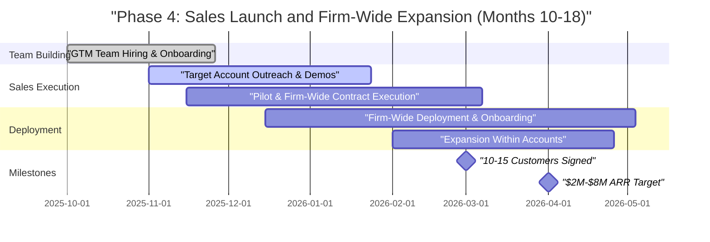

# Phase 4: Sales Launch and Firm-Wide Expansion (Months 10-18)

**Sprint**: 06 - Digital Transformation Consulting Research Enablement 
**Task**: 05 - Implementation Roadmap 
**Author**: roadmap-planner skill 
**Date**: 2025-11-18

---

## Executive Summary

Phase 4 transitions from pilot validation to scalable revenue growth through dedicated sales team hiring, systematic outreach to 30-50 target accounts, and firm-wide deployment execution. This 9-month phase focuses on converting pipeline from Phase 3 (case studies, conferences, webinars) into signed contracts, supporting firm-wide deployments (50-500 consultants per firm), and achieving $2M-$8M ARR by Month 18. The sales motion combines 8-12 week pilots (risk reduction for new customers) with direct firm-wide sales (for firms convinced by case studies), supported by a 5-7 person go-to-market team.

**Key Objectives**:
- Hire sales team (2-3 Account Executives, 1 SDR, 1 Sales Engineer)
- Execute outreach to 30-50 target accounts (Big 4 DX practices, boutique consultancies)
- Convert 10-15 firms to paying customers (mix of pilot → firm-wide and direct firm-wide)
- Support firm-wide deployments (onboarding 50-500 consultants per firm, training, change management)
- Achieve $2M-$8M ARR by Month 18 (target: 200-800 consultant seats at $5K-$10K per user)
- Establish customer success infrastructure (1-2 CSMs managing 10-15 accounts)

**Investment**: $500K-$1M (sales team salaries, marketing, customer success expansion, infrastructure scaling)

---

## Detailed Milestones and Timeline

### Month 10-11: Sales Team Hiring and Onboarding

**Milestone 4.1: Go-to-Market Team Hiring (Week 40-48)**

**Deliverables**:
- 5-7 person GTM team hired and onboarded
- Sales playbook documented (qualification criteria, demo process, pricing negotiations)
- CRM pipeline configured with 30-50 target accounts
- Sales compensation plan finalized (base salary + commission structure)

**Team Composition**:

| Role | FTE | Responsibilities | Compensation |
|------|-----|-----------------|--------------|
| **VP Sales or Sales Lead** | 1.0 | Team leadership, strategic accounts (Big 4), quota setting, pipeline management | $150K-$200K base + 20-30% variable |
| **Account Executives (AEs)** | 2-3 | Outreach, demos, pilot/firm-wide sales, contract negotiations | $100K-$140K base + 30-50% variable (OTE: $150K-$210K) |
| **Sales Development Rep (SDR)** | 1.0 | Lead generation, cold outreach, demo scheduling, conference follow-up | $60K-$80K base + 20-30% variable (OTE: $75K-$104K) |
| **Sales Engineer** | 1.0 | Technical demos, architecture discussions, CRM integration scoping, POC support | $120K-$150K base + 10-20% variable |
| **Customer Success Managers** | 1-2 | Firm-wide deployment support, onboarding, training, expansion within accounts | $100K-$130K base + 10-20% variable |

**Total GTM Team Cost (annual)**: $730K-$1.17M for 6-7 people

**Hiring Strategy**:

**VP Sales / Sales Lead**:
- **Profile**: 5-10 years enterprise SaaS sales experience, preferably sold to consulting firms or professional services
- **Sources**: LinkedIn recruiter, SaaS sales networks (Pavilion, Sales Hacker), executive recruiters
- **Compensation**: Competitive OTE ($200K-$260K), equity (1-3%), partnership in company growth

**Account Executives**:
- **Profile**: 3-5 years B2B SaaS sales, experience with $100K-$500K deal sizes, consultative selling skills
- **Ideal Background**: Sold to Big 4 consulting firms, professional services, or knowledge management tools
- **Sources**: LinkedIn, AngelList, referrals from existing team, SaaS sales job boards
- **Quota**: $800K-$1.5M ARR per AE per year (achievable with 5-10 firm-wide deals)

**SDR**:
- **Profile**: 1-3 years SDR experience, strong cold outreach skills (email, LinkedIn, phone)
- **Metrics**: 20-30 qualified demos per month, 50%+ demo show-rate
- **Sources**: SDR talent pools (Aspireship, SV Academy), university recruiting, sales bootcamps

**Sales Engineer**:
- **Profile**: Technical background (software engineering or solutions architecture) + customer-facing experience
- **Responsibilities**: Technical demos, integration scoping, POC support, documentation
- **Sources**: LinkedIn, engineering-to-sales career changers, former consultants with technical skills

**Sales Onboarding Program (2 weeks)**:

**Week 1: Product and Market Training**
- Product deep dive: Technology Intelligence, Case Studies, Business Case Generator, CRM integration (8 hours)
- Demo certification: Deliver 3 use case demos to internal team, receive feedback (4 hours)
- Market education: DX consulting landscape, buyer personas (Practice Leader, CFO, Managing Partner), competitive positioning (4 hours)
- Case study review: Read all 3 pilot case studies, memorize key metrics (40% time savings, 2.5x velocity, NPS 54) (2 hours)
- Customer calls: Shadow 2-3 customer success calls to understand user experience (3 hours)

**Week 2: Sales Process and Tools**
- Sales playbook: Qualification (BANT/MEDDIC), demo process, pilot vs. firm-wide sales motion, pricing negotiations (4 hours)
- CRM training: HubSpot/Salesforce pipeline management, activity tracking, forecasting (3 hours)
- Objection handling: Practice responses to common objections ("Too expensive", "We already use Gartner", "Not a priority right now") (3 hours)
- Role plays: 5 mock demos with feedback from VP Sales and founding team (5 hours)
- First outreach: Send 10-20 personalized emails or LinkedIn messages to target accounts under supervision (4 hours)

**Success Criteria**:
- 5-7 person GTM team hired by Month 11
- 100% of AEs complete demo certification (can deliver 3 use cases independently)
- Sales playbook documented and accessible in CRM
- First outreach campaigns launched by Week 48

**Team Involved**: VP Sales (lead), Founding team (hiring, onboarding, role plays)

**Budget**: $60K-$100K (salaries for Month 10-11, recruiting fees if using agency 15-20% of first-year salary)

---

### Month 11-14: Outbound Sales Campaign and Demo Acceleration

**Milestone 4.2: Target Account Outreach (Week 44-56)**

**Deliverables**:
- 30-50 target accounts actively engaged (emails sent, LinkedIn connections, calls made)
- 50-80 demos delivered (30-minute product demos with 3 use cases)
- 20-30 pilot or firm-wide proposals sent (SOWs, pricing, implementation timelines)
- 10-15 pilot agreements or firm-wide contracts signed

**Outreach Strategy**:

**Channel 1: Conference Follow-Up** (highest conversion)
- Follow up with 200-400 leads from Phase 3 conferences (Gartner Digital Workplace Summit, DT Summit)
- Personalized emails: "Great meeting you at [Conference]. As promised, here's the case study on 40% research time savings."
- Sequence: Email Day 1 (case study) → Email Day 5 (webinar recording or white paper) → Email Day 10 (demo invitation)
- Target: 50-100 demo requests from conference leads (25-50% conversion rate)

**Channel 2: Warm Introductions** (high conversion)
- Leverage pilot customers (Firm 1, Firm 3) for referrals to 10-15 peer firms
- Ask Practice Leaders: "Who else in your network should we be talking to about research intelligence?"
- Offer incentive: $5K-$10K referral bonus for signed customer introductions (paid after contract signature)
- Target: 10-15 warm intros → 8-10 demos → 4-6 pilot/firm-wide deals

**Channel 3: LinkedIn Outreach** (scalable)
- SDR sends 50-100 personalized LinkedIn connection requests per week to DX Practice Leaders, Managing Partners
- Message template: "Hi [Name], I came across [Firm Name]'s work in [Domain]. We recently helped 3 DX consultancies reduce research time by 40%—would you be open to a quick 15-minute intro call to share how?"
- Follow-up: Share case study → invite to demo or pilot consultation
- Target: 200-300 LinkedIn connections → 40-60 responses (20% response rate) → 20-30 demos

**Channel 4: Cold Email** (moderate conversion)
- AEs send 30-50 personalized emails per week to target accounts
- Subject lines: "[Firm Name] + 40% research time savings case study", "How [Peer Firm] achieved 2.5x proposal velocity"
- 3-email sequence: Problem + case study → white paper or webinar → demo invitation
- Target: 400-600 emails → 40-60 responses (10% response rate) → 20-30 demos

**Channel 5: Webinar Attendees** (moderate conversion)
- Follow up with 100-200 webinar attendees from Phase 3
- Personalized emails: "Thanks for attending the webinar on DX research intelligence. I'd love to offer you a personalized demo."
- Target: 20-30 demo requests from webinar attendees (15-20% conversion)

**Demo Process (30 minutes)**:

**Pre-Demo (5 minutes before meeting)**:
- Research prospect: firm size, DX practice focus, recent case studies, LinkedIn profiles
- Customize demo: Select relevant use cases (e.g., healthcare case studies if prospect focuses on healthcare)
- Set up environment: Load demo account with prospect-relevant content

**Demo Agenda**:
- Introduction (5 minutes): Introductions, agenda setting, discovery questions ("What are your biggest research challenges?")
- Use Case 1: Technology Intelligence (8 minutes) - Demonstrate real-time AI vendor monitoring or cloud landscape tracking
- Use Case 2: Case Study Discovery (8 minutes) - Search for industry-specific implementations, show ROI benchmarks
- Use Case 3: Business Case Generator (8 minutes) - Generate CFO or CTO business case with ROI calculator
- ROI Discussion (5 minutes): Show ROI calculator, estimate time savings and value for prospect's firm
- Next Steps (1 minute): Discuss pilot vs. firm-wide, pricing, timeline

**Demo Follow-Up** (within 24 hours):
- Send thank-you email with case studies, white paper, ROI calculator (customized with prospect's inputs)
- Proposal for pilot or firm-wide deployment (SOW, pricing, timeline, success metrics)
- Schedule follow-up call to discuss proposal (within 1 week)

**Sales Cycle Benchmarks**:

**Pilot Sales Cycle**: 8-12 weeks from first demo to signed pilot agreement
- Week 0: Demo delivered
- Week 1-2: Pilot proposal sent and reviewed
- Week 3-4: Pilot scoping call (participants, timeline, success metrics)
- Week 5-8: Legal/procurement review (MSA, SOW, privacy addendum)
- Week 8-12: Pilot agreement signed, launch scheduled

**Firm-Wide Sales Cycle**: 12-20 weeks from first demo to signed firm-wide contract (for firms that skip pilot based on case study evidence)
- Week 0: Demo delivered
- Week 1-3: Firm-wide proposal sent, stakeholder alignment (Practice Leader, CFO, IT, Procurement)
- Week 4-8: Executive presentations, ROI validation, reference calls with pilot customers
- Week 9-16: Legal/procurement negotiations (enterprise MSA, security review, data processing addendum)
- Week 16-20: Contract signed, implementation plan finalized

**Success Criteria**:
- 50-80 demos delivered over 12 weeks (4-6 per week across 2-3 AEs)
- 40%+ demo-to-proposal conversion (20-30 proposals sent)
- 50%+ proposal-to-contract conversion (10-15 contracts signed)
- Average deal size: $150K-$500K (30-100 users × $5K-$10K per user)

**Team Involved**: SDR (lead generation), AEs (demos, proposals), Sales Engineer (technical demos), VP Sales (strategic account support)

**Budget**: $120K-$200K (GTM team salaries for 3 months, demo tools, travel to customer meetings if needed)

---

**Milestone 4.3: Pilot and Firm-Wide Contract Execution (Week 48-64)**

**Deliverables**:
- 10-15 pilot or firm-wide contracts signed
- Mix of pilot programs (8-12 weeks, 10-20 users) and direct firm-wide deployments (50-500 users)
- Average contract value: $150K-$500K ARR per customer
- Total new ARR: $1.5M-$7.5M from new customers (plus $910K from Phase 2 pilots = $2.41M-$8.41M total)

**Customer Segmentation and Sales Motion**:

**Segment 1: Pilot-First (6-8 customers)**
- **Profile**: Risk-averse firms, no prior relationship, skeptical of ROI claims, need proof before firm-wide
- **Sales Motion**: 8-12 week pilot with 10-20 consultants → measure ROI → firm-wide expansion
- **Pilot Pricing**: $2K-$4K per user (40-60% discount) for pilot period
- **Firm-Wide Conversion**: If pilot succeeds (30-50% time savings, 80%+ satisfaction), expand to full DX practice
- **Timeline**: 8-12 weeks pilot + 4-8 weeks procurement = 12-20 weeks total sales cycle
- **Example Deals**:
  - Mid-sized boutique consultancy (150 people, 60 DX consultants): Pilot with 15 users → expand to 60 users at $6K per user = $360K ARR
  - Big 4 practice area (500 DX consultants): Pilot with 20 users in cloud practice → expand to 100 users at $7K per user = $700K ARR

**Segment 2: Direct Firm-Wide (4-7 customers)**
- **Profile**: Early adopters, convinced by case studies, eager to scale, previous relationship or warm intro
- **Sales Motion**: Skip pilot, go straight to firm-wide deployment based on case study evidence
- **Pricing**: $5K-$10K per user (standard pricing with volume discounts for 50+ users)
- **Timeline**: 12-16 weeks sales cycle (executive alignment, legal, procurement)
- **Example Deals**:
  - Boutique CX consultancy (80 people, 50 DX consultants): Direct firm-wide at $6K per user = $300K ARR
  - Vertical-specific consultancy (120 people, 70 DX consultants): Direct firm-wide + industry content pack at $7K per user + $30K = $520K ARR

**Pricing and Packaging**:

**Standard Pricing**:
- **Per-User Annual Subscription**: $5K-$10K per user (varies by firm size and commitment length)
- **Volume Discounts**:
  - 10-49 users: $8K-$10K per user (list price)
  - 50-99 users: $7K-$9K per user (10-15% discount)
  - 100-499 users: $6K-$8K per user (20-25% discount)
  - 500+ users: $5K-$7K per user (30-40% discount, custom negotiation)

**Add-Ons**:
- **Industry Content Packs**: $25K-$50K per year (financial services, healthcare, retail/CPG, manufacturing)
- **White-Label Client Portal**: $50K-$100K per year (for consulting firms that want to share intelligence with their clients)
- **Custom Integration**: $20K-$50K one-time (beyond standard Salesforce/CRM integration)
- **Dedicated CSM**: $25K-$50K per year (for firms with 200+ users or complex needs)

**Contract Terms**:
- **Length**: 12-month or 24-month subscriptions (24-month gets 10% discount)
- **Auto-Renewal**: Automatic renewal unless cancelled 60-90 days before expiration
- **Payment Terms**: Annual upfront (preferred) or quarterly (for larger deals >$500K)
- **Expansion Clause**: Customers can add users mid-contract at pro-rated pricing

**Target Customer Mix (10-15 customers by Month 18)**:

| Firm Type | Count | Avg Users | Avg Price per User | Avg ARR | Total ARR |
|-----------|-------|-----------|-------------------|---------|-----------|
| Big 4 Practice Area | 1-2 | 100-200 | $6K-$7K | $600K-$1.4M | $600K-$2.8M |
| Large Boutique (200+ consultants) | 2-3 | 80-120 | $6K-$8K | $480K-$960K | $960K-$2.88M |
| Mid-Sized Boutique (50-200 consultants) | 4-6 | 40-70 | $7K-$9K | $280K-$630K | $1.12M-$3.78M |
| Vertical Specialist | 2-3 | 30-50 | $7K-$10K | $210K-$500K | $420K-$1.5M |
| **TOTAL** | **10-15** | - | - | - | **$3.1M-$10.96M** |

**Realistic Target for Phase 4**: $2M-$8M new ARR (plus $910K from Phase 2 pilots = **$2.91M-$8.91M total ARR by Month 18**)

**Success Criteria**:
- 10-15 customers signed (mix of pilot and firm-wide)
- $2M-$8M new ARR from Phase 4 sales
- Average deal size: $200K-$500K ARR
- 200-800 total consultant seats deployed across all customers

**Team Involved**: AEs (negotiations), VP Sales (large deal support), Sales Engineer (technical scoping), Legal (contract review)

**Budget**: $150K-$300K (GTM team salaries for 4 months, legal fees, travel)

---

### Month 14-18: Firm-Wide Deployment and Customer Success

**Milestone 4.4: Firm-Wide Deployment Execution (Week 56-72)**

**Deliverables**:
- 10-15 firm-wide deployments completed (onboarding 200-800 consultants total)
- Onboarding and training programs delivered (2-4 weeks per firm)
- Change management support (executive stakeholder engagement, adoption tracking)
- Customer success infrastructure established (1-2 CSMs managing 10-15 accounts)

**Firm-Wide Deployment Process** (4-8 weeks per customer):

**Week 1-2: Planning and Configuration**
- Kickoff meeting with customer (Practice Leader, IT, project sponsor)
- Define deployment scope: user count, access controls, CRM integration, branding customization
- Technical setup: Provision user accounts, configure Salesforce integration, customize content filters (industry, geography)
- Training plan: Schedule sessions for different cohorts (practice areas, geographies, seniority levels)

**Week 2-3: Onboarding and Training**
- **Executive Kickoff** (1 hour): Practice Leader or Managing Partner introduces platform, explains strategic value, sets adoption expectations
- **Cohort Training Sessions** (2 hours each): 5-10 training sessions for groups of 20-50 consultants
  - Session structure: Product overview (30 min) → Live demos (60 min) → Q&A (30 min)
  - Use cases: Technology research for active engagements, case study discovery for proposals, business case generation for pitches
- **1-on-1 Sessions** (30 minutes): Available for consultants needing personalized training or struggling with onboarding
- **Train-the-Trainer**: Certify 2-3 internal champions (Senior Consultants or Knowledge Managers) to provide ongoing support

**Week 3-6: Active Usage and Support**
- **Daily Slack/Teams Monitoring**: CSM monitors firm's support channel, responds to questions within 2 hours
- **Weekly Office Hours**: 30-minute drop-in sessions for troubleshooting and advanced features
- **Usage Tracking**: Monitor adoption metrics (logins, searches, business cases generated) to identify low-usage consultants
- **Proactive Outreach**: CSM reaches out to consultants with <3 logins in first 2 weeks to understand barriers and provide additional training

**Week 6-8: Optimization and Expansion**
- **Usage Report**: Share adoption metrics with Practice Leader (% active users, average logins per week, business cases generated)
- **Feedback Session**: 1-hour retrospective with 5-10 power users and Practice Leader (what's working, what needs improvement)
- **Content Expansion**: Add customer-requested content (industry-specific case studies, technology domains, geographic coverage)
- **Expansion Discussions**: Identify opportunities to expand within account (additional practice areas, geographic offices, industry content packs)

**Change Management Best Practices**:

**Executive Sponsorship**:
- Engage Practice Leader or Managing Partner as executive sponsor
- Executive communicates strategic value: "This platform is core to our DX practice growth—I expect everyone to use it actively"
- Executive participates in kickoff and periodic all-hands updates

**Internal Champions**:
- Identify 2-3 consultants who are natural advocates (early adopters, tech-savvy, influential)
- Certify champions as platform experts (train-the-trainer sessions)
- Champions provide peer support, share use cases, evangelize platform benefits

**Incentives and Gamification**:
- Leaderboards: Top users by searches, business cases generated, time saved (displayed in Slack or internal dashboard)
- Prizes: $100 Amazon gift cards for top 3 users each month
- Recognition: Feature power users in firm newsletter or all-hands meetings

**Adoption Tracking**:

**Key Metrics**:
- **Active Users**: % of licensed users logging in 3+ times per week (target: 80%+)
- **Search Volume**: Average searches per active user per week (target: 5-10)
- **Business Cases Generated**: Average business cases created per user per month (target: 2-4)
- **Time Spent**: Average session duration and weekly usage hours (benchmark: 2-4 hours per week)
- **Satisfaction**: Quarterly NPS and SUS surveys (target: NPS 50+, SUS 80+)

**Red Flags and Interventions**:
- **Low Adoption (<60% active users)**: Executive intervention, additional training, identify barriers (UX issues, content gaps, change resistance)
- **Low Engagement (<3 logins per week)**: 1-on-1 outreach, personalized use case coaching, troubleshooting technical issues
- **Churn Risk**: If NPS <30 or executive sponsor disengaged, escalate to VP Sales and Product team for intervention

**Success Criteria**:
- 80%+ active usage within 8 weeks of deployment (target: 160-640 of 200-800 consultants)
- NPS 50+, SUS 80+ (consistent with pilot results)
- <5% deployment delays or issues (technical bugs, integration failures)
- 90%+ customer retention (only 1 customer churn allowed in Phase 4)

**Team Involved**: Customer Success Managers (lead), Sales Engineer (technical support), Product team (bug fixes, feature requests)

**Budget**: $150K-$300K (CSM salaries for 4 months, training materials, travel to customer sites if needed)

---

**Milestone 4.5: Expansion Within Accounts (Week 64-72)**

**Deliverables**:
- 3-5 expansion opportunities identified within existing accounts
- Expansion ARR: $300K-$1M from upsells (additional users, industry content packs, white-label portal)
- Quarterly business reviews (QBRs) established with top 5-10 accounts

**Expansion Opportunities**:

**1. Additional Users** (easiest expansion)
- **Scenario**: Customer deploys platform with 50 users, sees success, wants to expand to 80 users
- **Process**: CSM identifies expansion opportunity during QBR, AE negotiates pricing (pro-rated for remaining contract term)
- **Example**: Firm deployed with 60 users at $7K per user ($420K ARR), expands to 100 users (+40 users × $7K = +$280K ARR) = $700K total ARR

**2. Industry Content Packs** (high-margin add-on)
- **Scenario**: Customer uses general DX content, requests healthcare-specific case studies and benchmarks for specialized engagements
- **Process**: Product team curates 200+ healthcare case studies, customer purchases pack for $30K-$50K per year
- **Example**: 3 customers purchase healthcare pack at $35K each = +$105K ARR

**3. White-Label Client Portal** (premium feature)
- **Scenario**: Consulting firm wants to share platform intelligence with their clients under consultant's branding (retainer advisory use case)
- **Process**: Product team enables white-label export and client portal features, customer pays $50K-$100K per year
- **Example**: 2 customers purchase white-label portal at $75K each = +$150K ARR

**4. Additional Practice Areas** (within-firm expansion)
- **Scenario**: DX practice deploys platform, other practices (cybersecurity, data analytics) see value and want access
- **Process**: Cross-sell to adjacent practices within same firm
- **Example**: Firm deployed with 70 DX consultants, adds 30 cybersecurity consultants at $7K per user = +$210K ARR

**Quarterly Business Reviews (QBRs)**:

**QBR Agenda** (1 hour with Practice Leader or executive sponsor):
- **Usage Review** (15 minutes): Active users, searches, business cases generated, time saved estimate
- **ROI Validation** (15 minutes): Survey 5-10 consultants on time savings, compare to baseline, extrapolate value created
- **Success Stories** (10 minutes): Highlight consultant use cases (proposals won, clients impressed, retainer conversions)
- **Roadmap Preview** (10 minutes): Share upcoming features (mobile app, international content, advanced analytics)
- **Feedback and Requests** (10 minutes): Customer shares pain points, feature requests, content gaps

**Expansion Discussion** (optional, if relevant):
- Discuss opportunities to expand users, add industry packs, enable white-label portal
- AE joins QBR to discuss pricing and contracting

**Success Criteria**:
- 3-5 expansion deals closed (additional users, content packs, white-label)
- +$300K-$1M expansion ARR
- QBRs established with top 5-10 accounts (scheduled quarterly)
- Net Revenue Retention (NRR) >100% (expansion ARR exceeds churn)

**Team Involved**: CSMs (QBRs, expansion identification), AEs (expansion sales), Product team (content packs, white-label development)

**Budget**: $50K-$100K (CSM time, product development for add-ons)

---

## Resource Requirements

### Team Composition (Phase 4)

| Role | FTE | Salary Range (Annual) | 9-Month Cost |
|------|-----|----------------------|--------------|
| VP Sales / Sales Lead | 1.0 | $150K-$200K base + variable | $190K-$260K (OTE) |
| Account Executives | 2-3 | $100K-$140K base + variable | $225K-$473K (OTE for 2-3 AEs) |
| Sales Development Rep | 1.0 | $60K-$80K base + variable | $56K-$78K (OTE) |
| Sales Engineer | 1.0 | $120K-$150K base + variable | $99K-$135K (OTE) |
| Customer Success Managers | 1-2 | $100K-$130K base + variable | $82K-$195K (for 1-2 CSMs) |
| **TOTAL GTM TEAM** | **6-8** | - | **$652K-$1.14M** |

**Note**: Variable compensation paid quarterly or annually based on quota attainment

### Sales and Marketing

| Category | Description | Cost |
|----------|-------------|------|
| Sales Tools | CRM (HubSpot/Salesforce), LinkedIn Sales Navigator, email automation, demo tools | $10K-$20K |
| Marketing Campaigns | Paid ads (LinkedIn, Google), webinar follow-up, conference sponsorships | $20K-$50K |
| Customer Travel | On-site visits for large deals, deployment kickoffs | $15K-$30K |
| Sales Collateral | Updated pitch decks, one-pagers, video demos | $5K-$10K |

**Total Sales & Marketing Cost**: $50K-$110K

### Customer Success and Infrastructure

| Category | Description | Cost |
|----------|-------------|------|
| Training Materials | Video tutorials, help docs, onboarding decks | $10K-$20K |
| Customer Support Tools | Intercom, Zendesk, Slack workspace management | $5K-$10K |
| Infrastructure Scaling | AWS for 200-800 users, increased AI API usage | $30K-$60K |
| Legal & Contracts | MSA templates, privacy agreements, procurement support | $10K-$20K |

**Total Customer Success & Infrastructure Cost**: $55K-$110K

---

## Total Phase 4 Investment

| Category | Cost Range |
|----------|-----------|
| GTM Team Salaries (9 months) | $652K-$1.14M |
| Sales & Marketing | $50K-$110K |
| Customer Success & Infrastructure | $55K-$110K |
| **TOTAL PHASE 4** | **$757K-$1.36M** |

**Rounded Estimate**: **$500K-$1M** (aligns with brief, assumes some team hired mid-phase)

---

## Success Criteria and KPIs

### Sales KPIs

- **Demos Delivered**: 50-80 over 12 weeks (Month 11-14)
- **Proposals Sent**: 20-30 (40%+ demo-to-proposal conversion)
- **Contracts Signed**: 10-15 (50%+ proposal-to-contract conversion)
- **New ARR**: $2M-$8M from new customers
- **Average Deal Size**: $200K-$500K ARR per customer

### Deployment KPIs

- **Firms Deployed**: 10-15 (200-800 total consultants onboarded)
- **Deployment Timeline**: 4-8 weeks per firm (90%+ on-time)
- **Active Usage**: 80%+ of consultants logging in 3+ times per week within 8 weeks
- **Customer Satisfaction**: NPS 50+, SUS 80+

### Retention and Expansion KPIs

- **Customer Retention**: 90%+ (≤1 churn in Phase 4)
- **Expansion ARR**: $300K-$1M from upsells (users, content packs, white-label)
- **Net Revenue Retention**: >100% (expansion exceeds churn)
- **QBRs Completed**: 100% of top 10 accounts have quarterly business reviews

---

## Visual Roadmap

---

## References

1. **Pavilion** (2024). "Enterprise SaaS Sales Benchmarks: Quota, OTE, Sales Cycle Length". Retrieved from industry sales compensation surveys.

2. **SaaStr** (2024). "B2B SaaS Sales Team Composition: AE-to-SDR Ratio, Sales Engineer Ratios". Industry best practice: 1 SDR per 2-3 AEs, 1 SE per 3-5 AEs.

3. **ChartMogul** (2024). "SaaS Net Revenue Retention Benchmarks". Top-quartile SaaS companies achieve NRR >120% (expansion exceeds churn significantly).

4. **Gartner Research** (2024). "Enterprise Software Sales Cycle: 12-20 Weeks for $100K-$500K Deals". Benchmark for B2B SaaS sales to professional services firms.

5. **Winning by Design** (2024). "Customer Success Metrics: Active Usage, NPS, Quarterly Business Reviews". Best practices for SaaS customer success programs.

6. **LinkedIn Sales Navigator** (2024). "Cold Outreach Response Rates: 10-20% for Personalized Messages to Decision-Makers". Benchmark for SDR and AE outreach performance.
