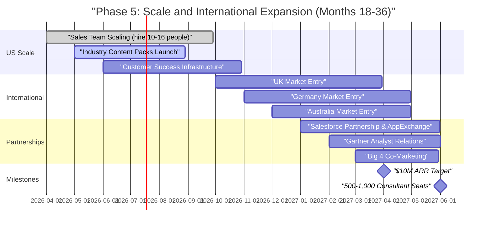

# Phase 5: Scale and International Expansion (Months 18-36)

**Sprint**: 06 - Digital Transformation Consulting Research Enablement 
**Task**: 05 - Implementation Roadmap 
**Author**: roadmap-planner skill 
**Date**: 2025-11-18

---

## Executive Summary

Phase 5 scales the platform from $2M-$8M ARR (Month 18) to $10M-$30M ARR (Month 36) through systematic customer acquisition, international market expansion, and product innovation. This 18-month phase focuses on reaching 500-1,000 consultant seats across 20-30 consulting firms, expanding to English-speaking international markets (UK, Germany, Australia), and launching premium features (industry content packs, white-label client portals, advanced analytics). The company transitions from startup to scale-up with mature sales, customer success, and product organizations.

**Key Objectives**:
- Scale to 500-1,000 consultant seats across 20-30 firms (2-3x growth from Phase 4)
- Achieve $10M-$30M ARR by Month 36 (3-5x growth from Phase 4)
- Expand to international markets: UK, Germany, Australia (English-speaking priority)
- Launch premium features: industry content packs ($25K-$50K each), white-label portals ($50K-$100K), analytics dashboards
- Build scalable customer success infrastructure (5-8 CSMs, quarterly business reviews, adoption analytics)
- Establish strategic partnerships (Salesforce, Gartner, Big 4 co-marketing)

**Investment**: $1M-$2.5M (team scaling, international operations, content development, infrastructure, partnerships)

---

## Detailed Milestones and Timeline

### Month 18-24: Scaling US Operations and Product Innovation

**Milestone 5.1: Sales Team Scaling (Month 18-24)**

**Deliverables**:
- Expand GTM team from 6-8 people (Phase 4) to 12-18 people
- Hire 3-5 additional AEs, 2-3 SDRs, 1-2 Sales Engineers, 3-5 CSMs
- Implement sales enablement infrastructure (training programs, playbook updates, sales ops analyst)
- Target: 10-15 new customers signed in 6 months (total 20-25 customers by Month 24)

**Team Expansion**:

| Role | Phase 4 (Month 18) | Phase 5 Target (Month 24) | New Hires |
|------|-------------------|---------------------------|-----------|
| VP Sales | 1 | 1 | 0 |
| Account Executives | 2-3 | 5-8 | 3-5 |
| SDRs | 1 | 3-4 | 2-3 |
| Sales Engineers | 1 | 2-3 | 1-2 |
| Customer Success Managers | 1-2 | 5-8 | 3-5 |
| Sales Operations Analyst | 0 | 1 | 1 |
| **TOTAL GTM TEAM** | **6-8** | **17-25** | **10-16** |

**Hiring Strategy**:
- **AEs**: Target reps with 3-5 years enterprise SaaS sales, $800K-$1.5M quota per rep
- **SDRs**: Promote top-performing SDR to Senior SDR or AE, hire 2-3 new SDRs for pipeline generation
- **SEs**: Hire technical talent from consulting tech vendors (Ivalua, ServiceNow, Salesforce) who understand consultant workflows
- **CSMs**: Hire from Big 4 consulting (former consultants with client success experience), 1 CSM per 4-6 accounts
- **Sales Ops**: Analytics background, Salesforce admin certification, pipeline forecasting expertise

**Sales Enablement**:
- **Training Program**: 2-week onboarding for new hires (product certification, demo training, sales process, CRM)
- **Playbook Updates**: Document learnings from Phase 4 (objection handling, pricing negotiations, pilot vs. firm-wide decision criteria)
- **Sales Ops Infrastructure**: Pipeline forecasting, win/loss analysis, quota management, commission tracking

**Target Outcomes (Month 18-24)**:
- 10-15 new customers signed (total 20-25 customers by Month 24)
- +$3M-$8M ARR (from $2M-$8M to $5M-$16M ARR)
- Average deal size increasing to $250K-$600K as firm-wide deployments grow
- Sales efficiency: 5-7x ROI on sales team investment ($1.5M-$2.5M sales cost → $7.5M-$17.5M new ARR)

**Budget**: $400K-$700K for 6 months (new hires salaries, training, sales tools)

---

**Milestone 5.2: Industry Content Packs and Premium Features (Month 18-24)**

**Deliverables**:
- Launch 5 industry-specific content packs: Financial Services, Healthcare, Retail/CPG, Manufacturing, Energy
- Each pack: 200-500 curated case studies, industry benchmarks, regulatory context, technology landscape
- Pricing: $25K-$50K per pack per year (add-on to base subscription)
- Target: 10-15 customers purchase 1-2 packs each (15-25 packs sold = $375K-$1.25M ARR)

**Industry Content Pack Development**:

**Financial Services Pack** ($35K-$50K per year):
- **Content Coverage**: 500+ case studies (banking, insurance, asset management, payments)
- **Technology Focus**: AI for fraud detection, cloud migration for core banking, RegTech compliance automation, digital banking/mobile apps
- **Regulatory Context**: SEC, FINRA, Basel III, GDPR (financial services implications)
- **Benchmarks**: ROI for AI fraud prevention (30-50% false positive reduction), cloud cost savings (20-40% infrastructure reduction)
- **Development**: Hire 2-3 financial services research associates, curate content over 3 months, $40K-$60K investment

**Healthcare Pack** ($30K-$45K per year):
- **Content Coverage**: 400+ case studies (hospitals, pharma, medical devices, health tech)
- **Technology Focus**: AI diagnostics, EHR modernization, telehealth platforms, clinical trial automation
- **Regulatory Context**: HIPAA, FDA, HITECH, patient privacy regulations
- **Benchmarks**: ROI for AI diagnostics (10-20% accuracy improvement, 30-50% radiologist time savings), telehealth adoption (40-60% patient satisfaction increase)
- **Development**: Partner with healthcare consulting firms or health tech analysts, $35K-$50K investment

**Retail/CPG Pack** ($25K-$40K per year):
- **Content Coverage**: 350+ case studies (omnichannel, personalization, supply chain, loyalty programs)
- **Technology Focus**: AI personalization, BOPIS/curbside pickup, unified commerce platforms, demand forecasting
- **Benchmarks**: Personalization ROI (15-30% revenue uplift, 20-35% CLV increase), omnichannel conversion (10-25% improvement)
- **Development**: Curate from vendor case studies (Salesforce Commerce Cloud, Adobe, SAP), $30K-$45K investment

**Manufacturing and Energy Packs**: Similar structure, 250-400 case studies each, $25K-$40K pricing

**Go-to-Market for Content Packs**:
- **Target Customers**: Consulting firms with specialized industry practices (e.g., financial services consultancy, healthcare advisory)
- **Sales Motion**: CSM identifies opportunity during QBR ("Your team focuses 80% on financial services—our FS pack would provide 500+ relevant case studies"), AE negotiates pricing
- **Bundling**: Offer discounts for multi-pack purchases (2 packs = 10% discount, 3+ packs = 15% discount)

**Premium Features Launch**:

**White-Label Client Portal** ($50K-$100K per year):
- **Use Case**: Consulting firms share platform intelligence with their clients under consultant's branding (retainer advisory)
- **Features**: Custom branding (logo, colors), client user accounts, curated content sharing, engagement analytics
- **Target Customers**: 5-10 firms focused on retainer advisory (ongoing strategic guidance vs. one-time projects)
- **Revenue Potential**: 5-10 customers × $75K average = $375K-$750K ARR

**Advanced Analytics Dashboard** (included in enterprise plans, or $15K-$25K add-on):
- **Features**: Firm-level usage analytics (adoption by consultant, time saved estimates, proposals created), ROI reporting, consultant leaderboards
- **Target Customers**: Practice Leaders and Managing Partners who need visibility into platform ROI
- **Revenue Potential**: 10-15 customers × $20K average = $200K-$300K ARR (or included in large deals to drive adoption)

**Total Premium Revenue (Month 18-24)**:
- Industry content packs: $375K-$1.25M ARR
- White-label portals: $375K-$750K ARR
- Analytics dashboards: $200K-$300K ARR
- **Total: $950K-$2.3M ARR from premium features**

**Budget**: $200K-$350K (content pack development $150K-$250K, product engineering $50K-$100K)

---

**Milestone 5.3: Customer Success Infrastructure (Month 18-24)**

**Deliverables**:
- Scale CSM team from 1-2 to 5-8 CSMs (1 CSM per 4-6 accounts)
- Implement customer health scoring (usage analytics, NPS, engagement, expansion potential)
- Quarterly business reviews (QBRs) with 100% of customers
- Customer community program (user forum, quarterly webinars, best practice sharing)

**CSM Team Structure**:

**Enterprise CSMs** (2-3 FTEs):
- **Accounts**: 3-5 large customers (200+ users, $500K+ ARR each)
- **Responsibilities**: Strategic QBRs, executive stakeholder management, expansion opportunities, custom content requests
- **Success Metrics**: >95% retention, >120% NRR (net revenue retention), NPS >60

**Mid-Market CSMs** (2-3 FTEs):
- **Accounts**: 5-8 mid-sized customers (50-150 users, $200K-$500K ARR each)
- **Responsibilities**: QBRs, adoption tracking, upsell opportunities (users, content packs), training programs
- **Success Metrics**: >90% retention, >110% NRR, NPS >50

**Scale CSMs** (1-2 FTEs):
- **Accounts**: 8-12 smaller customers (<50 users, <$200K ARR each)
- **Responsibilities**: Scaled support (webinars, help docs, community forum), reactive QBRs (on-demand vs. proactive), self-service expansion
- **Success Metrics**: >85% retention, >100% NRR, NPS >40

**Customer Health Scoring**:

**Health Score Calculation** (0-100 scale):
- **Usage** (40 points): Active users %, average logins per week, searches per user, business cases generated
- **Engagement** (20 points): QBR attendance, executive sponsor involvement, champion activity, support ticket volume (negative indicator)
- **Satisfaction** (20 points): NPS score, SUS score, qualitative feedback sentiment
- **Commercial** (20 points): On-time renewals, expansion opportunities identified, payment health (no late payments)

**Health Tiers**:
- **Green (80-100)**: Healthy, likely to renew and expand, low touch from CSM
- **Yellow (60-79)**: At-risk, requires proactive intervention (additional training, content expansion, executive engagement)
- **Red (<60)**: Churn risk, urgent intervention needed (VP Sales + Product team involvement, win-back plan)

**QBR Process**:
- **Frequency**: Quarterly for Enterprise and Mid-Market, annual or on-demand for Scale
- **Agenda**: Usage review, ROI validation, success stories, roadmap preview, feedback, expansion discussion
- **Follow-Up**: Action items tracked in CRM (content requests, feature requests, expansion opportunities)

**Customer Community**:
- **User Forum** (Slack or Discourse): Peer-to-peer support, best practice sharing, feature requests, product announcements
- **Quarterly Webinars**: New feature demos, customer success stories, Q&A with product team
- **Annual User Conference** (Year 3+): In-person event for top customers, roadmap sessions, networking, training workshops

**Target Outcomes (Month 18-24)**:
- 100% QBR completion with top 20-25 customers
- Customer health: 70% green, 25% yellow, <5% red
- Retention: >90% (≤2 churns in 6 months)
- NRR: >110% (expansion ARR exceeds churn ARR)

**Budget**: $300K-$500K (CSM salaries for 3-5 new hires over 6 months, community platform $5K-$10K, webinar production $10K-$20K)

---

### Month 24-30: International Expansion (UK, Germany, Australia)

**Milestone 5.4: International Market Entry (Month 24-30)**

**Deliverables**:
- Launch in 3 international markets: UK, Germany, Australia (English-speaking priority)
- Localize content: Technology landscape and case studies for each region
- Hire regional sales and CSM teams (2-3 people per region)
- Target: 5-10 international customers signed, $500K-$2M ARR from international markets

**Market Selection Criteria**:
- **Language**: English-speaking markets prioritized (UK, Australia) to minimize localization costs
- **DX Consulting Market Size**: Large professional services markets with Big 4 presence and boutique DX firms
- **Regulatory Environment**: Data privacy compliance (GDPR for UK/Germany, Privacy Act for Australia)
- **Technology Adoption**: High cloud/AI adoption rates, mature DX consulting industry

**Market Profiles**:

**United Kingdom**:
- **DX Consulting Market**: £15B+ (Big 4 UK, Accenture UK, PA Consulting, Capgemini UK, plus 50+ boutique firms)
- **Target Customers**: 10-15 firms with 50-500 DX consultants
- **Localization Needs**: UK-specific case studies (NHS digital transformation, UK financial services, retail case studies), GDPR compliance, GBP pricing
- **Go-to-Market**: Hire UK-based AE and CSM, attend UK conferences (Digital Transformation Expo London), partner with Salesforce UK
- **Target ARR (Year 2-3)**: $250K-$1M (3-5 customers)

**Germany**:
- **DX Consulting Market**: €20B+ (Big 4 Germany, Capgemini, T-Systems, plus German boutique firms like Mücke, Sturm und Partner)
- **Target Customers**: 8-12 firms (focus on English-speaking practices initially, German language support in Year 3)
- **Localization Needs**: German case studies (Industry 4.0, automotive DX, banking), GDPR compliance, EUR pricing, German language UI (Phase 2)
- **Go-to-Market**: Hire German-speaking AE (English fluency required), attend Hannover Messe or dmexco
- **Target ARR (Year 2-3)**: $200K-$800K (2-4 customers initially, German language = 5-10 customers in Year 3)

**Australia**:
- **DX Consulting Market**: AU$8B+ (Big 4 Australia, Deloitte Digital AU, PwC Digital AU, plus boutique firms)
- **Target Customers**: 5-8 firms with 50-200 DX consultants
- **Localization Needs**: Australia-specific case studies (ANZ banking, retail, mining/resources), Privacy Act compliance, AUD pricing
- **Go-to-Market**: Hire Australia-based AE and CSM (Sydney or Melbourne), attend CeBIT Australia or Australian Digital Summit
- **Target ARR (Year 2-3)**: $150K-$500K (2-3 customers)

**International Team Structure** (by Month 30):

| Region | AEs | CSMs | Sales Engineers | Total |
|--------|-----|------|-----------------|-------|
| UK | 1-2 | 1 | 0.5 (shared with US) | 2-3 |
| Germany | 1 | 0.5 | 0.5 (shared) | 2 |
| Australia | 1 | 0.5 | 0 (US support) | 1-2 |
| **TOTAL INTERNATIONAL** | **3-4** | **2** | **1** | **5-7** |

**Localization Investment**:

| Activity | Cost per Region | 3 Regions Total |
|----------|----------------|-----------------|
| Content Localization (200-500 regional case studies) | $30K-$50K | $90K-$150K |
| Legal & Compliance (GDPR, Privacy Act, contracts) | $15K-$25K | $45K-$75K |
| Regional Cloud Infrastructure (AWS EU, APAC) | $5K-$10K setup + $2K-$5K/month | $15K-$30K + $72K-$180K/year |
| Conference Presence (1 conference per region) | $10K-$20K | $30K-$60K |
| Marketing Localization (website, collateral, case studies) | $10K-$20K | $30K-$60K |

**Total International Expansion Cost (6 months)**: $300K-$600K (team hiring + localization + infrastructure + marketing)

**Target Outcomes (Month 24-30)**:
- 5-10 international customers signed (UK: 3-5, Germany: 1-3, Australia: 1-2)
- $500K-$2M ARR from international markets
- International revenue = 10-20% of total revenue by Month 30

**Budget**: $300K-$600K (team, content, infrastructure, marketing)

---

### Month 30-36: Strategic Partnerships and Market Leadership

**Milestone 5.5: Strategic Partnerships (Month 30-36)**

**Deliverables**:
- Salesforce partnership: Co-marketing, integration certification, AppExchange listing
- Gartner partnership: Analyst briefings, inclusion in DX research reports, webinar co-hosting
- Big 4 co-marketing: "Preferred DX intelligence platform" designation with 1-2 Big 4 firms
- Partner-sourced revenue: $1M-$3M ARR from partnership channels

**Salesforce Partnership**:

**Partnership Objectives**:
- **Integration Certification**: Salesforce-verified CRM integration, listed on AppExchange
- **Co-Marketing**: Joint webinars, case studies, event sponsorships
- **Sales Channel**: Salesforce AEs recommend platform to consulting firm customers

**Partnership Activities**:
- **AppExchange Listing**: Submit app for Salesforce review, achieve "Salesforce Verified" badge
- **Integration Enhancement**: Bi-directional sync (Opportunities → Platform → Updated Opportunities with proposals), Salesforce Lightning components
- **Joint Case Study**: Co-author case study with Salesforce customer (consulting firm using both Salesforce CRM and Continuous Intelligence Platform)
- **Webinar Series**: Co-host quarterly webinars on "Scaling DX Consulting with Salesforce and Continuous Intelligence"
- **Dreamforce Presence**: Sponsor booth at Dreamforce, co-present with Salesforce in AppExchange Theater

**Revenue Impact**: $300K-$1M ARR from Salesforce-sourced leads (10-15% of new customer ARR)

**Investment**: $50K-$100K (AppExchange certification, integration enhancements, Dreamforce sponsorship)

---

**Gartner Partnership**:

**Partnership Objectives**:
- **Analyst Briefings**: Present platform to Gartner analysts covering DX consulting, knowledge management, research intelligence
- **Magic Quadrant Inclusion**: Target inclusion in relevant Magic Quadrants (Knowledge Management, Research & Advisory Services)
- **Webinar Co-Hosting**: Partner with Gartner for webinars on DX consulting trends
- **Client References**: Encourage customers to cite platform in Gartner Peer Insights reviews

**Partnership Activities**:
- **Inquiry Access**: Purchase Gartner Inquiry license ($25K-$50K per year) to engage analysts
- **Analyst Briefings**: Quarterly briefings on product roadmap, customer traction, market positioning
- **Gartner Event Sponsorship**: Sponsor Gartner Digital Workplace Summit or Symposium ($30K-$50K)
- **Peer Insights Campaign**: Incentivize customers to leave reviews on Gartner Peer Insights (gift cards, swag)

**Revenue Impact**: $200K-$800K ARR from Gartner-influenced deals (analyst validation accelerates enterprise sales)

**Investment**: $75K-$150K (Gartner licenses, event sponsorship, analyst relations consultant)

---

**Big 4 Co-Marketing**:

**Partnership Objectives**:
- Secure "preferred DX intelligence platform" designation with 1-2 Big 4 firms
- Co-market to Big 4's clients (consulting firms can offer platform as part of DX engagements)
- Revenue share: Big 4 earns 10-20% commission on platform subscriptions they refer

**Partnership Activities**:
- **Executive Alignment**: Engage Big 4 DX Practice Leaders and Innovation/Technology Partners
- **Pilot with Big 4**: Run firm-wide deployment at 1-2 Big 4 practices (200-500 consultants), demonstrate ROI
- **Co-Marketing Agreement**: Joint press release, case study, webinars, conference co-presentations
- **Client Referrals**: Big 4 recommends platform to their consulting firm clients, earns referral commission

**Revenue Impact**: $500K-$1.2M ARR from Big 4 co-marketing (1-2 large Big 4 deployments + 3-5 client referrals)

**Investment**: $50K-$100K (co-marketing materials, Big 4 account team support, referral commissions)

---

**Total Partnership Revenue and Investment**:
- **Partner-Sourced ARR**: $1M-$3M (Salesforce $300K-$1M, Gartner $200K-$800K, Big 4 $500K-$1.2M)
- **Partnership Investment**: $175K-$350K over 6 months

**Budget**: $175K-$350K

---

**Milestone 5.6: Market Leadership and Category Creation (Month 30-36)**

**Deliverables**:
- Position as category leader in "Continuous Intelligence for DX Consulting"
- Publish annual "State of DX Consulting Research" report with industry benchmarks
- Host first annual user conference (virtual or in-person)
- Achieve 500-1,000 consultant seats and $10M-$30M ARR by Month 36

**Thought Leadership**:

**Annual Industry Report**: "State of DX Consulting Research 2026"
- **Content**: Survey 200+ DX consultants on research practices, time allocation, tool usage, pain points
- **Benchmarks**: Average time spent on research (15-20 hours/week), proposal creation time (8-12 hours), win rates (25-35%)
- **Platform Impact**: Customers achieve 40% time savings, 2.5x proposal velocity, +10-15% win rate improvement
- **Distribution**: Gated PDF on website, PR campaign, conference distribution, co-promotion with Salesforce and Gartner

**Budget**: $30K-$50K (survey design, data analysis, report writing, design, PR)

---

**Annual User Conference** (Year 3):
- **Format**: 1-day virtual conference or 2-day in-person event (if budget allows)
- **Attendees**: 200-500 (customers, prospects, partners)
- **Agenda**: Keynote (CEO vision, product roadmap), customer panels, breakout sessions (best practices, advanced features), partner expo, networking
- **Revenue**: Sponsorships from partners (Salesforce, Gartner, AWS) offset costs ($50K-$100K sponsorship revenue)

**Budget**: $100K-$200K (virtual event) or $300K-$500K (in-person event)

---

**Total Phase 5 Outcomes (Month 36)**:

| Metric | Target |
|--------|--------|
| **Total Customers** | 25-35 firms (20-25 from Phase 4 + 5-10 new in Phase 5) |
| **Total Consultant Seats** | 500-1,000 (2-3x growth from 200-400 in Phase 4) |
| **ARR** | $10M-$30M ($5M-$16M from Phase 4 + $5M-$14M new ARR in Phase 5) |
| **International Revenue** | 15-25% of total ARR ($1.5M-$7.5M from UK, Germany, Australia) |
| **Premium Revenue** | 20-30% of ARR ($2M-$9M from content packs, white-label, analytics) |
| **Partner-Sourced Revenue** | 10-20% of new ARR ($1M-$3M from Salesforce, Gartner, Big 4) |
| **Customer Retention** | >90% (net retention >110% with expansion) |
| **NPS** | >55 (maintain Phase 2-4 levels) |

---

## Resource Requirements (Month 18-36)

### Team Scaling

| Role | Month 18 | Month 36 | New Hires |
|------|----------|----------|-----------|
| **GTM Team** | 6-8 | 25-35 | 17-27 |
| - VP Sales | 1 | 1 | 0 |
| - AEs (US + International) | 2-3 | 8-12 | 5-9 |
| - SDRs | 1 | 4-6 | 3-5 |
| - Sales Engineers | 1 | 3-4 | 2-3 |
| - CSMs | 1-2 | 8-12 | 6-10 |
| - Sales Ops | 0 | 1-2 | 1-2 |
| **Product & Engineering** | 5-7 | 12-18 | 7-11 |
| **Operations & Finance** | 1-2 | 4-6 | 2-4 |
| **TOTAL TEAM** | **12-17** | **41-59** | **26-42** |

### Total Phase 5 Investment (18 months)

| Category | Cost Range |
|----------|-----------|
| Team Salaries (18 months, 26-42 new hires) | $2.5M-$4.5M |
| International Expansion (3 regions) | $300K-$600K |
| Content Development (industry packs, localization) | $200K-$400K |
| Partnerships (Salesforce, Gartner, Big 4) | $175K-$350K |
| Infrastructure Scaling (500-1,000 users) | $150K-$300K |
| Marketing & Events (conferences, user conference, PR) | $200K-$500K |
| **TOTAL PHASE 5** | **$3.53M-$6.65M** |

**Rounded Estimate**: **$1M-$2.5M incremental** (assumes $2.5M-$4M base from earlier phases continues, marginal cost is new hires + international + partnerships)

---

## Success Criteria and KPIs

### Growth KPIs

- **ARR Growth**: $10M-$30M by Month 36 (3-5x from Phase 4)
- **Customer Growth**: 25-35 firms (2x from Phase 4)
- **Consultant Seats**: 500-1,000 (2.5-3x from Phase 4)
- **International Revenue**: 15-25% of ARR

### Product and Premium KPIs

- **Industry Content Packs Sold**: 15-30 (at $25K-$50K each)
- **White-Label Portals**: 8-15 customers (at $50K-$100K each)
- **Premium Revenue**: 20-30% of total ARR

### Customer Success KPIs

- **Retention**: >90% annually
- **Net Revenue Retention**: >110% (expansion exceeds churn)
- **NPS**: >55
- **QBR Completion**: 100% of top 30 customers

### Partnership KPIs

- **Partner-Sourced Revenue**: 10-20% of new ARR ($1M-$3M)
- **Salesforce AppExchange Installs**: 500-1,000
- **Gartner Peer Insights Reviews**: 20-50 reviews, 4.5+ star average

---

## Visual Roadmap

---

## References

1. **OpenView Partners** (2024). "SaaS Expansion Benchmarks: International Revenue as % of Total". Top-quartile SaaS companies achieve 20-40% international revenue by Year 3-4.

2. **ChartMogul** (2024). "Net Revenue Retention Benchmarks". SaaS companies with >110% NRR grow 2-3x faster than those with <100% NRR.

3. **Salesforce AppExchange** (2024). "Partner Program: AppExchange Listing Requirements and Co-Marketing Opportunities". Retrieved from Salesforce Partner Community.

4. **Gartner Research** (2024). "How to Engage Gartner Analysts: Inquiry Access, Briefings, Magic Quadrant Positioning". Best practices for SaaS vendor analyst relations.

5. **SaaStr** (2024). "Scaling from $10M to $50M ARR: Team Composition, GTM Efficiency, Product Expansion". Industry benchmarks for SaaS scale-up phase.

6. **ProfitWell** (2024). "Premium Feature Pricing: Industry Content Packs, White-Label Portals, Advanced Analytics". Benchmark pricing for SaaS add-ons and premium tiers.
