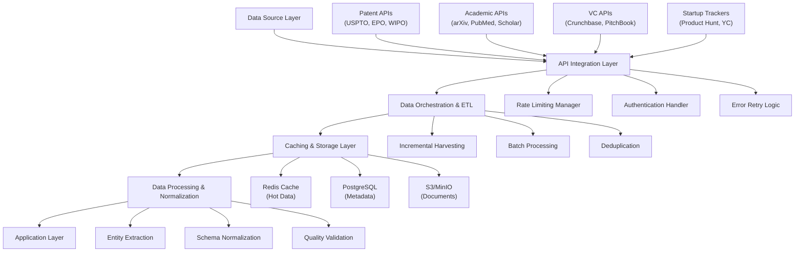

# Data Source Integration Requirements for Technology Scouting Platforms

**Sprint**: 07 - Technology Scouting & Strategic Foresight 
**Task**: 01 - Technical & Regulatory Landscape 
**Date**: 2025-11-18 
**Author**: Technical Researcher 

---

## Executive Summary

AI-powered technology scouting and strategic foresight platforms require integration with diverse data sources to monitor emerging technologies, patents, academic research, venture funding, and startup activities. This research examines the technical requirements, API capabilities, and integration challenges for major data sources including patent databases (USPTO, EPO, WIPO), academic repositories (arXiv, PubMed, Google Scholar), venture capital databases (Crunchbase, PitchBook), and startup trackers (Product Hunt, AngelList).

Key findings reveal that while official APIs exist for most patent databases and academic repositories, significant technical challenges persist with Google Scholar (no official API), VC database cost structures, and rate limiting across all platforms. A comprehensive technology scouting platform monitoring 500+ sources and processing 1M+ documents monthly requires sophisticated data orchestration, caching strategies, and multi-tier integration approaches combining official APIs, authorized third-party services, and ethical web scraping where permissible.

The estimated technical effort for full integration spans 3-4 months for MVP (5-10 core sources) and 5-6 months for enterprise-ready deployment (50-100+ sources with redundancy and failover).

---

## Key Findings

- **Patent Database APIs**: USPTO PatentsView, EPO Open Patent Services (OPS), and WIPO PATENTSCOPE provide official RESTful APIs with structured access to 100K+ monthly patent filings, supporting XML/JSON formats
- **Academic Repository Challenges**: arXiv and PubMed offer robust official APIs, but Google Scholar lacks official API support, requiring third-party services (SerpAPI, SearchAPI) or ethical web scraping
- **VC Database Cost Barriers**: Crunchbase and PitchBook provide API access only at enterprise tiers ($20K-100K+ annually), creating significant cost barriers for early-stage platforms
- **Rate Limiting Requirements**: All major APIs impose strict rate limits (100-10,000 requests/day), necessitating intelligent caching, batch processing, and multi-account strategies
- **Data Quality Variability**: Patent data is highly structured but complex; academic metadata varies significantly by source; VC data requires continuous validation due to frequent updates
- **Integration Timeline**: MVP integration (5-10 sources) requires 3-4 months; enterprise-ready platform (50+ sources) requires 5-6 months with dedicated data engineering resources

---

## 1. Patent Database Integration Requirements

### 1.1 USPTO (United States Patent and Trademark Office)

**API Availability**: Official APIs available through PatentsView and USPTO Open Data APIs

**PatentsView API**: 
The PatentsView API is the official USPTO interface offering structured access to United States patent data, suitable for researchers and developers exploring inventor relationships, citation data, patent metadata, and classification systems at scale [PatentsView, 2024]. The API includes name disambiguation for inventors and assignees and supports granular filtering across fields such as CPC codes, USPC classes, filing dates, and legal status.

**Key Features**:
- RESTful API with JSON response format
- Comprehensive bibliographic data (titles, abstracts, claims, classifications)
- Citation network data (forward and backward citations)
- Legal status tracking (granted, abandoned, pending)
- Inventor and assignee disambiguation
- Free access with rate limiting

**Rate Limits**: 45 requests per minute per IP address [USPTO, 2024]

**Data Volume**: 100,000+ new patent applications monthly, 11+ million total patents in database

**Integration Requirements**:
- Python client libraries available (uspto-opendata-python)
- API key not required for basic access
- Pagination required for large result sets (max 10,000 records per query)
- Recommended caching strategy: Daily incremental updates for new filings

**Technical Specifications**:
- Endpoint: `https://api.patentsview.org/patents/query`
- Response Format: JSON
- Authentication: None (rate limiting by IP)
- Documentation: https://patentsview.org/apis/api-endpoints

### 1.2 EPO (European Patent Office)

**API Availability**: EPO Open Patent Services (OPS) - Official RESTful API

**EPO Open Patent Services (OPS)**: 
The EPO's Open Patent Services (OPS) is the official RESTful API provided by the European Patent Office that gives developers programmatic access to structured patent data from the EPO, WIPO (via INPADOC), and many national patent offices [EPO, 2024]. OPS is best suited for retrieving bibliographic records, legal status data, patent family structures, and published document images.

**Key Features**:
- Access to EPO, WIPO INPADOC, and 90+ national patent offices
- Patent family data (related filings across jurisdictions)
- Legal status information (25+ million legal events)
- Full-text patent documents (PDF retrieval)
- Machine translation support (30+ languages)
- Free access with registration

**Rate Limits**:
- Anonymous access: 10 requests per minute
- Registered users: 20 requests per minute, 2.5 GB weekly quota
- Commercial licenses available for higher limits

**Data Volume**: 140+ million patent documents, 500K+ new filings monthly

**Integration Requirements**:
- OAuth 2.0 authentication for registered access
- XML response format (more complex than JSON, requires parsing)
- Client libraries available (Python: python-epo-ops-client)
- Batch processing recommended for large-scale data retrieval
- Image retrieval separate from metadata (two-step process)

**Technical Specifications**:
- Endpoint: `https://ops.epo.org/3.2/rest-services/`
- Response Format: XML (primary), JSON (limited)
- Authentication: OAuth 2.0
- Documentation: https://developers.epo.org/

**Technical Challenge**: XML format requires additional processing and transformation compared to modern JSON-native APIs, potentially increasing integration complexity by 20-30% [EPO Developer Portal, 2024].

### 1.3 WIPO (World Intellectual Property Organization)

**API Availability**: WIPO PATENTSCOPE API and WIPO API Catalog

**WIPO PATENTSCOPE**: 
WIPO provides the PATENTSCOPE Search Service, featuring full-text search of published international patent applications under the Patent Cooperation Treaty (PCT), with machine translations for some documents and access to international patent databases [WIPO, 2024]. The WIPO API Catalog provides centralized access to multiple intellectual property data services.

**Key Features**:
- PCT application data (340K+ annual filings)
- Full-text search with machine translation (10+ languages)
- Patent landscape reports
- Global patent statistics
- Free access with registration

**WIPO API Catalog Services**:
- PATENTSCOPE API: Search and retrieval of PCT applications
- Global Brand Database API: Trademark data
- Global Design Database API: Industrial design data
- IP Statistics API: Aggregated IP statistics by country/region

**Rate Limits**:
- Standard access: 100 requests per day
- Premium access: 10,000 requests per day (requires approval)

**Data Volume**: 5+ million PCT applications, 340,000+ new filings annually

**Integration Requirements**:
- API key required (free registration)
- Ruby client libraries available (wipo-patentscope)
- SOAP and REST interfaces (REST recommended for modern integrations)
- Response formats: XML, JSON (varies by service)
- Query complexity limits (max 100 search terms per query)

**Technical Specifications**:
- Endpoint: `https://www.wipo.int/patentscope/en/webservices/`
- Response Format: XML (primary), JSON (selected services)
- Authentication: API key
- Documentation: https://apicatalog.wipo.int/

### 1.4 Additional Patent Data Sources

**KIPO (Korean Intellectual Property Office)**: 
Through KIPRIS Plus, KIPO provides patent information via Open APIs, bulk data downloads, and online download services, offering approximately 126 types of open data products including patents, utility models, trademarks, designs, and foreign patents [KIPO, 2024].

**Patent Analytics Tools**: 
Third-party patent analytics platforms like PatSnap and Clarivate offer enhanced APIs with value-added services:
- Advanced search and filtering
- Patent family deduplication
- Citation network analysis
- Technology classification and clustering
- Competitive landscape mapping

**Cost Considerations**: Enterprise patent analytics APIs range from $50K-500K+ annually depending on usage volume and features.

---

## 2. Academic Research Repository Integration

### 2.1 arXiv (Physics, Math, Computer Science Preprints)

**API Availability**: Official arXiv API with open access

**arXiv Overview**: 
arXiv is an open-access repository of electronic preprints approved for posting after moderation (not peer-reviewed), popular in physics, mathematics, computer science, quantitative biology, quantitative finance, and statistics [arXiv.org, 2024]. With 2.4+ million preprints and 200K+ annual submissions, arXiv is a critical source for emerging research trends.

**Key Features**:
- Open API with no authentication required
- Full metadata access (title, authors, abstract, categories, dates)
- PDF full-text retrieval
- Subject category classification (physics, cs, math, q-bio, etc.)
- Version tracking (preprint updates and corrections)
- No cost for access

**Rate Limits**:
- Bulk data access: 1 request every 3 seconds (respectful crawling policy)
- API queries: No hard limit, but requests to be spaced appropriately
- Bulk downloads available via S3 buckets (metadata and full-text)

**Data Volume**: 2.4+ million preprints, 16,000+ new submissions monthly

**Integration Requirements**:
- No API key required
- REST API with Atom XML response format
- Python client libraries available (arxiv-py)
- OAI-PMH protocol support for metadata harvesting
- Recommended: Daily incremental harvesting by submission date

**Technical Specifications**:
- Endpoint: `http://export.arxiv.org/api/query`
- Response Format: Atom XML
- Authentication: None
- Documentation: https://info.arxiv.org/help/api/

**Best Practice**: For technology scouting, focus on `cs.AI`, `cs.LG`, `cs.CV`, `physics.comp-ph`, and `q-bio` categories for emerging technology signals.

### 2.2 PubMed / PubMed Central (Biomedical Literature)

**API Availability**: Official NCBI E-utilities API and Europe PMC API

**PubMed Overview**: 
PubMed Central (PMC) provides access to metadata of all items in the PMC archive and full text of a subset of these items. Europe PubMed Central offers a RESTful web service giving access to all publications and related information in their database [NCBI, 2024].

**Key Features**:
- Access to 36+ million biomedical citations
- MeSH (Medical Subject Headings) controlled vocabulary
- Full-text access for 7+ million open-access articles
- Citation network and related article recommendations
- Clinical trial linkage
- Free access with API key

**NCBI E-utilities Components**:
- **ESearch**: Search and retrieve PMIDs
- **EFetch**: Retrieve full records
- **ELink**: Find related articles and citations
- **ESummary**: Document summaries

**Rate Limits**:
- Without API key: 3 requests per second
- With API key: 10 requests per second
- Large-scale bulk downloads require FTP access

**Data Volume**: 36+ million citations, 1.5+ million new records annually

**Integration Requirements**:
- API key required (free NCBI account)
- Python client library: Biopython (Bio.Entrez module)
- XML response format (requires parsing)
- Batch processing recommended (max 500 IDs per request)
- Required: Email address in all requests (terms of service)

**Technical Specifications**:
- Endpoint: `https://eutils.ncbi.nlm.nih.gov/entrez/eutils/`
- Response Format: XML, JSON (limited support)
- Authentication: API key (optional but recommended)
- Documentation: https://www.ncbi.nlm.nih.gov/books/NBK25501/

**Europe PMC Alternative**: 
Europe PMC offers a more modern RESTful API with JSON responses:
- Endpoint: `https://www.ebi.ac.uk/europepmc/webservices/rest/`
- Response Format: JSON, XML
- No API key required for basic access
- Better full-text search capabilities

### 2.3 Google Scholar (Comprehensive Academic Search)

**API Availability**: No official API available

**Google Scholar Challenge**: 
Google does not offer an official API for Google Scholar. Researchers cannot directly query Google Scholar data using Google APIs and must look for alternative approaches such as web scraping or unofficial third-party APIs [Google, 2024].

**Alternative Integration Approaches**:

**Option 1: Third-Party API Services** (Recommended for Compliance)
- **SerpAPI Google Scholar**: $50-250/month, 5K-100K searches
  - Endpoint: `https://serpapi.com/search`
  - JSON responses with citation counts, PDF links, related articles
  - Rate limit: Based on subscription tier

- **SearchAPI**: $49-499/month, 10K-500K searches
  - Similar capabilities to SerpAPI
  - Better international coverage

**Option 2: Ethical Web Scraping** (Higher Risk)
- Custom scraper with respectful rate limiting (1-2 requests per second)
- User-agent rotation to avoid blocking
- Captcha handling (2Captcha, Anti-Captcha services)
- Legal risk: Violates Google Terms of Service
- Technical risk: High maintenance due to HTML structure changes

**Option 3: Semantic Scholar API** (Open Alternative)
- Free academic search API from Allen Institute for AI
- 200+ million papers indexed
- Citation network and influential citations
- API Endpoint: `https://api.semanticscholar.org/graph/v1/`
- Rate Limit: 1 request per second (free tier), 5 requests per second (API key)

**Recommended Approach**:
- Primary: Semantic Scholar API (free, legal, comprehensive)
- Secondary: SerpAPI for Google Scholar coverage (budget $150-250/month)
- Tertiary: Direct arXiv/PubMed for domain-specific deep coverage

**Cost Considerations**: Third-party Google Scholar APIs add $600-3,000 annually to infrastructure costs.

### 2.4 Additional Academic Sources

**CrossRef API**: 
- Metadata for 150+ million scholarly works
- DOI resolution and citation data
- Free API with no authentication
- Endpoint: `https://api.crossref.org/`
- Rate limit: 50 requests per second (polite pool with contact email)

**Microsoft Academic Graph** (Deprecated 2021): 
- No longer available; replaced by OpenAlex

**OpenAlex**: 
- Free, open replacement for Microsoft Academic
- 250+ million scholarly works
- API Endpoint: `https://api.openalex.org/`
- No authentication required
- Rate limit: 10 requests per second (100K per day)

---

## 3. Venture Capital Database Integration

### 3.1 Crunchbase

**API Availability**: Enterprise API access only

**Crunchbase Overview**: 
Crunchbase offers data on public and private companies from early-stage startups through Fortune 1000 companies, providing venture capitalists the ability to search for, analyze, and track investment trends, startups, growth industries, and other investors [Crunchbase, 2024].

**Key Features**:
- 3+ million company profiles
- Funding round data (valuations, investors, dates)
- Investor and VC firm profiles
- M&A transaction tracking
- People and leadership data
- Technology tags and categories

**Pricing & API Access**:
- **Starter**: $29-99/month per user (no API access)
- **Pro**: $99-499/month (limited API access, 100 requests/day)
- **Enterprise**: $20K-100K+/year (full API access, custom limits)

**API Capabilities** (Enterprise Tier):
- RESTful API with JSON responses
- Entity types: Organizations, People, Funding Rounds, Acquisitions, Investors
- Search, filter, and autocomplete endpoints
- Webhook support for real-time updates
- Rate limit: Custom (typically 1,000-10,000 requests/day)

**Integration Requirements**:
- API key required (enterprise subscription)
- OAuth 2.0 authentication
- Client libraries: Node.js, Python (community-maintained)
- Pagination required (max 1,000 results per query)
- Data freshness: Daily updates

**Technical Specifications**:
- Endpoint: `https://api.crunchbase.com/api/v4/`
- Response Format: JSON
- Authentication: OAuth 2.0
- Documentation: https://data.crunchbase.com/docs/

**Cost Barrier**: Enterprise API access starting at $20K annually creates significant barrier for early-stage technology scouting platforms.

### 3.2 PitchBook

**API Availability**: Enterprise clients only

**PitchBook Overview**: 
PitchBook offers insights into pre-money venture valuations and is known for consistently accurate and reliable data on private capital markets transactions, offering insights into over 3.5 million private and public companies worldwide and maintaining records from over 1.9 million business deals [PitchBook, 2024].

**Key Features**:
- Private company valuations (pre/post-money)
- Detailed cap table data (for premium clients)
- VC fund performance metrics
- Comparable company analysis
- Excel plug-in for financial modeling
- Deal sourcing and pipeline management

**Pricing & API Access**:
- **Standard**: $20K-40K/year per user (Excel plug-in, limited API)
- **Enterprise**: $50K-250K+/year (full API access, custom integrations)

**API Capabilities** (Enterprise Tier):
- Excel plug-in allows live data pulls into models
- Bulk export capabilities
- Custom API endpoints for enterprise clients
- Integration with internal analytics systems
- Rate limit: Negotiated per contract

**Integration Requirements**:
- Direct sales contact required (no self-service API)
- Enterprise contract minimum 1-3 years
- Dedicated account management and onboarding
- Custom integration development often required

**Technical Specifications**:
- API documentation not publicly available
- Integration typically via Excel COM Add-in or custom REST API
- Authentication: Enterprise credentials
- Data export formats: Excel, CSV, JSON (custom)

**Cost Barrier**: Minimum $50K annually for meaningful API access; primarily targets institutional investors and large corporate development teams.

### 3.3 Alternative VC Data Sources

**Dealroom**: 
- European startup and VC database
- API available for enterprise customers
- Pricing: €10K-50K annually
- Strong coverage of European ecosystem

**CB Insights**: 
- Technology trends and VC analytics
- API available for enterprise customers ($50K+ annually)
- Proprietary technology categorization (Mosaic Algorithm)
- Strong focus on tech industry trends

**Tracxn**: 
- Startup tracker with 2.5+ million companies
- API access with enterprise subscription
- Pricing: $15K-75K annually
- Coverage across 1,800+ technology sectors

**Harmonic.ai**: 
- Startup database with 20M+ companies and 150M+ professional profiles
- Real-time data engine for fresh information
- Pricing not publicly disclosed (enterprise sales)

**Cost-Effective Alternative Strategy**:
- Use publicly available data from AngelList, Product Hunt, and Y Combinator
- Supplement with manual curation and verification
- Build proprietary database over time from public sources
- Phase in Crunchbase/PitchBook integration as revenue scales

---

## 4. Startup Tracker Integration

### 4.1 Product Hunt

**API Availability**: Official GraphQL API (limited access)

**Product Hunt Overview**: 
Product Hunt is a platform for discovering new products, startups, and technology launches, with 500K+ registered users and 100K+ products listed [Product Hunt, 2024]. It serves as an early signal for consumer technology trends and product-market fit validation.

**Key Features**:
- Daily product launches (50-100+ per day)
- User voting and engagement metrics
- Maker and hunter profiles
- Technology tags and categories
- Comments and community feedback
- Integration with CrunchBase for funding data

**API Access**:
- GraphQL API available with OAuth token
- Rate limit: 1,000 requests per hour (authenticated)
- Public API access requires approval
- Developer documentation: https://api.producthunt.com/v2/docs

**Integration Requirements**:
- OAuth 2.0 authentication required
- GraphQL query language (steeper learning curve than REST)
- No official client libraries (community Node.js and Python clients exist)
- Webhook support for real-time launch notifications

**Technical Specifications**:
- Endpoint: `https://api.producthunt.com/v2/api/graphql`
- Response Format: JSON (GraphQL)
- Authentication: OAuth 2.0
- Rate Limit: 1,000 requests/hour

**Technology Scouting Value**:
- Early indicator of consumer product trends
- Validation of problem-solution fit (upvote counts)
- Maker network for talent scouting
- Category trends (AI tools, productivity, dev tools)

### 4.2 AngelList (Wellfound)

**API Availability**: Limited public API (deprecated); platform rebranded to Wellfound

**AngelList/Wellfound Overview**: 
AngelList (now Wellfound) is the infrastructure that powers the startup economy, providing startups and investors with connected tools to launch and scale startups or funds and invest in both [AngelList, 2024]. Users call it the go-to database for investor prospecting.

**Key Features**:
- 130K+ startup profiles
- Investor and angel networks
- Fundraising and equity management tools
- Talent marketplace (startup hiring)
- Syndicates and rolling funds

**API Status** (2024):
- Public API deprecated in 2018
- No official API for third-party integrations
- Data accessible via web scraping (violates ToS)
- Partnership opportunities for enterprise data access

**Alternative Integration Approaches**:
- Manual curation from public profiles
- Partnership with AngelList for data licensing (contact sales)
- Use Crunchbase or PitchBook as alternatives (better API support)

**Cost Considerations**: Data licensing from AngelList/Wellfound requires enterprise partnership negotiation; pricing not publicly disclosed.

### 4.3 Y Combinator Companies

**API Availability**: No official API; public directory available

**Y Combinator Overview**: 
Y Combinator (YC) is the world's most successful startup accelerator, with 5,000+ companies funded including Airbnb, Stripe, DoorDash, and OpenAI [Y Combinator, 2024]. YC batch announcements serve as strong signals for emerging technology trends.

**Data Sources**:
- Public company directory: https://www.ycombinator.com/companies
- Batch announcements (twice yearly)
- Demo Day presentations (invite-only)
- YC News (Hacker News) for community signals

**Integration Approaches**:
- Web scraping YC company directory (ethical scraping with rate limiting)
- RSS feeds for YC blog and batch announcements
- Hacker News API (official): `https://github.com/HackerNews/API`
- Manual curation of batch companies

**Hacker News API**:
- Official Firebase API
- No authentication required
- Real-time access to stories, comments, users
- Rate limit: No official limit, use respectful crawling
- Endpoint: `https://hacker-news.firebaseio.com/v0/`

**Technology Scouting Value**:
- Tier 1 signal for early-stage technology trends
- Batch themes indicate YC's thesis on emerging markets
- Founder backgrounds reveal talent migration patterns
- Follow-on funding serves as validation signal

### 4.4 Startup Tracker Aggregators

**Startup Tracker**: 
Startup Tracker combines data from leading databases including CrunchBase, AngelList, and Product Hunt, serving as a startup search engine to help users find and track relevant companies [Startup Tracker, 2024].

**Features**:
- Aggregated data from multiple sources
- Save and annotate profiles to Evernote
- Track companies from MVP to IPO
- Custom alerts for sector-specific launches

**API Availability**: No public API; web-based tool only

**Integration Strategy**: Use individual source APIs (Crunchbase, Product Hunt) rather than aggregator to ensure data quality and freshness.

---

## 5. Integration Architecture Recommendations

### 5.1 Multi-Tier Data Integration Strategy

**Tier 1: Official APIs (Primary Sources)**
- USPTO PatentsView
- EPO Open Patent Services
- arXiv API
- PubMed E-utilities
- Semantic Scholar API
- OpenAlex API
- CrossRef API
- Product Hunt API
- Hacker News API

**Estimated Cost**: $0-1,200/year (mostly free with third-party Scholar services)

**Tier 2: Enterprise APIs (Budget-Dependent)**
- Crunchbase Enterprise API ($20K-100K/year)
- PitchBook Enterprise API ($50K-250K/year)
- CB Insights API ($50K+/year)
- Patent analytics platforms ($50K-500K/year)

**Estimated Cost**: $20K-100K/year minimum for VC data access

**Tier 3: Third-Party Services (Gap Filling)**
- SerpAPI for Google Scholar ($150-250/month)
- Web scraping services (ethically, where ToS permits)
- Manual curation for high-value sources (YC, AngelList)

**Estimated Cost**: $2K-5K/year

**Total Integration Cost Range**:
- **MVP (Tier 1 only)**: $1,200-5,000/year
- **Growth (Tier 1 + Tier 3)**: $5,000-15,000/year
- **Enterprise (All Tiers)**: $50,000-250,000+/year

### 5.2 Technical Architecture Components

**Key Components**:

**1. API Integration Layer**
- Framework: Python (requests, httpx) or Node.js (axios)
- Rate limiting: Use token bucket algorithm with Redis backing
- Authentication: OAuth 2.0 token management with automatic refresh
- Error handling: Exponential backoff with circuit breaker pattern
- Monitoring: Prometheus metrics for API health and quota usage

**2. Data Orchestration**
- Workflow: Apache Airflow or Prefect for scheduled harvesting
- Incremental updates: Track last sync timestamp per source
- Batch processing: Group API calls to respect rate limits
- Parallelization: Multi-threaded/async I/O for independent sources
- Deduplication: SHA-256 hash of normalized identifiers (DOI, patent number, etc.)

**3. Caching & Storage**
- Hot cache: Redis for frequently accessed metadata (TTL: 1-7 days)
- Warm storage: PostgreSQL for structured metadata with full-text search
- Cold storage: S3/MinIO for PDF documents and full-text content
- Metadata indexing: Elasticsearch for advanced search capabilities

**4. Data Quality & Normalization**
- Schema mapping: Unified data models across heterogeneous sources
- Entity resolution: Deduplicate authors, companies, inventors across sources
- Quality scoring: Confidence metrics based on source authority and freshness
- Validation rules: Required fields, format checking, referential integrity

### 5.3 Scalability Considerations

**For Platform Monitoring 500+ Sources and Processing 1M+ Documents Monthly**:

**Compute Requirements**:
- API orchestration: 4-8 CPU cores, 16-32 GB RAM
- Data processing: Horizontal scaling with Kubernetes (10-50 pods)
- Database: PostgreSQL with read replicas (primary + 2-4 replicas)
- Cache: Redis cluster (3-5 nodes, 32-64 GB memory each)

**Storage Requirements**:
- Metadata: 500 GB - 2 TB PostgreSQL (with 5-year history)
- Documents: 10-50 TB object storage (S3/MinIO)
- Elasticsearch indexes: 1-5 TB for full-text search

**Network Bandwidth**:
- Outbound API calls: 10-50 Mbps sustained
- Document downloads: 100-500 Mbps peak
- User-facing traffic: 50-200 Mbps

**Estimated Infrastructure Cost** (AWS/GCP):
- Compute: $2,000-5,000/month
- Storage: $500-2,000/month
- Data transfer: $500-1,500/month
- Total: $3,000-8,500/month ($36K-102K annually)

### 5.4 Development Timeline

**Phase 1: MVP Integration (3-4 months)**
- Week 1-2: Architecture design and framework selection
- Week 3-6: Core API integrations (5-10 priority sources)
  - USPTO PatentsView
  - arXiv API
  - PubMed E-utilities
  - Semantic Scholar API
  - Product Hunt API
- Week 7-8: Data orchestration and incremental harvesting
- Week 9-10: Caching and storage layer implementation
- Week 11-12: Data quality validation and normalization
- Week 13-16: Testing, monitoring, and documentation

**Phase 2: Enterprise Expansion (Additional 2 months)**
- Week 17-20: Additional source integrations (30-50 sources)
  - EPO OPS
  - WIPO PATENTSCOPE
  - Crunchbase API (if budget allows)
  - Additional academic sources (OpenAlex, CrossRef)
  - Startup trackers (YC scraping, Hacker News)
- Week 21-22: Advanced deduplication and entity resolution
- Week 23-24: Redundancy, failover, and monitoring enhancements

**Total Timeline**: 5-6 months for enterprise-ready platform

**Team Requirements**:
- 2-3 Backend Engineers (API integration, data engineering)
- 1 DevOps Engineer (infrastructure, monitoring)
- 1 Data Scientist (data quality, normalization algorithms)

---

## 6. Risk Assessment & Mitigation

### 6.1 Technical Risks

| Risk | Likelihood | Impact | Mitigation Strategy |
|------|------------|--------|---------------------|
| **API Rate Limiting** | High | Medium | Multi-tier caching, batch processing, multiple API keys per source |
| **API Deprecation** | Medium | High | Monitor official changelogs, maintain fallback sources, modular integration design |
| **Data Quality Issues** | High | Medium | Multi-source validation, confidence scoring, manual review workflows |
| **Cost Overruns** | Medium | High | Start with free APIs, phase in enterprise sources, monitor usage quotas |
| **Legal Compliance** | Medium | High | Use only official APIs and ToS-compliant third-party services, avoid unauthorized scraping |
| **Source Coverage Gaps** | High | Medium | Prioritize high-signal sources, manual curation for critical gaps, community contributions |

### 6.2 Recommended Mitigation Actions

**1. Rate Limit Management**
- Implement intelligent request queuing with priority-based scheduling
- Use distributed rate limiting (Redis-based token buckets)
- Negotiate higher limits for critical sources (EPO, USPTO)
- Implement graceful degradation when limits reached

**2. API Change Monitoring**
- Subscribe to official developer mailing lists and RSS feeds
- Automated testing of API endpoints (daily health checks)
- Version pinning with staged migration to new API versions
- Modular adapter pattern for easy source replacement

**3. Data Quality Assurance**
- Cross-validation: Compare overlapping data across sources (e.g., patent citations)
- Freshness scoring: Penalize outdated records, prioritize recent updates
- Manual spot checks: Review 1-5% of ingested records for quality
- User feedback loops: Allow platform users to flag data issues

**4. Cost Control**
- Usage monitoring: Track API quota consumption in real-time (Grafana dashboards)
- Alert thresholds: Notify when approaching quota limits
- Tiered access: Reserve enterprise APIs for high-value use cases
- Cache optimization: Maximize cache hit rates to reduce API calls

**5. Legal Compliance**
- Terms of Service review: Legal audit of all integrated sources
- Data licensing: Ensure commercial use rights for VC data
- Privacy compliance: GDPR/CCPA compliance for user data (see separate research file)
- Ethical scraping guidelines: Respectful rate limiting, robots.txt compliance

---

## References

CB Insights. (2024). *Technology Trends and VC Analytics Platform*. Retrieved from https://www.cbinsights.com/

Crunchbase. (2024). *Crunchbase API Documentation*. Retrieved from https://data.crunchbase.com/docs/

European Patent Office. (2024). *EPO Open Patent Services (OPS) Developer Portal*. Retrieved from https://developers.epo.org/

Google Scholar. (2024). *Google Scholar Terms of Service*. Retrieved from https://scholar.google.com/

KIPO. (2024). *KIPRIS Plus Open API Services*. Retrieved from https://www.kipris.or.kr/

NCBI. (2024). *PubMed E-utilities API Documentation*. Retrieved from https://www.ncbi.nlm.nih.gov/books/NBK25501/

PitchBook. (2024). *Private Market Data Platform*. Retrieved from https://pitchbook.com/

Product Hunt. (2024). *Product Hunt API v2 Documentation*. Retrieved from https://api.producthunt.com/v2/docs

Startup Tracker. (2024). *Startup Company Search Engine*. Retrieved from https://startuptracker.io/

USPTO. (2024). *PatentsView API Documentation*. Retrieved from https://patentsview.org/apis/api-endpoints

WIPO. (2024). *WIPO API Catalog for Intellectual Property*. Retrieved from https://apicatalog.wipo.int/

Y Combinator. (2024). *YC Company Directory*. Retrieved from https://www.ycombinator.com/companies

arXiv.org. (2024). *arXiv API User Manual*. Retrieved from https://info.arxiv.org/help/api/

AngelList. (2024). *Wellfound Platform Overview*. Retrieved from https://wellfound.com/
