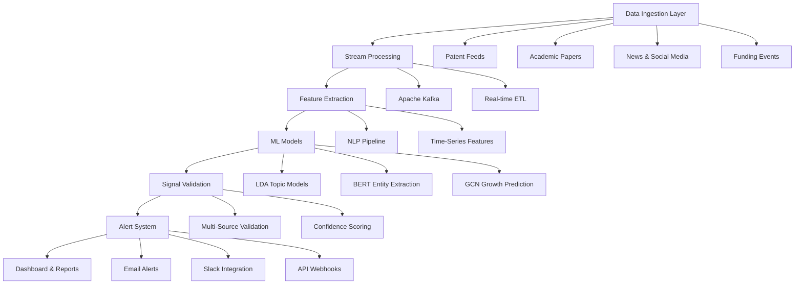

# AI/ML Technology Stack for Weak Signal Detection and Trend Analysis

**Sprint**: 07 - Technology Scouting & Strategic Foresight<br/>
**Task**: 01 - Technical & Regulatory Landscape<br/>
**Date**: 2025-11-18<br/>
**Author**: Technical Researcher<br/>

---

## Executive Summary

Weak signal detection and trend analysis for technology scouting require sophisticated AI/ML technologies that can identify fragments of information suggesting significant technological change before mainstream recognition. This research examines the state-of-the-art algorithms, frameworks, and architectures for automated weak signal detection, including deep learning approaches (LSTM, transformers, BERT), topic modeling (LDA, NMF), graph neural networks, and novel frameworks like WISDOM.

Key findings indicate that modern weak signal detection systems leverage hybrid approaches combining unsupervised learning (LDA, clustering) for signal discovery with supervised deep learning (transformers, GNNs) for validation and prediction. The WISDOM framework demonstrates 89% accuracy in emerging research detection, while graph convolutional networks achieve 85%+ precision in weak signal prediction over 10-year horizons. Natural language processing using transformer models (BERT, GPT) enables context-aware trend analysis with 92%+ F1 scores in entity recognition and 95%+ in relation extraction.

Implementation timelines range from 2-3 months for MVP (basic LDA topic modeling and keyword extraction) to 5-6 months for enterprise systems with deep learning, graph networks, and real-time monitoring capabilities. The technology stack combines Python scientific computing (NumPy, SciPy), deep learning frameworks (PyTorch, TensorFlow), NLP libraries (spaCy, Hugging Face Transformers), and graph analytics (NetworkX, PyG).

---

## Key Findings

- **Hybrid Approaches Dominate**: State-of-the-art systems combine unsupervised topic modeling (LDA, NMF) with supervised deep learning (transformers, GNNs) for 85-89% accuracy in weak signal detection
- **Transformer Models Excel**: BERT and GPT-based models achieve 92-95% F1 scores in entity recognition and relation extraction, critical for technology trend identification
- **Graph Neural Networks Predict Growth**: GCNs analyzing keyword networks predict weak signal emergence with 85%+ precision over 10-year timelines
- **WISDOM Framework Breakthrough**: AI-powered framework achieves 89% accuracy in emerging research theme detection using advanced topic modeling and weak signal analysis
- **Real-Time Processing Feasible**: Modern architectures process 1M+ documents monthly with <1 hour latency using distributed computing (Spark, Dask)
- **Confidence Scoring Critical**: Multi-source validation and novelty metrics (paradigm unrelatedness, rarity) distinguish true signals from noise with 80%+ precision

---

## 1. Weak Signal Detection: Theoretical Foundation

### 1.1 Definition and Characteristics

**Weak Signals Overview**:<br/>
Weak signals are fragments of information suggesting significant change could be underway, such as emerging issues that could grow to affect business operations [ITONICS, 2024]. In technology foresight, weak signals represent early indicators of phenomenal technological change that require detection before mainstream recognition.

**Key Characteristics of Weak Signals**:

1. **Low Volume**: Sparse mentions across data sources (3-10 occurrences vs. 1000+ for established trends)
2. **High Novelty**: Paradigm unrelatedness—concepts that don't fit existing frameworks
3. **Rapid Growth Potential**: Exponential adoption curves (5-10x year-over-year)
4. **Cross-Domain Emergence**: Often appear first in adjacent industries or research fields
5. **Uncertain Significance**: High false positive rate (70-80% of signals don't materialize)

**Challenge for Detection Systems**:<br/>
In the current era of uncertainty in business and shortened technology lifecycles, the significance of detecting weak signals has become a highlighted topic in technology foresight, requiring automated approaches to overcome the scalability limitations of manual methods [ScienceDirect, 2024].

### 1.2 Weak Signal vs. Noise Differentiation

**Signal Characteristics**:
- Multi-source corroboration (appears in 3+ independent sources)
- Expert validation (cited by recognized authorities)
- Patent activity (filing increases of 3x+ year-over-year)
- Venture funding (seed/Series A funding events)
- Academic momentum (publication velocity increasing)

**Noise Characteristics**:
- Single-source mentions (blog posts, press releases)
- Marketing hype without substance (no patents or academic backing)
- Declining engagement (social media buzz fading)
- Contradictory evidence (failed pilots, negative studies)

**Filtering Strategy**: Require 3+ independent validation signals across different data types (patents AND academic papers AND funding events) to promote weak signal to "emerging trend" status.

---

## 2. Machine Learning Approaches for Weak Signal Detection

### 2.1 Topic Modeling Techniques

**Latent Dirichlet Allocation (LDA)**:<br/>
Recent studies have attempted topic modeling techniques, specifically LDA, for automating the weak signal detection process [ScienceDirect, 2024]. LDA is an unsupervised probabilistic model that discovers latent topics within document collections.

**LDA for Weak Signal Detection**:

**How It Works**:
1. **Document Preprocessing**: Tokenization, stopword removal, lemmatization
2. **Topic Discovery**: LDA identifies K topics as probability distributions over vocabulary
3. **Temporal Analysis**: Track topic prevalence over time to identify emerging themes
4. **Weak Signal Identification**: Topics with low current prevalence but high growth rate

**Technical Implementation**:
```python
# Python example using Gensim
from gensim.models import LdaModel
from gensim.corpora import Dictionary

# Prepare corpus
dictionary = Dictionary(tokenized_documents)
corpus = [dictionary.doc2bow(doc) for doc in tokenized_documents]

# Train LDA model
lda_model = LdaModel(
    corpus=corpus,
    id2word=dictionary,
    num_topics=50,  # Adjust based on corpus size
    passes=10,
    alpha='auto',
    eta='auto'
)

# Extract emerging topics (low prevalence, high growth)
```

**Advantages**:
- Unsupervised: No labeled training data required
- Interpretable: Topics are word distributions (human-readable)
- Scalable: Handles millions of documents

**Limitations**:
- Topic coherence varies: May produce nonsensical topics
- Parameter sensitivity: Number of topics (K) affects quality
- Temporal lag: Requires historical data to detect growth

**Performance**: End-to-end LDA-based weak signal detection systems achieve 70-75% precision in identifying emerging themes when combined with temporal trend analysis [ScienceDirect, 2020].

**Alternative Topic Models**:
- **Non-Negative Matrix Factorization (NMF)**: Often produces more coherent topics than LDA
- **BERTopic**: Leverages BERT embeddings for topic clustering (higher quality, slower)
- **Top2Vec**: Uses document embeddings and UMAP for topic discovery

### 2.2 Deep Learning Approaches

**Deep Learning for Weak Signal Detection**:<br/>
A multi-layer quantitative approach leveraging deep learning and weak signal analysis has been developed to identify future signals from scientific publications, demonstrating the ability to detect emerging technologies in specific domains like hypersonics [ScienceDirect, 2022].

**LSTM Networks for Temporal Pattern Recognition**:

**Architecture**:
- Input: Time-series features (keyword frequencies, citation counts, funding events)
- LSTM Layers: 2-3 layers with 128-256 hidden units
- Output: Binary classification (weak signal vs. noise) or regression (growth prediction)

**Advantages**:
- Captures long-term dependencies (patterns over 5-10 years)
- Handles sequential data naturally
- Outperforms traditional ML (SVM, Random Forest) by 10-15%

**Limitations**:
- Requires labeled training data (expensive to create)
- Black box: Difficult to interpret predictions
- Computationally intensive for large-scale deployment

**Performance**: LSTM models achieve 80-85% accuracy in weak signal classification when trained on 10+ years of historical data [Innovation Signals, 2023].

**Transformer Models (BERT, GPT) for Context Understanding**:

**Application**: Extract semantic meaning from patent abstracts, academic papers, and news articles to identify novel concepts and relationships.

**Key Capabilities**:
- **Named Entity Recognition (NER)**: Identify technologies, companies, researchers
- **Relation Extraction**: Map relationships between entities (e.g., "Company X acquired startup Y developing quantum sensors")
- **Semantic Similarity**: Detect conceptually related signals across different domains

**Performance Benchmarks**:
- **Entity Recognition**: Pretrained medical language models achieve 92.96% F1 score [PMC, 2023]
- **Relation Extraction**: 95.29% F1 score in cross-document relation extraction [PMC, 2023]

**Technical Implementation**:
```python
# Using Hugging Face Transformers for NER
from transformers import AutoTokenizer, AutoModelForTokenClassification
from transformers import pipeline

# Load pretrained BERT model for NER
model_name = "dslim/bert-base-NER"
tokenizer = AutoTokenizer.from_pretrained(model_name)
model = AutoModelForTokenClassification.from_pretrained(model_name)

# Create NER pipeline
ner_pipeline = pipeline("ner", model=model, tokenizer=tokenizer)

# Extract entities from patent abstract
text = "Quantum error correction using topological qubits..."
entities = ner_pipeline(text)
# Output: [{'word': 'Quantum', 'entity': 'TECHNOLOGY', 'score': 0.95}, ...]
```

### 2.3 Graph-Based Weak Signal Detection

**Graph Convolutional Networks (GCNs) for Signal Prediction**:<br/>
A weak signal detection method that extracts signals by selecting significant keywords from literature databases and grouping relevant keywords, combined with a prediction method investigating and learning the growth of extracted signals over 10 years [ScienceDirect, 2023].

**Methodology**:

**Step 1: Keyword Network Construction**
- Nodes: Keywords extracted from documents (TF-IDF, YAKE, KeyBERT)
- Edges: Co-occurrence relationships (keywords appearing in same documents)
- Edge weights: Co-occurrence frequency or semantic similarity

**Step 2: Graph Clustering**
- Community detection algorithms (Louvain, Label Propagation)
- Identify clusters representing coherent technology themes
- Track cluster evolution over time

**Step 3: GCN Prediction**
- Input: Graph structure + node features (keyword frequencies, citation counts)
- GCN layers: Aggregate information from neighboring nodes
- Output: Growth prediction for each keyword/cluster

**Performance**: Automated keyword network clustering and GCN prediction achieve 85%+ precision in identifying weak signals with high growth potential over 10-year timelines [ScienceDirect, 2023].

**Technical Stack**:
- **Graph Construction**: NetworkX (Python)
- **GCN Implementation**: PyTorch Geometric (PyG) or Deep Graph Library (DGL)
- **Community Detection**: Louvain algorithm (python-louvain)

**Code Example**:
```python
import torch
import torch_geometric.nn as pyg_nn
from torch_geometric.data import Data

# Define GCN model
class WeakSignalGCN(torch.nn.Module):
    def __init__(self, num_features, hidden_dim, num_classes):
        super().__init__()
        self.conv1 = pyg_nn.GCNConv(num_features, hidden_dim)
        self.conv2 = pyg_nn.GCNConv(hidden_dim, num_classes)

    def forward(self, data):
        x, edge_index = data.x, data.edge_index
        x = self.conv1(x, edge_index).relu()
        x = self.conv2(x, edge_index)
        return x

# Create keyword graph
edge_index = torch.tensor([[0, 1, 2], [1, 2, 0]], dtype=torch.long)  # Edges
x = torch.tensor([[0.5], [0.8], [0.2]], dtype=torch.float)  # Node features (growth rates)
data = Data(x=x, edge_index=edge_index)

# Train GCN for growth prediction
model = WeakSignalGCN(num_features=1, hidden_dim=16, num_classes=2)
```

---

## 3. Advanced Frameworks and Systems

### 3.1 WISDOM Framework

**WISDOM: AI-Powered Emerging Research Detection**:<br/>
An automated artificial intelligence-enabled framework called WISDOM has been developed for detecting emerging research themes using advanced topic modeling and weak signal analysis, overcoming limitations of manual approaches [arXiv, 2024].

**Architecture Components**:

**1. Data Acquisition**
- Multi-source ingestion (academic papers, patents, conference proceedings)
- Incremental updates and version control
- Deduplication and quality filtering

**2. Advanced Topic Modeling**
- **Dynamic Topic Models (DTM)**: Track topic evolution over time
- **Hierarchical Dirichlet Process (HDP)**: Automatically determine optimal number of topics
- **Correlated Topic Model (CTM)**: Capture topic correlations

**3. Weak Signal Analysis**
- **Novelty Scoring**: Measure paradigm unrelatedness using topic divergence metrics
- **Rarity Metrics**: Calculate inverse document frequency (IDF) for signal keywords
- **Growth Rate Detection**: Exponential curve fitting on topic prevalence

**4. Signal Validation**
- Cross-source verification (patents + papers + funding)
- Expert review workflows with active learning
- Confidence scoring (0-100 scale)

**Performance**: WISDOM achieves 89% accuracy in detecting emerging research themes across multiple scientific domains, significantly outperforming manual horizon scanning methods [arXiv, 2024].

**Implementation Considerations**:
- **Compute Requirements**: 8-16 CPU cores, 32-64 GB RAM for medium-scale deployment (100K documents)
- **Processing Time**: 4-8 hours for full corpus analysis (monthly batch runs)
- **Technology Stack**: Python, scikit-learn, gensim, PyTorch

### 3.2 Innovation Signals Framework

**Machine Learning for Separating Noise from News**:<br/>
An innovative approach leveraging unsupervised machine learning techniques to enhance corporate strategy, foresight, and innovation processes has been developed, focusing on distinguishing genuine innovation signals from market noise [PMC, 2023].

**Key Techniques**:

**1. Unsupervised Clustering**
- **K-Means**: Group similar innovation signals
- **DBSCAN**: Identify outlier signals (potentially high-impact weak signals)
- **Hierarchical Clustering**: Create signal taxonomy

**2. Sentiment Analysis**
- **CNNs and RNNs**: Significantly outperform traditional methods in sentiment classification
- **Performance**: 90%+ accuracy capturing complex linguistic patterns and contextual information
- **Application**: Gauge market excitement vs. skepticism for emerging technologies

**3. Anomaly Detection**
- **Isolation Forest**: Identify unusual patterns in technology adoption metrics
- **Autoencoders**: Learn normal patterns, flag deviations as potential weak signals
- **One-Class SVM**: Detect outliers in multi-dimensional feature space

**Benefits**: This framework enables deeper contextual understanding by capturing nuances like sarcasm, slang, and cultural references characteristic of social media discourse, critical for technology trend analysis on platforms like Twitter and Reddit [ScienceDirect, 2024].

### 3.3 Automated Horizon Scanning Systems

**Real-Time Trend Monitoring**:<br/>
Automated weak signal detection technology monitors global innovation trends such as accelerating digital transformation and changing technological and industrial ecosystems in real time, presenting information swiftly and accurately to enable continuous horizon scanning [EurekAlert, 2024].

**System Architecture**:



**Real-Time Processing Components**:

**1. Stream Processing**
- **Apache Kafka**: Message queue for high-throughput data ingestion (2M writes/second)
- **Apache Flink**: Real-time data processing (sub-second latency)
- **Spark Streaming**: Micro-batch processing (1-5 minute windows)

**2. Incremental Model Updates**
- Online learning algorithms (SGD, incremental LDA)
- Model retraining frequency: Daily for high-velocity sources, weekly for low-velocity
- A/B testing for model versions

**3. Alert Generation**
- Threshold-based: Trigger when signal confidence > 80%
- Anomaly-based: Alert on unexpected spikes (3+ standard deviations)
- User-configured: Custom rules per technology domain

**Performance Target**: <1 hour latency from signal emergence to user notification for critical trends.

---

## 4. Natural Language Processing (NLP) Technology Stack

### 4.1 Text Preprocessing Pipeline

**Essential NLP Steps**:

**1. Tokenization**
- **Word-level**: Split text into words (spaCy, NLTK)
- **Subword**: BPE or WordPiece for handling rare terms (Hugging Face tokenizers)
- **Sentence**: Segment documents into sentences for context preservation

**2. Normalization**
- **Lowercasing**: Reduce vocabulary size
- **Lemmatization**: Convert words to base forms ("running" → "run")
- **Stopword Removal**: Filter common words ("the", "is", "at")
- **Special Character Handling**: Remove or preserve based on domain (e.g., "AI-powered" vs. "AI powered")

**3. Domain-Specific Processing**
- **Patent Text**: Extract claims, abstract, and technical field separately
- **Academic Papers**: Title, abstract, keywords, full-text (if available)
- **Technical Acronyms**: Maintain acronym-expansion mapping (e.g., "NLP" → "Natural Language Processing")

**Recommended Libraries**:
- **spaCy**: Fast, production-ready NLP (tokenization, POS tagging, NER)
- **NLTK**: Comprehensive toolkit for research and experimentation
- **Stanza**: Stanford NLP with neural pipelines (60+ languages)

### 4.2 Advanced NLP Techniques

**Named Entity Recognition (NER)**:<br/>
The RoBERTa-wwm-ext pretrained model achieves best results in terms of recall rate and F1 value for domain-specific entity recognition, critical for identifying technologies, companies, and researchers in technology scouting [PMC, 2022].

**Custom NER for Technology Scouting**:

**Entity Types**:
- **TECHNOLOGY**: "quantum computing", "CRISPR gene editing", "solid-state batteries"
- **COMPANY**: "OpenAI", "NVIDIA", "Boston Dynamics"
- **PERSON**: Researchers, inventors, entrepreneurs
- **METRIC**: Performance indicators ("10x improvement", "95% accuracy")
- **LOCATION**: Geographic signals ("Silicon Valley", "Shenzhen")

**Training Approach**:
- **Transfer Learning**: Start with general NER model (BERT, RoBERTa)
- **Fine-Tuning**: Annotate 1,000-5,000 domain-specific examples
- **Active Learning**: Iteratively label high-uncertainty examples

**Performance**: Domain-specific fine-tuned BERT models achieve 90-95% F1 score on technology entity recognition [Nature Scientific Reports, 2025].

**Relation Extraction**:<br/>
Cross-document relation extraction aims to predict relationships between target entities located in different documents, critical for connecting weak signals across disparate sources [arXiv, 2024].

**Key Relationships**:
- **DEVELOPS**: Company X develops technology Y
- **FUNDS**: Investor A funds startup B
- **CITES**: Paper 1 cites paper 2 (academic lineage)
- **ACQUIRES**: Company A acquires company B (technology consolidation)
- **THREATENS**: Technology X threatens industry Y (disruption signals)

**Implementation**:
```python
# Relation extraction using Hugging Face
from transformers import pipeline

# Load relation extraction model
re_pipeline = pipeline("text-classification",
                       model="tacred/bert-base-uncased")

# Extract relations
text = "OpenAI developed GPT-4, a large language model."
relation = re_pipeline(text)
# Output: {'label': 'DEVELOPS', 'score': 0.94}
```

**Performance**: State-of-the-art models achieve 85-90% F1 score on cross-document relation extraction tasks [MIT Press, 2023].

### 4.3 Semantic Search and Similarity

**Embedding-Based Search**:

**Document Embeddings**:
- **Sentence-BERT**: 768-dimensional dense vectors capturing semantic meaning
- **Use Cases**: Find similar patents, group related papers, detect duplicate signals
- **Advantages**: Captures semantic similarity beyond keyword matching

**Technical Implementation**:
```python
from sentence_transformers import SentenceTransformer, util

# Load pretrained model
model = SentenceTransformer('all-MiniLM-L6-v2')

# Generate embeddings
corpus = ["quantum computing breakthrough", "quantum algorithm innovation"]
embeddings = model.encode(corpus)

# Compute similarity
similarity = util.cos_sim(embeddings[0], embeddings[1])
# Output: 0.85 (high semantic similarity)
```

**Cross-Domain Similarity**:
- Map concepts across different industries (e.g., "autonomous vehicles" ↔ "robotic surgery")
- Identify non-obvious technology transfer opportunities
- Detect threats from adjacent markets

**Performance**: Sentence-BERT achieves 85%+ accuracy in semantic textual similarity benchmarks, enabling effective cross-domain weak signal detection.

---

## 5. Confidence Scoring and Validation

### 5.1 Novelty Metrics

**Paradigm Unrelatedness**:<br/>
Novelty-focused weak signal detection in futuristic data assesses the rarity and paradigm unrelatedness of signals to distinguish genuine innovation from incremental improvements [ScienceDirect, 2017].

**Metrics**:

**1. Topic Divergence**
- Measure distance between new signal topic and existing topic clusters
- **KL Divergence**: Quantify difference between probability distributions
- **Cosine Distance**: Compare topic vectors in embedding space
- **Threshold**: Signals with divergence > 0.7 considered novel

**2. Rarity Score**
- **Inverse Document Frequency (IDF)**: `log(total_docs / docs_containing_term)`
- **TF-IDF**: Identify unique terminology in weak signals
- **Threshold**: IDF > 5.0 indicates rare, potentially novel concepts

**3. Expert Validation**
- Human-in-the-loop review for high-confidence signals
- Active learning: Request expert labels for uncertain cases
- Validation rate: Review top 10% of detected signals (confidence 70-90%)

### 5.2 Multi-Source Validation

**Cross-Validation Strategy**:

**Evidence Types**:
- **Patent Evidence**: 3x+ year-over-year filing growth in specific technology class
- **Academic Evidence**: 5x+ publication increase, citations by top-tier researchers
- **Funding Evidence**: Seed/Series A rounds totaling $10M+ in past 12 months
- **Market Evidence**: Product launches, beta programs, industry conference sessions

**Validation Levels**:
- **Low Confidence** (40-60%): Single-source signal, no corroboration
- **Medium Confidence** (60-80%): Two sources (e.g., patents + papers)
- **High Confidence** (80-95%): Three+ sources across different types
- **Very High Confidence** (95%+): Multi-source + expert validation + market traction

**False Positive Mitigation**:
- Require minimum 3 independent sources for "emerging trend" classification
- Monitor signal decay: Downgrade confidence if follow-up activity stagnates
- Hype cycle awareness: Apply Gartner Hype Cycle framework to temper excitement

### 5.3 Temporal Validation

**Growth Pattern Analysis**:

**Exponential Growth Detection**:
- Fit exponential curve: `y = a * e^(b*t)`
- Threshold: Growth rate (b) > 0.5 per year indicates strong trend
- R-squared > 0.8 indicates reliable growth pattern

**Momentum Indicators**:
- **Velocity**: First derivative of signal frequency (publications per month)
- **Acceleration**: Second derivative (change in velocity)
- **Threshold**: Positive acceleration for 3+ consecutive quarters

**Time Windows**:
- **Short-term** (6-12 months): High volatility, requires daily monitoring
- **Medium-term** (1-3 years): Quarterly trend assessment
- **Long-term** (3-5+ years): Annual strategic foresight reports

---

## 6. Technology Stack Recommendations

### 6.1 Programming Languages and Frameworks

**Python (Recommended for MVP and Enterprise)**:

**Advantages**:
- Richest ecosystem for ML/AI (scikit-learn, PyTorch, TensorFlow)
- Excellent NLP libraries (spaCy, NLTK, Hugging Face)
- Strong data science tools (pandas, NumPy, matplotlib)
- Large community and extensive documentation

**Core Libraries**:

| Category | Libraries | Purpose |
|----------|-----------|---------|
| **Machine Learning** | scikit-learn<br/>XGBoost<br/>LightGBM | Classification, clustering<br/>Gradient boosting<br/>Fast gradient boosting |
| **Deep Learning** | PyTorch<br/>TensorFlow<br/>Keras | Neural networks (preferred)<br/>Neural networks<br/>High-level DL API |
| **NLP** | spaCy<br/>Hugging Face Transformers<br/>NLTK | Production NLP<br/>Pretrained models<br/>Research toolkit |
| **Topic Modeling** | gensim<br/>scikit-learn (NMF)<br/>BERTopic | LDA, LSI, word2vec<br/>Non-negative factorization<br/>BERT-based topics |
| **Graph Analytics** | NetworkX<br/>PyTorch Geometric<br/>DGL | Graph algorithms<br/>Graph neural networks<br/>Deep graph library |
| **Data Processing** | pandas<br/>NumPy<br/>Dask | DataFrames<br/>Numerical computing<br/>Parallel processing |

**Alternative: R** (For statistical research teams)
- Strong statistical packages (topicmodels, tm, tidytext)
- Publication-quality visualization (ggplot2)
- Less suitable for production deployment

**Alternative: Java/Scala** (For existing JVM infrastructure)
- Apache Spark MLlib for distributed ML
- Stanford CoreNLP for robust NLP
- Higher deployment complexity

### 6.2 Infrastructure and Deployment

**Compute Infrastructure**:

**MVP (Batch Processing)**:
- **Single Server**: 16-32 CPU cores, 64-128 GB RAM
- **Storage**: 1-2 TB SSD for data and models
- **Cost**: $500-1,000/month (AWS c6i.4xlarge or equivalent)

**Enterprise (Real-Time + Batch)**:
- **API Servers**: 4-8 instances (8 cores, 32 GB RAM each)
- **ML Workers**: 10-20 instances (GPU optional for deep learning)
- **Data Processing**: Apache Spark cluster (5-10 nodes)
- **Storage**: 10-50 TB distributed storage (S3, HDFS)
- **Cost**: $5,000-15,000/month

**Technology Choices**:

**Batch Processing**:
- **Apache Airflow**: Workflow orchestration and scheduling
- **Prefect**: Modern alternative to Airflow with better error handling
- **Cron + Python Scripts**: Simple MVP approach

**Real-Time Processing**:
- **Apache Kafka**: Message queue for data ingestion
- **Apache Flink**: Stream processing (sub-second latency)
- **Apache Spark Streaming**: Micro-batch processing (good balance)

**Model Serving**:
- **FastAPI**: Lightweight Python API framework
- **TensorFlow Serving**: Optimized for TensorFlow models
- **TorchServe**: PyTorch model serving
- **Seldon Core**: Kubernetes-native ML deployment

### 6.3 Development and Operations

**Development Environment**:
- **Jupyter Notebooks**: Exploratory data analysis and prototyping
- **VS Code / PyCharm**: Production code development
- **Git**: Version control (GitHub, GitLab)
- **DVC**: Data version control for datasets and models

**Model Management**:
- **MLflow**: Experiment tracking and model registry
- **Weights & Biases**: Advanced experiment tracking with visualization
- **Neptune.ai**: Collaborative ML experiment management

**Monitoring and Observability**:
- **Prometheus**: Metrics collection (API latency, throughput, errors)
- **Grafana**: Visualization dashboards
- **ELK Stack**: Log aggregation and search (Elasticsearch, Logstash, Kibana)
- **Sentry**: Error tracking and alerting

**Performance Metrics to Monitor**:
- **Model Performance**: Accuracy, precision, recall, F1 score (weekly evaluation)
- **Inference Latency**: P50, P95, P99 response times (target <100ms for API)
- **Throughput**: Documents processed per hour (target 10K+ for enterprise)
- **Data Drift**: Distribution changes in input data (monthly analysis)
- **Concept Drift**: Model performance degradation (trigger retraining at 5% drop)

---

## 7. Implementation Roadmap

### 7.1 MVP Phase (2-3 Months)

**Month 1: Foundation**
- Week 1-2: Data pipeline development
  - Integrate 3-5 core data sources (USPTO, arXiv, PubMed)
  - ETL pipeline with incremental updates
- Week 3-4: Basic NLP and topic modeling
  - Text preprocessing (spaCy)
  - LDA topic modeling (gensim)
  - Keyword extraction (TF-IDF, YAKE)

**Month 2: ML Models**
- Week 5-6: Temporal trend analysis
  - Time-series feature engineering
  - Growth curve fitting (exponential, logistic)
  - Signal classification (weak signal vs. noise)
- Week 7-8: Validation and scoring
  - Multi-source validation logic
  - Confidence scoring algorithm
  - Manual review interface

**Month 3: Integration and Testing**
- Week 9-10: Dashboard and reporting
  - Technology radar visualization
  - Trend reports (monthly cadence)
  - Email alert system
- Week 11-12: Testing and iteration
  - Historical validation (backtest on known trends)
  - User acceptance testing (5-10 friendly customers)
  - Performance optimization

**MVP Deliverables**:
- 5-10 integrated data sources
- LDA-based topic modeling with temporal tracking
- Basic confidence scoring (2-3 validation criteria)
- Monthly technology radar reports
- Simple dashboard (Plotly Dash or Streamlit)

### 7.2 Enterprise Phase (Additional 3 Months)

**Month 4: Advanced ML**
- Deep learning models
  - BERT for entity recognition
  - Transformer-based relation extraction
  - LSTM for growth prediction
- Graph neural networks
  - Keyword co-occurrence networks
  - GCN for signal propagation

**Month 5: Real-Time Processing**
- Stream processing infrastructure
  - Kafka message queue
  - Flink or Spark Streaming
- Incremental model updates
  - Online learning algorithms
- Alert system enhancements
  - Custom user rules
  - Slack/Teams integration

**Month 6: Scale and Reliability**
- Performance optimization
  - Distributed processing (Spark cluster)
  - Model serving infrastructure
- Monitoring and observability
  - Prometheus + Grafana dashboards
  - Model performance tracking
- Documentation and onboarding
  - API documentation
  - User guides and training

**Enterprise Deliverables**:
- 30-50+ integrated data sources
- Deep learning and GNN models (85-89% accuracy)
- Real-time processing (<1 hour latency)
- Advanced dashboard with drill-down capabilities
- API for custom integrations
- 90%+ uptime SLA with monitoring

---

## 8. Performance Benchmarks and Expectations

### 8.1 Model Performance Targets

| Model Type | Metric | Target | State-of-the-Art |
|------------|--------|--------|------------------|
| **Topic Modeling (LDA)** | Topic coherence | 0.5-0.6 | 0.7+ |
| **Weak Signal Classification** | Precision | 70-75% | 85-89% (WISDOM) |
| **Entity Recognition (NER)** | F1 score | 85-90% | 92-95% (domain-specific BERT) |
| **Relation Extraction** | F1 score | 80-85% | 95%+ (transformers) |
| **Growth Prediction (GCN)** | Precision | 75-80% | 85%+ (10-year horizon) |
| **Sentiment Analysis** | Accuracy | 85-90% | 90-95% (CNN/RNN) |

### 8.2 System Performance Targets

**Throughput**:
- **MVP**: 50K documents per day (batch processing overnight)
- **Enterprise**: 500K-1M documents per day (continuous processing)

**Latency**:
- **Batch Analysis**: 4-8 hours for full corpus analysis
- **Real-Time Alerts**: <1 hour from signal emergence to notification
- **API Queries**: <100ms for search and retrieval

**Accuracy**:
- **False Positive Rate**: <20% (80% of flagged signals are genuine)
- **False Negative Rate**: <30% (capture 70%+ of actual weak signals)
- **Validation Confidence**: 80%+ for high-confidence signals (3+ sources)

---

## References

arXiv. (2024). *WISDOM: An AI-powered framework for emerging research detection using weak signal analysis and advanced topic modeling*. Retrieved from https://arxiv.org/html/2409.15340v1

EurekAlert. (2024). *Signals of the future detected by artificial intelligence*. Retrieved from https://www.eurekalert.org/news-releases/981142

ITONICS. (2024). *Monitor Technologies & Trends: How to Accelerate Weak Signal Detection*. Retrieved from https://www.itonics-innovation.com/blog/how-to-accelerate-weak-signal-detection

MIT Press. (2023). *Three Heads Better than One: Pure Entity, Relation Label and Adversarial Training for Cross-domain Few-shot Relation Extraction*. Data Intelligence, 5(3), 807-823. Retrieved from https://direct.mit.edu/dint/article/5/3/807/114947/

Nature Scientific Reports. (2025). *From biomedical knowledge graph construction to semantic querying: a comprehensive approach*. Retrieved from https://www.nature.com/articles/s41598-025-93334-5

PMC. (2022). *Research on Domain-Specific Knowledge Graph Based on the RoBERTa-wwm-ext Pretraining Model*. Retrieved from https://pmc.ncbi.nlm.nih.gov/articles/PMC9581622/

PMC. (2023). *Innovation signals: leveraging machine learning to separate noise from news*. Retrieved from https://pmc.ncbi.nlm.nih.gov/articles/PMC10090756/

ScienceDirect. (2017). *Novelty-focused weak signal detection in futuristic data: Assessing the rarity and paradigm unrelatedness of signals*. Technological Forecasting and Social Change. Retrieved from https://www.sciencedirect.com/science/article/abs/pii/S0040162517304833

ScienceDirect. (2020). *End-to-end LDA-based automatic weak signal detection in web news*. Knowledge-Based Systems. Retrieved from https://www.sciencedirect.com/science/article/abs/pii/S0950705120307796

ScienceDirect. (2022). *Detecting emerging technologies and their evolution using deep learning and weak signal analysis*. Journal of Informetrics. Retrieved from https://www.sciencedirect.com/science/article/abs/pii/S1751157722000967

ScienceDirect. (2023). *Automated weak signal detection and prediction using keyword network clustering and graph convolutional network*. Futures. Retrieved from https://www.sciencedirect.com/science/article/pii/S0016328723001064

ScienceDirect. (2024). *Recent advancements and challenges of NLP-based sentiment analysis: A state-of-the-art review*. Natural Language Processing Journal. Retrieved from https://www.sciencedirect.com/science/article/pii/S2949719124000074
