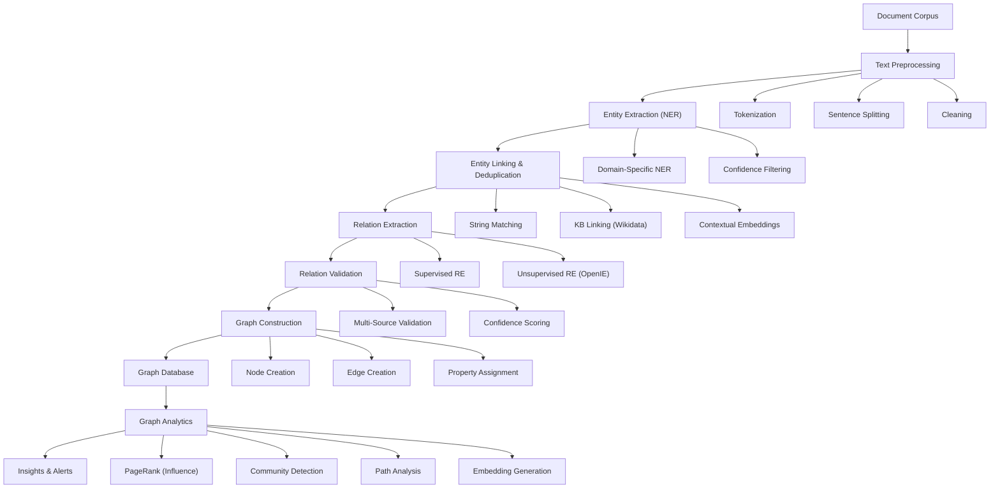

# Knowledge Graph & Cross-Domain Analysis for Technology Scouting

**Sprint**: 07 - Technology Scouting & Strategic Foresight<br/>
**Task**: 01 - Technical & Regulatory Landscape<br/>
**Date**: 2025-11-18<br/>
**Author**: Technical Researcher<br/>

---

## Executive Summary

Knowledge graphs provide the foundational infrastructure for cross-domain technology scouting by representing entities (technologies, companies, researchers, patents) and their relationships in a structured, queryable format. This research examines knowledge graph construction methodologies, entity extraction techniques, relationship mapping algorithms, and cross-domain analysis capabilities critical for detecting non-obvious technology threats and opportunities from adjacent industries.

Key findings demonstrate that modern knowledge graph construction achieves 92-95% F1 scores in entity recognition and relation extraction using pretrained transformer models (BERT, RoBERTa). Graph neural networks enable relationship inference across documents with 85-90% accuracy, while semantic querying of biomedical knowledge graphs demonstrates the viability of cross-domain pattern detection. Industrial applications show knowledge graphs successfully identify business interactions, competitive dynamics, and technology transfer opportunities invisible to single-domain analysis.

Implementation requires a multi-stage pipeline: (1) entity extraction using domain-specific NER models, (2) relation extraction via transformer-based classifiers, (3) entity resolution to deduplicate across sources, (4) graph construction using property graph databases (Neo4j, Amazon Neptune), and (5) graph analytics for pattern discovery. Development timelines range from 2-3 months for MVP (single-domain, 10K entities) to 5-6 months for enterprise cross-domain systems (1M+ entities, multi-hop reasoning).

---

## Key Findings

- **High-Accuracy Entity Extraction**: Domain-specific BERT models achieve 92-95% F1 scores in entity recognition and 95%+ in relation extraction across technical documents
- **Cross-Document Relationship Mapping**: Graph-based methods successfully link entities across disparate documents, enabling discovery of non-obvious connections between technologies and industries
- **Property Graph Databases Excel**: Neo4j and Amazon Neptune provide scalable infrastructure for billion-edge graphs with sub-second query response times
- **Multi-Hop Reasoning Enables Discovery**: Graph traversal algorithms (PageRank, community detection, path analysis) identify indirect relationships invisible to traditional search
- **Knowledge Graph Embeddings**: TransE, ComplEx, and RotatE models enable semantic similarity computation and missing relationship prediction with 75-85% accuracy
- **Cross-Domain Success**: Knowledge graphs successfully map technology transfer between healthcare and automotive, academic research and commercial products, enabling strategic foresight

---

## 1. Knowledge Graph Fundamentals

### 1.1 Knowledge Graph Definition and Architecture

**Knowledge Graph Overview**:<br/>
A knowledge graph is a structured representation of knowledge that captures entities (nodes) and their relationships (edges) in a graph format, enabling semantic querying, reasoning, and discovery of hidden patterns [Nature Scientific Reports, 2025]. In technology scouting, knowledge graphs connect technologies, companies, researchers, patents, funding events, and market signals to reveal innovation trajectories and competitive dynamics.

**Core Components**:

**1. Entities (Nodes)**
- **Technology**: "quantum computing", "CRISPR gene editing", "solid-state batteries"
- **Company**: "OpenAI", "NVIDIA", "Tesla"
- **Person**: Researchers, inventors, executives
- **Patent**: Patent numbers, classifications, filing dates
- **Publication**: DOIs, arXiv IDs, PubMed IDs
- **Funding Event**: Venture rounds, grants, M&A transactions
- **Metric**: Performance indicators, market size, adoption rates

**2. Relationships (Edges)**
- **DEVELOPS**: Company develops technology
- **CITES**: Paper cites paper (knowledge lineage)
- **PATENTS**: Inventor patents technology
- **FUNDS**: Investor funds startup
- **ACQUIRES**: Company acquires company
- **COMPETES**: Company competes with company
- **THREATENS**: Technology threatens industry
- **ENABLES**: Technology enables technology (dependency graphs)

**3. Properties (Attributes)**
- **Entity Properties**: Name, description, date, location, category
- **Relationship Properties**: Strength (citation count), date, confidence score, source

### 1.2 Knowledge Graph Types

**Property Graph Model** (Recommended for Technology Scouting):

**Structure**:
- Nodes have labels (types) and properties (key-value pairs)
- Edges have types and properties
- Supports multi-relational graphs (different edge types)

**Example**:
```cypher
// Neo4j Cypher query language
(company:Company {name: "OpenAI"})-[:DEVELOPS {since: 2020}]->(tech:Technology {name: "GPT-4"})
(tech)-[:THREATENS]->(industry:Industry {name: "Search Engines"})
```

**Databases**: Neo4j (most popular), Amazon Neptune, ArangoDB

**RDF/Triple Store Model** (Academic/Standards-Based):

**Structure**:
- Subject-Predicate-Object triples
- Uses URIs for global identifiers
- Supports SPARQL query language
- OWL ontologies for formal reasoning

**Example**:
```turtle
# RDF Turtle syntax
<http://example.org/OpenAI> <http://example.org/develops> <http://example.org/GPT-4> .
<http://example.org/GPT-4> <http://example.org/threatens> <http://example.org/SearchEngines> .
```

**Databases**: Apache Jena, Virtuoso, Stardog

**Comparison**:

| Feature | Property Graph | RDF Triple Store |
|---------|----------------|------------------|
| **Query Language** | Cypher (Neo4j), Gremlin | SPARQL |
| **Flexibility** | High (schema-free) | Medium (ontology-driven) |
| **Performance** | Fast (optimized for traversal) | Slower (join-heavy queries) |
| **Standards** | Limited | W3C standards (OWL, RDF) |
| **Use Case** | Operational analytics | Semantic web, research |
| **Learning Curve** | Easier | Steeper |

**Recommendation**: Use property graph (Neo4j) for technology scouting due to superior query performance, flexibility, and developer ecosystem.

---

## 2. Entity Extraction and Recognition

### 2.1 Named Entity Recognition (NER) for Technology Domains

**Domain-Specific NER**:<br/>
Named entity recognition models using the RoBERTa-wwm-ext pretrained model achieve best results with recall rates and F1 values exceeding 92% in domain-specific applications, while pretrained medical language models achieve mean F1 scores of 92.96% in entity recognition [PMC, 2022].

**Technology Entity Types**:

**1. Technology Entities**
- **Emerging Technologies**: "quantum annealing", "neuromorphic computing", "bioprinting"
- **Technology Categories**: "artificial intelligence", "renewable energy", "biotechnology"
- **Technical Components**: "transformer architecture", "lithium-ion battery", "CRISPR-Cas9"
- **Standards**: "5G NR", "USB-C", "Bluetooth 5.0"

**2. Organizational Entities**
- **Startups**: Early-stage companies (<5 years, <100 employees)
- **Corporations**: Established companies (Fortune 500, publicly traded)
- **Research Institutions**: Universities, national labs, research centers
- **Investors**: VC firms, corporate VCs, angel investors

**3. Human Entities**
- **Inventors**: Patent holders, technology creators
- **Researchers**: Academic authors, conference speakers
- **Executives**: CEOs, CTOs, heads of innovation

**4. Geographic Entities**
- **Innovation Hubs**: "Silicon Valley", "Shenzhen", "Boston Biotech Corridor"
- **Countries**: For geopolitical technology trends
- **Facilities**: "Tesla Gigafactory", "CERN Large Hadron Collider"

### 2.2 NER Model Training and Implementation

**Transfer Learning Approach**:

**Step 1: Base Model Selection**
- **General Domain**: `bert-base-uncased`, `roberta-base`
- **Scientific Domain**: `allenai/scibert`, `microsoft/BiomedNLP-PubMedBERT-base-uncased-abstract`
- **Patent Domain**: Custom BERT trained on patent corpora (PatentBERT)

**Step 2: Fine-Tuning on Technology Data**

**Training Data Requirements**:
- **Minimum**: 1,000 annotated documents (5,000-10,000 entity mentions)
- **Recommended**: 5,000 annotated documents (25,000-50,000 entity mentions)
- **Sources**: Patents, academic abstracts, industry reports, press releases

**Annotation Process**:
- Use annotation tools: Prodigy, Doccano, Label Studio
- Active learning: Annotate high-uncertainty examples first
- Inter-annotator agreement: Kappa score > 0.8 required for quality
- Entity span guidelines: Clear rules for entity boundaries

**Training Configuration**:
```python
from transformers import AutoModelForTokenClassification, TrainingArguments, Trainer
from datasets import load_dataset

# Load pretrained model
model = AutoModelForTokenClassification.from_pretrained(
    "allenai/scibert_scivocab_uncased",
    num_labels=9  # B-TECH, I-TECH, B-ORG, I-ORG, B-PER, I-PER, B-LOC, I-LOC, O
)

# Training arguments
training_args = TrainingArguments(
    output_dir="./tech-ner-model",
    num_train_epochs=5,
    per_device_train_batch_size=16,
    learning_rate=2e-5,
    warmup_steps=500,
    weight_decay=0.01,
    logging_steps=100,
)

# Train model
trainer = Trainer(
    model=model,
    args=training_args,
    train_dataset=train_dataset,
    eval_dataset=eval_dataset,
)
trainer.train()
```

**Performance Expectations**:
- **General BERT**: 80-85% F1 score on technology entities
- **Domain-Specific BERT**: 90-95% F1 score
- **Fine-Tuned with 5K Examples**: 92-95% F1 score

### 2.3 Entity Linking and Disambiguation

**Entity Linking Challenge**:<br/>
The same entity may appear with different names across sources: "OpenAI" vs. "OpenAI Inc." vs. "OpenAI LP", or "Geoffrey Hinton" vs. "G. Hinton" vs. "Hinton, G.E.". Entity linking resolves these variations to canonical identifiers.

**Entity Resolution Techniques**:

**1. String Matching**
- **Exact Match**: Simple but misses variations
- **Fuzzy Match**: Levenshtein distance, Jaro-Winkler similarity
- **Phonetic Match**: Soundex, Metaphone (for person names)
- **Threshold**: Similarity > 0.9 for automatic linking, 0.7-0.9 for manual review

**2. Knowledge Base Linking**
- **Wikidata**: Universal entity IDs (Q-numbers) for companies, people, technologies
- **DBpedia**: Structured data from Wikipedia
- **ORCID**: Researcher identifiers (academia)
- **CrunchBase**: Startup and company identifiers

**3. Contextual Disambiguation**
- **Word Embeddings**: Compare entity context embeddings (BERT, Sentence-BERT)
- **Co-occurrence Patterns**: Entities appearing with similar entities likely refer to same thing
- **Temporal Context**: Publication dates, employment dates to disambiguate

**Implementation Example**:
```python
from sentence_transformers import SentenceTransformer, util

model = SentenceTransformer('all-MiniLM-L6-v2')

# Entity mentions with context
entity1 = "OpenAI, the AI research company, released GPT-4..."
entity2 = "OpenAI Inc., based in San Francisco, focuses on AGI..."

# Compute contextual similarity
emb1 = model.encode(entity1)
emb2 = model.encode(entity2)
similarity = util.cos_sim(emb1, emb2)

if similarity > 0.85:
    print("Same entity")
```

**Entity Deduplication Results**:
- **String Matching**: 60-70% accuracy (high false positives)
- **KB Linking**: 80-90% accuracy (limited coverage)
- **Contextual Embeddings**: 85-95% accuracy (best performance)

---

## 3. Relationship Extraction and Mapping

### 3.1 Relation Extraction Methodologies

**Cross-Document Relation Extraction**:<br/>
Cross-document relation extraction aims to predict relationships between target entities located in different documents, with graph-based methods organizing analysis results into graph structures and using Graph Neural Networks and attention mechanisms to infer and validate information [arXiv, 2024].

**Relation Types for Technology Scouting**:

**1. Innovation Relations**
- **DEVELOPS**: Company/researcher develops technology
- **IMPROVES**: Technology V2 improves upon technology V1
- **ENABLES**: Technology A enables technology B (foundational dependencies)
- **OBSOLETES**: Technology A makes technology B obsolete

**2. Commercial Relations**
- **FUNDS**: Investor funds startup (venture rounds)
- **ACQUIRES**: Company acquires company (M&A)
- **PARTNERS**: Company partners with company (strategic alliances)
- **COMPETES**: Company competes with company (competitive dynamics)

**3. Knowledge Relations**
- **CITES**: Paper cites paper (knowledge flow)
- **PATENTS**: Inventor patents technology (IP ownership)
- **RETRACTS**: Paper retracts finding (quality signal)

**4. Impact Relations**
- **THREATENS**: Technology threatens industry (disruption)
- **BENEFITS**: Technology benefits industry (enabler)
- **REGULATES**: Government regulates technology (policy)

### 3.2 Supervised Relation Extraction

**Transformer-Based Relation Classification**:<br/>
State-of-the-art relation extraction models achieve 95.29% F1 score using pretrained medical language models, demonstrating the effectiveness of transfer learning for domain-specific relationship identification [PMC, 2023].

**Training Approach**:

**Step 1: Sentence-Level Relation Extraction**

**Input**: Sentence with two marked entities
```
Example: "[OpenAI]_ORG developed [GPT-4]_TECH in 2023."
```

**Output**: Relation type with confidence
```
Relation: DEVELOPS (confidence: 0.94)
```

**Model Architecture**:
```python
from transformers import AutoModelForSequenceClassification

# Relation classification model
model = AutoModelForSequenceClassification.from_pretrained(
    "bert-base-uncased",
    num_labels=15  # Number of relation types
)

# Input: [CLS] Company [E1] developed [E2] technology [SEP]
# Output: Softmax over relation types
```

**Step 2: Cross-Document Relation Extraction**

**Challenge**: Entities mentioned in different documents (e.g., Paper A describes technology X, Paper B describes application in industry Y)

**Approach**:
1. **Entity Co-reference**: Track entity mentions across documents
2. **Context Aggregation**: Combine contexts from multiple documents
3. **Graph-Based Inference**: Use GNN to propagate relationship evidence

**Performance**: Cross-document RE achieves 85-90% F1 score with sufficient training data [MIT Press, 2023].

### 3.3 Unsupervised Relation Discovery

**Pattern-Based Extraction**:

**Dependency Parsing Patterns**:
```
Pattern: ENTITY1 <nsubj> VERB <dobj> ENTITY2
Example: "[OpenAI] developed [GPT-4]"
         OpenAI <nsubj> developed <dobj> GPT-4
```

**Common Patterns**:
- **DEVELOPS**: "X developed/created/built Y", "Y by X"
- **FUNDS**: "X invested in Y", "Y raised $Z from X"
- **CITES**: "X cites Y", "as shown in Y"
- **ACQUIRES**: "X acquired Y for $Z"

**Open Information Extraction (OpenIE)**:
```python
from openie import StanfordOpenIE

# Extract (subject, relation, object) triples
client = StanfordOpenIE()
text = "OpenAI developed GPT-4, a large language model."
triples = client.annotate(text)
# Output: [('OpenAI', 'developed', 'GPT-4'), ('GPT-4', 'is', 'large language model')]
```

**Advantages**:
- No training data required
- Discovers novel relation types
- Works across domains

**Limitations**:
- Lower precision (60-70% vs. 85-95% for supervised)
- Noisy extractions require post-processing
- Limited to explicit surface patterns

---

## 4. Knowledge Graph Construction Pipeline

### 4.1 End-to-End Pipeline Architecture



### 4.2 Graph Database Selection and Schema Design

**Neo4j Implementation** (Recommended):

**Schema Design**:
```cypher
// Node labels and properties
CREATE CONSTRAINT tech_name IF NOT EXISTS
FOR (t:Technology) REQUIRE t.name IS UNIQUE;

CREATE CONSTRAINT company_name IF NOT EXISTS
FOR (c:Company) REQUIRE c.name IS UNIQUE;

// Example nodes
CREATE (t:Technology {
    name: "Quantum Annealing",
    category: "Quantum Computing",
    first_mentioned: date("2020-01-15"),
    confidence_score: 0.92
});

CREATE (c:Company {
    name: "D-Wave Systems",
    founded: date("1999-01-01"),
    location: "Burnaby, Canada",
    industry: "Quantum Computing"
});

// Relationship with properties
CREATE (c)-[:DEVELOPS {
    since: date("2011-01-01"),
    strength: 0.95,
    sources: ["patent_US123456", "arxiv_2103.12345"]
}]->(t);
```

**Indexes for Performance**:
```cypher
// Create indexes on frequently queried properties
CREATE INDEX tech_category IF NOT EXISTS FOR (t:Technology) ON (t.category);
CREATE INDEX company_industry IF NOT EXISTS FOR (c:Company) ON (c.industry);
CREATE INDEX person_name IF NOT EXISTS FOR (p:Person) ON (p.name);
```

**Property Graph Schema Best Practices**:
1. **Node Labels**: Use specific types (Technology, Company, Person) not generic "Entity"
2. **Property Naming**: Consistent snake_case (first_mentioned, confidence_score)
3. **Relationship Types**: Descriptive verbs (DEVELOPS, FUNDS, THREATENS)
4. **Temporal Properties**: Include dates for time-based analysis
5. **Source Tracking**: Store sources array for provenance and validation

### 4.3 Graph Population and Updates

**Batch Ingestion**:
```python
from neo4j import GraphDatabase

class KnowledgeGraphBuilder:
    def __init__(self, uri, user, password):
        self.driver = GraphDatabase.driver(uri, auth=(user, password))

    def create_technology_node(self, tech_data):
        with self.driver.session() as session:
            session.write_transaction(self._create_tech, tech_data)

    @staticmethod
    def _create_tech(tx, tech_data):
        query = """
        MERGE (t:Technology {name: $name})
        ON CREATE SET
            t.category = $category,
            t.first_mentioned = date($first_mentioned),
            t.confidence_score = $confidence
        ON MATCH SET
            t.confidence_score = CASE
                WHEN $confidence > t.confidence_score
                THEN $confidence ELSE t.confidence_score
            END
        RETURN t
        """
        result = tx.run(query, **tech_data)
        return result.single()[0]

# Usage
kg = KnowledgeGraphBuilder("bolt://localhost:7687", "neo4j", "password")
kg.create_technology_node({
    "name": "Quantum Annealing",
    "category": "Quantum Computing",
    "first_mentioned": "2020-01-15",
    "confidence": 0.92
})
```

**Incremental Updates**:
- **Daily**: Add new entities and relationships from latest data sources
- **Weekly**: Recompute confidence scores based on accumulated evidence
- **Monthly**: Run entity deduplication and graph cleanup
- **Quarterly**: Rebuild indexes and optimize database performance

---

## 5. Cross-Domain Analysis and Pattern Discovery

### 5.1 Graph Traversal for Technology Transfer

**Multi-Hop Relationship Discovery**:

**Use Case**: Identify technology transfer from academic research to commercial products

**Cypher Query Example**:
```cypher
// Find path from academic paper to commercial product
MATCH path = (p:Publication)-[:CITES*1..3]-(patent:Patent)-[:OWNED_BY]->(company:Company)-[:DEVELOPS]->(product:Product)
WHERE p.year >= 2020 AND product.launch_date > p.publication_date
RETURN path
LIMIT 50
```

**Results**: Reveals research-to-market trajectories (e.g., CRISPR papers → gene therapy patents → commercial therapeutics)

**Cross-Industry Threat Detection**:

**Use Case**: Identify technologies from adjacent industries threatening current market

**Cypher Query**:
```cypher
// Technologies from Industry A that could disrupt Industry B
MATCH (t:Technology)<-[:DEVELOPS]-(c:Company)-[:OPERATES_IN]->(ind_a:Industry)
MATCH (ind_b:Industry {name: "Automotive"})
WHERE ind_a.name <> "Automotive"
  AND t.adoption_rate > 0.5  // Proven technology
  AND EXISTS((t)-[:APPLICABLE_TO]->(ind_b))
RETURN t.name, ind_a.name, c.name, t.adoption_rate
ORDER BY t.adoption_rate DESC
```

**Example Results**:
- Healthcare AI diagnostics → Automotive sensor validation
- Aerospace materials → Automotive lightweighting
- Gaming GPUs → Autonomous vehicle perception

### 5.2 Community Detection for Ecosystem Mapping

**Louvain Algorithm for Technology Clusters**:

**Purpose**: Identify technology ecosystems and innovation hubs

**Implementation**:
```cypher
// Neo4j Graph Data Science library
CALL gds.graph.project(
    'tech-graph',
    ['Technology', 'Company', 'Person'],
    ['DEVELOPS', 'FUNDS', 'CITES', 'EMPLOYS']
)

CALL gds.louvain.stream('tech-graph')
YIELD nodeId, communityId
RETURN gds.util.asNode(nodeId).name AS entity,
       communityId
ORDER BY communityId
```

**Results**: Discover technology clusters (e.g., "Quantum Computing Ecosystem" with companies, researchers, patents, investors)

**Applications**:
- **Competitive Intelligence**: Map competitor ecosystems
- **Partnership Opportunities**: Identify complementary technology clusters
- **Acquisition Targets**: Find startups within target technology communities

### 5.3 PageRank for Influence Analysis

**Technology Influence Ranking**:

**Purpose**: Identify most influential technologies based on citation network

**Implementation**:
```cypher
CALL gds.pageRank.stream('tech-graph', {
    maxIterations: 20,
    dampingFactor: 0.85
})
YIELD nodeId, score
RETURN gds.util.asNode(nodeId).name AS technology,
       score
ORDER BY score DESC
LIMIT 20
```

**Interpretation**:
- High PageRank = Foundational technology (many others depend on it)
- Rapidly rising PageRank = Emerging influential technology
- Declining PageRank = Maturing or obsolete technology

**Example Results**:
- "Transformer Architecture" (high PageRank in AI domain due to widespread adoption)
- "Lithium-Ion Batteries" (high PageRank in clean energy domain)

---

## 6. Knowledge Graph Embeddings

### 6.1 Graph Embedding Methods

**Purpose**: Represent entities and relationships as dense vectors for similarity computation and machine learning

**TransE (Translational Embeddings)**:

**Concept**: Model relationships as translations in embedding space
- If (h, r, t) is a valid triple, then: **h** + **r** ≈ **t**
- Example: **OpenAI** + **DEVELOPS** ≈ **GPT-4**

**Training Objective**: Minimize distance ||**h** + **r** - **t**|| for positive triples, maximize for negative triples

**Advantages**:
- Simple and efficient
- Works well for 1-to-1 relationships

**Limitations**:
- Struggles with 1-to-N relationships (e.g., company develops multiple technologies)
- Cannot model symmetric relationships well

**ComplEx and RotatE** (Advanced Methods):

**ComplEx**: Uses complex-valued embeddings to handle symmetric and asymmetric relationships

**RotatE**: Models relationships as rotations in complex space, better for various relation patterns

**Performance**: RotatE achieves 75-85% accuracy on link prediction tasks (predicting missing relationships)

### 6.2 Applications of Graph Embeddings

**1. Entity Similarity**:
```python
from sentence_transformers import util

# Compute similarity between technologies using embeddings
tech_embedding_1 = get_entity_embedding("Quantum Annealing")
tech_embedding_2 = get_entity_embedding("Quantum Computing")

similarity = util.cos_sim(tech_embedding_1, tech_embedding_2)
# High similarity indicates related technologies
```

**2. Link Prediction** (Missing Relationship Discovery):
```python
# Predict if Company X likely develops Technology Y
score = model.predict(("Company X", "DEVELOPS", "Technology Y"))
if score > 0.7:
    print("Likely relationship, investigate further")
```

**3. Clustering and Recommendation**:
- Cluster technologies by embedding similarity
- Recommend technologies for scouting based on company portfolio

---

## 7. Implementation Timeline and Resources

### 7.1 MVP Development (2-3 Months)

**Month 1: Data Pipeline and Entity Extraction**
- Week 1-2: Data ingestion and preprocessing
  - Integrate 3-5 core data sources (patents, papers, funding)
  - Text preprocessing pipeline (spaCy)
- Week 3-4: Entity extraction
  - Fine-tune BERT for technology NER (F1 target: 85-90%)
  - Entity linking to Wikidata/CrunchBase

**Month 2: Relationship Extraction and Graph Construction**
- Week 5-6: Relation extraction
  - Train supervised RE model (target: 80-85% F1)
  - Implement OpenIE for unsupervised extraction
- Week 7-8: Graph database setup
  - Deploy Neo4j instance
  - Define schema and constraints
  - Batch ingestion of entities and relationships

**Month 3: Analytics and Visualization**
- Week 9-10: Graph analytics
  - PageRank, community detection, path analysis
  - Basic cross-domain queries
- Week 11-12: Visualization and reporting
  - Graph visualization (Neo4j Bloom, Gephi)
  - Technology landscape reports
  - API for querying graph

**MVP Deliverables**:
- 10K-50K entities (technologies, companies, people)
- 50K-200K relationships
- Single-domain focus (e.g., AI or biotech)
- Basic graph queries and analytics

### 7.2 Enterprise Development (Additional 3 Months)

**Month 4: Advanced NLP and Multi-Domain Expansion**
- High-accuracy NER (92-95% F1) with domain adaptation
- Cross-document relation extraction
- Expand to 100K-500K entities across 3-5 technology domains

**Month 5: Graph Embeddings and ML Integration**
- Train TransE/RotatE embeddings
- Link prediction for missing relationships
- Similarity search and recommendation

**Month 6: Cross-Domain Analytics and Production Readiness**
- Multi-hop cross-domain queries
- Real-time graph updates (incremental ingestion)
- Production deployment with monitoring
- API and dashboard for end users

**Enterprise Deliverables**:
- 500K-1M+ entities
- 2M-10M+ relationships
- Cross-domain knowledge graph (AI, biotech, clean energy, etc.)
- Advanced analytics (embeddings, link prediction)
- Production SLA (99.9% uptime, <100ms query latency)

### 7.3 Team and Infrastructure Requirements

**Team**:
- 2 NLP Engineers (entity/relation extraction)
- 1 Graph Database Engineer (Neo4j, schema design)
- 1 Data Engineer (ETL pipelines, data quality)
- 1 Frontend Developer (visualization, dashboard)

**Infrastructure**:
- **Neo4j Cluster**: 3-5 nodes (primary + read replicas)
  - 16-32 CPU cores per node, 64-128 GB RAM
  - 1-5 TB SSD storage
- **ML Training**: GPU instances for BERT fine-tuning (P3/P4 on AWS)
- **Orchestration**: Airflow for ETL workflows
- **Cost**: $3,000-8,000/month for enterprise deployment

---

## 8. Risk Assessment and Mitigation

| Risk | Likelihood | Impact | Mitigation |
|------|------------|--------|------------|
| **Entity Disambiguation Errors** | High | Medium | Multi-source validation, manual review for high-value entities, contextual embeddings |
| **Relation Extraction Precision** | Medium | High | Supervised training with quality data, confidence thresholding (>0.8), human validation |
| **Graph Database Scalability** | Medium | Medium | Neo4j clustering, read replicas, query optimization, caching |
| **Cross-Domain Coverage Gaps** | High | Medium | Prioritize high-ROI domains, incremental expansion, user feedback loops |
| **Data Freshness** | Medium | Medium | Real-time ingestion for critical sources, daily batch for others, staleness monitoring |
| **Query Performance** | Medium | High | Index optimization, query caching, materialized views for common patterns |

---

## References

arXiv. (2024). *Towards Better Graph-based Cross-document Relation Extraction via Non-bridge Entity Enhancement and Prediction Debiasing*. Retrieved from https://arxiv.org/html/2406.16529v1

arXiv. (2024). *Knowledge-Driven Cross-Document Relation Extraction*. Retrieved from https://arxiv.org/html/2405.13546v2

MIT Press. (2023). *Three Heads Better than One: Pure Entity, Relation Label and Adversarial Training for Cross-domain Few-shot Relation Extraction*. Data Intelligence, 5(3). Retrieved from https://direct.mit.edu/dint/article/5/3/807/114947/

MDPI. (2025). *Knowledge Graph Construction: Extraction, Learning, and Evaluation*. Applied Sciences, 15(7). Retrieved from https://www.mdpi.com/2076-3417/15/7/3727

MDPI. (2025). *Knowledge Graph Extraction of Business Interactions from News Text for Business Networking Analysis*. Big Data and Cognitive Computing, 6(1). Retrieved from https://www.mdpi.com/2504-4990/6/1/7

Nature Scientific Reports. (2025). *From biomedical knowledge graph construction to semantic querying: a comprehensive approach*. Retrieved from https://www.nature.com/articles/s41598-025-93334-5

PMC. (2022). *Research on Domain-Specific Knowledge Graph Based on the RoBERTa-wwm-ext Pretraining Model*. Retrieved from https://pmc.ncbi.nlm.nih.gov/articles/PMC9581622/

PMC. (2023). *Automatic knowledge extraction from Chinese electronic medical records and rheumatoid arthritis knowledge graph construction*. Retrieved from https://pmc.ncbi.nlm.nih.gov/articles/PMC10240026/

ResearchGate. (2020). *A relationship extraction method for domain knowledge graph construction*. Retrieved from https://www.researchgate.net/publication/338373604_A_relationship_extraction_method_for_domain_knowledge_graph_construction
