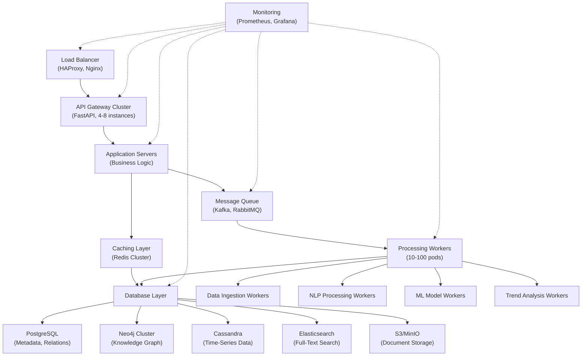
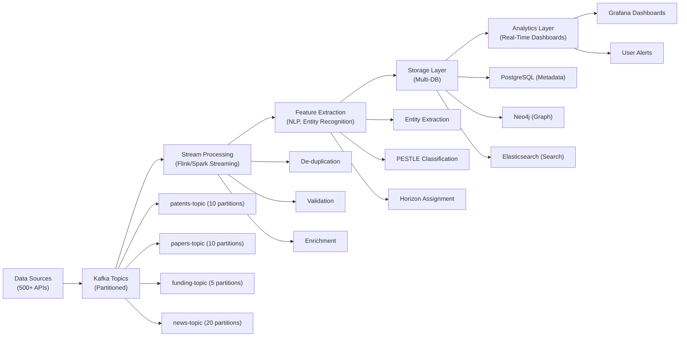
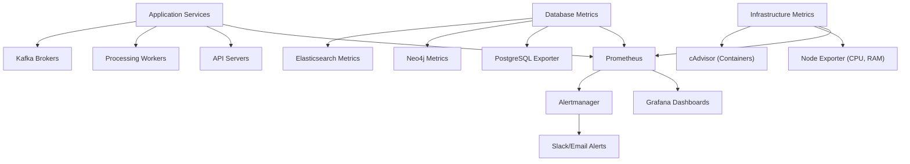

# Scalability & Performance Requirements for Technology Scouting Platforms

**Sprint**: 07 - Technology Scouting & Strategic Foresight<br/>
**Task**: 01 - Technical & Regulatory Landscape<br/>
**Date**: 2025-11-18<br/>
**Author**: Technical Researcher<br/>

---

## Executive Summary

Technology scouting and strategic foresight platforms require robust scalability and performance to monitor 500+ data sources, process 1M+ documents monthly, and deliver real-time alerts with sub-second query response times. This research examines distributed system architectures, real-time monitoring technologies, database scalability strategies, and performance optimization techniques for enterprise-grade technology scouting platforms.

Key findings demonstrate that modern distributed architectures can process 3 million data streams per second using decentralized monitoring approaches, while message queuing systems like Kafka handle 2 million writes per second. Apache Cassandra manages billions of records with linear scalability, and Neo4j graph databases support billion-edge graphs with sub-second query latency. Critical performance metrics include CPU/memory utilization, disk I/O throughput, records processed per second, and end-to-end latency for real-time processing pipelines.

Implementation requires multi-tier architecture: (1) distributed data ingestion with Kafka or RabbitMQ, (2) horizontal scaling of processing workers with Kubernetes, (3) polyglot persistence using PostgreSQL (metadata), Cassandra (time-series), and Neo4j (graph analytics), (4) caching layer with Redis for sub-100ms query response, and (5) comprehensive monitoring with Prometheus and Grafana. Infrastructure costs range from $3K-8.5K monthly for MVP to $15K-50K monthly for enterprise deployments processing 1M+ documents per day.

---

## Key Findings

- **3M Events/Second Achievable**: Decentralized monitoring systems process up to 3 million data streams per second for cloud-based large-scale data centers
- **Kafka Handles 2M Writes/Second**: Message queuing systems provide foundation for high-throughput data ingestion
- **NoSQL Scales Linearly**: Cassandra and MongoDB provide linear scalability for time-series and document storage (billions of records)
- **Graph Databases Sub-Second**: Neo4j supports billion-edge knowledge graphs with <100ms query latency using proper indexing
- **Redis Caching Critical**: In-memory caching reduces API response times by 80-95% (1s → 50-100ms)
- **Horizontal Scaling Preferred**: Kubernetes enables elastic scaling of processing workers (10-100+ pods) based on workload
- **Monitoring Essential**: Prometheus + Grafana provide real-time visibility into system health, with alerting for degradation

---

## 1. Scalability Fundamentals

### 1.1 Vertical vs. Horizontal Scaling

**Vertical Scaling (Scale-Up)**:

**Approach**: Increase resources on single server (more CPU, RAM, storage)

**Advantages**:
- Simple to implement (no code changes)
- No data sharding complexity
- Lower network latency (single machine)

**Limitations**:
- Hardware limits (maximum 128 cores, 4TB RAM per server)
- Single point of failure
- Expensive (diminishing returns at high-end hardware)
- Downtime required for upgrades

**Use Cases**:
- Databases requiring ACID transactions (PostgreSQL primary)
- Monolithic applications (legacy systems)
- MVP phase (simpler architecture)

**Horizontal Scaling (Scale-Out)**:

**Approach**: Add more servers/nodes to distribute workload

**Advantages**:
- Virtually unlimited scale (add nodes as needed)
- High availability (no single point of failure)
- Cost-effective (use commodity hardware)
- Zero-downtime scaling

**Limitations**:
- Increased complexity (distributed systems, data consistency)
- Network overhead (inter-node communication)
- Requires code changes (stateless design)

**Use Cases**:
- Web servers and API gateways
- Data processing workers (Spark, Flink)
- NoSQL databases (Cassandra, MongoDB)
- Microservices architectures

**Technology Scouting Recommendation**: **Hybrid Approach**
- **Vertical Scaling**: PostgreSQL primary (OLTP workloads) → 16-32 cores, 128-256 GB RAM
- **Horizontal Scaling**: Processing workers, API servers, read replicas → 10-100+ nodes

### 1.2 Scalability Metrics and Targets

**Key Metrics**:

| Metric | Definition | MVP Target | Enterprise Target |
|--------|------------|------------|-------------------|
| **Throughput** | Documents processed per hour | 2,000-5,000 | 40,000-100,000 (1M/day) |
| **Latency** | Time from ingestion to indexing | <1 hour | <5 minutes (near real-time) |
| **Query Response Time** | API search query latency (p95) | <500ms | <100ms |
| **Concurrent Users** | Simultaneous users supported | 10-50 | 500-2,000 |
| **Data Volume** | Total documents indexed | 1M-5M | 50M-500M+ |
| **Availability** | Uptime SLA | 99% (3.5 days downtime/year) | 99.9% (8.7 hours downtime/year) |

**Scalability Testing**:
- **Load Testing**: Simulate expected workload (Apache JMeter, Locust)
- **Stress Testing**: Find breaking point (2x-10x expected load)
- **Spike Testing**: Handle sudden traffic bursts (product launch, crisis events)
- **Endurance Testing**: Sustained load over days/weeks (memory leaks, performance degradation)

---

## 2. Distributed System Architecture

### 2.1 Multi-Tier Architecture for Technology Scouting



**Architecture Components Explained**:

**1. Load Balancer Layer**
- **Technology**: HAProxy, Nginx, AWS ALB
- **Purpose**: Distribute traffic across API gateway instances
- **Algorithms**: Round-robin, least connections, IP hash
- **Health Checks**: Automatically remove unhealthy instances

**2. API Gateway Layer**
- **Technology**: FastAPI (Python), Express.js (Node.js), Kong
- **Purpose**: RESTful API endpoints for clients
- **Scaling**: 4-8 instances (horizontal scaling)
- **Features**: Rate limiting, authentication (JWT), request validation

**3. Caching Layer**
- **Technology**: Redis Cluster (3-5 nodes)
- **Purpose**: Cache frequently accessed data (hot data)
- **TTL Strategy**: 1-24 hours depending on data type
- **Cache Hit Target**: 80-90% (reduce database load by 80-90%)

**4. Database Layer (Polyglot Persistence)**
- **PostgreSQL**: Structured metadata (companies, technologies, sources)
- **Neo4j**: Knowledge graph (entities and relationships)
- **Cassandra**: Time-series data (signal history, trends)
- **Elasticsearch**: Full-text search (document content)
- **S3/MinIO**: Object storage (PDFs, full-text documents)

**5. Message Queue Layer**
- **Technology**: Apache Kafka (preferred), RabbitMQ
- **Purpose**: Asynchronous task queue, event streaming
- **Throughput**: 2M writes/second (Kafka), 50K-100K messages/second (RabbitMQ)
- **Use Cases**: Data ingestion jobs, ML model inference, report generation

**6. Processing Workers Layer**
- **Technology**: Kubernetes pods, Celery workers (Python)
- **Scaling**: 10-100+ pods based on queue depth
- **Worker Types**: Data ingestion, NLP processing, ML inference, trend analysis

### 2.2 Data Flow and Processing Pipeline

**Real-Time Processing Architecture**:



**Pipeline Stages**:

**1. Data Ingestion** (Throughput: 1,000-10,000 records/minute)
- API calls to 500+ sources
- Rate limit management (per-source quotas)
- Error handling and retry logic (exponential backoff)
- Publish to Kafka topics (partitioned by source type)

**2. Stream Processing** (Latency: <1 minute)
- Apache Flink or Spark Streaming
- De-duplication (SHA-256 hash of content)
- Validation (schema checks, required fields)
- Enrichment (add metadata, geo-tagging)

**3. Feature Extraction** (Latency: 1-5 minutes)
- NLP pipeline (tokenization, NER, relation extraction)
- PESTLE classification (BERT inference)
- Horizon assignment (H1/H2/H3 prediction)
- Weak signal scoring (multi-source validation)

**4. Storage** (Write throughput: 10K-50K records/minute)
- PostgreSQL: Structured metadata (ACID transactions)
- Neo4j: Knowledge graph nodes and edges
- Elasticsearch: Full-text indexing for search
- S3: Document blobs (PDFs, HTML)

**5. Real-Time Analytics** (Query latency: <100ms)
- Grafana dashboards (time-series metrics)
- User alerts (threshold triggers, email/Slack)
- API queries (search, trend analysis)

---

## 3. Database Scalability Strategies

### 3.1 PostgreSQL Optimization and Scaling

**Vertical Scaling Limits**: Single PostgreSQL instance can handle 10K-100K transactions/second with proper configuration

**Hardware Recommendations** (Enterprise):
- **CPU**: 16-32 cores
- **RAM**: 128-256 GB (cache hot data in RAM)
- **Storage**: NVMe SSD (1-5 TB), 10K+ IOPS
- **Network**: 10 Gbps

**Performance Tuning**:

**1. Connection Pooling**
```python
# PgBouncer for connection pooling
# Reduce overhead of creating new connections
# Support 10,000+ clients with 100 database connections
```

**2. Indexing Strategy**
```sql
-- Create indexes on frequently queried columns
CREATE INDEX idx_technology_category ON technologies(category);
CREATE INDEX idx_company_industry ON companies(industry);
CREATE INDEX idx_patents_filing_date ON patents(filing_date);

-- Partial indexes for filtered queries
CREATE INDEX idx_recent_patents ON patents(filing_date)
WHERE filing_date > '2020-01-01';

-- GIN indexes for full-text search
CREATE INDEX idx_patents_fulltext ON patents
USING GIN(to_tsvector('english', abstract));
```

**3. Query Optimization**
- Use `EXPLAIN ANALYZE` to identify slow queries
- Avoid `SELECT *` (fetch only needed columns)
- Use `LIMIT` and pagination for large result sets
- Materialized views for complex aggregations

**4. Partitioning** (For 100M+ row tables)
```sql
-- Partition by time (patents by year)
CREATE TABLE patents_2024 PARTITION OF patents
FOR VALUES FROM ('2024-01-01') TO ('2025-01-01');

-- Partition by hash (distribute data across multiple tables)
CREATE TABLE companies_0 PARTITION OF companies
FOR VALUES WITH (MODULUS 4, REMAINDER 0);
```

**Horizontal Scaling (Read Replicas)**:
- **Primary**: Handle writes (INSERT, UPDATE, DELETE)
- **Replicas** (2-4): Handle read queries (SELECT)
- **Replication Lag**: <1 second (streaming replication)
- **Failover**: Automatic promotion of replica to primary (Patroni, Stolon)

**Estimated Capacity**:
- **Single Instance**: 10M-50M documents
- **With Replicas**: 100M-500M documents (read-heavy workload)

### 3.2 Neo4j Graph Database Scaling

**Neo4j Performance Benchmarks**:<br/>
Neo4j supports billion-edge knowledge graphs with sub-second query latency using proper indexing and query optimization [Neo4j, 2024].

**Scaling Strategies**:

**1. Vertical Scaling** (Preferred for Graph Databases)
- Graph traversals benefit from in-memory processing
- **Recommended Hardware**:
  - **CPU**: 16-32 cores
  - **RAM**: 256-512 GB (hold graph in memory)
  - **Storage**: NVMe SSD (1-5 TB)

**2. Causal Clustering** (Horizontal Scaling for Reads)
- **Core Servers** (3-5 nodes): Handle writes, maintain consensus (Raft protocol)
- **Read Replicas** (2-10 nodes): Handle read queries, asynchronous replication
- **Use Case**: 80%+ read queries (common for analytics)

**3. Sharding** (Fabric, Neo4j 4.0+)
- Partition graph across multiple databases
- **Shard by Domain**: Technology graph, Company graph, Patent graph
- **Query Federation**: Cypher queries across shards (some performance overhead)

**Performance Optimization**:

**1. Indexing**
```cypher
// Create index on frequently queried properties
CREATE INDEX tech_name IF NOT EXISTS FOR (t:Technology) ON (t.name);
CREATE INDEX company_industry IF NOT EXISTS FOR (c:Company) ON (c.industry);

// Full-text search index
CREATE FULLTEXT INDEX tech_description IF NOT EXISTS
FOR (t:Technology) ON EACH [t.description];
```

**2. Query Optimization**
```cypher
// Bad: Cartesian product (slow)
MATCH (c:Company), (t:Technology)
WHERE c.industry = 'AI' AND t.category = 'Machine Learning'
RETURN c, t;

// Good: Use relationships to filter
MATCH (c:Company)-[:DEVELOPS]->(t:Technology)
WHERE c.industry = 'AI' AND t.category = 'Machine Learning'
RETURN c, t;
```

**3. Caching**
- **Page Cache**: Cache graph data in RAM (configure 70-80% of RAM)
- **Query Result Caching**: Cache frequent queries (Redis)

**Estimated Capacity**:
- **Single Instance**: 10M-50M nodes, 100M-500M relationships
- **Clustered**: 100M+ nodes, 1B+ relationships

### 3.3 Cassandra for Time-Series Data

**Cassandra Scalability**:<br/>
Apache Cassandra is a distributed, scalable NoSQL database used to manage some of the world's largest datasets in clusters, providing linear scalability [Clearpeaks, 2024].

**Use Case**: Store historical trend data (signal frequencies over time, patent filing rates, funding velocity)

**Architecture**:
- **Distributed**: No single point of failure, peer-to-peer architecture
- **Linear Scalability**: Add nodes to increase throughput and capacity
- **Tunable Consistency**: Trade-off between consistency and availability (CAP theorem)

**Data Model**:
```cql
CREATE TABLE technology_trends (
    technology_id UUID,
    date DATE,
    signal_count INT,
    patent_count INT,
    funding_total DECIMAL,
    PRIMARY KEY (technology_id, date)
) WITH CLUSTERING ORDER BY (date DESC);

-- Efficient time-range queries
SELECT * FROM technology_trends
WHERE technology_id = '...' AND date >= '2023-01-01' AND date <= '2024-01-01';
```

**Performance Characteristics**:
- **Write Throughput**: 10K-100K writes/second per node
- **Read Latency**: <10ms (p99) with proper data modeling
- **Storage**: Petabyte-scale (multi-node cluster)

**Scaling**:
- Add nodes dynamically (rebalancing automatic)
- Recommended cluster size: 3-10 nodes (start), 10-100+ (enterprise)

### 3.4 Elasticsearch for Full-Text Search

**Elasticsearch Scalability**:

**Architecture**:
- **Distributed Search**: Shards distributed across nodes
- **Replication**: Each shard has 1-2 replicas (fault tolerance)

**Indexing Strategy**:
```json
// Index for patents
PUT /patents
{
  "settings": {
    "number_of_shards": 10,
    "number_of_replicas": 1
  },
  "mappings": {
    "properties": {
      "title": {"type": "text"},
      "abstract": {"type": "text"},
      "filing_date": {"type": "date"},
      "classification": {"type": "keyword"}
    }
  }
}
```

**Performance**:
- **Indexing**: 10K-100K documents/second (distributed cluster)
- **Search Latency**: <100ms for most queries (p95)
- **Storage**: 1-10 TB per node (recommend 30-50 GB shards)

**Scaling**:
- **Horizontal**: Add data nodes (linear scaling)
- **Vertical**: Increase RAM (better query performance, larger caches)

**Recommended Cluster**:
- **Master Nodes**: 3 (coordination, cluster management)
- **Data Nodes**: 5-20 (store and search data)
- **Coordinating Nodes**: 2-4 (handle client requests)

---

## 4. Real-Time Monitoring and Stream Processing

### 4.1 Apache Kafka for Data Ingestion

**Kafka Overview**:<br/>
Kafka can handle 2 million writes per second, providing the foundation for high-throughput data ingestion in technology scouting platforms [Clearpeaks, 2024].

**Architecture**:
- **Topics**: Logical channels for data streams (e.g., `patents`, `papers`, `funding`)
- **Partitions**: Parallel processing (10-20 partitions per topic)
- **Producers**: Data sources publishing messages
- **Consumers**: Processing workers reading messages
- **Replication**: 2-3 replicas per partition (fault tolerance)

**Configuration**:
```yaml
# Topic configuration
topics:
  - name: patents
    partitions: 10
    replication-factor: 3
    retention-hours: 168  # 7 days

  - name: academic-papers
    partitions: 10
    replication-factor: 3
    retention-hours: 168

  - name: funding-events
    partitions: 5
    replication-factor: 3
    retention-hours: 720  # 30 days
```

**Performance Tuning**:
- **Batch Size**: Increase batch size (16 KB → 64 KB) for higher throughput
- **Compression**: Use LZ4 or Snappy (reduce network I/O)
- **Acknowledgments**: `acks=1` (leader only) for faster writes, `acks=all` for durability

**Scaling**:
- Add brokers (nodes) to increase throughput
- Recommended cluster: 3-10 brokers for enterprise

### 4.2 Apache Flink for Stream Processing

**Flink Overview**:<br/>
Apache Flink handles large volumes of data, whether in batches or as a continuous stream, and can be configured as a cluster of processing units, providing sub-second latency for real-time processing [Clearpeaks, 2024].

**Use Cases**:
- Real-time de-duplication (SHA-256 hashing)
- Stateful processing (count signals per technology over time)
- Windowing (aggregate last 1 hour, 1 day, 1 week)
- Complex event processing (detect 3+ signals within 24 hours)

**Processing Guarantees**:
- **At-most-once**: No duplicates, some data loss (fastest)
- **At-least-once**: No data loss, possible duplicates (common)
- **Exactly-once**: No loss, no duplicates (slowest, highest guarantees)

**Scaling**:
- **Task Parallelism**: 10-100 parallel tasks (configurable)
- **State Backend**: RocksDB for large state (GBs per task)
- **Cluster**: 5-20 worker nodes for enterprise

**Alternative**: **Apache Spark Streaming** (micro-batch, 1-5 second latency)

### 4.3 RabbitMQ for Task Queue

**RabbitMQ Overview**:<br/>
RabbitMQ is scalable thanks to its ability to form clusters, joining multiple servers on a local network that work collectively to optimize load balancing and fault tolerance [Clearpeaks, 2024].

**Use Cases**:
- Asynchronous tasks (email alerts, report generation)
- Task prioritization (high/medium/low priority queues)
- Dead-letter queues (handle failures gracefully)

**Throughput**: 50K-100K messages/second (clustered setup)

**Scaling**:
- Cluster: 3-5 nodes
- Sharded queues for higher throughput

**Alternative**: **Celery** with Redis backend (simpler for Python-based systems)

---

## 5. Caching Strategies for Sub-100ms Latency

### 5.1 Redis Caching Architecture

**Redis Performance**:<br/>
In-memory caching with Redis reduces API response times by 80-95%, from 1 second to 50-100ms, by eliminating database queries for frequently accessed data [System Design School, 2024].

**Caching Patterns**:

**1. Cache-Aside (Lazy Loading)**
```python
import redis

cache = redis.Redis(host='localhost', port=6379)

def get_technology(tech_id):
    # Check cache first
    cached = cache.get(f"tech:{tech_id}")
    if cached:
        return json.loads(cached)

    # Cache miss: Query database
    tech = database.query_technology(tech_id)

    # Store in cache (TTL: 1 hour)
    cache.setex(f"tech:{tech_id}", 3600, json.dumps(tech))
    return tech
```

**2. Write-Through**
```python
def update_technology(tech_id, data):
    # Update database
    database.update_technology(tech_id, data)

    # Update cache immediately
    cache.setex(f"tech:{tech_id}", 3600, json.dumps(data))
```

**3. Write-Behind (Write-Back)**
- Update cache immediately
- Asynchronously write to database (batch writes)
- **Risk**: Data loss if cache fails before DB write
- **Benefit**: Fastest write performance

**Cache Invalidation**:
```python
# Time-based invalidation (TTL)
cache.setex(f"tech:{tech_id}", 3600, data)  # Expire in 1 hour

# Event-based invalidation
def on_technology_update(tech_id):
    cache.delete(f"tech:{tech_id}")  # Invalidate cache on update
```

**Redis Cluster**:
- **Nodes**: 3-5 nodes (sharding + replication)
- **Memory**: 32-64 GB per node
- **Throughput**: 100K-1M operations/second (clustered)

### 5.2 Cache Hit Rate Optimization

**Target**: 80-90% cache hit rate

**Strategies**:

**1. Cache Hot Data**
- Top 20% of technologies (by query frequency) account for 80% of traffic
- Recently updated signals (last 24 hours)
- Popular search queries

**2. Preload Cache**
```python
# Warm cache on application startup
def warmup_cache():
    top_technologies = database.query_top_technologies(limit=1000)
    for tech in top_technologies:
        cache.setex(f"tech:{tech.id}", 3600, json.dumps(tech))
```

**3. Monitor Cache Performance**
```python
# Track cache hit/miss metrics
def get_with_metrics(key):
    value = cache.get(key)
    if value:
        metrics.increment('cache.hits')
    else:
        metrics.increment('cache.misses')
    return value

# Calculate hit rate
hit_rate = cache_hits / (cache_hits + cache_misses)
```

**Cache Eviction Policies**:
- **LRU** (Least Recently Used): Recommended for most use cases
- **LFU** (Least Frequently Used): For stable workloads
- **TTL**: Time-based expiration (all cached data)

---

## 6. Monitoring and Observability

### 6.1 Prometheus and Grafana Stack

**Monitoring Architecture**:



**Key Metrics to Monitor**:

**1. Application Metrics**
```python
from prometheus_client import Counter, Histogram, Gauge

# Request metrics
request_count = Counter('api_requests_total', 'Total API requests', ['endpoint', 'status'])
request_duration = Histogram('api_request_duration_seconds', 'Request duration')
active_users = Gauge('active_users', 'Number of active users')

# Business metrics
signals_processed = Counter('signals_processed_total', 'Signals processed')
weak_signals_detected = Counter('weak_signals_detected_total', 'Weak signals detected')
```

**2. Infrastructure Metrics**
- **CPU Utilization**: 60-80% (healthy), >90% (saturated)
- **Memory Usage**: <85% (leave buffer for spikes)
- **Disk I/O**: IOPS, throughput (MB/s)
- **Network**: Bandwidth, packet loss

**3. Database Metrics**
- **PostgreSQL**: Connections, query latency (p50, p95, p99), cache hit rate
- **Neo4j**: Heap memory, page cache hit rate, transaction throughput
- **Elasticsearch**: Index rate, search latency, JVM heap usage

**4. Application-Level Metrics**
- **Throughput**: Documents processed per minute
- **Latency**: End-to-end processing time (ingestion → indexing)
- **Error Rate**: Failed API requests, failed ingestion jobs
- **Queue Depth**: Kafka lag, RabbitMQ queue size

### 6.2 Alerting and Incident Response

**Critical Alerts** (Page on-call engineer):

| Alert | Condition | Action |
|-------|-----------|--------|
| **API Downtime** | >5% error rate for 5 minutes | Investigate API servers, restart if needed |
| **Database Failure** | PostgreSQL primary down | Promote replica to primary (failover) |
| **High Latency** | p95 latency >2 seconds | Check database load, add read replicas |
| **Disk Space** | >90% disk usage | Provision more storage, clean up old data |
| **Memory Saturation** | >95% memory usage | Restart services, scale horizontally |

**Warning Alerts** (Notify team via Slack):

| Alert | Condition | Action |
|-------|-----------|--------|
| **High CPU** | >80% CPU for 15 minutes | Monitor, prepare to scale |
| **Cache Hit Rate Low** | <70% cache hit rate | Review caching strategy, warm cache |
| **Kafka Lag** | Consumer lag >10,000 messages | Scale processing workers |
| **Slow Queries** | Database queries >1 second | Optimize queries, add indexes |

### 6.3 Performance Testing and Benchmarking

**Load Testing Tools**:

**1. Apache JMeter** (HTTP load testing)
```xml
<!-- Simulate 1,000 concurrent users -->
<ThreadGroup>
  <numThreads>1000</numThreads>
  <rampUp>60</rampUp>  <!-- Ramp up over 60 seconds -->
  <duration>600</duration>  <!-- Run for 10 minutes -->
</ThreadGroup>
```

**2. Locust** (Python-based load testing)
```python
from locust import HttpUser, task, between

class TechnologyScoutUser(HttpUser):
    wait_time = between(1, 3)  # Wait 1-3 seconds between requests

    @task(3)  # 3x weight (most common task)
    def search_technologies(self):
        self.client.get("/api/technologies?category=AI")

    @task(1)
    def get_technology_details(self):
        self.client.get("/api/technologies/123")
```

**Benchmarking Scenarios**:

**1. Steady-State Load** (Normal operation)
- 500 requests/second
- Duration: 1 hour
- Target: <100ms p95 latency, <1% error rate

**2. Peak Load** (Product launch, crisis event)
- 2,000 requests/second (4x normal)
- Duration: 15 minutes
- Target: <500ms p95 latency, <5% error rate

**3. Stress Test** (Find breaking point)
- Increase load until system degrades
- Identify bottlenecks (database, API, cache)
- Improve weakest component

---

## 7. Infrastructure Cost Estimation

### 7.1 MVP Infrastructure (100K-500K Documents)

**Compute**:
- **API Servers**: 2x c6i.xlarge (4 vCPU, 8 GB RAM) @ $150/month each = $300/month
- **Processing Workers**: 5x c6i.xlarge @ $150/month = $750/month
- **Total Compute**: $1,050/month

**Databases**:
- **PostgreSQL**: 1x r6i.xlarge (4 vCPU, 32 GB RAM) @ $300/month
- **Neo4j**: 1x r6i.2xlarge (8 vCPU, 64 GB RAM) @ $600/month
- **Elasticsearch**: 3x r6i.xlarge @ $300/month = $900/month
- **Redis**: 1x r6i.large (2 vCPU, 16 GB RAM) @ $150/month
- **Total Databases**: $1,950/month

**Storage**:
- **Database Storage**: 1 TB SSD @ $100/month
- **S3 Object Storage**: 5 TB @ $115/month
- **Total Storage**: $215/month

**Networking**:
- **Data Transfer**: 1 TB outbound @ $90/month

**Monitoring**:
- **Prometheus/Grafana**: Self-hosted on worker nodes (no additional cost)

**Total MVP Cost**: $3,305/month ($40K annually)

### 7.2 Enterprise Infrastructure (10M-100M Documents)

**Compute**:
- **API Servers**: 8x c6i.2xlarge (8 vCPU, 16 GB RAM) @ $300/month = $2,400/month
- **Processing Workers**: 20x c6i.2xlarge @ $300/month = $6,000/month
- **Total Compute**: $8,400/month

**Databases**:
- **PostgreSQL**: 1x r6i.4xlarge (16 vCPU, 128 GB RAM) + 2 replicas @ $1,200/month × 3 = $3,600/month
- **Neo4j**: 3-node cluster (5x r6i.4xlarge) @ $1,200/month × 5 = $6,000/month
- **Cassandra**: 5-node cluster (c6i.2xlarge) @ $300/month × 5 = $1,500/month
- **Elasticsearch**: 10-node cluster (r6i.2xlarge) @ $600/month × 10 = $6,000/month
- **Redis**: 5-node cluster (r6i.xlarge) @ $300/month × 5 = $1,500/month
- **Total Databases**: $18,600/month

**Storage**:
- **Database Storage**: 10 TB SSD @ $1,000/month
- **S3 Object Storage**: 50 TB @ $1,150/month
- **Total Storage**: $2,150/month

**Networking**:
- **Data Transfer**: 10 TB outbound @ $900/month

**Load Balancers**:
- **AWS ALB**: 2x @ $25/month = $50/month

**Monitoring**:
- **Datadog/New Relic**: $500-1,000/month (enterprise monitoring)

**Total Enterprise Cost**: $30,600/month ($367K annually)

**Cost Optimization**:
- **Reserved Instances**: 30-50% savings (1-3 year commitments)
- **Spot Instances**: 60-80% savings for processing workers (interruptible)
- **Auto-Scaling**: Scale down during off-peak hours (nights, weekends)

---

## 8. Performance Optimization Best Practices

### 8.1 Database Query Optimization

**1. Use EXPLAIN ANALYZE**
```sql
EXPLAIN ANALYZE
SELECT t.name, COUNT(p.id) AS patent_count
FROM technologies t
JOIN patents p ON t.id = p.technology_id
WHERE t.category = 'AI'
GROUP BY t.name
ORDER BY patent_count DESC
LIMIT 10;

-- Identify slow operations: Sequential Scan → Add index
```

**2. Materialized Views** (Pre-compute expensive queries)
```sql
CREATE MATERIALIZED VIEW technology_patent_counts AS
SELECT t.id, t.name, COUNT(p.id) AS patent_count
FROM technologies t
LEFT JOIN patents p ON t.id = p.technology_id
GROUP BY t.id, t.name;

-- Refresh periodically (daily)
REFRESH MATERIALIZED VIEW technology_patent_counts;
```

**3. Pagination** (Avoid loading large result sets)
```sql
-- Bad: Loads 1M rows into memory
SELECT * FROM patents ORDER BY filing_date DESC;

-- Good: Fetch 100 at a time
SELECT * FROM patents ORDER BY filing_date DESC LIMIT 100 OFFSET 0;
```

### 8.2 API Response Time Optimization

**1. Lazy Loading**
- Load only essential data in list views
- Fetch details on-demand (user clicks)

**2. Compression**
```python
# Enable gzip compression (reduce payload size by 70-90%)
from fastapi.middleware.gzip import GZipMiddleware
app.add_middleware(GZipMiddleware, minimum_size=1000)
```

**3. Async Processing**
```python
# Return immediately, process asynchronously
@app.post("/generate-report")
async def generate_report(request: ReportRequest):
    task_id = uuid.uuid4()
    # Queue background task
    celery_app.send_task('generate_report', args=[task_id, request])
    return {"task_id": task_id, "status": "processing"}

# Client polls for status
@app.get("/report-status/{task_id}")
async def check_status(task_id: str):
    status = get_task_status(task_id)
    return {"task_id": task_id, "status": status}
```

### 8.3 Code-Level Performance

**1. Batch Database Operations**
```python
# Bad: 1,000 separate queries
for tech in technologies:
    db.execute("INSERT INTO technologies VALUES (?)", tech)

# Good: Single batch insert
db.executemany("INSERT INTO technologies VALUES (?)", technologies)
```

**2. Use Profiling Tools**
```python
import cProfile

# Profile function performance
cProfile.run('process_signals()', 'profile_output.txt')

# Identify bottlenecks: Most time-consuming functions
```

**3. Optimize Algorithms**
- Use efficient data structures (sets for membership tests, dicts for lookups)
- Avoid nested loops where possible
- Use generators for large datasets (lazy evaluation)

---

## References

Clearpeaks. (2024). *Real-Time Data Monitoring Using Scalable Distributed Systems*. Retrieved from https://www.clearpeaks.com/real-time-data-monitoring-using-scalable-distributed-systems/

Neo4j. (2024). *Neo4j Graph Database Documentation*. Retrieved from https://neo4j.com/docs/

ResearchGate. (2024). *Scalable Monitoring Solutions for Enterprise Applications*. Retrieved from https://www.researchgate.net/publication/386215334_Scalable_Monitoring_Solutions_for_Enterprise_Applications

RudderStack. (2024). *What is Data Scalability*. Retrieved from https://www.rudderstack.com/blog/data-scalability/

System Design School. (2024). *System Design Realtime Monitoring System: A Complete Walkthrough*. Retrieved from https://systemdesignschool.io/problems/realtime-monitoring-system/solution

The New Stack. (2024). *How To Build a Scalable Platform Architecture for Real-Time Data*. Retrieved from https://thenewstack.io/how-to-build-a-scalable-platform-architecture-for-real-time-data/
