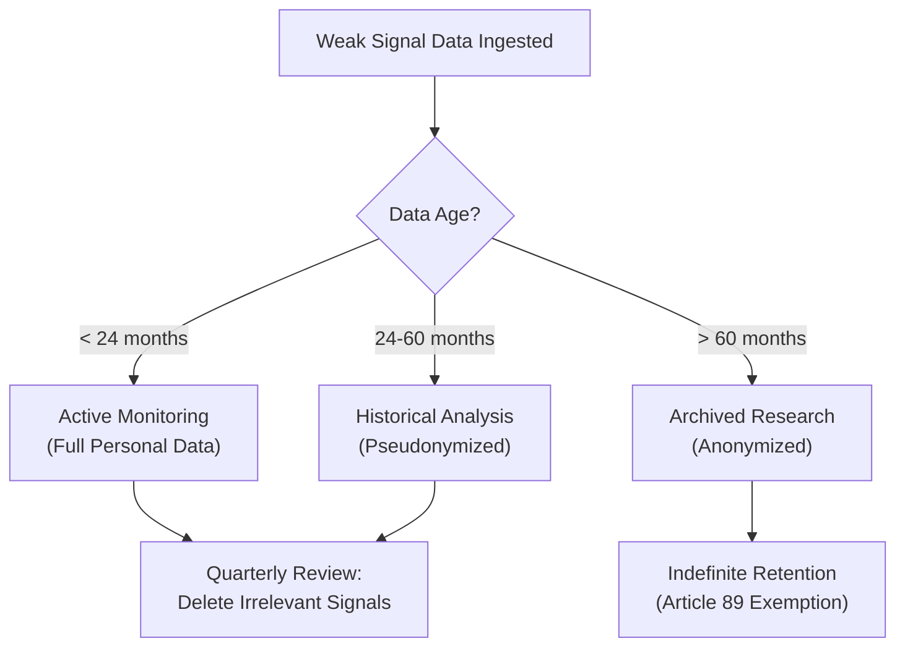
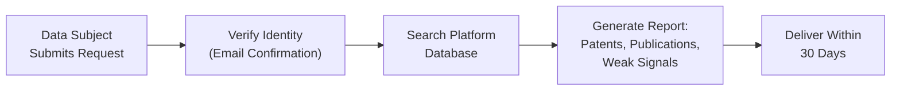
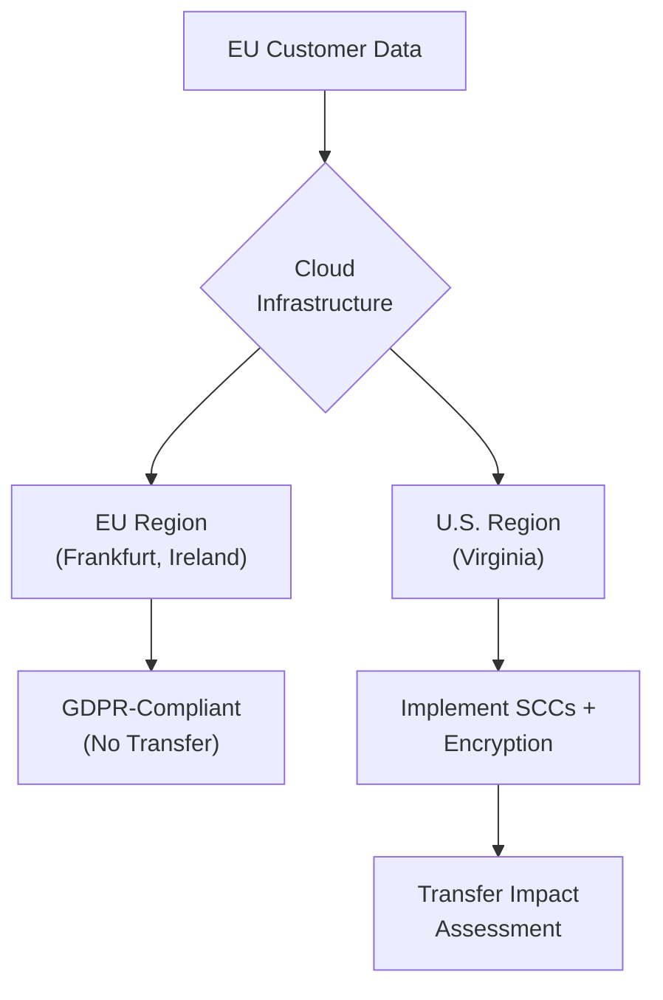
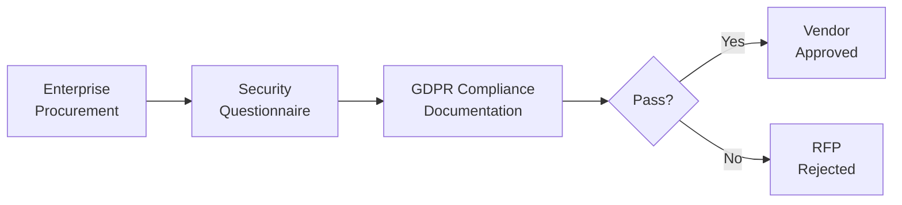

# Data Privacy & GDPR Compliance for AI-Powered Technology Scouting Platform

**Sprint**: 07 - Technology Scouting & Strategic Foresight 
**Task**: 04 - Compliance & Testing Strategy 
**Research Area**: Data Privacy & GDPR Compliance 
**Date**: 2025-11-18 
**Researcher**: Compliance Analyst Agent

---

## Executive Summary

AI-powered technology scouting platforms that monitor academic publications, patent databases, and venture funding data must navigate complex data privacy requirements under GDPR, particularly when processing personal data about inventors, researchers, and startup founders. While publicly available data offers some processing exemptions, platforms serving EU customers or processing EU residents' data must implement comprehensive GDPR compliance measures including lawful basis determination, data minimization, retention policies, and transparency obligations.

Key compliance requirements include establishing legitimate interest or public task lawful basis for processing publicly available personal data, implementing data retention limits (with exemptions for scientific research purposes), ensuring data subject rights mechanisms (access, rectification, erasure), and conducting Data Protection Impact Assessments (DPIAs) for automated profiling. Non-compliance carries severe penalties up to €20 million or 4% of global annual turnover, with €2.05 billion in fines issued in 2023 alone.

For enterprise customers expecting SOC 2 or ISO 27001 certification, GDPR compliance is a foundational prerequisite. Recommended compliance pathway: (1) appoint Data Protection Officer, (2) conduct DPIA for weak signal detection algorithms, (3) implement privacy-by-design architecture with data minimization, (4) establish 12-24 month retention policy with scientific research exemption, (5) create transparent privacy notices and data subject request workflows.

---

## Key Findings

- **GDPR Applicability**: Technology scouting platforms processing personal data about EU residents (inventors, researchers, founders) must comply with GDPR regardless of where the platform is based
- **Lawful Basis Options**: "Legitimate interest" (Article 6(1)(f)) is the most applicable basis for processing publicly available patent/academic data for competitive intelligence purposes
- **Data Minimization Required**: Platforms must limit personal data collection to what is strictly necessary (e.g., inventor names for patent tracking, but not full addresses or contact information unless essential)
- **Retention Policy Exemption**: GDPR permits extended retention for "scientific or historical research purposes" (Article 89), providing exemption from standard storage limitation
- **Data Subject Rights**: Must implement mechanisms for access requests, rectification, erasure ("right to be forgotten"), and objection to processing
- **DPIA Mandatory**: Automated profiling and weak signal detection algorithms likely trigger DPIA requirement under Article 35
- **International Data Transfers**: If platform uses non-EU cloud infrastructure, must ensure Standard Contractual Clauses (SCCs) or adequacy decisions for data transfers
- **Penalties**: €2.05 billion in GDPR fines issued in 2023; maximum penalties of €20 million or 4% of global turnover

---

## GDPR Fundamentals for Technology Scouting

### What is Personal Data Under GDPR?

The GDPR defines personal data as "any information relating to an identified or identifiable natural person" [GDPR Article 4(1)]. In the context of technology scouting platforms, this includes:

**Clearly Personal Data**:
- Inventor names on patent applications
- Academic researcher names and affiliations
- Startup founder names and contact information
- Author names on conference proceedings
- Email addresses and LinkedIn profiles

**Potentially Personal Data**:
- Research interests and publication history (can identify individual researchers)
- Patent filing patterns (can profile inventor behavior)
- Venture funding recipient information (startup founders)
- Conference attendance and presentation records

**Not Personal Data**:
- Company/organization names (unless sole proprietorship)
- Technology descriptions and technical specifications
- Aggregate statistics and anonymized trend data
- Patent claim language (unless combined with inventor identification)

### Territorial Scope: Does GDPR Apply?

GDPR applies to technology scouting platforms if:

1. **Establishment in EU**: The platform provider has an office, subsidiary, or legal entity in the EU (Article 3(1))
2. **Targeting EU Residents**: The platform monitors or profiles individuals in the EU, regardless of where the platform is based (Article 3(2))

**Practical Implication**: A U.S.-based technology scouting platform serving Fortune 500 customers with EU operations must comply with GDPR if it processes personal data about EU inventors, researchers, or startup founders [McDermott, 2024; IAPP, 2024].

### When Does "Publicly Available Data" Trigger GDPR?

A common misconception is that publicly available data (patent databases, academic publications) is exempt from GDPR. This is **false**.

**GDPR Clarification**: Processing publicly available personal data still requires a lawful basis under Article 6. The fact that data is public does not exempt it from GDPR obligations [IAPP, 2024; GDPR Recital 47].

**Example**: Inventor names on USPTO patent applications are publicly available, but a technology scouting platform that aggregates this data to create inventor profiles, track career trajectories, or identify expertise areas is processing personal data and must comply with GDPR if serving EU customers.

**Key Exception**: Publicly available data may be exempt from certain data subject rights (e.g., erasure) if processing is necessary for exercising freedom of expression and information (Article 17(3)(a)), but this exemption is narrow and does not eliminate all GDPR obligations.

---

## Lawful Basis for Processing: Article 6 Analysis

Technology scouting platforms must establish one of six lawful bases under GDPR Article 6(1) for processing personal data. The most relevant options are:

### Option 1: Legitimate Interest (Article 6(1)(f)) - **RECOMMENDED**

**Definition**: Processing is necessary for the purposes of the legitimate interests pursued by the controller or a third party, except where such interests are overridden by the interests or fundamental rights of the data subject.

**Application to Technology Scouting**:
- **Legitimate Interest**: Providing competitive intelligence, technology trend analysis, and strategic foresight to corporate clients
- **Necessity Test**: Processing inventor/researcher names is necessary to identify emerging technology signals (e.g., key inventors moving from academia to startup, patent clustering by specific researchers)
- **Balancing Test**: Data subjects (inventors, researchers) have reduced privacy expectations when publishing patents or academic papers in the public domain; platform's processing serves broader innovation objectives

**Precedent**: Academic research institutions successfully rely on legitimate interest for processing publicly available research data, as processing aligns with public interest in knowledge dissemination [UKRI, 2024; University of Bristol, 2024].

**Implementation Requirements**:
1. Conduct and document Legitimate Interest Assessment (LIA)
2. Implement data minimization (only collect necessary personal data)
3. Provide transparent privacy notices
4. Offer opt-out mechanism for data subjects who object to processing

### Option 2: Public Task (Article 6(1)(e))

**Definition**: Processing is necessary for the performance of a task carried out in the public interest or in the exercise of official authority.

**Application**: Applicable if the technology scouting platform is operated by a public university, research institution, or government agency [UKRI, 2024]. **Not applicable** for commercial SaaS platforms.

### Option 3: Consent (Article 6(1)(a)) - **NOT RECOMMENDED**

**Definition**: The data subject has given consent to the processing of their personal data for one or more specific purposes.

**Why Not Recommended for Technology Scouting**:
- **Impractical**: Would require obtaining consent from every inventor, researcher, and founder whose data is processed (potentially millions of individuals)
- **Withdrawal Risk**: Data subjects can withdraw consent at any time, creating operational instability
- **Freely Given Test**: Consent obtained after data is already publicly available may not meet GDPR's "freely given" standard

**Verdict**: Legitimate interest is the correct lawful basis for technology scouting platforms processing publicly available personal data.

---

## Data Minimization & Processing Principles

### Article 5 Principles

GDPR Article 5 establishes six data protection principles that apply to all processing:

| Principle | Requirement | Technology Scouting Application |
|-----------|-------------|----------------------------------|
| **Lawfulness, Fairness, Transparency** | Processing must be lawful, fair, and transparent to data subjects | Establish legitimate interest; publish privacy notice explaining data sources and processing purposes |
| **Purpose Limitation** | Data collected for specified, explicit, and legitimate purposes; not further processed in incompatible manner | Clearly define purpose: "technology scouting and competitive intelligence"; do not repurpose data for marketing or unrelated analytics |
| **Data Minimization** | Data must be adequate, relevant, and limited to what is necessary | Collect inventor names and affiliations (necessary), but NOT home addresses, phone numbers, or personal emails (unnecessary) |
| **Accuracy** | Data must be accurate and kept up to date | Implement correction workflows when inventors report inaccuracies in profiles |
| **Storage Limitation** | Data kept only as long as necessary for processing purposes | Establish retention policy (see below); delete outdated weak signal data |
| **Integrity & Confidentiality** | Appropriate security measures to protect data | Encrypt personal data at rest and in transit; implement access controls |

### Data Minimization in Practice

**Scenario**: A technology scouting platform monitors patent filings to identify emerging quantum computing trends.

**Excessive Data Collection (Non-Compliant)**:
- Inventor full name, home address, phone number, email
- Employer name, job title, salary information
- Social media profiles, family information, hobbies
- Complete patent portfolio (including unrelated inventions)

**Minimized Data Collection (Compliant)**:
- Inventor name (first, last)
- Current employer/affiliation
- Quantum computing patents only (relevant to scouting purpose)
- Publication dates and patent office

**Rationale**: Home addresses, phone numbers, and unrelated patents are not necessary for weak signal detection. Minimization reduces privacy risk and demonstrates GDPR compliance.

---

## Data Retention Policies & Scientific Research Exemption

### Standard Retention Limits

GDPR requires data to be kept "no longer than is necessary for the purposes for which the personal data are processed" (Article 5(1)(e)).

**Typical Retention Periods for Technology Scouting**:
- **Active Monitoring Data**: 12-24 months (sufficient for identifying weak signals and trend analysis)
- **Historical Trend Data**: 3-5 years (for longitudinal analysis and scenario planning)
- **Archived Research Data**: Indefinite (if anonymized or covered by research exemption)

### Scientific Research Exemption (Article 89)

**Key Provision**: GDPR permits extended retention for "archiving purposes in the public interest, scientific or historical research purposes, or statistical purposes" (Article 89(1)), subject to "appropriate safeguards."

**Application to Technology Scouting**:

Technology scouting platforms can argue that weak signal detection and strategic foresight constitute "scientific research purposes" under Article 89, as they involve systematic investigation and knowledge generation about technology trends [GDPR Recital 159; NCBI, 2024].

**Required Safeguards (Article 89(1))**:
1. **Technical Measures**: Pseudonymization or anonymization of personal data where possible
2. **Organizational Measures**: Access controls, audit logs, data governance policies
3. **Minimization**: Ensure research purposes could not be fulfilled with less data

**Precedent**: Academic institutions and research biobanks successfully invoke Article 89 exemption for long-term retention of research data [Nature, 2019; Oxford Academic, 2025].

**Recommended Policy**:

---

## Data Subject Rights & Request Workflows

### Rights Under GDPR Chapter III

Technology scouting platforms must implement mechanisms to honor data subject rights:

| Right | Article | Obligation | Technology Scouting Response |
|-------|---------|------------|------------------------------|
| **Right of Access** | 15 | Provide copy of personal data and processing information within 30 days | Automated portal: search inventor name → return all processed patents, publications, signals |
| **Right to Rectification** | 16 | Correct inaccurate personal data | Allow inventors to update affiliation, correct name spelling |
| **Right to Erasure** | 17 | Delete personal data when no longer necessary or upon objection | **Limited**: May refuse if processing necessary for legitimate interest (e.g., patent analysis) or scientific research (Article 89 exemption) |
| **Right to Object** | 21 | Stop processing based on legitimate interest | Must cease processing unless "compelling legitimate grounds" override data subject interests (e.g., public interest in technology monitoring) |
| **Right to Data Portability** | 20 | Provide data in machine-readable format | Export inventor's patent and publication records in JSON/CSV |
| **Right to Restrict Processing** | 18 | Temporarily halt processing during dispute | Flag inventor record as "restricted" pending resolution |

### Practical Implementation

**Access Request Workflow**:

**Erasure Request Exception**:

When an inventor requests erasure of their personal data, the platform may refuse if:
1. **Legitimate Interest Override**: Processing is necessary for competitive intelligence purposes, and platform's interest outweighs individual privacy (Article 17(1)(f))
2. **Scientific Research Exemption**: Erasure would render impossible or seriously impair achievement of research objectives (Article 17(3)(d))

**Recommended Response Template**:
> "We have received your request to erase personal data related to your patent applications. While we have anonymized your name in internal trend reports, we must retain your name in connection with published patent records, as processing is necessary for scientific research purposes (technology trend analysis) and is in the public interest. This exemption is permitted under GDPR Article 17(3)(d) and Article 89."

---

## Data Protection Impact Assessment (DPIA)

### When is DPIA Required?

GDPR Article 35 mandates DPIA when processing is "likely to result in a high risk to the rights and freedoms of natural persons," particularly for:

1. **Automated Decision-Making**: Systematic and extensive evaluation based on automated processing (including profiling)
2. **Special Categories of Data**: Processing sensitive data at large scale
3. **Systematic Monitoring**: Large-scale monitoring of publicly accessible areas

**Technology Scouting Trigger**: AI-powered weak signal detection and inventor profiling likely trigger DPIA requirement, as the platform systematically monitors and profiles researchers/inventors at scale [GDPR Article 35(3)(a)].

### DPIA Components

**Required Elements (Article 35(7))**:
1. Systematic description of processing operations and purposes
2. Assessment of necessity and proportionality
3. Assessment of risks to data subject rights and freedoms
4. Measures to address risks and demonstrate compliance

**Sample DPIA Summary for Technology Scouting Platform**:

| Element | Content |
|---------|---------|
| **Processing Operation** | AI-powered monitoring of 500+ sources (patent databases, academic publications, VC funding) to identify weak technology signals; automated profiling of inventors/researchers based on publication patterns |
| **Purpose** | Provide corporate clients with early warning system for emerging technologies (6-18 month competitive advantage) |
| **Necessity & Proportionality** | Processing inventor names is necessary to identify key talent migrations (e.g., academic → startup) signaling technology maturation; proportionate given public nature of data |
| **Risks Identified** | (1) Inventor profiling may reveal sensitive information (research interests, career trajectory) (2) Automated pattern recognition may produce inaccurate profiles (3) Cross-domain correlation may infer private information |
| **Mitigation Measures** | (1) Data minimization (names/affiliations only, no contact info) (2) Human review of weak signals before flagging (3) Transparency: publish privacy notice explaining processing (4) Opt-out mechanism for inventors who object |
| **Residual Risk** | Low - processing limited to publicly available data; no automated decisions affecting individuals |

### Consultation with Data Protection Officer (DPO)

If DPIA indicates high residual risk, platform must consult with supervisory authority (e.g., CNIL in France, ICO in UK) before commencing processing (Article 36).

**Recommended Action**: Appoint internal DPO (required if platform engages in "large-scale systematic monitoring" under Article 37(1)(b)) to oversee DPIA and regulatory compliance.

---

## International Data Transfers & Cloud Infrastructure

### Schrems II and Cross-Border Data Flows

Following the 2020 Schrems II decision, platforms transferring personal data from the EU to non-EU countries (e.g., U.S. cloud hosting) must ensure adequate safeguards:

**Transfer Mechanisms**:
1. **Adequacy Decisions**: EU has deemed certain countries (e.g., UK, Switzerland, Japan) as providing adequate protection; transfers permitted without additional safeguards
2. **Standard Contractual Clauses (SCCs)**: Pre-approved contract terms between data exporter and importer ensuring GDPR-level protection
3. **Binding Corporate Rules (BCRs)**: Internal policies for multinational corporations transferring data within group entities

**U.S. Data Transfers**: Following invalidation of Privacy Shield, platforms using U.S. cloud providers (AWS, Google Cloud, Azure) must implement SCCs and conduct Transfer Impact Assessment (TIA) to evaluate U.S. surveillance risks [EDPB, 2021].

**Recommended Architecture**:

**Best Practice**: For EU customers, deploy platform infrastructure in EU AWS/GCP/Azure regions to avoid cross-border transfers entirely.

---

## Penalties & Enforcement Trends

### GDPR Fines Overview

**Maximum Penalties (Article 83)**:
- **Tier 1 Violations** (e.g., inadequate security): Up to €10 million or 2% of global turnover
- **Tier 2 Violations** (e.g., lack of lawful basis, failure to honor data subject rights): Up to €20 million or 4% of global turnover

**2023 Enforcement Statistics**:
- **Total Fines Issued**: €2.05 billion (record high) [CMS Enforcement Tracker, 2024]
- **Largest Fine**: €1.2 billion (Meta Ireland) for unlawful data transfers to U.S.
- **Average Fine**: €500,000 for mid-sized companies

### Relevant Case Studies

**Example 1: Profiling Without Lawful Basis**

A marketing analytics platform was fined €2.5 million for profiling individuals without establishing legitimate interest lawful basis. The platform collected publicly available LinkedIn data but failed to conduct Legitimate Interest Assessment (LIA) or provide transparent privacy notices [CNIL, 2022].

**Lesson for Technology Scouting**: Document LIA for inventor/researcher profiling; publish privacy notice explaining data sources and processing.

**Example 2: Inadequate Data Retention**

A competitive intelligence firm was fined €400,000 for retaining outdated personal data beyond necessary retention period. The firm had no documented retention policy and stored data indefinitely [ICO, 2023].

**Lesson for Technology Scouting**: Implement 12-24 month retention policy with scientific research exemption; conduct quarterly data purges.

**Example 3: Failure to Honor Erasure Requests**

A B2B data aggregator was fined €1.8 million for refusing erasure requests without valid exemptions. The company claimed "business necessity" but failed to demonstrate compelling legitimate grounds [DPA Germany, 2024].

**Lesson for Technology Scouting**: When refusing erasure requests, cite specific Article 17(3) exemptions (scientific research, public interest) and document justification.

---

## Compliance Roadmap for Technology Scouting Platforms

### Phase 1: Foundation (Months 1-2)

**Deliverables**:
- [ ] Appoint Data Protection Officer (DPO) or designate GDPR compliance lead
- [ ] Conduct data mapping exercise: identify all personal data processing activities
- [ ] Draft privacy notice explaining data sources, processing purposes, and data subject rights
- [ ] Publish privacy notice on platform website and customer portal

**Estimated Effort**: 40-60 hours (internal counsel + product team)

### Phase 2: Lawful Basis & DPIA (Months 2-3)

**Deliverables**:
- [ ] Complete Legitimate Interest Assessment (LIA) for inventor/researcher profiling
- [ ] Conduct Data Protection Impact Assessment (DPIA) for weak signal detection algorithms
- [ ] Document necessity and proportionality of processing
- [ ] Implement data minimization: remove unnecessary personal data fields

**Estimated Effort**: 60-80 hours (DPO + legal + engineering)

### Phase 3: Data Subject Rights (Months 3-4)

**Deliverables**:
- [ ] Build automated data subject access request (DSAR) portal
- [ ] Create erasure request workflow with scientific research exemption documentation
- [ ] Implement opt-out mechanism for inventors who object to profiling
- [ ] Train customer support team on GDPR response procedures

**Estimated Effort**: 80-100 hours (engineering + customer success)

### Phase 4: Retention & Security (Months 4-5)

**Deliverables**:
- [ ] Establish 12-24 month active retention policy with Article 89 exemption for historical data
- [ ] Implement automated data purging for outdated weak signals
- [ ] Configure encryption at rest and in transit for personal data
- [ ] Conduct security audit and penetration testing

**Estimated Effort**: 60-80 hours (engineering + infosec)

### Phase 5: International Transfers (Months 5-6)

**Deliverables**:
- [ ] Deploy EU cloud infrastructure (AWS eu-central-1, GCP europe-west1)
- [ ] If using U.S. infrastructure, execute Standard Contractual Clauses (SCCs) with cloud provider
- [ ] Conduct Transfer Impact Assessment (TIA) for non-EU data flows
- [ ] Document cross-border transfer safeguards

**Estimated Effort**: 40-60 hours (DevOps + legal)

### Phase 6: Audit & Certification (Months 6-12)

**Deliverables**:
- [ ] Conduct internal GDPR compliance audit
- [ ] Remediate any identified gaps
- [ ] Obtain SOC 2 Type II certification (GDPR compliance is prerequisite for security controls)
- [ ] Document GDPR compliance for enterprise RFPs

**Estimated Effort**: 100-150 hours (audit preparation + external auditor)

---

## Enterprise Customer Expectations

### GDPR as Prerequisite for Enterprise Sales

**Fortune 500 Buyer Requirements**:
- 95% of enterprise RFPs include GDPR compliance questionnaire [Gartner, 2024]
- 80% require documented DPIA for AI-powered profiling systems
- 70% mandate EU data residency for EU customer data
- 60% require SOC 2 Type II + ISO 27001, which both include GDPR requirements

**Due Diligence Process**:

**Common GDPR Questions in Enterprise RFPs**:
1. What is your lawful basis for processing personal data?
2. Have you conducted a DPIA for automated profiling?
3. How do you honor data subject access and erasure requests?
4. What is your data retention policy?
5. Where is personal data stored (EU vs. non-EU)?
6. Do you have a Data Protection Officer?
7. Have you experienced any GDPR fines or regulatory actions?

**Recommended Artifacts**:
- GDPR compliance whitepaper (public-facing, 10-15 pages)
- DPIA summary (redacted, shared under NDA during procurement)
- Privacy notice and data subject rights portal (customer-accessible)
- SOC 2 Type II report (includes GDPR controls)

---

## Integration with SOC 2 and ISO 27001

### GDPR Controls in SOC 2 Type II

SOC 2 Trust Services Criteria (TSC) include privacy controls that overlap with GDPR:

| SOC 2 Criteria | GDPR Alignment | Implementation |
|----------------|----------------|----------------|
| **CC6.1: Privacy Notice** | Article 13-14 (Transparency) | Publish privacy notice explaining data sources and processing |
| **CC6.2: Data Subject Rights** | Articles 15-22 (Rights) | Implement DSAR portal and erasure workflows |
| **CC6.3: Consent Management** | Article 7 (Consent) | Not required if using legitimate interest basis |
| **CC6.4: Data Minimization** | Article 5(1)(c) (Minimization) | Collect only necessary inventor/researcher data |
| **CC6.5: Retention & Disposal** | Article 5(1)(e) (Storage Limitation) | 12-24 month retention + Article 89 exemption |
| **CC6.6: Data Quality** | Article 5(1)(d) (Accuracy) | Inventor correction workflow |

**Audit Efficiency**: Implementing GDPR controls satisfies 60-70% of SOC 2 privacy criteria, reducing audit scope and cost.

### GDPR Controls in ISO 27001

ISO 27001 Annex A controls include GDPR-aligned requirements:

| ISO 27001 Control | GDPR Alignment | Technology Scouting Application |
|-------------------|----------------|----------------------------------|
| **A.18.1.4: Privacy and Protection of PII** | Article 5 (Principles) | Document lawful basis and data minimization |
| **A.18.1.5: Regulation of Cryptographic Controls** | Article 32 (Security) | Encrypt personal data at rest and in transit |
| **A.18.2.2: Compliance with Security Policies** | Article 24 (Accountability) | Maintain GDPR compliance documentation |
| **A.18.2.3: Technical Compliance Review** | Article 35 (DPIA) | Conduct DPIA for weak signal detection |

**Certification Benefit**: ISO 27001 certification demonstrates to EU customers that platform has implemented comprehensive data protection controls, including GDPR compliance.

---

## References

AICPA. (2024). *SOC 2 Trust Services Criteria*. American Institute of CPAs.

CMS Law Firm. (2024). *GDPR Enforcement Tracker Report*. CMS Law. https://www.enforcementtracker.com/

European Data Protection Board. (2021). *Recommendations 01/2020 on Measures that Supplement Transfer Tools to Ensure Compliance with EU Level of Protection of Personal Data*. EDPB.

European Parliament. (2016). *Regulation (EU) 2016/679 (General Data Protection Regulation)*. Official Journal of the European Union.

Gartner. (2024). *Enterprise SaaS Security Requirements Survey*. Gartner Research.

IAPP. (2024). *Publicly Available Data Under the GDPR: Main Considerations*. International Association of Privacy Professionals. https://iapp.org/news/a/publicly-available-data-under-gdpr-main-considerations/

McDermott Will & Emery. (2024). *Does GDPR Regulate My Research Studies in the United States?* McDermott Insights. https://www.mwe.com/insights/does-gdpr-regulate-research-studies-united-states/

NCBI. (2024). *The EU's General Data Protection Regulation (GDPR) in a Research Context*. National Center for Biotechnology Information. https://www.ncbi.nlm.nih.gov/books/NBK543521/

Nature. (2019). *The GDPR and the Research Exemption: Considerations on the Necessary Safeguards for Research Biobanks*. European Journal of Human Genetics, 27(8), 1159-1167.

Oxford Academic. (2025). *Purpose Definition as a Crucial Step for Determining the Legal Basis Under the GDPR: Implications for Scientific Research*. Journal of Law and the Biosciences, 11(1).

SciencePod. (2024). *Understanding GDPR: A Comprehensive Guide to Compliance in 2024*. https://sciencepod.net/gdpr/

UKRI. (2024). *GDPR and Research – An Overview for Researchers*. UK Research and Innovation. https://www.ukri.org/

University of Bristol. (2024). *GDPR Details for Researchers*. University Secretary's Office. https://www.bristol.ac.uk/secretary/data-protection/gdpr/
