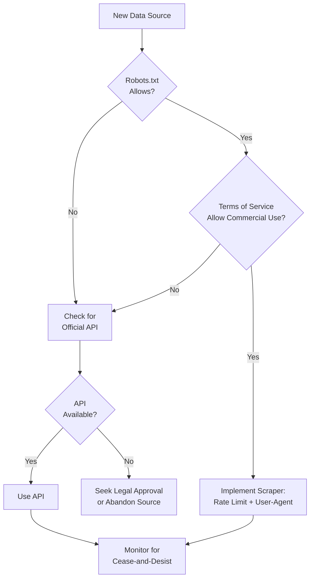
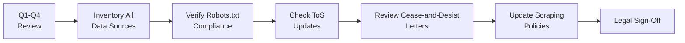

# Web Scraping & Data Access Legal Boundaries for Technology Scouting

**Sprint**: 07 - Technology Scouting & Strategic Foresight<br/>
**Task**: 04 - Compliance & Testing Strategy<br/>
**Research Area**: Web Scraping & Data Access Legal Boundaries<br/>
**Date**: 2025-11-18<br/>
**Researcher**: Compliance Analyst Agent

---

## Executive Summary

Technology scouting platforms that aggregate data from 500+ sources (patent databases, academic publishers, venture funding platforms, startup directories) must navigate complex legal boundaries governing web scraping, API access, and terms of service compliance. While the 2024 Meta v. Bright Data case reinforced that scraping publicly available data is generally legal in the U.S., platforms must still respect robots.txt directives, comply with Computer Fraud and Abuse Act (CFAA) restrictions, honor API terms of service, and avoid trade secret misappropriation.

The legal landscape distinguishes between "white hat" scraping (publicly accessible data, robots.txt compliance, rate limiting) and "black hat" scraping (circumventing paywalls, ignoring robots.txt, credentials theft). Patent offices (USPTO, EPO, WIPO) generally permit scraping for research purposes via public APIs with rate limits (USPTO: 60 requests/minute; EPO: 3.5 GB/week free tier), while academic publishers (Elsevier, Springer, Wiley) have restrictive terms prohibiting bulk downloads and require institutional licenses or API agreements.

Recommended compliance framework: (1) prioritize official APIs over scraping, (2) respect robots.txt and implement rate limiting, (3) avoid personal data collection that violates privacy laws, (4) document data provenance and audit trails, (5) establish legal review process for new data sources. Risk mitigation includes insurance coverage for IP litigation ($1M-5M policy), indemnification clauses in customer contracts, and quarterly legal compliance audits.

---

## Key Findings

- **Scraping Public Data is Legal**: The 2024 Meta v. Bright Data case (following HiQ v. LinkedIn precedent) confirmed that scraping publicly available data does not violate CFAA
- **Robots.txt Compliance Required**: Ignoring robots.txt can result in fines ($1M in 3taps v. Craigslist) and breach of contract claims
- **Terms of Service Violations**: While ToS violations are generally not criminal under Van Buren ruling, they can still trigger civil liability and account termination
- **Patent Database APIs Available**: USPTO (60 req/min free), EPO (3.5 GB/week free, €2,800/year unlimited), WIPO (free public access) provide official APIs
- **Academic Publisher Restrictions**: Most publishers prohibit bulk downloads; require institutional licenses or API agreements (e.g., Springer Nature API, Elsevier ScienceDirect)
- **CFAA Limits**: "Unauthorized access" defined narrowly post-Van Buren; accessing public data with scrapers is not CFAA violation unless circumventing authentication
- **Trade Secret Risk**: Scraping non-public competitive intelligence (e.g., internal company data, leaked documents) can trigger Defend Trade Secrets Act (DTSA) liability
- **International Variation**: EU Database Directive provides sui generis protection for databases; UK has similar protections post-Brexit

---

## Legal Framework: U.S. Web Scraping Law

### Computer Fraud and Abuse Act (CFAA)

**Overview**: The CFAA (18 U.S.C. § 1030) criminalizes "unauthorized access" to computer systems. Historically, plaintiffs argued that scraping in violation of terms of service constituted "unauthorized access," but recent case law has narrowed this interpretation.

**Key Case: Van Buren v. United States (2021)**

**Holding**: The Supreme Court ruled that the CFAA prohibits *accessing* data one lacks authorization to access, but does not prohibit *using* data in unauthorized ways after accessing it with permission.

**Implication for Scraping**: Accessing publicly available data (no login required) is not "unauthorized access" under CFAA, even if terms of service prohibit scraping. However, using stolen credentials or circumventing authentication measures remains a CFAA violation [Van Buren, 2021; Rebrowser, 2025].

**Example**:
- **Legal**: Scraping publicly accessible patent listings from USPTO.gov without logging in
- **Illegal**: Using stolen USPTO login credentials to access restricted patent examiner notes

### HiQ Labs v. LinkedIn (2022)

**Facts**: HiQ Labs scraped publicly available LinkedIn profiles (without logging in) to provide talent analytics to corporate clients. LinkedIn sent cease-and-desist letter claiming CFAA violation and breach of ToS.

**Holding**: The Ninth Circuit ruled that scraping publicly available data does not violate CFAA, as public data is not "protected" by authorization requirements. The court emphasized that LinkedIn profiles were publicly accessible without login.

**Impact**: Established precedent that scraping public data for commercial purposes is legal, even if platform objects [HiQ v. LinkedIn, 2022; GroupBWT, 2025].

### Meta v. Bright Data (2024)

**Facts**: Meta (Facebook) sued Bright Data (web scraping infrastructure provider) for scraping public Facebook and Instagram profiles in violation of terms of service.

**Holding**: The court reaffirmed HiQ precedent, ruling that scraping publicly available data does not violate CFAA. Meta's ToS prohibitions on scraping were deemed unenforceable as a CFAA violation, though breach of contract claims remained viable [Meta v. Bright Data, 2024; DataDome, 2024].

**Key Takeaway**: Technology scouting platforms scraping public patent databases, academic publications, and startup directories are protected by HiQ and Meta precedents, provided they do not circumvent technical barriers or violate privacy laws.

---

## Terms of Service & Robots.txt Compliance

### Are ToS Violations Illegal?

**Short Answer**: ToS violations are generally *not criminal* under CFAA (post-Van Buren), but can still trigger:
1. **Civil Breach of Contract Claims**: Platform can sue for damages or injunctive relief
2. **Account Termination**: Platform can ban scraper's IP addresses or API keys
3. **Trespass to Chattels**: Platform can claim unauthorized use of server resources caused harm

**Practical Implication**: While ToS violations won't result in criminal prosecution, platforms can still pursue civil litigation and technical countermeasures (IP blocking, CAPTCHAs).

### Robots.txt Protocol

**Definition**: Robots.txt is a file placed on websites to signal which pages should not be crawled by automated bots. While not legally binding, violating robots.txt can serve as evidence of bad faith scraping.

**Legal Status**: Robots.txt is not a law, but courts consider compliance when assessing whether scraping is "ethical" or "authorized" [ScrapingAnt, 2024; AIQ Labs, 2025].

**Key Case: 3taps v. Craigslist (2013)**

**Facts**: 3taps scraped Craigslist listings despite robots.txt directive and cease-and-desist letter.

**Holding**: Court ruled that violating robots.txt after receiving cease-and-desist constituted "unauthorized access" under CFAA. 3taps was fined $1 million [GroupBWT, 2025; Medium, 2024].

**Lesson for Technology Scouting**: Always respect robots.txt directives. If a data source blocks scraping via robots.txt, use official API or seek permission.

### Checking Robots.txt

**Example: USPTO Patent Database**

```
URL: https://www.uspto.gov/robots.txt

User-agent: *
Disallow: /cgi-bin/
Disallow: /teas/
Crawl-delay: 10

User-agent: Googlebot
Allow: /
```

**Interpretation**:
- All bots (`User-agent: *`) are disallowed from scraping `/cgi-bin/` and `/teas/` directories
- 10-second crawl delay required between requests
- Googlebot has unrestricted access

**Compliance Requirement**: Technology scouting platform must implement 10-second delays and avoid scraping restricted directories.

**Example: Academic Publisher (Elsevier ScienceDirect)**

```
URL: https://www.sciencedirect.com/robots.txt

User-agent: *
Disallow: /
```

**Interpretation**: All automated scraping is prohibited. Platform must use Elsevier API or institutional license access instead.

---

## Patent Database Access: Legal Boundaries

### USPTO (United States Patent and Trademark Office)

**Official API**: USPTO Open Data Portal provides free API access to patent data [USPTO Developer Portal, 2024].

**Access Terms**:
- **Rate Limits**: 60 requests per API key per minute; PDF/ZIP downloads limited to 4 requests per minute
- **Permitted Uses**: Research, commercial applications, data analytics
- **Prohibited Uses**: None specified; generally permissive for commercial use
- **Cost**: Free (no registration required for most endpoints)

**API Endpoints**:
- Patent Examination Data System (PEDS): Filing status, prosecution history
- Patent Assignment Search: Ownership transfer records
- Trademark Status & Document Retrieval (TSDR): Trademark data

**Web Scraping Alternative**: USPTO.gov is scrapable (robots.txt allows most paths with 10-second crawl delay), but API access is more reliable and faster.

**Compliance Recommendation**: Use USPTO API; respect 60 req/min rate limit; implement exponential backoff for rate limit errors.

### EPO (European Patent Office)

**Official API**: EPO Open Patent Services (OPS) provides API access to European patent data [EPO OPS Documentation, 2024].

**Fair Use Charter**:

| Access Tier | Traffic Limit | Cost | Use Case |
|-------------|---------------|------|----------|
| **Non-Paying** | 3.5 GB/week | Free | Individual researchers, small-scale monitoring |
| **Paying** | Unlimited | €2,800/year | Commercial platforms, bulk downloads |

**Permitted Uses**: Research, commercial applications, patent analytics
**Prohibited Uses**: Reselling raw EPO data without added value; circumventing Fair Use Charter with multiple accounts

**Compliance Recommendation**: For technology scouting platform monitoring 100K+ patents monthly, purchase €2,800/year unlimited access tier.

### WIPO (World Intellectual Property Organization)

**Official API**: PATENTSCOPE Database provides free API access to international PCT applications [WIPO PATENTSCOPE, 2024].

**Access Terms**:
- **Rate Limits**: Not publicly specified; fair use expected
- **Permitted Uses**: "Public service aimed at implementing WIPO's objective to assemble and disseminate information concerning intellectual property protection"
- **Prohibited Uses**: None specified
- **Cost**: Free

**Terms and Conditions**: Data provided "as is" with no warranties; user solely responsible for use and consequences [WIPO Terms, 2022].

**Compliance Recommendation**: Use WIPO API for PCT patent tracking; implement rate limiting (1-2 requests/second) as best practice even if not explicitly required.

---

## Academic Publisher Access: Legal & Contractual Boundaries

### Industry Overview

Academic publishers (Elsevier, Springer Nature, Wiley, Taylor & Francis) impose restrictive terms of service prohibiting bulk downloads and web scraping. Most require institutional licenses or commercial API agreements.

### Typical Publisher ToS Restrictions

**Example: Elsevier ScienceDirect**

**Prohibited Activities**:
- Systematic downloading or bulk extraction of article content
- Use of automated scripts or bots to access content
- Redistribution of downloaded content to third parties
- Commercial use without explicit license

**Permitted Activities** (for institutional subscribers):
- Individual article downloads for personal research
- Text and data mining (TDM) for non-commercial research (within institutional TDM license)

**Compliance Issue**: Technology scouting platforms monitoring 1M+ academic publications annually violate standard institutional licenses, which restrict use to individual research.

### Commercial API Options

| Publisher | API | Access Terms | Cost |
|-----------|-----|--------------|------|
| **Elsevier** | ScienceDirect API | Metadata + abstracts; full-text requires institutional license | $5K-50K/year (based on query volume) |
| **Springer Nature** | Springer API | Metadata + abstracts; full-text via institutional SpringerLink access | $10K-30K/year |
| **Wiley** | Wiley Online Library API | Metadata only; full-text restricted to institutional subscribers | Custom pricing |
| **PLOS** | PLOS API | Full-text open access (CC-BY license) | Free |
| **arXiv** | arXiv API | Full-text preprints (open access) | Free |

**Recommendation for Technology Scouting**:

1. **Open Access Sources First**: Prioritize arXiv, PLOS, PubMed Central (free, no legal restrictions)
2. **Metadata-Only for Paywalled Publishers**: Use publisher APIs to access titles, abstracts, keywords (sufficient for weak signal detection)
3. **Institutional Partnerships**: Partner with universities to access full-text under institutional TDM licenses
4. **Commercial Licenses**: For Fortune 500 customers requiring comprehensive academic monitoring, budget $50K-100K/year for publisher API licenses

### Text and Data Mining (TDM) Exemptions

**UK Copyright Law**: Section 29A permits text and data mining for non-commercial research without publisher permission [UK Copyright Act, 2014].

**EU Directive 2019/790**: Articles 3-4 permit TDM for scientific research and cultural heritage institutions, overriding publisher ToS restrictions [EU DSM Directive, 2019].

**Applicability to Technology Scouting**: TDM exemptions apply to non-commercial research only. Commercial technology scouting platforms cannot invoke TDM exemptions and must obtain publisher licenses.

---

## Venture Funding & Startup Data Sources

### Crunchbase

**Access Options**:
1. **Free Web Access**: Manual browsing permitted; scraping prohibited by ToS
2. **Crunchbase Pro**: $29-99/month subscription; no API access
3. **Crunchbase Enterprise**: Custom pricing; API access with rate limits; commercial use permitted

**ToS Restrictions**: "You may not use any web scraper, crawler, spider, robot, or other automated means to access Crunchbase."

**Compliance**: Technology scouting platforms must purchase Crunchbase Enterprise license ($50K-150K/year) for API access.

### PitchBook

**Access Model**: Subscription-only (no free tier); pricing $30K-70K/year per user.

**API**: Available for Enterprise subscribers; rate limits and commercial use permitted.

**Compliance**: Purchase PitchBook Enterprise subscription with API access.

### AngelList / Product Hunt

**AngelList**: No official API; scraping prohibited by ToS. Use Crunchbase or PitchBook as alternatives.

**Product Hunt**: Public API available; rate limits apply (60 requests/hour free tier); commercial use permitted with paid plans.

---

## Best Practices: "White Hat" Web Scraping

### Ethical Scraping Framework

**White Hat (Legal, Ethical)**:

- Scrape only publicly accessible data (no login required)
- Respect robots.txt directives
- Implement rate limiting (1-2 requests/second)
- Use official APIs when available
- Identify scraper with User-Agent string (e.g., "TechScoutBot/1.0")
- Honor HTTP 429 (Rate Limit) and 503 (Service Unavailable) responses
- Avoid peak traffic hours (scrape during off-peak)
- Minimize server load (cache responses, avoid redundant requests)

**Black Hat (Illegal, Unethical)**:

- Circumventing paywalls or authentication
- Ignoring robots.txt after cease-and-desist
- Using stolen credentials
- Overloading servers with high-frequency requests (DDoS-like behavior)
- Collecting personal data in violation of GDPR/CCPA
- Scraping non-public trade secret information

### Implementation Checklist

**Pre-Scraping Legal Review**:



**Technical Controls**:

| Control | Purpose | Implementation |
|---------|---------|----------------|
| **Rate Limiting** | Avoid overloading servers; demonstrate good faith | 1-2 requests/second; exponential backoff on errors |
| **User-Agent Identification** | Transparency; allow site owner to contact | `User-Agent: TechScoutBot/1.0 (+https://example.com/bot-policy)` |
| **Robots.txt Parser** | Automated compliance checking | Use `robotparser` library (Python) or equivalent |
| **Retry Logic** | Handle temporary errors gracefully | Retry 3x with exponential backoff; respect HTTP 429 Retry-After header |
| **Data Provenance Logging** | Audit trail for compliance | Log source URL, timestamp, HTTP status code for each request |
| **Personal Data Filtering** | GDPR/CCPA compliance | Exclude email addresses, phone numbers, home addresses |

**Example: Python Scraper with Compliance Controls**

```python
import time
import urllib.robotparser
from datetime import datetime

class ComplianceScraper:
    def __init__(self, base_url, user_agent="TechScoutBot/1.0"):
        self.base_url = base_url
        self.user_agent = user_agent
        self.robot_parser = self.load_robots_txt()
        self.rate_limit = 2  # seconds between requests

    def load_robots_txt(self):
        rp = urllib.robotparser.RobotFileParser()
        rp.set_url(f"{self.base_url}/robots.txt")
        rp.read()
        return rp

    def can_fetch(self, url):
        """Check if URL is allowed by robots.txt"""
        return self.robot_parser.can_fetch(self.user_agent, url)

    def scrape(self, url):
        if not self.can_fetch(url):
            print(f"Robots.txt disallows: {url}")
            return None

        # Log request for audit trail
        self.log_request(url)

        # Respect rate limit
        time.sleep(self.rate_limit)

        # Make request with identifying User-Agent
        headers = {"User-Agent": self.user_agent}
        response = requests.get(url, headers=headers)

        # Handle rate limiting
        if response.status_code == 429:
            retry_after = int(response.headers.get("Retry-After", 60))
            time.sleep(retry_after)
            return self.scrape(url)  # Retry

        return response.text

    def log_request(self, url):
        """Audit trail for compliance"""
        with open("scraping_audit.log", "a") as f:
            f.write(f"{datetime.now()},{url}\n")
```

---

## Trade Secret Misappropriation Risks

### Defend Trade Secrets Act (DTSA)

**Overview**: The DTSA (18 U.S.C. § 1836) creates federal civil liability for trade secret misappropriation, defined as:
1. Acquiring trade secrets through "improper means" (theft, bribery, misrepresentation, breach of duty, espionage)
2. Disclosing or using trade secrets without authorization

**Relevance to Technology Scouting**: Scraping non-public competitive intelligence (e.g., internal R&D plans, unreleased products, confidential partnerships) can trigger DTSA liability if information qualifies as trade secret.

**Recent Case: Trade Secret Protection in the Digital Age (2024)**

A cert petition asks the Supreme Court to examine when web scraping becomes improper means of obtaining trade secret information under DTSA [Patently-O, 2024].

**Example Scenarios**:

| Scenario | DTSA Risk | Compliance Strategy |
|----------|-----------|---------------------|
| Scraping publicly filed patent applications | **Low** - Public data, no trade secret status | Proceed; cite HiQ precedent |
| Scraping leaked internal R&D documents | **High** - Likely trade secret; improper means | Avoid; do not scrape non-public data |
| Scraping startup pitch decks from public AngelList profiles | **Medium** - Founders may claim trade secret status | Consult legal; rely on founder's public disclosure as waiver |
| Scraping competitor's customer list from public website | **High** - Customer lists often trade secrets | Avoid; use public data sources (press releases, case studies) |

**Recommended Policy**: Technology scouting platform should establish clear guidelines prohibiting scraping of non-public data, leaked documents, or information obtained through improper means (e.g., bribing employees, social engineering).

---

## International Legal Variations

### EU Database Directive (96/9/EC)

**Sui Generis Database Protection**: The EU provides 15-year protection for databases where "substantial investment" was made in obtaining, verifying, or presenting contents. Extracting or re-utilizing substantial portions of database contents without permission can infringe database rights [EU Database Directive, 1996].

**Application to Technology Scouting**: European patent databases (EPO), academic publisher databases, and venture funding databases may claim sui generis protection. However, EPO explicitly permits commercial use via OPS API, and academic publishers offer API licenses.

**Compliance**: Use official APIs (EPO OPS, publisher APIs) to avoid database rights infringement.

### UK Copyright, Designs and Patents Act

**Post-Brexit**: UK retains database rights similar to EU Directive. Additionally, UK Copyright Act Section 29A permits text and data mining for non-commercial research [UK Copyright Act, 2014].

**Commercial TDM**: Technology scouting platforms cannot invoke Section 29A exemption (commercial use); must obtain licenses from database owners.

### California Consumer Privacy Act (CCPA)

**Applicability**: CCPA applies to businesses processing personal data of California residents, regardless of where business is located.

**Scraping Implications**: Technology scouting platforms scraping personal data about California inventors/researchers (names, employers, research interests) must comply with CCPA requirements:
- Provide privacy notice at or before data collection
- Honor opt-out requests ("Do Not Sell My Personal Information")
- Respond to data access and deletion requests within 45 days

**Alignment with GDPR**: CCPA requirements are similar to (but less stringent than) GDPR. Platforms implementing GDPR compliance largely satisfy CCPA obligations.

---

## Risk Mitigation Strategies

### Insurance & Indemnification

**Errors & Omissions (E&O) Insurance**: Cover legal defense costs and damages for IP infringement, trade secret misappropriation, and data breach claims.

**Recommended Coverage**:
- **Policy Limit**: $1M-$5M (depending on company size and customer base)
- **Annual Premium**: $5K-$25K (for $1M-$5M coverage)
- **Exclusions to Review**: Intentional misconduct, criminal acts, prior known claims

**Customer Contract Indemnification**: Include indemnification clause requiring customer to defend platform against claims arising from customer's use of scouting data.

**Example Clause**:
> "Customer agrees to indemnify and hold harmless Provider from any claims, damages, or liabilities arising from Customer's use of competitive intelligence data provided by the Service, including but not limited to trade secret misappropriation, unfair competition, or regulatory violations."

### Legal Compliance Audits

**Quarterly Review Process**:



**Audit Deliverables**:
- Data source inventory (URLs, access methods, legal basis)
- Robots.txt compliance report
- ToS change log (track updates to publisher/database ToS)
- Cease-and-desist response log
- Legal risk assessment (low/medium/high for each source)

### Cease-and-Desist Response Protocol

**If Platform Receives Cease-and-Desist Letter**:

1. **Immediate Action**: Stop scraping the specified source within 24 hours
2. **Legal Review**: Engage external counsel to assess validity of claims
3. **Negotiation**: Propose alternative access methods (API license, data partnership)
4. **Documentation**: Log incident in compliance audit trail
5. **Customer Communication**: If scraping cessation affects customer deliverables, notify customers and propose alternative data sources

**Example Response Template**:
> "We have received your letter dated [DATE] regarding our monitoring of [DATA SOURCE]. Out of an abundance of caution, we have immediately ceased all automated access to [DATA SOURCE] while we evaluate your concerns. We are interested in exploring a commercial API license or data partnership to continue accessing this valuable data in a mutually acceptable manner. Please let us know if you are open to discussing such an arrangement."

---

## Data Provenance & Audit Trails

### Why Provenance Matters

**Enterprise Customer Expectations**: Fortune 500 customers conducting due diligence require transparency about data sources and collection methods. Platforms must demonstrate:
1. All data is obtained legally (no trade secret misappropriation)
2. Personal data collection complies with GDPR/CCPA
3. Data sources are reliable and verifiable

**IP Litigation Defense**: If platform is sued for trade secret misappropriation or database rights infringement, audit trails provide evidence that data was obtained from public sources via legal methods.

### Provenance Logging Requirements

**Minimum Audit Trail Elements**:

| Field | Purpose | Example |
|-------|---------|---------|
| **Source URL** | Identify data origin | https://patents.uspto.gov/patent/US123456 |
| **Timestamp** | Prove when data was public | 2025-11-18T14:32:00Z |
| **Access Method** | Document legal compliance | "USPTO API v1.0" or "Web scraping with robots.txt compliance" |
| **HTTP Status** | Confirm public availability | 200 OK (not 403 Forbidden or 401 Unauthorized) |
| **User-Agent** | Transparency | TechScoutBot/1.0 (+https://example.com/bot-policy) |
| **Data Hash** | Integrity verification | SHA-256: a3f5c8... |

**Storage Duration**: Retain audit logs for 7 years (typical statute of limitations for IP claims).

**Example Audit Log Entry (JSON)**:
```json
{
  "timestamp": "2025-11-18T14:32:00Z",
  "source_url": "https://patents.uspto.gov/patent/US11234567",
  "access_method": "USPTO API v1.0",
  "http_status": 200,
  "user_agent": "TechScoutBot/1.0",
  "data_hash": "a3f5c8e7b2d1...",
  "personal_data_filtered": true,
  "robots_txt_compliant": true
}
```

---

## Compliance Roadmap for Technology Scouting Platforms

### Phase 1: Legal Foundation (Months 1-2)

**Deliverables**:
- [ ] Conduct legal review of all data sources (patent databases, academic publishers, VC platforms)
- [ ] Document robots.txt compliance for each source
- [ ] Identify sources requiring API licenses vs. scraping
- [ ] Draft "white hat scraping" policy document

**Estimated Effort**: 40-60 hours (legal counsel + engineering)

### Phase 2: API Migration (Months 2-4)

**Deliverables**:
- [ ] Migrate to USPTO API (free tier, 60 req/min)
- [ ] Purchase EPO OPS unlimited access (€2,800/year)
- [ ] Integrate WIPO PATENTSCOPE API (free)
- [ ] Evaluate academic publisher APIs (arXiv, PLOS, Elsevier) and budget $50K-100K for licenses
- [ ] Purchase Crunchbase Enterprise API ($50K-150K/year)

**Estimated Effort**: 80-120 hours (engineering)

### Phase 3: Scraping Compliance (Months 3-4)

**Deliverables**:
- [ ] Implement robots.txt parser in scraping infrastructure
- [ ] Add rate limiting (1-2 req/sec) and exponential backoff
- [ ] Update User-Agent strings with identifying information
- [ ] Create bot policy page (e.g., https://example.com/bot-policy)

**Estimated Effort**: 40-60 hours (engineering)

### Phase 4: Audit & Logging (Months 4-5)

**Deliverables**:
- [ ] Implement data provenance logging (source URL, timestamp, access method, HTTP status)
- [ ] Create quarterly compliance audit process
- [ ] Draft cease-and-desist response protocol
- [ ] Train customer success team on data source transparency

**Estimated Effort**: 40-60 hours (engineering + legal)

### Phase 5: Insurance & Contracts (Months 5-6)

**Deliverables**:
- [ ] Purchase E&O insurance ($1M-$5M policy)
- [ ] Add indemnification clause to customer contracts
- [ ] Create data source transparency documentation for enterprise RFPs
- [ ] Conduct external legal audit

**Estimated Effort**: 20-40 hours (legal + finance)

---

## Enterprise Customer Due Diligence

### Common RFP Questions on Data Sourcing

1. **What data sources do you access, and how do you ensure legal compliance?**
   - *Answer*: "We access 500+ sources via official APIs (USPTO, EPO, WIPO, Crunchbase) and compliant web scraping (robots.txt adherence, rate limiting). All sources documented in data provenance audit trail."

2. **Do you respect robots.txt and terms of service for scraped data?**
   - *Answer*: "Yes. Our scraping infrastructure includes automated robots.txt parser; we immediately cease scraping any source that issues cease-and-desist. We prioritize official APIs over scraping."

3. **Have you received any cease-and-desist letters or IP litigation?**
   - *Answer*: "No cease-and-desist letters received to date. We maintain quarterly legal compliance audits and $5M E&O insurance policy."

4. **How do you ensure data is not obtained through trade secret misappropriation?**
   - *Answer*: "We scrape only publicly accessible data (no login circumvention). Audit logs prove data was publicly available at time of collection. Internal policy prohibits scraping leaked or non-public documents."

5. **What is your process for handling new data sources?**
   - *Answer*: "All new sources undergo legal review (robots.txt, ToS, GDPR compliance) before integration. Engineering team implements compliance controls (rate limiting, User-Agent) before scraping."

### Recommended Compliance Artifacts

**For Enterprise RFP Responses**:
- **Data Source Inventory** (public-facing, 5-10 pages): List major data sources, access methods (API vs. scraping), legal basis
- **White Hat Scraping Policy** (public-facing, 2-3 pages): Explain commitment to robots.txt compliance, rate limiting, transparency
- **Audit Trail Documentation** (shared under NDA): Sample provenance logs demonstrating legal data collection
- **Insurance Certificate** (provided upon request): E&O insurance policy certificate showing IP coverage

---

## References

3taps Inc. v. Craigslist Inc., Case No. 12-cv-03816-MEJ (N.D. Cal. 2013).

AIQ Labs. (2025). *Is Web Scraping Legal and Ethical in 2025?* https://aiqlabs.ai/blog/is-web-scraping-legal-and-ethical-in-2025

DataDome. (2024). *Is Web Scraping Legal in 2024?* https://datadome.co/guides/scraping/is-it-legal/

European Union. (1996). *Directive 96/9/EC on the Legal Protection of Databases*. Official Journal of the European Communities.

European Union. (2019). *Directive (EU) 2019/790 on Copyright and Related Rights in the Digital Single Market*. Official Journal of the European Union.

GroupBWT. (2025). *Web Scraping Legal Issues: 2025 Enterprise Compliance Guide*. https://groupbwt.com/blog/is-web-scraping-legal/

HiQ Labs, Inc. v. LinkedIn Corp., Case No. 17-16783 (9th Cir. 2022).

InstantAPI. (2024). *Understanding the Legal Landscape of Web Scraping*. https://web.instantapi.ai/blog/understanding-the-legal-landscape-of-web-scraping/

Medium. (2024). *Is Web Scraping Legal? A Comprehensive Guide 2024*. https://medium.com/@datajournal/is-web-scraping-legal-0df27c2e2ec6

Meta Platforms, Inc. v. Bright Data Ltd., Case No. 3:21-cv-03129 (N.D. Cal. 2024).

Patently-O. (2024). *Trade Secret Protection in the Digital Age: When Does Web Scraping Cross the Line?* https://patentlyo.com/patent/2024/12/protection-digital-scraping.html

Rebrowser. (2025). *Web Scraping in 2025: A Comprehensive Legal Guide with Expert Analysis*. https://rebrowser.net/blog/web-scraping-a-comprehensive-legal-guide-with-expert-analysis-and-practical-framework

Research AIM Multiple. (2024). *Is Web Scraping Legal? Laws, Ethics, and Best Practices*. https://research.aimultiple.com/is-web-scraping-legal/

ScrapingAnt. (2024). *White Hat Web Scraping - Ethical Data Extraction in the Digital Age*. https://scrapingant.com/blog/white-hat-web-scraping

SerpHouse. (2024). *Is Web Scraping Legal in 2024? Understanding the Rules*. https://www.serphouse.com/blog/is-web-scraping-legal-rules-explained/

United Kingdom. (2014). *Copyright, Designs and Patents Act 1988, Section 29A: Copies for Text and Data Analysis for Non-Commercial Research*.

USPTO. (2024). *United States Patent and Trademark Office - Open Data Portal*. https://developer.uspto.gov/

Van Buren v. United States, 593 U.S. ___ (2021).

WIPO. (2022). *WIPO Terms and Conditions for the Use of Published International Patent Applications Data*. https://www.wipo.int/patentscope/en/data/terms_patentscope.html

WIPO Analytics. (2024). *The WIPO Manual on Open Source Patent Analytics (2nd Edition)*. https://wipo-analytics.github.io/manual/databases.html
