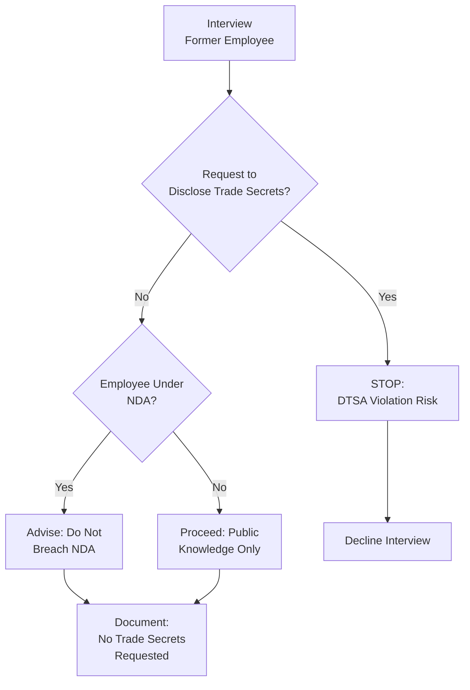

# Intellectual Property Protection & Competitive Intelligence Legal Boundaries

**Sprint**: 07 - Technology Scouting & Strategic Foresight 
**Task**: 04 - Compliance & Testing Strategy 
**Research Area**: Intellectual Property Protection & Competitive Intelligence 
**Date**: 2025-11-18 
**Researcher**: Compliance Analyst Agent

---

## Executive Summary

Technology scouting platforms operating in the competitive intelligence domain must navigate the fine line between legal, ethical information gathering and illegal industrial espionage or trade secret misappropriation. The Strategic and Competitive Intelligence Professionals (SCIP) Code of Ethics establishes that competitive intelligence must use only legal and ethical means, relying on publicly available sources while avoiding bribery, social engineering, or obtaining confidential information through improper means.

U.S. law distinguishes sharply between ethical competitive intelligence (analyzing public patents, publications, conferences, financial reports) and economic espionage (stealing trade secrets, bribing employees, cyber intrusion). The Economic Espionage Act (1996) and Defend Trade Secrets Act (2016) criminalize and create civil liability for trade secret misappropriation, with penalties reaching $5 million per violation and 15 years imprisonment for individuals. Industrial espionage costs the U.S. economy an estimated $500 billion annually (3% of GDP).

For technology scouting platforms, recommended safeguards include: (1) establishing "public sources only" policy prohibiting non-public data access, (2) implementing employee training on SCIP ethics and DTSA compliance, (3) requiring legal review for gray-area intelligence (e.g., former employee interviews, reverse engineering), (4) documenting data provenance to prove public accessibility, (5) including IP indemnification clauses in customer contracts. Non-disclosure agreements (NDAs) should protect platform's own proprietary algorithms and customer data while avoiding collection of competitor trade secrets that could trigger misappropriation liability.

---

## Key Findings

- **Legal vs. Illegal Intelligence Gathering**: Ethical competitive intelligence uses publicly available sources (patents, publications, conferences); industrial espionage uses improper means (theft, bribery, hacking)
- **Trade Secret Definition**: Confidential information providing competitive advantage; must have economic value and be subject to reasonable secrecy efforts (DTSA, 18 U.S.C. § 1836)
- **Economic Impact**: Industrial espionage costs U.S. economy ~$500 billion annually; 3% of GDP lost to trade secret theft
- **Criminal Penalties**: Economic Espionage Act authorizes up to 15 years imprisonment and $5 million fines for individuals; $10 million for organizations
- **Civil Remedies**: Defend Trade Secrets Act (2016) provides federal civil cause of action; plaintiffs can seek injunctions, damages, and attorney's fees
- **SCIP Ethics Framework**: Strategic and Competitive Intelligence Professionals establish industry standards prohibiting deception, misrepresentation, and unauthorized access
- **Gray Area Risks**: Interviewing competitor's former employees, reverse engineering products, attending trade shows under false identity can trigger legal liability if mishandled
- **IP Protection for Platform**: Technology scouting platforms must protect proprietary weak signal detection algorithms, customer data, and competitive insights with NDAs, trade secret policies

---

## Ethical Competitive Intelligence: SCIP Framework

### What is Competitive Intelligence?

**Definition**: "The legal and ethical process of gathering, analyzing, and disseminating information about competitors, customers, and market environment to support strategic decision-making" [SCIP, 2024].

**Key Characteristics**:
- **Legal**: Complies with laws governing data access, privacy, and intellectual property
- **Ethical**: Adheres to professional standards prohibiting deception and misrepresentation
- **Analytical**: Focuses on synthesis and insight generation, not raw data collection
- **Public Sources**: Relies on information available to anyone (websites, patents, conferences, financial reports)

**Distinction from Industrial Espionage**: Competitive intelligence uses publicly available information and ethical methods; industrial espionage employs illegal or unethical means (theft, bribery, hacking) to obtain confidential information [Watch My Competitor, 2024; Klue, 2024].

### SCIP Code of Ethics

The Strategic and Competitive Intelligence Professionals (SCIP) organization establishes ethical guidelines for practitioners:

**Core Principles**:

1. **Truthfulness**: Do not misrepresent identity or purpose when gathering information
2. **Legality**: Comply with all applicable laws governing data access and privacy
3. **Transparency**: Disclose affiliations when interviewing sources or attending events
4. **Confidentiality**: Respect confidential information and do not disclose without authorization
5. **Integrity**: Refuse to participate in or condone illegal or unethical intelligence gathering

**Prohibited Activities** (per SCIP):
- Misrepresenting identity to obtain information (pretexting)
- Bribing competitors' employees for confidential information
- Obtaining trade secrets through theft, deception, or breach of duty
- Hacking or unauthorized access to computer systems
- Economic espionage or industrial spying

**Permitted Activities**:
- Analyzing publicly available patents, academic publications, conference proceedings
- Attending trade shows and industry conferences (with proper identification)
- Monitoring competitor websites, press releases, financial reports
- Interviewing former employees (provided they do not disclose trade secrets)
- Reverse engineering publicly available products (where legal)

---

## Trade Secrets: Legal Definition & Protection

### What Qualifies as a Trade Secret?

**Legal Definition (DTSA, 18 U.S.C. § 1839)**:

A trade secret is information that:
1. **Derives economic value** (actual or potential) from not being generally known or readily ascertainable by others who could obtain economic value from its disclosure or use
2. **Is subject to reasonable efforts** to maintain its secrecy

**Examples of Trade Secrets**:
- Formulas (e.g., Coca-Cola recipe, pharmaceutical compounds)
- Manufacturing processes (e.g., semiconductor fabrication techniques)
- Customer lists and pricing strategies
- R&D plans and unreleased product roadmaps
- Proprietary algorithms and software source code
- Business strategies and competitive analysis

**Not Trade Secrets** (Generally Public Information):
- Published patents (publicly disclosed by definition)
- Academic research papers (published for dissemination)
- Information disclosed in public filings (SEC reports, FDA submissions)
- Product features observable through reverse engineering
- General industry knowledge and skills

### Defend Trade Secrets Act (DTSA)

**Overview**: The DTSA, signed into law in 2016, created the first federal civil cause of action for trade secret misappropriation. Previously, trade secret claims were limited to state courts under the Uniform Trade Secrets Act (UTSA).

**Key Provisions**:

**Misappropriation Defined (§ 1839(5))**:
1. **Acquisition** by improper means (theft, bribery, misrepresentation, breach of duty, espionage, electronic intrusion)
2. **Disclosure or Use** without authorization by someone who:
   - Acquired it through improper means
   - Knew or should have known it was obtained improperly
   - Owed a duty to maintain secrecy (e.g., employee under NDA)

**Remedies (§ 1836)**:
- **Injunctive Relief**: Court orders to prevent further disclosure or use
- **Damages**: Actual losses suffered by plaintiff + unjust enrichment gained by defendant
- **Exemplary Damages**: Up to 2x actual damages for willful and malicious misappropriation
- **Attorney's Fees**: Awarded to prevailing party if misappropriation was willful or bad faith

**Statute of Limitations**: 3 years from discovery of misappropriation (§ 1836(d))

### Economic Espionage Act (EEA)

**Overview**: The EEA (18 U.S.C. § 1831-1839), enacted in 1996, criminalizes trade secret theft with two distinct offenses:

**Section 1831: Economic Espionage** (Benefit of Foreign Government)
- **Conduct**: Theft or misappropriation of trade secrets to benefit foreign government, instrumentality, or agent
- **Penalties**: Up to 15 years imprisonment; fines up to $5 million (individuals) or $10 million (organizations)

**Section 1832: Theft of Trade Secrets** (Commercial Benefit)
- **Conduct**: Theft or misappropriation of trade secrets for commercial advantage
- **Penalties**: Up to 10 years imprisonment; fines up to $5 million (individuals) or $10 million (organizations)

**Improper Means (§ 1839(6))**:
- Theft, bribery, misrepresentation, breach or inducement of breach of duty to maintain secrecy
- Espionage through electronic or other means

**Example Prosecution**: In 2019, a former Apple engineer was charged under EEA for stealing autonomous vehicle trade secrets before fleeing to China [DOJ, 2019].

---

## Technology Scouting: Legal vs. Illegal Intelligence Gathering

### Legal Methods (Ethical Competitive Intelligence)

Technology scouting platforms may **legally** gather intelligence using these methods:

| Method | Description | Legal Basis | Example |
|--------|-------------|-------------|---------|
| **Patent Analysis** | Monitoring USPTO, EPO, WIPO patent filings | Publicly available government data | Tracking quantum computing patents to identify emerging startups |
| **Academic Publications** | Analyzing papers, conference proceedings, dissertations | Public research dissemination | Monitoring arXiv for AI/ML breakthroughs |
| **Venture Funding Data** | Tracking VC investments via Crunchbase, PitchBook | Publicly reported funding rounds | Identifying Series A biotech startups as acquisition targets |
| **Trade Show Attendance** | Attending industry conferences, product demonstrations | Public events (with proper registration) | Attending CES to observe competitor product launches |
| **Financial Reports** | Analyzing SEC filings, earnings calls, annual reports | Public disclosure requirements | Reviewing 10-K filings to identify R&D budget trends |
| **Press Releases & News** | Monitoring competitor announcements, media coverage | Public communications | Tracking partnership announcements to map ecosystem |
| **Social Media** | Analyzing LinkedIn, Twitter, GitHub for talent signals | Publicly shared information | Identifying key engineers moving from academia to startups |
| **Reverse Engineering** | Disassembling publicly purchased products (where legal) | Purchased product; no trade secret if observable | Analyzing competitor's hardware to identify component suppliers |

**Key Principle**: All methods rely on **publicly available** information accessible to any interested party without improper means.

### Illegal Methods (Industrial Espionage)

Technology scouting platforms must **NEVER** engage in these activities:

| Method | Why Illegal | Statute Violated | Potential Penalty |
|--------|-------------|------------------|-------------------|
| **Bribing Employees** | Inducing breach of confidentiality duty | DTSA, EEA | Civil damages + criminal prosecution (10-15 years) |
| **Hacking / Cyber Intrusion** | Unauthorized access to computer systems | CFAA, EEA | $500K+ fines, 10-15 years imprisonment |
| **Theft of Documents** | Physically stealing confidential materials | EEA, state larceny laws | 10-15 years imprisonment |
| **Social Engineering** | Pretexting (lying about identity) to obtain secrets | DTSA (improper means) | Civil liability, reputational damage |
| **Dumpster Diving** | Searching trash for confidential documents (if protected) | DTSA if documents are trade secrets | Civil liability (injunction, damages) |
| **Hiring for Secrets** | Recruiting competitor employees specifically to extract trade secrets | DTSA (inducement of breach) | Injunction, 2x damages (willful) |
| **Wiretapping / Eavesdropping** | Recording private conversations without consent | Federal Wiretap Act | Criminal prosecution, civil damages |

**Real-World Example: Uber v. Waymo (2017)**

Waymo (Google self-driving car unit) sued Uber for trade secret misappropriation, alleging that former Waymo engineer Anthony Levandowski stole 14,000 confidential files before joining Uber's autonomous vehicle team. Uber settled for $245 million and agreed not to use Waymo technology [Ars Technica, 2018].

**Lesson**: Hiring competitor employees is legal; hiring them specifically to obtain trade secrets is DTSA violation.

---

## Gray Areas: High-Risk Intelligence Activities

### Former Employee Interviews

**Scenario**: Technology scouting platform interviews former employees of competitor to understand product roadmap.

**Legal Risk**: **Medium-High**

**Analysis**:
- **Legal**: Former employees may share general knowledge, skills, and publicly known information
- **Illegal**: Former employees may **not** disclose trade secrets learned during employment, even if they left the company

**DTSA Consideration**: Knowingly soliciting trade secrets from former employee who owes continuing duty of confidentiality constitutes misappropriation (§ 1836(b)(3)(A)).

**Recommended Approach**:

**Best Practice**:
1. Begin interview with disclaimer: "Please do not disclose any confidential or proprietary information from your former employer."
2. Focus on publicly observable trends, general industry knowledge, and non-confidential experiences
3. If employee offers trade secret information, **decline** and document refusal
4. Consult legal counsel before conducting interviews with employees from highly sensitive roles (e.g., R&D, engineering)

**Example Language**:
> "Thank you for agreeing to speak with us. Before we begin, I want to emphasize that we are only interested in publicly available information and your general industry knowledge. Please do not disclose any confidential, proprietary, or trade secret information from [Former Employer]. If I ask a question that you believe would require disclosing such information, please let me know and we will move to a different topic."

### Reverse Engineering

**Scenario**: Technology scouting platform purchases competitor's product and disassembles it to identify component suppliers and manufacturing techniques.

**Legal Risk**: **Low-Medium** (depends on jurisdiction and product type)

**Analysis**:
- **Generally Legal**: Reverse engineering publicly purchased products is permitted in most U.S. jurisdictions, provided no license agreement prohibits it
- **Exceptions**:
  - **Software**: Digital Millennium Copyright Act (DMCA) prohibits circumventing technical protection measures (e.g., encryption, copy protection)
  - **Patented Products**: Reverse engineering does not excuse patent infringement (but can inform design-around strategies)
  - **License Restrictions**: If product is sold with "no reverse engineering" clause in license (e.g., software EULA), reverse engineering may breach contract

**Recommended Approach**:

1. **Check License Terms**: Review end-user license agreement (EULA) or terms of sale for reverse engineering prohibitions
2. **Clean Room Analysis**: If license prohibits reverse engineering, consider "clean room" approach (one team analyzes product, separate team designs based on functionality without seeing internals)
3. **Patent Research First**: Before reverse engineering, check if product features are already disclosed in public patents (easier and lower-risk than disassembly)

**Example: Semiconductor Reverse Engineering**

Semiconductor companies routinely purchase competitor chips and analyze them using scanning electron microscopy (SEM) to identify manufacturing processes and circuit designs. This is generally legal, as chip architecture is observable and not protectable as trade secret once sold publicly [ABA IP Section, 2024].

### Attending Conferences Under Assumed Identity

**Scenario**: Technology scouting analyst attends competitor's customer conference using generic business card (not disclosing affiliation).

**Legal Risk**: **High**

**Analysis**: Misrepresenting identity or affiliation to gain access to confidential presentations or network with employees constitutes:
1. **Fraud / Misrepresentation**: Common law tort; civil liability
2. **DTSA Violation**: If confidential information is obtained through misrepresentation (improper means)
3. **SCIP Ethics Violation**: Professional misconduct

**Recommended Approach**:
- **Public Conferences**: Attend with proper registration; disclose affiliation if asked
- **Private/Invite-Only Events**: Do not attempt to gain access through deception
- **Networking**: Use accurate business cards; do not misrepresent employer or purpose

**Example Policy**:
> "All technology scouting personnel attending industry events must accurately represent their employer affiliation when asked. Misrepresentation or use of false identities is strictly prohibited and may result in termination."

---

## IP Protection for Technology Scouting Platform

### Protecting Proprietary Algorithms & Methods

Technology scouting platforms must protect their own intellectual property, particularly:

1. **Weak Signal Detection Algorithms**: Proprietary AI/ML models for trend identification
2. **Data Processing Methods**: Techniques for aggregating and analyzing multi-source data
3. **Customer Insights**: Competitive intelligence reports and strategic foresight analysis
4. **Platform Architecture**: Software codebase, database schemas, API designs

**Protection Mechanisms**:

| IP Type | Protection Method | Duration | Pros | Cons |
|---------|-------------------|----------|------|------|
| **Trade Secret** | NDA, access controls, confidentiality policies | Indefinite (while secret) | No public disclosure; immediate protection | Loss if disclosed; no protection against independent discovery |
| **Patent** | File utility patent for novel algorithms or methods | 20 years from filing | Public exclusivity; licensing revenue | Expensive ($10K-$50K); public disclosure; 2-3 year prosecution |
| **Copyright** | Automatic for original code; register with USPTO | Life + 70 years | Low cost; protects expression | Does not protect ideas/algorithms; easy to design-around |
| **Trademark** | Register brand name, logo with USPTO | 10 years (renewable) | Brand protection; customer recognition | Does not protect technology |

**Recommended Strategy for Technology Scouting Platform**:

1. **Trade Secret (Primary)**: Protect weak signal detection algorithms, data processing methods, and customer insights as trade secrets
   - Require NDAs for all employees, contractors, and customers accessing proprietary systems
   - Implement access controls (need-to-know basis for algorithm details)
   - Mark documents "Confidential" and "Proprietary"
   - Include trade secret protection clauses in customer contracts

2. **Patent (Secondary)**: File patents for novel, non-obvious algorithmic innovations (e.g., cross-domain weak signal correlation method)
   - Benefit: Blocks competitors from using patented methods
   - Drawback: Public disclosure may help competitors design around patent

3. **Copyright (Automatic)**: Protects software codebase automatically
   - Register copyright for key modules to enable statutory damages and attorney's fees in infringement suits

### Employee & Contractor NDAs

**Purpose**: Prevent unauthorized disclosure of platform's proprietary information and customer data.

**Key Provisions**:

| Provision | Purpose | Example Language |
|-----------|---------|------------------|
| **Definition of Confidential Information** | Specify what is protected | "Confidential Information includes all proprietary algorithms, customer data, weak signal detection methods, competitive intelligence reports, and any information marked 'Confidential.'" |
| **Obligations** | Require secrecy and limited use | "Employee agrees to maintain confidentiality and use Confidential Information solely for authorized business purposes." |
| **Duration** | Specify how long duty lasts | "Obligations survive termination of employment for 5 years." |
| **Exclusions** | Clarify what is not confidential | "Excludes information that is (a) publicly known, (b) independently developed, (c) rightfully received from third party." |
| **Return of Materials** | Ensure no retention after termination | "Upon termination, Employee must return all Confidential Information and delete all copies." |

**Sample NDA Clause**:
> "Employee acknowledges that the Company's weak signal detection algorithms, data processing methods, customer insights, and competitive intelligence reports constitute valuable trade secrets. Employee agrees not to disclose such information to any third party or use it for any purpose other than performing duties for the Company, during employment and for five (5) years thereafter."

### Customer Contracts: IP Ownership & Indemnification

**Issue**: Who owns competitive intelligence insights generated by platform—provider or customer?

**Recommended Approach**:

1. **Platform Retains IP in Algorithms**: Technology scouting platform retains ownership of proprietary weak signal detection algorithms and software
2. **Customer Owns Insights**: Customer owns rights to competitive intelligence reports and insights generated specifically for them (work product)
3. **Platform Retains Anonymized Data**: Platform may use anonymized, aggregated insights across multiple customers to improve algorithms (with customer consent)

**IP Ownership Clause**:
> "Provider retains all intellectual property rights in the technology scouting platform, algorithms, and software. Customer owns all competitive intelligence reports and insights generated specifically for Customer. Provider may use anonymized, aggregated insights across multiple customers to improve the platform, provided no Customer-specific data is disclosed."

**Indemnification Clause** (protect platform from customer misuse):
> "Customer agrees to indemnify and hold harmless Provider from any claims arising from Customer's use of competitive intelligence, including but not limited to trade secret misappropriation, unfair competition, or violations of third-party IP rights. Customer acknowledges that Provider obtains data from publicly available sources and does not guarantee that Customer's use of such data will not infringe third-party rights."

---

## Industry-Specific Considerations

### Technology & Software

**High-Risk Areas**:
- **Startup Acquisitions**: Acquiring competitor to obtain trade secrets (legal) vs. hiring competitor employees solely for trade secrets (illegal)
- **Open Source Intelligence**: Monitoring GitHub, Stack Overflow, developer forums (legal) vs. accessing private repositories or leaked code (illegal)

**Best Practice**: Use only publicly accessible GitHub repositories; do not solicit or download leaked source code.

### Pharmaceuticals & Biotech

**High-Risk Areas**:
- **Clinical Trial Data**: Public ClinicalTrials.gov data (legal) vs. unpublished trial results (trade secret)
- **Regulatory Filings**: FDA submissions (public after approval) vs. pre-approval confidential data

**Best Practice**: Monitor public FDA submissions, academic publications, and conference presentations; avoid soliciting unpublished clinical data from former employees.

### Manufacturing & Industrial

**High-Risk Areas**:
- **Process Trade Secrets**: Manufacturing techniques often protected as trade secrets (e.g., Coca-Cola formula, semiconductor fabrication)
- **Reverse Engineering**: Disassembling products (generally legal) vs. accessing confidential process documentation (illegal)

**Best Practice**: Reverse engineer publicly purchased products; document that insights were derived from observable features, not confidential sources.

---

## Economic Impact & Enforcement Trends

### Cost of Industrial Espionage

**U.S. Economic Losses**:
- **Annual Cost**: ~$500 billion (estimated 3% of GDP) [Lexis Nexis, 2024]
- **Primary Targets**: Technology (36%), manufacturing (24%), pharmaceuticals (18%)
- **Threat Actors**: Foreign governments (China, Russia), corporate competitors, organized crime

**High-Profile Cases**:

1. **Waymo v. Uber (2018)**: $245 million settlement for trade secret theft (autonomous vehicle technology)
2. **DuPont v. Kolon Industries (2011)**: $919 million verdict for Kevlar trade secret misappropriation
3. **United States v. Sinovel (2018)**: Chinese wind turbine manufacturer convicted of stealing AMSC trade secrets; $1.5 million fine + $57 million restitution

### FBI & DOJ Enforcement Priorities

**Trade Secret Enforcement Trends**:
- **International Focus**: DOJ prioritizes cases involving foreign actors (Economic Espionage Act § 1831)
- **Insider Threats**: 70% of trade secret theft involves current or former employees [FBI, 2023]
- **Cyber Espionage**: Growing enforcement against state-sponsored hacking (APT groups targeting U.S. companies)

**Recent Indictments**:
- 2023: Former Apple engineer charged with stealing autonomous vehicle trade secrets before fleeing to China
- 2024: Chemical company executive indicted for downloading 150GB of R&D data before joining competitor

**Civil Litigation Surge**: DTSA cases increased 300% from 2016-2024, with average damages of $5-10 million for successful plaintiffs [Law360, 2024].

---

## Compliance Roadmap for Technology Scouting Platforms

### Phase 1: Policy Development (Months 1-2)

**Deliverables**:
- [ ] Draft "Public Sources Only" policy prohibiting non-public data access
- [ ] Adopt SCIP Code of Ethics for all competitive intelligence activities
- [ ] Create employee handbook section on trade secret compliance and DTSA
- [ ] Establish legal review process for gray-area intelligence (former employee interviews, reverse engineering)

**Estimated Effort**: 20-40 hours (legal counsel + compliance team)

### Phase 2: Employee Training (Months 2-3)

**Deliverables**:
- [ ] Conduct mandatory training on DTSA, EEA, and SCIP ethics for all employees
- [ ] Train technology scouting analysts on distinguishing public vs. confidential information
- [ ] Create "red flag" checklist for identifying potential trade secret misappropriation risks
- [ ] Implement quarterly refresher training

**Estimated Effort**: 40-60 hours (HR + legal + content development)

### Phase 3: NDA & Contracts (Months 3-4)

**Deliverables**:
- [ ] Execute NDAs with all employees and contractors
- [ ] Update customer contracts with IP ownership and indemnification clauses
- [ ] Implement NDA management system (track execution, renewal, termination)
- [ ] Create vendor NDA template for third-party data providers

**Estimated Effort**: 20-40 hours (legal + contracts team)

### Phase 4: Data Provenance & Audit (Months 4-5)

**Deliverables**:
- [ ] Implement data provenance logging (source URL, timestamp, public accessibility proof)
- [ ] Create audit trail for all competitive intelligence sources
- [ ] Establish quarterly IP compliance audit process
- [ ] Document "chain of custody" for sensitive competitive insights

**Estimated Effort**: 40-60 hours (engineering + compliance)

### Phase 5: Insurance & Risk Management (Months 5-6)

**Deliverables**:
- [ ] Purchase E&O insurance with IP infringement coverage ($1M-$5M policy)
- [ ] Establish incident response plan for cease-and-desist or litigation threats
- [ ] Create crisis communication protocol for IP disputes
- [ ] Conduct external legal audit of IP compliance

**Estimated Effort**: 20-40 hours (legal + risk management)

---

## Enterprise RFP Responses: IP Compliance

### Common Due Diligence Questions

1. **How do you ensure competitive intelligence is obtained legally and ethically?**
   - *Answer*: "We adhere to SCIP Code of Ethics and use only publicly available sources (patents, publications, conferences, financial reports). All employees complete mandatory DTSA and trade secret compliance training."

2. **What safeguards prevent trade secret misappropriation?**
   - *Answer*: "'Public Sources Only' policy prohibits soliciting confidential information. Data provenance audit trail proves all data was publicly accessible. Legal review required for former employee interviews or sensitive sources."

3. **Do you interview competitor employees or former employees?**
   - *Answer*: "We may interview former employees with legal counsel approval, provided they do not disclose trade secrets or breach NDAs. Interviews begin with disclaimer prohibiting confidential information disclosure."

4. **How do you protect our confidential information?**
   - *Answer*: "All employees and contractors sign NDAs. Customer data protected by access controls, encryption, and 'need-to-know' policies. Customer owns all competitive intelligence reports generated for them."

5. **Have you been involved in any IP litigation or DTSA claims?**
   - *Answer*: "No IP litigation or trade secret claims to date. We maintain $5M E&O insurance policy and conduct quarterly IP compliance audits."

### Recommended Compliance Artifacts

**For Enterprise RFP Responses**:
- **SCIP Ethics Commitment Letter** (1 page): Signed commitment to ethical competitive intelligence
- **Public Sources Policy** (2-3 pages): Document prohibiting non-public data access
- **Employee Training Records** (summary): Proof of DTSA and trade secret compliance training
- **NDA Template** (provided upon request): Sample employee and customer NDA
- **IP Indemnification Clause** (in customer contract): Protection for platform provider

---

## References

American Bar Association. (2024). *Artificial Intelligence and Trade Secrets*. ABA Intellectual Property Law Section. https://www.americanbar.org/groups/intellectual_property_law/resources/landslide/archive/artificial-intelligence-trade-secrets/

Defend Trade Secrets Act, 18 U.S.C. § 1836 (2016).

Economic Espionage Act, 18 U.S.C. §§ 1831-1839 (1996).

FBI. (2023). *Insider Threat Statistics: Trade Secret Theft and Economic Espionage*. Federal Bureau of Investigation.

Herbert Smith Freehills Kramer. (2025). *Unlocking Competitive Advantage: The Strategic Role of Trade Secrets in IP Protection*. https://www.hsfkramer.com/insights/reports/2025/unlocking-competitive-advantage

Klue. (2024). *Competitive Intelligence Ethics Gone Wrong: Three Real-Life Examples of Crossing the Line*. https://klue.com/blog/competitive-intelligence-ethics-gone-wrong-three-real-life-examples-of-crossing-the-line

Kompyte. (2024). *How to Keep Your Competitive Intelligence Legal (and Ethical)*. https://www.kompyte.com/blog/how-to-keep-your-competitive-intelligence-legal/

Law360. (2024). *Trade Secrets Litigation Trends: 2016-2024 Analysis*. Law360 Research.

Lexis Nexis. (2024). *Espionage Alert: How to Crack the Competitive Intelligence Code Without Breaking Ethical & Legal Boundaries*. https://www.lexisnexis.com/community/insights/professional/b/solutions/posts/espionage-alert

PatentPC. (2024). *The Role of IP in Competitive Intelligence*. https://patentpc.com/blog/the-role-of-ip-in-competitive-intelligence

RSRR. (2024). *Protection of Trade Secrets from Economic Espionage and its Conflict with Competitive Intelligence*. https://www.rsrr.in/post/protection-of-trade-secrets-from-economic-espionage

Strategic and Competitive Intelligence Professionals (SCIP). (2024). *SCIP Code of Ethics*. SCIP Professional Standards.

USPTO. (2024). *Artificial Intelligence: Intellectual Property Policy Considerations*. https://www.uspto.gov/about-us/events/artificial-intelligence-intellectual-property-policy-considerations

Watch My Competitor. (2024). *Ethical Competitive Intelligence: A Complete Guide*. https://www.watchmycompetitor.com/resources/ethical-competitive-intelligence-a-complete-guide/

WIPO. (2024). *Trade Secrets*. World Intellectual Property Organization. https://www.wipo.int/en/web/trade-secrets
