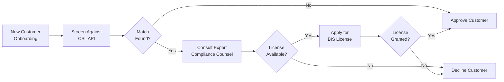
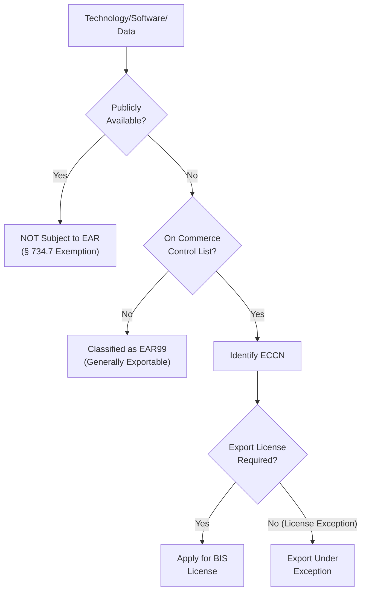
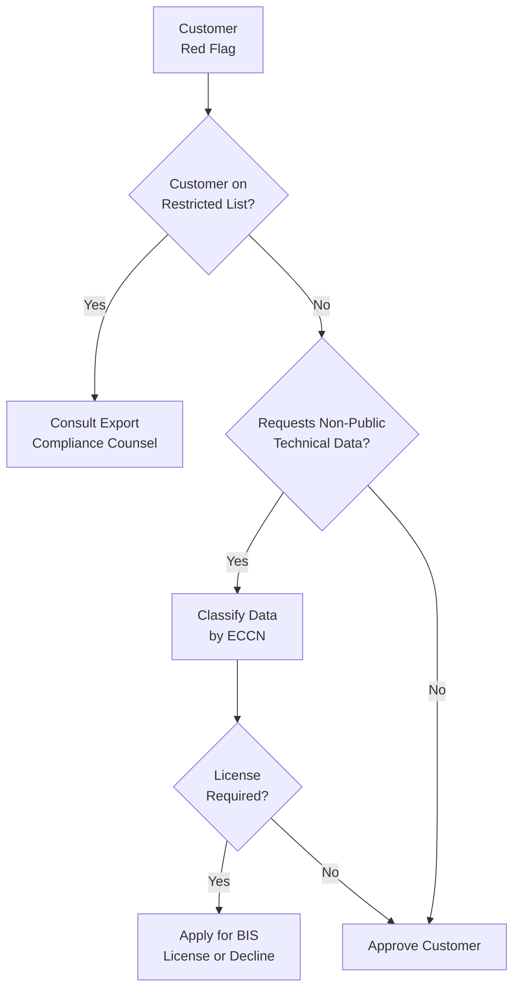

# Export Control & ITAR Compliance for Technology Scouting Platforms

**Sprint**: 07 - Technology Scouting & Strategic Foresight 
**Task**: 04 - Compliance & Testing Strategy 
**Research Area**: Export Control & ITAR Considerations 
**Date**: 2025-11-18 
**Researcher**: Compliance Analyst Agent

---

## Executive Summary

Technology scouting platforms monitoring emerging technologies must navigate U.S. export control regulations when tracking dual-use technologies (commercial and military applications) and defense-related innovations. The Export Administration Regulations (EAR), administered by the Bureau of Industry and Security (BIS), govern commercial and dual-use items, while the International Traffic in Arms Regulations (ITAR), overseen by the Directorate of Defense Trade Controls (DDTC), regulate military-specific technologies on the U.S. Munitions List (USML).

For technology scouting focused on quantum computing, AI/ML, advanced materials, biotechnology, and autonomous systems, the primary compliance concern is EAR rather than ITAR, as these technologies are predominantly dual-use. However, monitoring defense contractor patents, DARPA research, or aerospace innovations may trigger ITAR considerations if data includes technical specifications, blueprints, or controlled technical data (CTD).

Critical compliance obligations include: (1) avoiding dissemination of EAR-controlled technology to restricted countries (China, Russia, Iran, North Korea) or foreign nationals without export licenses, (2) implementing "deemed export" controls when sharing technical data with non-U.S. employees or customers, (3) screening customers and data sources against Denied Persons List and Entity List, (4) classifying monitored technologies by Export Control Classification Number (ECCN) to determine licensing requirements, (5) training employees on export control compliance and recognizing "red flags" for potential violations.

While most publicly available patent and academic publication data is exempt from EAR controls (publicly available exception under 15 CFR § 734.7), platforms must avoid aggregating or analyzing controlled technical data in ways that create exportable "technology" under EAR definitions. Violations carry severe penalties: up to $1 million per civil violation, $1 million criminal fine, and 20 years imprisonment. Recommended compliance framework includes export control classification reviews, customer screening protocols, and consultation with external trade compliance counsel.

---

## Key Findings

- **EAR vs. ITAR**: EAR governs dual-use (commercial + military) items; ITAR governs defense-specific items on U.S. Munitions List
- **Dual-Use Technology Focus**: Quantum computing, AI/ML, biotechnology, advanced materials, autonomous systems fall under EAR (not ITAR)
- **Deemed Export Risk**: Sharing controlled technical data with foreign nationals (including non-U.S. employees) constitutes "deemed export" requiring license
- **Publicly Available Exception**: Patent data, published academic research, and open conferences are generally exempt from EAR controls (15 CFR § 734.7)
- **Entity List Restrictions**: Platforms must screen against BIS Entity List (prohibits exports to listed organizations, including Chinese tech firms like Huawei, SMIC)
- **ECCN Classification**: Technologies classified by Export Control Classification Number (ECCN); EAR99 items generally exportable without license
- **Penalties**: Civil violations up to $1M per violation + $300K per violation; criminal violations up to $1M fine + 20 years imprisonment
- **Encryption Controls**: Technology scouting platforms using encryption (>56-bit) may be subject to EAR encryption controls (ECCN 5D002)

---

## Export Control Regulatory Framework

### EAR (Export Administration Regulations)

**Overview**: The EAR, codified at 15 CFR Parts 730-774, regulates the export and re-export of commercial and dual-use items (goods, software, technology) that have both civilian and military applications.

**Administering Agency**: Bureau of Industry and Security (BIS), U.S. Department of Commerce

**What is Regulated**:
- **Items**: Physical goods (hardware, components, materials)
- **Software**: Computer programs, source code, object code
- **Technology**: Technical data, blueprints, know-how, technical assistance

**Commerce Control List (CCL)**: EAR classifies controlled items using Export Control Classification Numbers (ECCN):
- **Category 0-9**: 0=Nuclear, 1=Materials, 2=Materials Processing, 3=Electronics, 4=Computers, 5=Telecommunications/Information Security, 6=Sensors, 7=Navigation, 8=Marine, 9=Aerospace
- **Example**: ECCN 3A001 = Electronic integrated circuits (semiconductors)

**Export Licensing**: Exports of EAR-controlled items to certain countries (China, Russia, etc.) or for certain end-uses (military, nuclear) require BIS export license.

### ITAR (International Traffic in Arms Regulations)

**Overview**: ITAR, codified at 22 CFR Parts 120-130, regulates the export and temporary import of defense articles, services, and technical data specifically designed for military use.

**Administering Agency**: Directorate of Defense Trade Controls (DDTC), U.S. Department of State

**What is Regulated**:
- **Defense Articles**: Military equipment, weapons, ammunition
- **Defense Services**: Technical assistance, training, engineering support for defense articles
- **Technical Data**: Blueprints, drawings, plans, instructions required for design, production, operation, or maintenance of defense articles

**U.S. Munitions List (USML)**: ITAR classifies defense items in 21 categories:
- **Category I**: Firearms, close assault weapons
- **Category VIII**: Aircraft and spacecraft (military)
- **Category XI**: Military electronics
- **Category XV**: Spacecraft systems and equipment (satellites, launch vehicles)

**Example ITAR Items**: F-35 fighter jet components, military satellite encryption, guided missile technology

### Key Differences: EAR vs. ITAR

| Aspect | EAR | ITAR |
|--------|-----|------|
| **Administering Agency** | BIS (Dept. of Commerce) | DDTC (Dept. of State) |
| **Scope** | Dual-use items (commercial + military) | Military-specific items |
| **Classification** | ECCN (Export Control Classification Number) | USML (U.S. Munitions List) |
| **Licensing Authority** | BIS export license | DDTC export license or Technical Assistance Agreement (TAA) |
| **Penalties** | $300K civil, $1M criminal per violation | $1M civil/criminal per violation |
| **Registration** | No general registration required | Manufacturers/exporters must register with DDTC ($2,250/year) |
| **Publicly Available Exception** | Yes (15 CFR § 734.7) | Limited (22 CFR § 120.11) |

---

## Relevance to Technology Scouting Platforms

### Which Technologies Trigger Export Controls?

Technology scouting platforms monitoring the following domains may encounter EAR-controlled or ITAR-controlled technologies:

**EAR-Controlled (Dual-Use) Technologies**:

| Technology Domain | ECCN Category | Example Controlled Items | Typical End-Use |
|-------------------|---------------|--------------------------|-----------------|
| **Quantum Computing** | 3A (Electronics), 5A (Telecom) | Quantum processors, quantum encryption | National security, cryptography |
| **AI/ML** | 4A (Computers), 5D (Software) | AI chips (>600 TOPS), neural network software | Surveillance, autonomous weapons |
| **Advanced Materials** | 1C (Materials) | Carbon fiber, titanium alloys, high-strength ceramics | Aerospace, defense manufacturing |
| **Biotechnology** | 1C (Materials), 2B (Equipment) | Genetically modified organisms, bioprocessing equipment | Bioweapons, dual-use research |
| **Autonomous Systems** | 7A (Navigation), 8A (Marine) | Autonomous underwater vehicles, drone navigation systems | Military reconnaissance, weapons delivery |
| **Semiconductors** | 3A (Electronics) | Advanced semiconductors (<14nm), lithography equipment | AI chips, military electronics |
| **Encryption** | 5A (Telecom), 5D (Software) | Encryption algorithms (>1024-bit RSA), cryptographic processors | Secure communications |

**ITAR-Controlled (Defense-Specific) Technologies**:

| Technology Domain | USML Category | Example Controlled Items |
|-------------------|---------------|--------------------------|
| **Military Aircraft** | VIII | F-35 avionics, stealth coatings, military jet engines |
| **Guided Missiles** | IV | Ballistic missile guidance systems, rocket propulsion |
| **Military Satellites** | XV | Satellite encryption, military communications payloads |
| **Firearms** | I | Military firearms, grenade launchers, military optics |
| **Military Electronics** | XI | Radar jamming equipment, military-grade GPS |

**Technology Scouting Implication**: Platforms monitoring commercial quantum computing, AI/ML, biotech, and advanced materials will primarily encounter **EAR-controlled** technologies. **ITAR-controlled** technologies are only relevant if platform monitors defense contractor patents, DARPA research, or aerospace/defense industry innovations.

### "Publicly Available" Exception

**Critical Exemption**: Both EAR and ITAR provide exemptions for publicly available information, which is the foundation of technology scouting.

**EAR Publicly Available Exception (15 CFR § 734.7)**:

Information is **not controlled** under EAR if it is:
1. **Published**: Available to the public through unlimited distribution (books, journals, conferences, patents)
2. **General Scientific Knowledge**: Taught in academic institutions and available to the general public
3. **Patent Applications**: Published patent applications (available from patent offices)

**Example**: A technology scouting platform analyzing publicly filed USPTO quantum computing patents does **not** require BIS export license to share insights with EU customers, because patent data is publicly available.

**ITAR Publicly Available Exception (22 CFR § 120.11)**:

Information is **not controlled** under ITAR if it is:
1. **Published**: Available to the public through unlimited distribution
2. **Fundamental Research**: Research published openly without restrictions (university research)
3. **Patent Applications**: Published patent applications (but **not** classified or military-restricted patents)

**Limitation**: ITAR's publicly available exception is narrower than EAR's. Defense contractors often publish redacted patents that omit ITAR-controlled technical details.

**Example**: A DARPA-funded research project on hypersonic missile guidance may publish high-level findings in academic journals (publicly available, not ITAR-controlled), but withhold specific technical data (controlled under ITAR Category IV).

**Technology Scouting Recommendation**: Rely on publicly available sources (patents, publications, conferences) to maximize publicly available exemption coverage. Avoid soliciting or aggregating non-public technical data from defense contractors or classified research programs.

---

## "Deemed Export" Risk for Technology Scouting Platforms

### What is a Deemed Export?

**Definition**: A "deemed export" occurs when controlled technology or technical data is **released** to a foreign national (non-U.S. person) in the United States, including employees, contractors, or visitors [15 CFR § 734.13; 22 CFR § 120.17].

**Key Principle**: Sharing EAR- or ITAR-controlled technical data with a foreign national is treated as an "export" to that person's country of citizenship, even if the data never leaves U.S. borders.

**Example**:
- U.S.-based technology scouting platform employs Chinese national engineer
- Engineer accesses platform's proprietary AI/ML algorithms for processing quantum computing patents (ECCN 4D001 controlled software)
- **Result**: Deemed export to China; BIS export license required unless exemption applies

### Foreign National Definition

**EAR Definition (15 CFR § 772.1)**:
- Any person who is **not** a U.S. citizen or lawful permanent resident (green card holder)
- Includes foreign nationals on work visas (H-1B, L-1, etc.)

**ITAR Definition (22 CFR § 120.16)**:
- Any person who is **not** a U.S. citizen or lawful permanent resident
- **Stricter**: Some ITAR licenses require U.S. citizenship (green card holders excluded)

### Technology Scouting Platform Risks

**Scenario 1: Non-U.S. Employees Accessing Controlled Data**

- Platform employs engineers from China, Russia, India to develop AI-powered weak signal detection algorithms
- Algorithms process patent data related to advanced semiconductors (ECCN 3A001) or quantum encryption (ECCN 5A002)
- **Risk**: If algorithms themselves are EAR-controlled (ECCN 5D002 encryption software), sharing with foreign national employees constitutes deemed export

**Mitigation**:
1. **Technology Control Plan (TCP)**: Implement access controls limiting foreign nationals' access to EAR-controlled software/data
2. **Export License**: Apply for BIS deemed export license if foreign nationals require access
3. **Fundamental Research Exception**: If platform is affiliated with university conducting fundamental research (published openly), deemed export exemption may apply (15 CFR § 734.8)

**Scenario 2: Sharing Controlled Technical Data with Foreign Customers**

- Platform provides competitive intelligence reports to EU, Asian, or Middle Eastern customers
- Reports include technical specifications, design details, or performance parameters of EAR-controlled technologies (e.g., quantum computing processors, AI chips)
- **Risk**: Sharing controlled technical data with foreign customers constitutes export; license required if ECCN is not EAR99

**Mitigation**:
1. **Publicly Available Sources Only**: Ensure all technical data in reports is derived from publicly available sources (patent publications, academic papers), which are exempt from EAR
2. **High-Level Analysis**: Provide strategic insights and trend analysis (not detailed technical specifications)
3. **Export Classification**: Classify all customer-facing reports by ECCN; obtain BIS licenses for non-EAR99 data

### Screening Foreign Nationals & Customers

**Required Screening**:

Technology scouting platforms must screen employees, contractors, and customers against U.S. government restricted party lists:

| List | Administering Agency | Prohibition | Screening Frequency |
|------|---------------------|-------------|---------------------|
| **Denied Persons List (DPL)** | BIS | Cannot export EAR items without license | Prior to hire/onboarding; quarterly updates |
| **Entity List** | BIS | Specific export license requirements (often denied) | Prior to customer contract; quarterly updates |
| **Unverified List (UVL)** | BIS | Additional due diligence required | Prior to export; quarterly updates |
| **Specially Designated Nationals (SDN)** | OFAC (Treasury) | Prohibited from all transactions (sanctions) | Prior to any transaction; real-time updates |
| **Debarred List** | DDTC (State) | Cannot export ITAR items | Prior to ITAR-related transactions |

**Example Entity List Entries (High-Profile)**:
- **Huawei Technologies** (China): Restricted entity for advanced semiconductors, 5G equipment
- **SMIC (Semiconductor Manufacturing International Corp.)** (China): Restricted for advanced chip manufacturing
- **Russian defense contractors**: Broad export restrictions due to Ukraine sanctions

**Screening Tools**:
- **Consolidated Screening List (CSL)**: BIS provides API for automated screening against all lists (https://www.trade.gov/consolidated-screening-list)
- **Third-Party Compliance Software**: Visual Compliance, Descartes, Amber Road (subscription-based)

**Technology Scouting Workflow**:

---

## ECCN Classification for Technology Scouting Data

### What is an ECCN?

**Export Control Classification Number (ECCN)**: A five-character alphanumeric code (e.g., 3A001, 5D002) that identifies items on the Commerce Control List (CCL) subject to EAR controls.

**Format**: `[Category][Product Group][Reason for Control][Item Number]`
- **Category**: 0-9 (e.g., 3 = Electronics, 5 = Telecommunications)
- **Product Group**: A=Systems, B=Test Equipment, C=Materials, D=Software, E=Technology
- **Reason for Control**: 0=National Security, 1=Missile Tech, 2=Nuclear Nonproliferation, 9=Anti-Terrorism
- **Item Number**: 01-99 (specific item within category)

**Example**: **ECCN 5D002** = Software for cryptographic activation (encryption software >1024-bit)

**EAR99**: Items subject to EAR but **not** listed on CCL; generally exportable without license to most countries (excluding embargoed countries like Iran, North Korea).

### Classification Process

**Who Determines ECCN?**:
- **Exporter Responsibility**: Companies exporting EAR items must self-classify (determine applicable ECCN)
- **BIS Advisory Opinion**: If uncertain, companies can request official ECCN classification from BIS (response time: 60-90 days)
- **Commodity Jurisdiction (CJ)**: For items potentially subject to ITAR (not EAR), companies submit CJ request to DDTC to determine jurisdiction

**Classification Methodology**:

### Technology Scouting Platform Classification Examples

**Example 1: Quantum Computing Patent Analysis Report**

**Content**: Report analyzing USPTO quantum computing patents, identifying emerging startups, and forecasting technology maturation timelines. Report includes publicly filed patent abstracts, inventor names, and high-level trend analysis.

**Classification**:
- **ECCN**: **NOT controlled** (publicly available exception under 15 CFR § 734.7)
- **Rationale**: All data derived from published USPTO patents (publicly available)
- **Export License**: Not required (can be shared with foreign customers without license)

**Example 2: Proprietary AI/ML Software for Weak Signal Detection**

**Content**: Platform's proprietary AI/ML software that processes patent data, identifies weak signals, and generates predictive analytics. Software includes advanced natural language processing (NLP) and machine learning algorithms.

**Classification**:
- **ECCN**: **5D002** (if software includes encryption >1024-bit) or **EAR99** (if no encryption or <1024-bit)
- **Rationale**: Software for data analytics generally EAR99 unless it includes controlled cryptography
- **Export License**: If 5D002, license required for exports to China, Russia; if EAR99, generally exportable without license

**Recommendation**: Consult export compliance counsel to classify platform software and determine licensing requirements.

**Example 3: Technical Report on Advanced Semiconductor Manufacturing**

**Content**: Report analyzing patents and publications related to 3nm semiconductor manufacturing processes, including lithography techniques, materials, and design architectures. Report includes technical specifications extracted from public sources.

**Classification**:
- **ECCN**: **3E001** (technology for production of electronic components) or **NOT controlled** (if publicly available)
- **Rationale**: If report aggregates publicly available data without adding controlled technical details, publicly available exception applies; if report includes proprietary analysis of controlled manufacturing processes, ECCN 3E001 may apply
- **Export License**: If ECCN 3E001, license required for exports to China (due to U.S. semiconductor export restrictions)

**Recommendation**: Limit reports to publicly available data and high-level analysis to maximize publicly available exemption.

---

## Compliance Obligations for Technology Scouting Platforms

### 1. Export Compliance Program (ECP)

**BIS Recommendation**: Companies exporting EAR-controlled items should establish Export Compliance Program with following elements [15 CFR Part 730, Supplement No. 3]:

**Required Elements**:

| Element | Description | Technology Scouting Implementation |
|---------|-------------|-------------------------------------|
| **Management Commitment** | Senior leadership supports export compliance | CEO/General Counsel signs export compliance policy |
| **Risk Assessment** | Identify products/services subject to EAR/ITAR | Classify platform software, customer reports by ECCN |
| **Policies & Procedures** | Written export compliance procedures | Document screening process, license application workflows |
| **Training** | Employee education on export controls | Mandatory annual training for all employees (especially customer-facing roles) |
| **Screening** | Check customers/transactions against restricted party lists | Automated CSL screening via API |
| **Recordkeeping** | Maintain export transaction records for 5 years | Log customer screening results, license applications, exports |
| **Auditing** | Periodic compliance audits | Annual internal audit + external audit every 3 years |
| **Corrective Action** | Address violations and prevent recurrence | Incident response plan for suspected violations |

### 2. Customer Screening Protocol

**Pre-Contract Screening**:

1. **Collect Customer Information**:
   - Company name, address, country
   - Key personnel (CEO, procurement contact)
   - End-use description (what will customer do with competitive intelligence?)
   - End-user location (will data be shared with foreign subsidiaries?)

2. **Screen Against Restricted Party Lists**:
   - Automated CSL API check for company name and key personnel
   - Manual review if any matches found
   - Document screening results in CRM

3. **Red Flag Assessment**:
   - Does customer refuse to provide end-use information?
   - Is customer located in restricted country (China, Russia, Iran)?
   - Does customer request technical specifications beyond publicly available data?
   - Is customer a defense contractor or government entity?

**Red Flag Decision Tree**:

### 3. Export License Applications

**When License Required**:
- Exporting EAR-controlled items (ECCN ≠ EAR99) to restricted countries
- Exporting to Entity List companies (Huawei, SMIC, etc.)
- Deemed export to foreign nationals (if no license exception applies)

**Application Process**:

1. **Determine ECCN**: Classify technology/software/data
2. **Check Country Chart** (15 CFR Part 738): Determine if license required for destination country
3. **Submit Application**: File online via SNAP-R system (https://snapr.bis.doc.gov/)
4. **Processing Time**: 60-90 days (longer for sensitive technologies or restricted countries)
5. **Decision**: Approved, approved with conditions, denied, or returned without action

**License Validity**: Typically 2-4 years; renewable

**Cost**: No application fee; legal/consulting costs for preparation ($5K-$20K depending on complexity)

### 4. Recordkeeping Requirements

**EAR Recordkeeping (15 CFR § 762)**:
- **Duration**: 5 years from date of export
- **Records to Retain**:
  - Export licenses and license exception documentation
  - Customer screening results (CSL checks)
  - ECCN classification determinations
  - Shipping documents and invoices
  - Customer agreements and end-use statements

**Technology Scouting Platform Records**:
- Customer onboarding questionnaires (end-use, end-user)
- CSL screening logs (automated API responses)
- ECCN classification memos for platform software and reports
- Export license applications and approvals (if any)
- Employee deemed export approvals (if foreign nationals access controlled data)

---

## Penalties & Enforcement

### Civil Penalties

**BIS Civil Penalties (15 CFR Part 766)**:
- **Maximum**: $300,000 per violation (adjusted for inflation annually; currently ~$330,000)
- **Factors**: Willfulness, harm to national security, cooperation with investigation, voluntary disclosure

**Recent Civil Enforcement**:
- **2023**: U.S. company fined $750,000 for exporting semiconductor manufacturing equipment to China without license (multiple violations)
- **2022**: Defense contractor fined $2.5 million for ITAR violations (deemed exports to foreign nationals without licenses)

### Criminal Penalties

**EAR Criminal Penalties (50 U.S.C. § 1705)**:
- **Willful Violations**: Up to $1,000,000 fine + 20 years imprisonment per violation
- **Ordinary Violations**: Up to $250,000 fine + 5 years imprisonment

**Recent Criminal Prosecutions**:
- **2024**: Chinese national sentenced to 4 years imprisonment for illegally exporting AI chips to China
- **2023**: Company executives indicted for conspiracy to violate EAR (exporting controlled technology to Iran)

### Voluntary Self-Disclosure (VSD)

**BIS Incentive**: Companies that discover violations and voluntarily report to BIS receive reduced penalties (typically 50% reduction).

**VSD Process**:
1. Discover violation (e.g., inadvertent deemed export, shipment to restricted entity)
2. Conduct internal investigation and determine scope
3. File VSD with BIS within timeframe of discovery
4. Implement corrective actions (employee training, policy updates)
5. Cooperate with BIS investigation

**Benefit**: VSD demonstrates good faith compliance culture and significantly reduces civil penalties.

---

## Industry-Specific Considerations

### Quantum Computing & Advanced Electronics

**Export Control Focus**:
- Quantum computers with >5 qubits (ECCN 3A090)
- Quantum encryption and quantum key distribution (ECCN 5A002, 5D002)
- Advanced semiconductors <14nm (ECCN 3A001)

**Technology Scouting Risk**: Monitoring quantum computing patents and startups generally **not** controlled (publicly available exception), unless platform develops proprietary quantum simulation software subject to ECCN classification.

**Mitigation**: Use publicly available patent data; avoid aggregating controlled technical specifications.

### Artificial Intelligence & Machine Learning

**Export Control Focus**:
- AI chips with >600 TOPS (ECCN 3A090)
- Neural network software for military/surveillance applications (ECCN 4D090)
- Facial recognition and biometric software (ECCN 5D001)

**Recent Restrictions**: In 2023, BIS implemented new controls on AI chip exports to China, restricting NVIDIA A100/H100 GPUs and AMD MI250 accelerators.

**Technology Scouting Risk**: Monitoring AI/ML research and patents generally **not** controlled (publicly available exception). However, platform's proprietary AI algorithms for weak signal detection may be EAR-controlled if they include advanced machine learning capabilities.

**Mitigation**: Classify platform software (likely EAR99 if general-purpose analytics); document publicly available sources for all AI/ML insights.

### Biotechnology & Life Sciences

**Export Control Focus**:
- Genetically modified organisms (ECCN 1C351)
- Bioprocessing equipment (ECCN 2B352)
- Select agents and toxins (CDC/USDA regulation + EAR)

**Technology Scouting Risk**: Monitoring biotech patents and academic research generally **not** controlled (publicly available exception). However, tracking select agents (e.g., SARS-CoV-2 variants, anthrax) may trigger additional CDC/USDA compliance.

**Mitigation**: Focus on commercially published research; avoid soliciting non-public data on select agents or dual-use pathogens.

### Aerospace & Defense

**Export Control Focus**:
- Military aircraft technology (ITAR Category VIII)
- Spacecraft and satellites (ITAR Category XV)
- Autonomous drones and navigation systems (EAR ECCN 7A, 9A)

**Technology Scouting Risk**: Monitoring defense contractor patents and DARPA research may encounter **ITAR-controlled** technical data. Even if patents are published, defense contractors often redact ITAR-controlled details.

**Mitigation**:
1. Avoid deep-dive analysis of ITAR-controlled defense technologies (guided missiles, military satellites)
2. Focus on commercially published aerospace research (commercial space, civilian drones)
3. If monitoring defense innovations, consult ITAR counsel to determine Commodity Jurisdiction

---

## Compliance Roadmap for Technology Scouting Platforms

### Phase 1: Export Control Assessment (Months 1-2)

**Deliverables**:
- [ ] Classify platform software by ECCN (engage export compliance counsel)
- [ ] Conduct risk assessment: identify EAR/ITAR-controlled technologies monitored by platform
- [ ] Determine publicly available exception applicability for customer reports
- [ ] Screen current customers against CSL (Consolidated Screening List)

**Estimated Effort**: 40-60 hours (legal counsel + compliance team)

### Phase 2: Export Compliance Program (Months 2-3)

**Deliverables**:
- [ ] Draft export compliance policy and procedures manual
- [ ] Establish customer screening protocol (CSL API integration)
- [ ] Create red flag assessment checklist for sales team
- [ ] Implement recordkeeping system (5-year retention)

**Estimated Effort**: 40-60 hours (compliance + engineering)

### Phase 3: Employee Training (Months 3-4)

**Deliverables**:
- [ ] Conduct mandatory export control training for all employees (EAR, ITAR, deemed export)
- [ ] Train sales team on customer screening and red flag identification
- [ ] Train engineering team on ECCN classification and publicly available exception
- [ ] Implement annual refresher training

**Estimated Effort**: 20-40 hours (HR + compliance + content development)

### Phase 4: Technology Control Plan (Months 4-5)

**Deliverables** (if platform employs foreign nationals):
- [ ] Identify foreign national employees and document citizenship/visa status
- [ ] Implement access controls to limit foreign nationals' access to EAR-controlled data
- [ ] Apply for deemed export licenses (if required)
- [ ] Document Technology Control Plan (TCP)

**Estimated Effort**: 40-60 hours (HR + legal + IT)

### Phase 5: Audit & Ongoing Compliance (Months 6+)

**Deliverables**:
- [ ] Conduct annual internal export compliance audit
- [ ] Engage external trade compliance counsel for audit every 3 years
- [ ] Update customer screening against CSL quarterly
- [ ] Monitor BIS rule changes and update policies accordingly

**Estimated Effort**: 20-40 hours annually

---

## Enterprise RFP Responses: Export Control Compliance

### Common Due Diligence Questions

1. **Are your products/services subject to U.S. export controls (EAR or ITAR)?**
   - *Answer*: "Our technology scouting platform is subject to EAR (not ITAR). Platform software is classified as EAR99 (generally exportable without license). All competitive intelligence reports are derived from publicly available sources (patents, publications) and are exempt from EAR controls under the publicly available exception (15 CFR § 734.7)."

2. **Do you have an Export Compliance Program?**
   - *Answer*: "Yes. We maintain a comprehensive Export Compliance Program including customer screening against BIS Consolidated Screening List, employee training, ECCN classification reviews, and 5-year recordkeeping. Annual internal audits and triennial external audits ensure ongoing compliance."

3. **How do you screen customers against restricted party lists?**
   - *Answer*: "All customers are screened against BIS Consolidated Screening List (CSL) prior to contract execution. Automated API integration with trade.gov CSL ensures real-time screening. Quarterly re-screening detects any additions to restricted lists."

4. **Have you experienced any export control violations or penalties?**
   - *Answer*: "No export control violations or BIS penalties to date. We maintain proactive compliance culture with mandatory employee training and voluntary self-disclosure policy if violations are discovered."

5. **Can you export to customers in China, Russia, or other restricted countries?**
   - *Answer*: "Yes, provided customer is not on BIS Entity List or Denied Persons List. All competitive intelligence reports are derived from publicly available sources and are exempt from EAR licensing requirements. Platform software (EAR99) is generally exportable without license, though we conduct enhanced due diligence for customers in restricted countries."

### Recommended Compliance Artifacts

**For Enterprise RFP Responses**:
- **Export Compliance Policy** (public-facing, 2-3 pages): Overview of ECP, customer screening, ECCN classification
- **ECCN Classification Memo** (shared under NDA): Official ECCN determination for platform software and reports
- **Publicly Available Exception Documentation** (2-3 pages): Explain how all customer-facing data is derived from public sources
- **Customer Screening Protocol** (internal, summary for RFP): Describe CSL screening process and red flag assessment

---

## References

Bureau of Industry and Security (BIS). (2024). *Export Administration Regulations (EAR), 15 CFR Parts 730-774*. U.S. Department of Commerce. https://www.bis.doc.gov/

Directorate of Defense Trade Controls (DDTC). (2024). *International Traffic in Arms Regulations (ITAR), 22 CFR Parts 120-130*. U.S. Department of State. https://www.pmddtc.state.gov/

Export Compliance Training Institute. (2024). *ITAR and EAR Export Compliance Basics: Understanding Key Terms, Issues, Similarities and Differences*. https://www.learnexportcompliance.com/

Export Solutions, Inc. (2024). *ITAR vs. EAR – What's the Difference?* https://www.exportsolutionsinc.com/resources/blog/itar-vs-ear-difference/

GAN Integrity. (2024). *ITAR and EAR Regulations and Compliance*. https://www.ganintegrity.com/reference/itar-ear/

Securiti. (2024). *ITAR vs. EAR Compliance – What's the Difference*. https://securiti.ai/blog/itar-vs-ear-compliance/

TechTarget. (2024). *ITAR and EAR Compliance: Definition and Overview*. https://www.techtarget.com/whatis/definition/ITAR-and-EAR-compliance

University of California Berkeley. (2024). *Export Control: Controlled Technologies Lists*. https://rac.berkeley.edu/ec/exportcontrollist.html

University of Michigan. (2024). *Export Control (EAR/ITAR) – Information Security at Michigan Engineering*. https://infosec.engin.umich.edu/export-control-ear-itar/

University of Pittsburgh. (2024). *Export of Commercial or Dual-Use Items - EAR | Office of Research Security & Trade Compliance*. https://www.tradecompliance.pitt.edu/manual-guidelines/guidance-documents/export-commercial-or-dual-use-items-ear

U.S. Department of Commerce. (2024). *Consolidated Screening List API*. https://www.trade.gov/consolidated-screening-list
