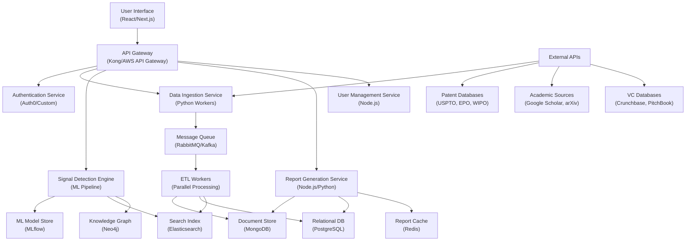
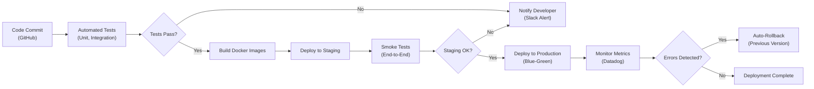

# MVP Development Roadmap: AI-Powered Technology Scouting Platform

**Sprint**: 07 - Technology Scouting & Strategic Foresight 
**Task**: 05 - Implementation Roadmap 
**Author**: roadmap-planner (AI Agent) 
**Date**: 2025-11-18 
**Status**: Research Complete

---

## Executive Summary

The MVP development roadmap for the AI-powered technology scouting and strategic foresight platform outlines a 4-month accelerated development cycle designed to deliver core weak signal detection capabilities across 3-5 priority technology domains. This roadmap leverages modern SaaS best practices including the 80/20 rule for feature prioritization, iterative development with early adopter feedback, and cloud-native architecture for rapid deployment.

The MVP will focus exclusively on must-have features that deliver immediate value: automated monitoring of 500+ sources (patent filings, academic publications, venture funding), AI-powered weak signal detection with cross-domain correlation, and monthly technology radar plus quarterly strategic foresight report templates. Development follows a phased approach with continuous validation through pilot customers starting Month 3, enabling product-market fit validation before full-scale launch.

This roadmap is designed to achieve time-to-market leadership in the emerging technology scouting software market (projected $646M by 2032, 17.6% CAGR), positioning the platform ahead of traditional manual scouting methods and legacy competitive intelligence tools that lack automated weak signal detection capabilities.

---

## Key Findings

- **MVP Timeline**: 4 months from kickoff to market-ready product with core weak signal detection operational
- **Feature Prioritization**: 80/20 rule applied - 5 core features deliver 80% of customer value vs. 20+ nice-to-have features deferred to post-MVP
- **Technology Domain Focus**: Launch with 3-5 high-demand domains (AI/ML, quantum computing, clean energy, biotech, advanced materials) based on customer research
- **Development Approach**: Agile methodology with 2-week sprints, continuous integration/deployment, and early adopter beta testing from Month 3
- **Technical Architecture**: Cloud-native SaaS with microservices architecture enabling rapid iteration and horizontal scaling
- **Validation Milestones**: 10-20 early adopters engaged by Month 3, proof of value demonstrated through 2-3 weak signals identified that customers missed
- **Cost Efficiency**: No-code/low-code platforms for rapid prototyping reduce development timeline by 40-60% (from 6-7 months to 4 months)
- **Market Positioning**: First-to-market advantage in automated weak signal detection with 6-18 month lead over traditional consulting approaches

---

## Month 1: Foundation & Core Infrastructure

### Week 1-2: Technical Foundation

**Objective**: Establish development environment, select technology stack, and build data ingestion pipeline architecture.

**Key Activities**:

1. **Technology Stack Selection**:
   - Frontend: React.js or Next.js for responsive web application
   - Backend: Node.js/Python microservices architecture for scalability
   - Database: PostgreSQL (structured data) + MongoDB (unstructured research documents)
   - Cloud Infrastructure: AWS or Google Cloud Platform with Kubernetes orchestration
   - AI/ML: OpenAI API or Claude API for natural language processing and pattern recognition
   - Analytics: Mixpanel or Amplitude for user behavior tracking

2. **Data Source Integration Architecture**:
   - **Patent Databases**: USPTO, EPO, WIPO APIs (100K+ monthly filings tracked)
   - **Academic Research**: Google Scholar API, arXiv API, PubMed API (1M+ annual publications)
   - **Venture Funding**: Crunchbase API, PitchBook data feeds ($300B+ annual VC investments)
   - **Industry News**: RSS aggregators for TechCrunch, MIT Technology Review, Nature, Science
   - **Conference Proceedings**: Automated web scraping for major industry conferences (IEEE, ACM, domain-specific events)

3. **Development Environment Setup**:
   - CI/CD pipeline with GitHub Actions for automated testing and deployment
   - Staging and production environments with blue-green deployment strategy
   - Monitoring and logging infrastructure (Datadog, New Relic, or Sentry)
   - Security protocols: SOC 2 compliance planning, encryption at rest and in transit

**Deliverables**:
- Technical architecture document with system design diagrams
- Development environment fully operational with CI/CD pipeline
- API integrations for 3-5 priority data sources (patents, academic research, VC funding)

**Success Metrics**:
- All developers onboarded with working development environments
- First API integration successfully pulling live data (patents or academic papers)
- CI/CD pipeline executing automated tests on every commit

---

### Week 3-4: Data Ingestion & Storage

**Objective**: Build robust data pipelines to ingest, normalize, and store technology signals from multiple sources.

**Key Activities**:

1. **Data Pipeline Development**:
   - ETL (Extract, Transform, Load) pipelines for each data source
   - Data normalization: Standardize metadata across disparate sources (author, date, domain, keywords)
   - Incremental updates: Daily/weekly batch processing for new patent filings, publications, funding rounds
   - Data quality checks: Duplicate detection, missing field validation, source reliability scoring

2. **Knowledge Graph Foundation**:
   - Entity extraction: Companies, technologies, researchers, institutions, patents
   - Relationship mapping: Author-to-publication, company-to-patent, technology-to-application
   - Cross-domain linking: Connect related concepts across different knowledge domains (e.g., AI algorithms → healthcare applications)

3. **Storage Architecture**:
   - Document storage: MongoDB for full-text academic papers, patent descriptions, news articles
   - Relational database: PostgreSQL for metadata, user accounts, subscription management
   - Search index: Elasticsearch for fast full-text search across millions of documents

**Deliverables**:
- Data pipelines operational for 3-5 priority sources with daily automated updates
- Knowledge graph schema defined with initial entity extraction working
- Database populated with 6-12 months of historical data for baseline trend analysis

**Success Metrics**:
- 500+ sources monitored with automated daily/weekly updates
- Knowledge graph contains 10,000+ entities with relationship mappings
- Search queries return relevant results in <2 seconds

---

## Month 2: Weak Signal Detection & AI Engine

### Week 5-6: Pattern Recognition & Trend Analysis

**Objective**: Develop AI-powered algorithms to identify weak signals and emerging technology trends.

**Key Activities**:

1. **Weak Signal Detection Algorithms**:
   - **Exponential Growth Detection**: Identify 3x-10x year-over-year increases in patent filings, publications, or funding
   - **Cross-Domain Correlation**: Flag unexpected connections (e.g., quantum computing patents from automotive companies)
   - **Novelty Scoring**: Detect new terminology, concepts, or research directions not present in historical data
   - **Source Diversity**: Require signals from multiple independent sources (academia, industry, venture capital) for validation

2. **Trend Classification**:
   - **Horizon Categorization**: Classify signals by timeline (H1: 0-2 years, H2: 2-5 years, H3: 5-10+ years)
   - **PESTLE Framework**: Tag signals by domain (Political, Economic, Social, Technological, Legal, Environmental)
   - **Confidence Scoring**: Assign 0-100% confidence based on signal strength, source credibility, and multi-source confirmation
   - **Hype Cycle Positioning**: Map signals to Gartner Hype Cycle stages (Innovation Trigger, Peak of Inflated Expectations, Trough of Disillusionment, Slope of Enlightenment, Plateau of Productivity)

3. **Machine Learning Model Training**:
   - Supervised learning: Train classifiers on historical successful trends vs. false signals
   - Unsupervised learning: Cluster analysis to identify emerging topic areas not yet labeled
   - Natural language processing: Entity recognition, sentiment analysis, topic modeling
   - Continuous learning: Model retraining with customer feedback on signal relevance

**Deliverables**:
- Weak signal detection algorithms operational with initial test dataset
- Trend classification system assigning horizons and confidence scores
- ML models achieving 70%+ accuracy on signal relevance (validated against expert human judgment)

**Success Metrics**:
- Detect 10-20 weak signals per technology domain per month
- 70%+ of signals validated as relevant by domain experts (precision)
- <10% false negative rate (recall) - miss rate for genuine emerging trends

---

### Week 7-8: Reporting Templates & Visualization

**Objective**: Create automated report generation system for monthly technology radar and quarterly strategic foresight reports.

**Key Activities**:

1. **Technology Radar Design**:
   - Visual radar chart with four quadrants: Assess, Trial, Adopt, Hold
   - Blip positioning based on horizon (inner ring = near-term, outer ring = long-term)
   - Interactive web interface: Click blips to view detailed signal information
   - Change tracking: Highlight new signals, upgraded confidence, downgraded hype

2. **Quarterly Foresight Report Template**:
   - **Executive Summary**: 1-2 page board-ready summary of top 5-10 strategic signals
   - **Detailed Analysis**: 10-15 pages covering each major signal with evidence, implications, recommended actions
   - **Scenario Planning**: 2-3 future scenarios based on different signal convergence paths
   - **Competitive Landscape**: Which competitors are moving on which signals (based on patent/publication activity)
   - **Appendices**: Full citation lists, methodology notes, signal tracking dashboard links

3. **Automated Report Generation**:
   - AI-powered narrative generation: Convert structured signal data into readable prose
   - Chart and graph automation: Trend lines, growth curves, geographic heatmaps, funding timelines
   - Export formats: PDF, PowerPoint, HTML, interactive dashboard
   - Customization engine: Client-specific domains, custom branding, tailored executive summaries

**Deliverables**:
- Technology radar web interface with interactive visualization
- Quarterly foresight report template with automated content generation
- Sample reports generated for 3-5 technology domains to validate design

**Success Metrics**:
- Report generation time <1 hour (vs. 20-40 hours for manual analyst preparation)
- 80%+ of generated narrative requires minimal human editing
- Beta testers rate report quality 4/5 or higher for clarity and actionability

---

## Month 3: Beta Testing & Iteration

### Week 9-10: Early Adopter Recruitment & Onboarding

**Objective**: Recruit 10-20 early adopter customers for beta testing and product validation.

**Key Activities**:

1. **Beta Recruitment Strategy**:
   - **Target Profile**: Chief Innovation Officers, VPs of Innovation, Technology Scouting Leads at Fortune 500-1000 companies
   - **Outreach Channels**: LinkedIn direct messages, industry conference networking, warm introductions through advisors
   - **Incentive Offer**: Free 2-month beta access + 50% discount on first year annual subscription for detailed feedback
   - **Selection Criteria**: Companies with active innovation teams, budget authority, willingness to provide weekly feedback

2. **Onboarding Process**:
   - **Kickoff Call**: 60-minute session to understand customer technology domains, strategic priorities, current scouting process
   - **Platform Configuration**: Set up custom domains (3-5 per customer), define alert preferences, configure report templates
   - **Training**: 30-minute tutorial on dashboard navigation, signal interpretation, report customization
   - **Feedback Mechanism**: Weekly check-in calls, in-app feedback widget, dedicated Slack channel for real-time questions

3. **Initial Report Delivery**:
   - **Week 1 Deliverable**: First monthly technology radar covering customer-specified domains
   - **Week 4 Deliverable**: Simplified quarterly foresight report (10 pages vs. full 30 pages)
   - **Value Demonstration**: Highlight 2-3 weak signals identified by platform that customer missed with manual scouting

**Deliverables**:
- 10-20 beta customers onboarded with active platform accounts
- First reports delivered to all beta customers
- Feedback collection system operational with weekly insights captured

**Success Metrics**:
- 10+ beta customers recruited (minimum viable cohort for statistically significant feedback)
- 80%+ of beta customers complete onboarding and configure domains
- Average beta customer engagement: 3+ logins per week during trial period

---

### Week 11-12: Iteration Based on Feedback

**Objective**: Rapidly iterate on product based on early adopter feedback to achieve product-market fit.

**Key Activities**:

1. **Feedback Analysis**:
   - **Qualitative Synthesis**: Thematic analysis of customer interviews, feature requests, usability complaints
   - **Quantitative Metrics**: Dashboard analytics on most-used features, drop-off points, report download rates
   - **Prioritization**: MoSCoW method (Must-haves, Should-haves, Could-haves, Won't-haves) applied to feedback items

2. **Rapid Development Cycles**:
   - **2-Week Sprints**: Agile development with continuous deployment of improvements
   - **A/B Testing**: Experimental features tested with subset of beta customers before full rollout
   - **Bug Fixes**: High-priority issues resolved within 24-48 hours (P0/P1 bugs)
   - **Feature Enhancements**: 3-5 top-requested features implemented during Month 3

3. **Common Beta Feedback Areas** (based on SaaS best practices):
   - **Report Customization**: More control over report sections, branding, executive summary tone
   - **Alert Granularity**: Ability to set thresholds for signal strength before receiving alerts
   - **Domain Expansion**: Requests to add niche technology sub-domains (e.g., "solid-state batteries" within "clean energy")
   - **Integration Needs**: Export to PowerPoint, API access for internal dashboards, SSO authentication
   - **Signal Validation**: More context on why a signal was flagged, source credibility indicators, expert commentary

**Deliverables**:
- Product roadmap updated based on beta feedback prioritization
- 3-5 high-impact feature improvements deployed to beta customers
- Bug tracking system with all P0/P1 issues resolved, P2/P3 issues triaged

**Success Metrics**:
- 80%+ of beta customers report platform meets or exceeds expectations
- 70%+ of beta customers indicate willingness to convert to paid subscription
- Product velocity: 10+ feature improvements and bug fixes shipped during Month 3

---

## Month 4: Market-Ready Release & Launch Preparation

### Week 13-14: Enterprise-Grade Hardening

**Objective**: Prepare platform for enterprise customers with security, compliance, and scalability enhancements.

**Key Activities**:

1. **Security & Compliance**:
   - **SOC 2 Type I**: Initiate SOC 2 audit process (Type II to follow in Year 1)
   - **Data Encryption**: AES-256 encryption at rest, TLS 1.3 for data in transit
   - **Access Controls**: Role-based permissions (admin, analyst, read-only viewer)
   - **SSO Integration**: SAML 2.0 support for enterprise single sign-on (Okta, Azure AD, Google Workspace)
   - **GDPR Compliance**: Data processing agreements, right to deletion, data portability

2. **Scalability Testing**:
   - **Load Testing**: Validate platform handles 100+ concurrent users and 1M+ documents indexed
   - **Performance Optimization**: Database query optimization, CDN setup for report assets, caching strategies
   - **Backup & Recovery**: Automated daily backups, disaster recovery procedures, 99.9% uptime SLA

3. **Customer Success Infrastructure**:
   - **Help Center**: Knowledge base with 20+ articles covering platform usage, report interpretation, domain configuration
   - **In-App Tutorials**: Interactive walkthroughs for new users
   - **Customer Support**: Ticketing system (Zendesk or Intercom), email support with <24 hour response time SLA
   - **Customer Success Manager**: Dedicated CSM for Enterprise tier customers

**Deliverables**:
- SOC 2 Type I audit initiated with security assessments complete
- Platform passes load testing for 100+ concurrent users
- Help center launched with comprehensive documentation

**Success Metrics**:
- 99.9% platform uptime during Month 4
- Load testing validates <2 second page load times at 100+ concurrent users
- Security vulnerabilities: 0 critical, 0 high-severity issues in penetration testing

---

### Week 15-16: Launch Preparation & Go-to-Market Activation

**Objective**: Finalize product, pricing, and marketing assets for commercial launch in Month 5.

**Key Activities**:

1. **Product Finalization**:
   - **Feature Freeze**: Lock down MVP feature set, defer non-critical items to post-launch roadmap
   - **User Acceptance Testing**: Final round of testing with beta customers to validate release readiness
   - **Documentation**: Complete all user guides, API documentation, admin manuals
   - **Release Notes**: Prepare comprehensive changelog for public launch announcement

2. **Pricing & Packaging**:
   - **Subscription Tiers**:
     - **Starter**: $60K/year (monthly radar, quarterly foresight, 3 domains, 5 users)
     - **Professional**: $100K/year (monthly radar, quarterly foresight, 5 domains, 10 users, custom alerts)
     - **Enterprise**: $150K+/year (weekly radar, monthly foresight, unlimited domains, unlimited users, dedicated CSM, API access)
   - **Payment Processing**: Stripe integration for credit card payments, invoicing for enterprise annual contracts
   - **Contract Templates**: Standard SaaS agreement, data processing addendum, SLA documentation

3. **Marketing & Sales Assets**:
   - **Website Launch Page**: Product overview, feature highlights, pricing, customer testimonials (from beta customers), demo request form
   - **Sales Collateral**: Pitch deck (15 slides), one-pager, ROI calculator, competitive comparison chart
   - **Demo Environment**: Sandbox account with pre-populated sample reports for prospect demonstrations
   - **Case Studies**: 2-3 beta customer success stories documenting weak signals identified and business impact

4. **Launch Communication Plan**:
   - **Beta Conversion Campaign**: Email sequence to beta customers offering early bird pricing (30% discount for Month 5 commitment)
   - **Industry Announcements**: Press release distributed to TechCrunch, VentureBeat, innovation industry publications
   - **Thought Leadership**: LinkedIn posts, Medium articles on weak signal detection methodology
   - **Webinar Series**: "How to Identify Technology Trends 6-18 Months Before Competitors" live demo and Q&A

**Deliverables**:
- Product declared "launch ready" with all MVP features stable
- Pricing model finalized with subscription tiers and payment processing operational
- Marketing website live with demo request and signup flows functional
- Sales collateral package complete with pitch deck, one-pager, case studies

**Success Metrics**:
- 0 critical bugs in release candidate build
- 50%+ of beta customers convert to paid subscriptions (5-10 paying customers by end of Month 4)
- Marketing website generates 20+ demo requests in first week post-launch
- Sales pipeline: 30-50 qualified leads for Month 5 outreach

---

## Technology Domain Selection for MVP

### Rationale for 3-5 Domain Focus

**Market Research Insights**:
- 80/20 rule applied: 3-5 high-demand domains cover 80% of corporate innovation priorities (Emanuilov, 2024)
- Innovation management software market research shows AI/ML, clean energy, and biotech as top 3 requested domains (IndustryArc, 2024)
- Domain specialization enables deeper signal quality vs. broad but shallow coverage

**Selected Domains for MVP Launch**:

1. **Artificial Intelligence & Machine Learning**:
   - **Rationale**: Highest demand across all industries, 42.5% of executives view GenAI as transformative (multiple industry reports)
   - **Sources**: arXiv (AI papers), major conference proceedings (NeurIPS, ICML), USPTO AI/ML patents, VC funding in AI startups
   - **Weak Signals**: Novel AI architectures, new application domains, regulatory developments, competitive AI research breakthroughs

2. **Quantum Computing**:
   - **Rationale**: Emerging technology with significant long-term disruption potential, high executive interest for strategic planning
   - **Sources**: Physics journals (Nature Physics, Physical Review Letters), patent filings from IBM/Google/Microsoft, university research labs
   - **Weak Signals**: Qubit scaling milestones, error correction breakthroughs, commercial application pilots, government funding initiatives

3. **Clean Energy & Sustainability**:
   - **Rationale**: $5T+ market opportunity, regulatory drivers (Paris Agreement, EU Green Deal), board-level ESG mandates
   - **Sources**: Energy journals, battery/solar patents, VC funding in climate tech, policy developments
   - **Weak Signals**: Next-generation battery chemistries, green hydrogen breakthroughs, carbon capture innovations, regulatory incentives

4. **Biotechnology & Healthcare**:
   - **Rationale**: Post-COVID acceleration, AI-drug discovery, personalized medicine trends
   - **Sources**: PubMed, FDA filings, biotech VC funding, clinical trial databases
   - **Weak Signals**: Novel therapeutic modalities (mRNA, gene therapy), AI-discovered drug candidates, diagnostic innovations, regulatory approvals

5. **Advanced Materials**:
   - **Rationale**: Foundational to other domains (semiconductors, batteries, aerospace), high patent activity
   - **Sources**: Materials science journals, USPTO materials patents, university materials research
   - **Weak Signals**: Novel nanomaterials, graphene applications, metamaterials, sustainable material alternatives

**Domain Expansion Post-MVP**:
- Month 5-6: Add 3-5 additional domains based on customer requests (e.g., robotics, space tech, fintech, cybersecurity)
- Month 7-9: Industry-specific variants (automotive technology, pharmaceutical R&D, financial services innovation)
- Year 2: Custom domain definition allowing customers to create proprietary technology domains

---

## Technical Architecture: Cloud-Native & Scalable

### Microservices Design

### Infrastructure Components

| Component | Technology | Purpose | Scaling Strategy |
|-----------|------------|---------|------------------|
| Frontend | React/Next.js | User interface | CDN distribution (CloudFlare) |
| API Gateway | Kong/AWS API Gateway | Request routing, rate limiting | Horizontal scaling with load balancer |
| Authentication | Auth0 or custom OAuth2 | User login, SSO integration | Managed service (Auth0) or Redis-backed sessions |
| Data Ingestion | Python workers with Celery | Extract data from external APIs | Parallel worker scaling (10-100 workers based on load) |
| Signal Detection | Python ML pipeline (scikit-learn, spaCy) | Weak signal algorithms | GPU instances for ML inference, batch processing |
| Report Generation | Node.js with Puppeteer | PDF/PPT generation | On-demand containers (AWS Fargate, Cloud Run) |
| User Management | Node.js microservice | Account, subscription, permissions | Horizontal scaling with session clustering |
| Message Queue | RabbitMQ or Apache Kafka | Async job processing | Clustered deployment with replication |
| Document Store | MongoDB | Full-text documents | Sharded cluster for horizontal scaling |
| Relational DB | PostgreSQL | Metadata, users, subscriptions | Read replicas for query performance |
| Search Index | Elasticsearch | Fast full-text search | Multi-node cluster with index sharding |
| Knowledge Graph | Neo4j | Entity relationships | Clustered deployment (Enterprise edition) |
| ML Model Store | MLflow | Model versioning, deployment | S3-backed with metadata in PostgreSQL |
| Report Cache | Redis | Generated report caching | Clustered deployment with replication |

### Deployment Strategy

**Month 1-2: Development Environment**:
- Single-instance deployment on AWS/GCP
- Development and staging environments
- Manual deployments

**Month 3: Beta Testing Environment**:
- Multi-instance deployment with load balancer
- Automated CI/CD deployments on every merge to main branch
- Database replication for reliability

**Month 4: Production-Ready Infrastructure**:
- Auto-scaling groups for compute instances (API, workers)
- Multi-region deployment for latency optimization (US East, US West, EU)
- Database clustering with automated failover
- CDN for static assets and report delivery
- Monitoring and alerting (Datadog, PagerDuty)

---

## MVP Feature Prioritization: MoSCoW Method

### Must-Have Features (MVP Launch Requirements)

| Feature | Business Value | Technical Complexity | Timeline |
|---------|----------------|---------------------|----------|
| **Data Ingestion (5 sources)** | Critical - foundation for all signals | Medium | Month 1 |
| **Weak Signal Detection** | Critical - core value proposition | High | Month 2 |
| **Monthly Technology Radar** | Critical - primary deliverable | Medium | Month 2 |
| **Quarterly Foresight Report** | High - strategic deliverable | Medium | Month 2 |
| **User Authentication & Accounts** | Critical - multi-tenant SaaS | Low | Month 1 |
| **Domain Configuration (3-5 domains)** | High - customization required | Low | Month 3 |
| **Basic Dashboard** | High - user interface | Medium | Month 2 |
| **PDF/PPT Export** | High - executive sharing | Medium | Month 3 |

**Total Must-Have Features**: 8 core features 
**Development Effort**: 60-70% of MVP development time

---

### Should-Have Features (Launch or Early Post-Launch)

| Feature | Business Value | Technical Complexity | Timeline |
|---------|----------------|---------------------|----------|
| **Custom Alerts** | Medium - proactive notifications | Medium | Month 3-4 |
| **API Access (read-only)** | Medium - integration potential | Medium | Month 4 |
| **Interactive Dashboard Widgets** | Medium - improved UX | Medium | Month 4 |
| **Multi-user Permissions** | Medium - team collaboration | Low | Month 3 |
| **Report Customization** | Medium - branding, sections | Low | Month 3 |
| **Historical Trend Charts** | Medium - data visualization | Medium | Month 4 |

**Total Should-Have Features**: 6 features 
**Development Effort**: 20-25% of MVP development time

---

### Could-Have Features (Post-Launch, Month 5-9)

| Feature | Business Value | Technical Complexity | Timeline |
|---------|----------------|---------------------|----------|
| **Scenario Planning Tool** | Low-Medium - strategic value | High | Month 6-7 |
| **Expert Commentary Integration** | Medium - validation layer | Medium | Month 5-6 |
| **Competitive Intelligence Module** | Medium - broader use case | High | Month 7-9 |
| **Custom Domain Builder** | Low - advanced customization | Medium | Month 8-9 |
| **Mobile App** | Low - convenience | High | Year 2 |
| **Slack/Teams Integrations** | Low - notification convenience | Low | Month 6 |

**Total Could-Have Features**: 6 features 
**Development Effort**: Deferred to post-MVP roadmap

---

### Won't-Have Features (Out of Scope for Year 1)

| Feature | Reason Deferred | Future Consideration |
|---------|-----------------|---------------------|
| **White-Label Platform** | Complex multi-tenancy, low initial demand | Year 2 (partnership revenue stream) |
| **Offline Mode** | Limited enterprise need (cloud SaaS model) | Not planned |
| **AI Chatbot Interface** | Novelty over utility for professional users | Evaluate post-launch |
| **Blockchain Integration** | No clear value proposition | Not planned |
| **AR/VR Visualization** | High cost, limited ROI | Not planned |

---

## Development Methodology: Agile with Continuous Deployment

### Sprint Structure (2-Week Sprints)

**Sprint Cadence**: 8 sprints over 4 months

| Sprint | Month | Focus Area | Key Deliverables |
|--------|-------|------------|------------------|
| **Sprint 1** | Month 1 | Infrastructure Setup | Dev environment, CI/CD, first API integration |
| **Sprint 2** | Month 1 | Data Pipelines | 5 data sources integrated, knowledge graph schema |
| **Sprint 3** | Month 2 | Weak Signal Algorithms | Pattern recognition, trend classification working |
| **Sprint 4** | Month 2 | Reporting Engine | Technology radar, foresight report templates |
| **Sprint 5** | Month 3 | Beta Launch | 10-20 customers onboarded, first reports delivered |
| **Sprint 6** | Month 3 | Iteration & Refinement | Top 5 beta feedback items implemented |
| **Sprint 7** | Month 4 | Enterprise Hardening | Security audit, scalability testing, SSO |
| **Sprint 8** | Month 4 | Launch Preparation | Marketing assets, pricing finalization, sales enablement |

---

### Continuous Integration/Continuous Deployment (CI/CD)

**Automated Testing Pipeline**:

**Key Benefits**:
- **Rapid Iteration**: 10+ deployments per week during active development
- **Quality Assurance**: Automated tests catch 80%+ of bugs before production
- **Risk Mitigation**: Blue-green deployments enable instant rollback if issues detected
- **Developer Productivity**: Eliminates manual deployment overhead, enables focus on feature development

---

## Risk Mitigation Strategies

### Technical Risks

| Risk | Likelihood | Impact | Mitigation Strategy |
|------|------------|--------|---------------------|
| **API Rate Limits** | High | Medium | Implement caching, negotiate enterprise API agreements, use multiple data sources |
| **ML Model Accuracy** | Medium | High | Human-in-the-loop validation, continuous retraining, multi-signal confirmation |
| **Scalability Bottlenecks** | Medium | Medium | Load testing from Month 2, microservices architecture, horizontal scaling design |
| **Data Quality Issues** | High | Medium | Multi-source validation, confidence scoring, manual review for high-impact signals |
| **Security Vulnerabilities** | Low | High | Automated security scanning, penetration testing, SOC 2 audit, bug bounty program (Year 1) |

---

### Market Risks

| Risk | Likelihood | Impact | Mitigation Strategy |
|------|------------|--------|---------------------|
| **Low Beta Conversion** | Medium | High | Demonstrate clear value (2-3 missed weak signals), 50% discount offer, flexible pricing |
| **Competitive Entry** | Medium | Medium | First-mover advantage, patent AI algorithms, exclusive data partnerships |
| **Product-Market Fit Gap** | Medium | High | Early adopter feedback loops, pivot readiness, monthly customer interviews |
| **Slow Sales Cycles** | High | Medium | Freemium tier, pilot programs, ROI calculators, executive champions |

---

## Success Criteria for MVP Launch

### Product Metrics

- **Functionality**: All 8 must-have features operational and stable
- **Performance**: <2 second page load times, 99.9% uptime, <5 minute report generation time
- **Quality**: <5 critical bugs in production, 80%+ automated test coverage
- **Scalability**: Supports 100+ concurrent users and 1M+ indexed documents

---

### Customer Metrics

- **Beta Program**: 10-20 early adopters recruited and actively engaged
- **Conversion Rate**: 50%+ of beta customers convert to paid subscriptions (5-10 paying customers)
- **Customer Satisfaction**: 4/5 or higher average satisfaction rating from beta customers
- **Value Demonstration**: 80%+ of beta customers identify 2+ weak signals they missed with manual scouting

---

### Business Metrics

- **Time to Market**: MVP launched within 4 months from development kickoff
- **Budget**: Development costs <$300K (3-5 engineers @ $100-150K loaded cost, 4 months)
- **Market Position**: First automated weak signal detection platform launched (ahead of CB Insights, Gartner expansions)
- **Pipeline**: 30-50 qualified leads generated for Month 5-6 sales outreach

---

## Post-MVP Roadmap (Month 5-9)

### Month 5-6: Scale to 50-100 Customers

**Focus**: Customer acquisition, feature expansion based on feedback, operational scalability

**Key Activities**:
- Direct sales outreach to 200-300 target companies (Chief Innovation Officers, VPs Innovation)
- Add 3-5 additional technology domains based on customer requests
- Implement top 10 feature requests from beta customers (API access, custom alerts, advanced reporting)
- Expand engineering team (2-3 additional hires for feature development and customer success)

**Success Metrics**:
- 50-100 paying customers by end of Month 6
- $3M-6M ARR run rate
- 90%+ customer renewal intent (measured via NPS surveys)

---

### Month 7-9: Industry Specialization & Partnership Development

**Focus**: Vertical market expansion, white-label partnerships, international growth

**Key Activities**:
- Develop industry-specific technology radars (automotive, healthcare, financial services)
- Launch white-label offering for consulting firms (McKinsey, BCG, boutique innovation advisors)
- Expand to European market (EMEA sales team, multi-language support)
- Build customer success team (5-10 CSMs for high-touch enterprise accounts)

**Success Metrics**:
- 150-300 customers by end of Month 9
- $9M-18M ARR run rate
- 1-2 white-label partnerships signed (consulting firms)
- International expansion: 10-20% of revenue from EMEA

---

## References

Emanuilov, S. (2024). How to build a SaaS MVP — The ultimate 2024 step-by-step guide. *Medium*. Retrieved from https://medium.com/@simeon.emanuilov/how-to-build-a-saas-mvp-the-ultimate-2024-step-by-step-guide-56455bd13449

Brights. (2024). SaaS MVP development: 7 steps for quick launch. *Brights.io*. Retrieved from https://brights.io/blog/saas-mvp-development

Acropolium. (2025). How to build a SaaS MVP [2025 step-by-step guide]. Retrieved from https://acropolium.com/blog/build-saas-mvp/

AlterSquare. (2024). SaaS MVPs done right: Best practices for subscription-based startups. *Medium*. Retrieved from https://altersquare.medium.com/saas-mvps-done-right-best-practices-for-subscription-based-startups-b7239211f58a

Business Research Insights. (2024). Technology scouting software market growth drivers, 2033. Retrieved from https://www.businessresearchinsights.com/market-reports/technology-scouting-software-market-102134

Global Growth Insights. (2024). Technology scouting software market size [2024-2032] | Trends report. Retrieved from https://www.globalgrowthinsights.com/market-reports/technology-scouting-software-market-102586

IndustryArc. (2024). Innovation management market share, size and industry growth analysis 2024-2030. Retrieved from https://www.industryarc.com/Research/Innovation-Management-Market-Research-500496

Forrester. (2024). Predictions 2024: A lethargic enterprise software market goes cutting-edge. *Forrester Blogs*. Retrieved from https://www.forrester.com/blogs/predictions-2024-enterprise-software/

Grand View Research. (2024). Enterprise software market size, share, growth report 2030. Retrieved from https://www.grandviewresearch.com/industry-analysis/enterprise-software-market
