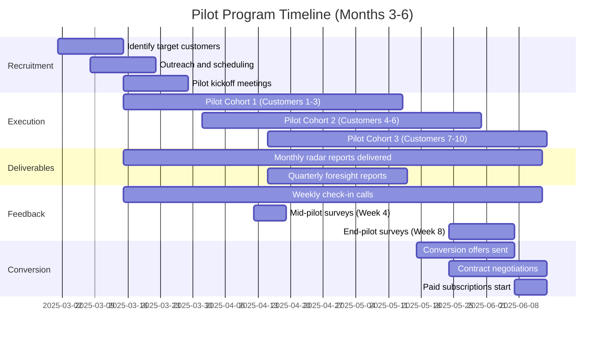
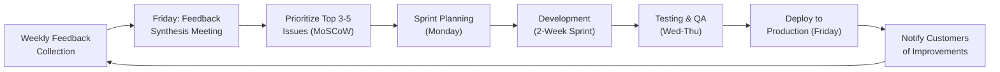

# Pilot Program Strategy: Customer Validation & Product-Market Fit

**Sprint**: 07 - Technology Scouting & Strategic Foresight<br/>
**Task**: 05 - Implementation Roadmap<br/>
**Author**: roadmap-planner (AI Agent)<br/>
**Date**: 2025-11-18<br/>
**Status**: Research Complete

---

## Executive Summary

The pilot program strategy for the AI-powered technology scouting platform is designed to achieve rapid customer validation and product-market fit through a structured 2-month trial with 5-10 friendly corporate innovation teams. This approach leverages B2B SaaS best practices where pilot programs serve as the critical bridge between MVP development and full commercial launch, with properly executed pilots converting at 70-80% to paid subscriptions when structured correctly.

The pilot program begins in Month 3 (concurrent with beta testing) and runs through Month 6, focusing on demonstrating quantifiable value through identification of 2-3 weak signals that customers missed with manual scouting methods. Unlike free trials that rarely convert, this pilot program charges discounted fees ($15K-30K for 2-month trial vs. $60K-150K annual pricing) to ensure customer commitment and validate willingness-to-pay.

The strategy emphasizes building champions within client organizations who can become internal advocates for platform adoption, with success measured by conversion rate (70%+ target), customer satisfaction scores (4/5+ rating), and documented ROI case studies (340% ROI benchmark from technology scouting literature). This pilot-first approach de-risks the go-to-market strategy and creates early customer references essential for scaling to 50-100 customers by Month 9.

---

## Key Findings

- **Pilot Conversion Benchmark**: Properly structured B2B SaaS pilots convert at 70-80% to paid subscriptions when value is demonstrated (Shah, 2024)
- **Paid Pilots Essential**: Free pilots rarely convert; charging $15K-30K ensures customer commitment and validates pricing (Talented Learning, 2024)
- **Customer Profile**: Target Chief Innovation Officers, VPs Innovation, Technology Scouting Leads at Fortune 500-1000 with $200K-500K innovation budgets
- **Pilot Duration**: 2 months (60 days) optimal - long enough to demonstrate value, short enough to maintain urgency
- **Value Demonstration**: 2-3 weak signals identified that customer missed with manual scouting = proof of ROI
- **Success Criteria**: Clear, measurable KPIs agreed upfront (time savings, signal quality, actionable insights)
- **Feedback Intensity**: Weekly check-ins during pilot to capture detailed product feedback and iterate rapidly
- **Champion Development**: Pilot programs succeed when champion becomes internal hero by demonstrating platform value to executives
- **Early Bird Incentive**: 50% discount on Year 1 subscription for pilot participants who commit within 2 weeks of trial completion
- **Case Study Creation**: Document 2-3 pilot success stories for sales collateral, with quantified business impact

---

## Pilot Program Objectives

### Primary Objectives

1. **Product-Market Fit Validation**:
   - Confirm that weak signal detection delivers measurable value to corporate innovation teams
   - Validate that monthly technology radar + quarterly foresight reports meet strategic planning needs
   - Identify feature gaps and prioritize product roadmap enhancements

2. **Customer Success Methodology Development**:
   - Define onboarding process that ensures customer realizes value within first 30 days
   - Establish best practices for domain configuration, alert settings, report customization
   - Create customer success playbook for scaling to 100+ customers

3. **Sales Process Refinement**:
   - Test messaging, value proposition, competitive positioning with real prospects
   - Validate pricing and packaging (Starter, Professional, Enterprise tiers)
   - Identify objections and develop sales enablement materials (objection handling, ROI calculators)

4. **Case Study & Reference Creation**:
   - Document 2-3 quantified success stories with customer testimonials
   - Create referenceable customers for future sales conversations
   - Build proof points for marketing campaigns (website, pitch decks, conference presentations)

---

### Secondary Objectives

1. **Operational Scalability Testing**:
   - Validate that platform can handle 5-10 concurrent customers without performance degradation
   - Test customer support processes (ticketing, documentation, response times)
   - Identify bottlenecks in onboarding, report generation, data pipeline updates

2. **Partnership Opportunity Discovery**:
   - Identify pilot customers who may become white-label partners (e.g., innovation consulting firms)
   - Explore integration opportunities (customer internal innovation platforms, business intelligence tools)
   - Assess demand for API access, data exports, custom domain creation

3. **Market Segmentation Insights**:
   - Understand which industries derive highest value (technology, automotive, healthcare, financial services)
   - Identify persona differences (Chief Innovation Officer vs. VP Strategy vs. Technology Scouting Manager)
   - Determine optimal customer size (Fortune 500 vs. mid-market vs. high-growth startups)

---

## Pilot Program Structure

### Timeline: Month 3 to Month 6



---

### Cohort Approach: Staggered Onboarding

**Rationale**: Onboarding 5-10 customers simultaneously overwhelms product and customer success resources. Staggered cohorts enable continuous learning and iteration.

| Cohort | Start Date | Customers | Focus |
|--------|------------|-----------|-------|
| **Cohort 1** | Month 3, Week 3 | 2-3 customers | **Baseline validation** - Does platform deliver core value? Intensive support to ensure success. |
| **Cohort 2** | Month 4, Week 1 | 3-4 customers | **Process refinement** - Apply learnings from Cohort 1. Test updated onboarding materials. |
| **Cohort 3** | Month 4, Week 3 | 3-4 customers | **Scalability testing** - Validate that processes work with reduced hand-holding. |

**Benefits**:
- Early cohort feedback informs product improvements for later cohorts
- Reduces risk of widespread negative experience if major issues discovered
- Enables A/B testing of onboarding approaches, report formats, alert configurations
- Customer success team learns incrementally vs. being overwhelmed

---

### Pilot Pricing: Paid Pilots for Commitment

**Key Principle**: "If you don't charge, it's not a pilot — it's an extended demo" (Headway.io, 2024)

**Pilot Pricing Structure**:

| Tier | Annual Equivalent | Pilot Price (2 months) | Discount | Target Customer |
|------|-------------------|------------------------|----------|-----------------|
| **Starter** | $60K/year | $15K (2 months) | 70% off | Mid-market innovation teams |
| **Professional** | $100K/year | $25K (2 months) | 70% off | Fortune 1000 companies |
| **Enterprise** | $150K/year | $30K (2 months) | 80% off | Fortune 500 companies |

**Rationale**:
- **Commitment Signal**: Paying $15K-30K demonstrates budget authority and serious intent
- **Value Validation**: If customer won't pay discounted pilot fee, unlikely to convert to full annual subscription
- **Decision-Maker Engagement**: Budget approval process ensures C-level awareness and buy-in
- **Revenue Offset**: $150K-300K total pilot revenue offsets Month 3-6 operational costs

**Payment Terms**:
- 50% upfront (due at pilot kickoff)
- 50% at end of Month 1 (contingent on first monthly radar delivery)
- If customer cancels after Month 1, no refund but no additional charges

---

## Pilot Customer Recruitment

### Target Customer Profile

**Decision-Maker Personas**:

1. **Chief Innovation Officer (CIO)** or **VP Innovation**:
   - **Responsibilities**: Lead corporate innovation strategy, manage technology scouting, oversee venture capital investments, report to CEO/Board on emerging technology threats
   - **Pain Points**: Overwhelmed by manual scouting (100+ sources to monitor), missed weak signals discovered by competitors first, board pressure for strategic foresight
   - **Budget Authority**: $200K-500K annual innovation intelligence budget
   - **Evaluation Criteria**: Time savings, signal quality vs. manual scouting, board presentation readiness

2. **Head of Technology Scouting** or **Director of Strategic Planning**:
   - **Responsibilities**: Execute technology monitoring, prepare trend reports, coordinate with R&D and business units
   - **Pain Points**: Labor-intensive data collection, difficulty distinguishing signal from noise, lack of systematic horizon scanning methodology
   - **Budget Authority**: $100K-300K budget, escalates to VP/C-level for approval
   - **Evaluation Criteria**: Automation efficiency, cross-domain insights, integration with existing workflows

3. **Chief Strategy Officer (CSO)**:
   - **Responsibilities**: Long-term strategic planning, M&A target identification, competitive positioning
   - **Pain Points**: Need for data-driven foresight (not just backward-looking analysis), scenario planning for board discussions
   - **Budget Authority**: $300K-1M strategic advisory budget
   - **Evaluation Criteria**: Strategic insight quality, competitive intelligence depth, scenario planning capabilities

---

### Company Segmentation

| Segment | Company Size | Industry Focus | Annual Budget | Pilot Tier | Priority |
|---------|--------------|----------------|---------------|------------|----------|
| **Fortune 500** | $10B+ revenue | Technology, automotive, healthcare, financial services | $500K-1M+ | Enterprise | High |
| **Fortune 1000** | $1B-10B revenue | Manufacturing, pharma, energy, retail | $200K-500K | Professional | High |
| **High-Growth Tech** | 500-5,000 employees, $100M-1B revenue | Software, hardware, biotech | $150K-300K | Professional | Medium |
| **Mid-Market** | 200-500 employees, $50M-500M revenue | Diversified industries | $50K-150K | Starter | Low |

**Pilot Recruitment Focus**: Fortune 500-1000 companies (75% of pilot cohort) + select high-growth tech companies (25%)

---

### Recruitment Channels

**1. Warm Introductions (Highest Priority)**:
- **Advisors & Investors**: Request introductions from board members, angel investors, VCs with corporate innovation connections
- **Existing Network**: Leverage founders' professional networks (former colleagues, conference contacts, LinkedIn 1st-degree connections)
- **Beta Customer Referrals**: Ask MVP beta customers (from Month 3-4) to introduce platform to peer innovation leaders

**Expected Conversion**: 40-60% of warm introductions agree to pilot (vs. 1-3% for cold outreach)

---

**2. LinkedIn Direct Outreach (Medium Priority)**:
- **Search Criteria**: Title = "Chief Innovation Officer" OR "VP Innovation" OR "Head of Technology Scouting"; Company = Fortune 500-1000; Location = US/EU
- **Message Template**:
  ```
  [First Name],

  I noticed [Company] recently [specific innovation initiative - e.g., announced $100M innovation fund / launched corporate VC arm / published future of mobility whitepaper].

  We've built an AI platform that automates weak signal detection across 500+ sources (patents, academic research, VC funding) to identify technology trends 6-18 months before competitors. Early customers are saving 20-30 analyst hours/week and catching signals they missed with manual scouting.

  Would you be open to a 2-month pilot to see if it accelerates [Company]'s technology scouting? Happy to share case studies from [Peer Company 1] and [Peer Company 2].

  Best,
  [Name]
  ```

**Expected Response Rate**: 10-20% of targeted outreach (50-100 messages → 5-10 pilot customers)

---

**3. Industry Conferences (Medium Priority)**:
- **Target Events**: Corporate Innovation Summit, Innovation Leader Conference, TechCrunch Disrupt, Web Summit
- **Booth Strategy**: Live demo of technology radar with pre-populated sample reports for automotive, healthcare, fintech domains
- **Speaking Opportunities**: Submit proposals on "Weak Signal Detection Methodology" or "AI for Strategic Foresight"
- **Networking**: 1:1 meetings with 20-30 innovation leaders per conference

**Expected Conversion**: 3-5 pilot customers per conference attended

---

**4. Thought Leadership Content (Low Priority, Long-Term)**:
- **LinkedIn Posts**: Weekly insights on technology trends, case studies, weak signal examples
- **Medium Articles**: "How to Identify Technology Trends 6-18 Months Before Competitors" (SEO optimization)
- **Webinar Series**: Live demo + Q&A with 50-100 corporate innovation professionals

**Expected Conversion**: 1-2% of content engagement converts to pilot discussions (requires 3-6 months to build audience)

---

### Recruitment Timeline

**Month 3, Week 1-2**: Outreach Campaign Launch

| Day | Activity | Target | Owner |
|-----|----------|--------|-------|
| **Day 1-3** | Advisor warm intro requests | 10-15 targeted intros | Founders |
| **Day 4-7** | LinkedIn search and outreach | 100 personalized messages sent | Sales/Marketing |
| **Day 8-10** | Conference booth confirmed | 1-2 conferences (Month 4-5) | Marketing |
| **Day 11-14** | Follow-up calls scheduled | 10-20 intro calls booked | Sales |

**Month 3, Week 3-4**: Pilot Kickoff

| Day | Activity | Target | Owner |
|-----|----------|--------|-------|
| **Day 15-17** | Pilot agreements signed | 2-3 Cohort 1 customers | Sales |
| **Day 18-21** | Onboarding sessions conducted | All Cohort 1 customers | Customer Success |
| **Day 22-28** | First monthly radar delivered | Cohort 1 | Product Team |

---

## Pilot Onboarding Process

### Pre-Kickoff: Agreement & Expectations

**Pilot Agreement Document** (3-5 pages):

1. **Scope of Services**:
   - 2-month pilot duration (Day 1 = kickoff meeting)
   - Deliverables: 2 monthly technology radars + 1 quarterly foresight report (at end of Month 2)
   - Customer commitment: Weekly feedback calls (30 minutes), end-of-pilot survey, testimonial (if successful)

2. **Success Criteria** (Mutually Agreed KPIs):
   - **Time Savings**: Reduce technology scouting time by 50-70% (baseline measured at kickoff)
   - **Signal Quality**: Identify 2-3 weak signals customer missed with manual scouting
   - **Strategic Value**: Foresight report rated 4/5 or higher for board presentation readiness
   - **User Adoption**: 80%+ of innovation team members log in weekly to review radar updates

3. **Pricing & Payment Terms**:
   - Pilot fee: $15K-30K based on tier (Starter/Professional/Enterprise)
   - Payment schedule: 50% upfront, 50% at end of Month 1
   - Early bird conversion offer: 50% discount on Year 1 annual subscription if commitment made within 2 weeks of pilot completion

4. **Post-Pilot Options**:
   - **Option 1**: Convert to annual subscription with early bird discount (encouraged)
   - **Option 2**: Extend pilot by 1 month at 50% of monthly subscription rate
   - **Option 3**: Decline to proceed (no penalties, but pilot fee non-refundable)

**Legal Review**: Standard SaaS terms, data processing agreement (GDPR compliance), confidentiality for proprietary signals

---

### Kickoff Meeting (60-90 Minutes)

**Attendees**:
- Customer side: Chief Innovation Officer, Technology Scouting Team (2-5 people), optional IT representative (for SSO setup)
- Platform side: Founder/CEO, Customer Success Manager, Product Manager (for feedback capture)

**Agenda**:

**1. Customer Context Deep Dive (20 minutes)**:
   - What are your top 3 strategic priorities for next 12-24 months? (e.g., electric vehicle transition, AI-powered diagnostics, quantum-safe cryptography)
   - Which technology domains are most critical to monitor? (narrow down to 3-5 domains for pilot)
   - How do you currently conduct technology scouting? (sources, frequency, team size, pain points)
   - What does success look like for this pilot? (quantify: hours saved, signals identified, executive satisfaction)

**2. Platform Demo & Configuration (30 minutes)**:
   - Live demo of technology radar interface and sample quarterly foresight report
   - Configure customer domains: Select 3-5 technology domains from pre-built taxonomy (AI/ML, quantum, clean energy, biotech, advanced materials) or define custom domains
   - Set alert preferences: Confidence score thresholds, notification frequency (daily digest vs. real-time alerts), delivery channels (email, Slack, dashboard)
   - User account setup: Provision accounts for innovation team members (5-10 users typical), configure role-based permissions (admin vs. read-only)

**3. Baseline Measurement (15 minutes)**:
   - Document current scouting process metrics:
     - Hours per week spent on technology scouting (aggregate across team)
     - Number of sources manually monitored (academic journals, patent databases, industry news, conferences)
     - Frequency of strategic foresight reports generated (quarterly, bi-annual, ad-hoc)
   - Identify recent weak signals customer discovered manually (for comparison during pilot)

**4. Pilot Timeline & Deliverables (10 minutes)**:
   - Week 2: First monthly technology radar delivered (30-50 signals across customer domains)
   - Week 4: Mid-pilot check-in call + survey (feedback on radar quality, feature requests)
   - Week 6: Second monthly technology radar delivered (with trend progressions from Week 2)
   - Week 8: Quarterly strategic foresight report delivered (board-ready 20-30 page report)
   - Week 9: Final pilot evaluation call + conversion discussion

**5. Q&A & Next Steps (10 minutes)**:
   - Technical questions (SSO setup, API access, data security)
   - Pilot logistics (weekly call scheduling, Slack channel setup, feedback submission process)
   - Set expectation for weekly 30-minute check-in calls

**Post-Meeting Deliverables**:
- Meeting notes shared with customer within 24 hours
- Platform accounts provisioned and login instructions sent
- Calendar invites for all weekly check-in calls
- Dedicated Slack channel (optional) for real-time support

---

### Week 1-2: First Monthly Radar Delivery

**Objective**: Demonstrate immediate value by delivering first monthly technology radar with 30-50 relevant signals.

**Activities**:

1. **Data Collection & Signal Detection**:
   - AI platform scans 500+ sources for customer-configured domains (patents, academic papers, VC funding, industry news)
   - Weak signal detection algorithms identify 30-50 signals with exponential growth patterns, cross-domain correlations, novelty scores
   - Human analyst review (10-20% of signals) to validate quality and flag any false positives

2. **Technology Radar Preparation**:
   - Categorize signals by horizon (H1: 0-2 years, H2: 2-5 years, H3: 5-10+ years)
   - Assign confidence scores (0-100%) based on multi-source validation
   - Position signals on radar chart (quadrants: Assess, Trial, Adopt, Hold)
   - Add context for each signal: Brief description (2-3 sentences), key evidence (3-5 citations), strategic implications (1-2 sentences)

3. **Delivery & Review**:
   - Technology radar published to customer dashboard (interactive web interface)
   - Email notification sent with PDF export and link to interactive version
   - Optional: 30-minute walkthrough call to explain radar interpretation, highlight top 5-10 signals, answer questions

**Success Metrics**:
- Radar delivered within 2 weeks of kickoff (on-time delivery)
- Customer identifies 1-2 signals they were not previously tracking (immediate value demonstration)
- Customer logs into dashboard within 48 hours of delivery (engagement signal)

---

### Week 3-4: Mid-Pilot Check-In & Feedback

**Objective**: Capture detailed feedback to iterate on product and ensure customer is on track for successful pilot completion.

**30-Minute Check-In Call Agenda**:

1. **Radar Usefulness Assessment** (10 minutes):
   - Which signals were most valuable? (identify pattern for future radars)
   - Any signals that were irrelevant or low-quality? (improve noise filtering)
   - Are confidence scores accurate in your judgment? (calibrate ML models)
   - How does signal quality compare to your manual scouting? (competitive positioning)

2. **Feature Feedback** (10 minutes):
   - Dashboard usability: Easy to navigate? Any confusing elements?
   - Alert preferences: Too many alerts? Not enough? Timing issues?
   - Report format: PDF export quality? Missing sections? Branding needs?
   - Requested features: API access? Custom domains? Expert commentary?

3. **Success Trajectory** (10 minutes):
   - Are we on track to meet pilot success criteria? (time savings, signal quality, strategic value)
   - Any concerns or blockers we need to address?
   - What would need to be true for you to convert to annual subscription at end of pilot?

**Mid-Pilot Survey** (Sent After Call):
- 10-question online survey (5-minute completion time)
- Quantitative ratings: Signal quality (1-5), dashboard usability (1-5), support responsiveness (1-5)
- Qualitative feedback: Top 3 feature requests, any frustrations, testimonial-worthy wins

**Product Team Action Items**:
- Prioritize top 3-5 feature requests for implementation before end of pilot (if feasible)
- Address any usability complaints with quick fixes
- Refine domain coverage or alert settings based on feedback

---

### Week 5-6: Second Monthly Radar & Iteration

**Objective**: Demonstrate product improvement based on feedback and show trend progression over time.

**Enhanced Radar Features**:

1. **Trend Progressions**:
   - Highlight signals from Week 2 radar that have progressed (e.g., confidence score increased from 60% to 80% due to new patent filings)
   - Flag new signals that emerged in past 4 weeks
   - Downgrade hype signals that show weakening evidence (e.g., VC funding dried up, publication rate declining)

2. **Customizations Based on Feedback**:
   - Add requested sub-domains (e.g., "solid-state batteries" within "clean energy" domain)
   - Adjust alert thresholds (reduce noise for low-priority domains, increase sensitivity for high-priority domains)
   - Improve report formatting based on customer preferences (executive summary length, citation style, chart types)

3. **Value Demonstration**:
   - Call out 1-2 signals that customer explicitly stated they were not tracking before pilot
   - Include competitive intelligence: "Company X filed 3 patents in [domain] last month" for customer's competitors
   - Add actionable next steps: "Recommend deeper analysis on Signal Y - schedule expert interview or commission technical feasibility study"

**Delivery & Follow-Up**:
- Week 6 radar delivered with email highlighting improvements based on customer feedback
- Optional: 15-minute call to walk through trend progressions and new signals
- Monitor engagement: Track which signals customer clicks on for detailed view (analytics on dashboard usage)

---

### Week 7-8: Quarterly Foresight Report & Pilot Evaluation

**Objective**: Deliver flagship quarterly foresight report demonstrating strategic value for board presentations and conduct final pilot evaluation.

**Quarterly Foresight Report Structure** (20-30 pages):

1. **Executive Summary** (2 pages):
   - Top 5-10 strategic signals with highest business impact for customer industry
   - Key recommendations: Which technologies to invest in, monitor, or deprioritize
   - Competitive landscape: How customer compares to peers on technology adoption

2. **Horizon Analysis** (8-10 pages):
   - **Horizon 1 (0-2 years)**: Technologies ready for adoption or trial (detailed ROI analysis, vendor landscape, implementation roadmap)
   - **Horizon 2 (2-5 years)**: Emerging technologies requiring strategic investment (pilot programs, R&D partnerships, talent acquisition)
   - **Horizon 3 (5-10+ years)**: Long-term disruptive technologies for scenario planning (technology watch, academic collaboration, venture capital monitoring)

3. **Scenario Planning** (5-7 pages):
   - **Scenario 1 (Optimistic)**: Rapid technology maturation, favorable regulatory environment, strong market adoption
   - **Scenario 2 (Baseline)**: Moderate technology progress, mixed regulatory landscape, gradual market adoption
   - **Scenario 3 (Pessimistic)**: Slower-than-expected technology breakthroughs, regulatory headwinds, market skepticism
   - Strategic implications and recommended actions for each scenario

4. **Competitive Intelligence** (3-5 pages):
   - Patent activity analysis: Which competitors are investing heavily in which technology domains
   - Academic partnerships: University collaborations, research consortia, talent pipelines
   - Venture capital activity: Corporate VC investments, M&A targets, partnership announcements

5. **Appendices** (5-10 pages):
   - Full citation list (100-200+ sources: patents, academic papers, funding rounds, news articles)
   - Methodology notes: Data sources, weak signal detection algorithms, confidence scoring methodology
   - Interactive dashboard links for ongoing monitoring

**Report Delivery**:
- Week 8: Report published to customer dashboard and emailed as PDF + PowerPoint
- Week 8: 60-minute presentation call to walk through report, answer questions, discuss strategic implications
- Board-ready version: Optional executive summary (1-2 slides) formatted for board presentation

---

### Week 9: Final Pilot Evaluation & Conversion Discussion

**Final Evaluation Call (60 minutes)**:

**1. Success Criteria Review** (20 minutes):
   - **Time Savings**: Did we reduce technology scouting time by 50-70%? (compare baseline from kickoff to current state)
   - **Signal Quality**: Did we identify 2-3 weak signals you missed with manual scouting? (customer confirmation)
   - **Strategic Value**: How do you rate quarterly foresight report quality for board presentations? (1-5 scale)
   - **User Adoption**: What percentage of innovation team actively used platform? (login analytics)

**2. Testimonial & Case Study** (15 minutes):
   - Request customer testimonial quote (1-2 sentences) for marketing materials (if pilot was successful)
   - Discuss case study creation: Can we quantify business impact? (hours saved, budget efficiency, competitive advantage)
   - Request permission to use company name/logo as reference customer (LinkedIn, website, pitch decks)

**3. Conversion Offer** (20 minutes):
   - Present early bird offer: 50% discount on Year 1 annual subscription (expires in 2 weeks)
   - Pricing options:
     - **Annual Pre-Pay**: Full year upfront (additional 10% discount) → $27K (Starter), $45K (Professional), $67.5K (Enterprise)
     - **Quarterly Billing**: 4 quarterly payments → $30K/year (Starter), $50K/year (Professional), $75K/year (Enterprise)
   - Add-ons: Custom scenario planning workshop ($25K), white-label reseller license (if consulting firm), API access (included in Enterprise)

**4. Objection Handling** (optional if customer hesitates):
   - **Budget Constraints**: Offer quarterly billing to spread costs over fiscal year
   - **Need More Time**: Offer 1-month pilot extension at 50% of monthly subscription rate ($2.5K-6.25K)
   - **Feature Gaps**: Show product roadmap with requested features (timeline for implementation)
   - **Internal Approval Process**: Provide ROI calculator, executive presentation materials, peer references

**5. Next Steps** (5 minutes):
   - If converting: Send contract for e-signature, schedule onboarding for full platform access (additional domains, unlimited users)
   - If extending: Send 1-month extension agreement, continue weekly check-ins
   - If declining: Request feedback on decision rationale (improve product or sales approach), keep warm for future re-engagement

**End-of-Pilot Survey** (Sent After Call):
- Net Promoter Score (NPS): How likely are you to recommend platform to peer innovation leaders? (0-10 scale)
- Overall satisfaction: Rate pilot experience (1-5 scale)
- Value assessment: Did platform deliver ROI compared to pilot investment? (Yes/No/Maybe)
- Open-ended feedback: What would have made pilot more successful? What did we do exceptionally well?

---

## Success Metrics & KPIs

### Pilot-Level Metrics

| Metric | Target | Measurement Method | Owner |
|--------|--------|-------------------|-------|
| **Pilot Conversion Rate** | 70%+ convert to paid subscription | # paid subscriptions / # pilot starts | Sales |
| **Customer Satisfaction** | 4/5 or higher average rating | End-of-pilot survey (1-5 scale) | Customer Success |
| **Net Promoter Score (NPS)** | 40+ (industry benchmark for B2B SaaS) | End-of-pilot survey (0-10 scale) | Customer Success |
| **Value Demonstration** | 80%+ identify 2+ missed signals | Final evaluation call + survey | Product |
| **Time Savings** | 50-70% reduction in scouting time | Baseline (kickoff) vs. final (Week 8) | Customer Success |
| **User Adoption** | 80%+ of innovation team logins weekly | Dashboard analytics | Product |
| **Report Quality** | 4/5 or higher for foresight report | Survey + final evaluation call | Product |
| **Feature Feedback** | 5-10 feature requests per pilot | Weekly calls + mid-pilot survey | Product |

---

### Program-Level Metrics (Across All Pilots)

| Metric | Target | Measurement Method | Owner |
|--------|--------|-------------------|-------|
| **Pilot Recruitment** | 10-20 customers total (Months 3-6) | CRM tracking | Sales |
| **Cohort Distribution** | 2-3 customers per cohort | Onboarding schedule | Customer Success |
| **Revenue from Pilots** | $150K-300K total pilot fees | Invoicing system | Finance |
| **Case Studies Created** | 2-3 quantified success stories | Customer interviews + metrics | Marketing |
| **Testimonials Collected** | 5-10 customer quotes | Survey + evaluation calls | Marketing |
| **Product Iterations** | 10+ feature improvements shipped | Product release notes | Product |
| **Time to First Value** | <2 weeks from kickoff to first radar | Delivery tracking | Customer Success |
| **Support Response Time** | <24 hours for customer questions | Ticketing system | Customer Success |

---

## Pilot Feedback Collection & Iteration

### Feedback Channels

**1. Weekly Check-In Calls** (30 minutes):
- Structured interview format with consistent questions across all customers
- Capture verbatim quotes for product insights and marketing testimonials
- Record and transcribe for thematic analysis (identify recurring patterns)

**2. Mid-Pilot Survey** (Week 4):
- Quantitative ratings: Signal quality, dashboard usability, support responsiveness (1-5 scale)
- Qualitative feedback: Top 3 feature requests, biggest frustration, most valuable signal
- 10 questions, <5 minute completion time

**3. End-of-Pilot Survey** (Week 9):
- Net Promoter Score (NPS): Likelihood to recommend (0-10 scale)
- Overall satisfaction: Pilot experience rating (1-5 scale)
- Value assessment: ROI compared to pilot investment (Yes/No/Maybe)
- Open-ended feedback: Success factors, improvement opportunities
- 15 questions, <10 minute completion time

**4. Dashboard Analytics** (Continuous):
- User engagement: Logins per week, time on platform, signals clicked
- Report downloads: PDF/PPT export frequency, sections most viewed
- Alert interactions: Open rates, click-through rates, opt-out rates
- Feature usage: Which dashboard widgets used most, API calls (if applicable)

**5. In-App Feedback Widget** (Continuous):
- Embedded in dashboard for real-time feedback submission
- Bug reports, feature requests, general comments
- 1-minute submission form with optional screenshot attachment

---

### Feedback Prioritization: MoSCoW Method

**Must-Have Improvements** (Ship During Pilot):
- Critical bugs affecting core functionality (signal detection accuracy, report generation failures)
- Major usability issues blocking customer success (confusing navigation, broken links)
- Security/compliance gaps identified by enterprise customers (SSO issues, data encryption concerns)

**Should-Have Enhancements** (Ship by End of Pilot):
- Top 3-5 feature requests mentioned by 50%+ of pilot customers
- Report customization improvements (branding, executive summary length, chart types)
- Alert granularity enhancements (domain-specific thresholds, notification frequency controls)

**Could-Have Features** (Post-Pilot Roadmap):
- Advanced features requested by <30% of customers (scenario planning tool, expert commentary, API access)
- Nice-to-have improvements that enhance experience but not critical for conversion
- Integration requests for niche tools (e.g., integration with customer-specific innovation platform)

**Won't-Have Features** (Not Planned):
- Out-of-scope requests unrelated to core value proposition
- Requests that would require major architectural changes
- Features relevant only to single customer (unless strategic account)

---

### Rapid Iteration Process (2-Week Sprints)



**Key Practices**:
- **Weekly Feedback Synthesis**: Every Friday, product team reviews all feedback from pilot customers (calls, surveys, analytics, in-app submissions)
- **Cross-Functional Prioritization**: Product Manager, Engineering Lead, Customer Success Manager jointly prioritize improvements using MoSCoW method
- **Fast Deployment**: Ship 3-5 improvements every 2 weeks during pilot period (vs. monthly releases post-launch)
- **Customer Communication**: Email all pilot customers when improvements ship, highlighting which feedback was addressed ("You asked for X, we built it")
- **A/B Testing**: Test experimental features with subset of pilot customers before full rollout (if feasible)

---

## Pilot Conversion Strategy

### Early Bird Offer: Limited-Time Discount

**Offer Structure**:
- **50% discount on Year 1 annual subscription** for pilot customers who commit within 2 weeks of pilot completion
- **Additional 10% discount for annual pre-payment** (vs. quarterly billing)
- **Free onboarding for full platform access** (additional domains, unlimited users, CSM support)

**Rationale**:
- **Urgency**: 2-week deadline creates urgency for decision-making (vs. indefinite consideration that leads to inertia)
- **Value Perception**: 50% discount feels substantial, addresses budget objection for most customers
- **Commitment Signal**: Annual pre-pay indicates high confidence in platform value and reduces churn risk

**Pricing Examples**:

| Tier | Annual List Price | Pilot Early Bird (50% off) | Annual Pre-Pay (60% off total) |
|------|-------------------|----------------------------|-------------------------------|
| **Starter** | $60K | $30K (quarterly billing) | $27K (upfront) |
| **Professional** | $100K | $50K (quarterly billing) | $45K (upfront) |
| **Enterprise** | $150K | $75K (quarterly billing) | $67.5K (upfront) |

**Offer Expiration Handling**:
- **Week 1 After Pilot**: Daily email sequence with ROI calculator, case studies, peer testimonials to drive urgency
- **Week 2 After Pilot**: Final reminder email 48 hours before deadline, offer extension call to address any blockers
- **Post-Deadline**: Offer expires, but customer can still subscribe at standard pricing (no discount) or request 1-month pilot extension at 50% monthly rate

---

### Champion Development: Making Customers Heroes

**Key Principle**: "Pilot programs succeed when champion becomes internal hero by demonstrating platform value to executives" (Headway.io, 2024)

**Champion Enablement Tactics**:

1. **Executive Summary Package** (Delivered Week 8):
   - 2-slide PowerPoint summarizing pilot results: Time savings, missed signals identified, cost-benefit analysis
   - ROI calculator pre-populated with customer's metrics (annual subscription cost vs. analyst labor savings + opportunity capture value)
   - Peer testimonials from similar companies (industry, company size, use case)

2. **Board Presentation Support** (Optional):
   - Offer to attend customer's board meeting (virtual) to present quarterly foresight report findings
   - Prepare 10-15 slide deck with strategic implications for customer industry
   - Provide talking points for champion to present platform value to C-suite

3. **Competitive Intelligence Brief** (Delivered Week 6):
   - Document competitors' technology moves identified through platform (patent filings, VC investments, academic partnerships)
   - Highlight threats customer would have missed without platform (differentiation vs. manual scouting)
   - Create urgency: "Competitor X filed 5 patents in [domain] - 6-month head start on your R&D roadmap"

4. **Case Study Co-Creation** (Week 9):
   - Work with champion to quantify business impact: Hours saved, budget efficiency, strategic decisions influenced
   - Draft case study for champion to share internally (justify annual subscription budget to CFO)
- Offer to present at customer's internal innovation summit or town hall (raise champion's profile)

**Champion Success Metrics**:
- 80%+ of champions receive executive approval for annual subscription within 2 weeks of pilot completion
- 50%+ of champions reference platform in board presentations or C-suite meetings during pilot
- 30%+ of champions refer platform to peer innovation leaders at other companies (referral engine)

---

## Risk Mitigation for Pilot Program

### Risk 1: Low Pilot Conversion Rate (<50%)

**Causes**:
- Weak value demonstration (failed to identify missed weak signals)
- Product bugs or quality issues during pilot
- Customer budget constraints or procurement delays
- Internal politics (champion lacks executive buy-in)

**Mitigation**:
- **Pre-Pilot Qualification**: Only accept pilot customers with confirmed budget authority ($200K+ innovation intelligence budget)
- **Success Criteria Agreement**: Mutually agree on specific, measurable KPIs at kickoff (avoid vague "we'll see if it's useful")
- **Weekly Value Reinforcement**: Every check-in call, highlight specific value delivered (signals identified, time saved, competitive insights)
- **Executive Engagement**: Invite customer's VP/C-level to Week 8 foresight report presentation (build executive sponsorship)

---

### Risk 2: Negative Pilot Experience Damages Reputation

**Causes**:
- Platform outages or performance issues
- Poor signal quality (too much noise, missed relevant signals)
- Inadequate customer support (slow response times, unresolved issues)
- Misaligned expectations (customer expected features not in MVP)

**Mitigation**:
- **Platform Stability Testing**: Load testing and QA before pilot launch (Month 3 focus)
- **Human-in-Loop Quality**: Analyst review of 10-20% of signals to validate AI quality before customer delivery
- **Proactive Support**: Weekly check-ins (don't wait for customer to complain), dedicated Slack channel for real-time questions, <24 hour email response SLA
- **Expectation Setting**: Kickoff meeting clearly defines MVP scope, acknowledge limitations, set realistic timelines for feature requests

---

### Risk 3: Pilot Customers Demand Free or Heavily Discounted Service

**Causes**:
- Customer perceives pilot as "beta testing" (expects free access as favor to company)
- Large enterprises leverage bargaining power ("We'll pilot if it's free")
- Competitive pressure (other vendors offering free trials)

**Mitigation**:
- **Charge for Pilots**: Position as "discounted early access" not "free beta testing" (paid pilots convert at 5-10x rate of free trials)
- **Value Framing**: Emphasize $15K-30K pilot fee is 70-80% discount on annual subscription (highlight savings, not cost)
- **ROI Demonstration**: Share case studies from beta customers showing 340% ROI (platform pays for itself in 1-2 quarters)
- **Firm Pricing Policy**: Don't negotiate pilot pricing (establishes precedent that pricing is non-negotiable, protects revenue integrity)

---

### Risk 4: Pilot Overwhelms Product/Support Resources

**Causes**:
- Too many pilots onboarded simultaneously (5-10 customers all starting Week 1)
- Underestimated support effort (customer questions, bug fixes, custom configurations)
- Product instability requiring constant firefighting

**Mitigation**:
- **Staggered Cohorts**: Onboard 2-3 customers every 2 weeks (Cohort 1, 2, 3 approach)
- **Customer Success Hiring**: Dedicated CSM hired by Month 3 to manage pilot program (vs. founders wearing too many hats)
- **Documentation Investment**: Build comprehensive help center, onboarding videos, FAQ before pilot launch (reduce repetitive support questions)
- **Platform Stability Focus**: Prioritize bug fixes and performance optimization in Month 3-4 over new feature development

---

## Post-Pilot Transition: Onboarding Paid Customers

### Conversion Workflow

**Week 1 After Pilot Completion**:
- **Day 1**: Send early bird offer email with ROI calculator, case studies, contract for e-signature
- **Day 3**: Follow-up call to address any questions or objections
- **Day 5**: If no response, send email with peer testimonials and competitive intelligence brief

**Week 2 After Pilot Completion**:
- **Day 8**: Send final reminder email (48 hours before deadline)
- **Day 10**: Offer expiration - if customer hasn't signed, follow up via phone to understand decision timeline
- **Day 12-14**: If customer requests extension, offer 1-month pilot extension at 50% monthly rate ($2.5K-6.25K)

**Post-Conversion Onboarding** (For Customers Who Sign):
- **Day 1**: Contract signed, payment processed (annual pre-pay or first quarterly invoice)
- **Day 2-3**: Upgrade customer account to full tier (unlock additional domains, unlimited users, API access if Enterprise)
- **Day 7**: Onboarding call to configure additional domains, set up team members, customize report branding
- **Day 14**: First monthly radar delivered as paid customer (with expanded domain coverage)
- **Day 30**: Check-in call to ensure successful transition and address any issues

---

### Paid Customer Success Management

**Quarterly Business Reviews (QBRs)** (Every 3 Months):
- **Agenda**:
  - Review platform usage metrics (logins, report downloads, signals actioned)
  - Discuss ROI vs. baseline (time savings, budget efficiency, strategic decisions influenced)
  - Showcase product roadmap and upcoming features
  - Identify expansion opportunities (additional users, white-label partnership, API access)
- **Goal**: Ensure customer realizes value, drive renewal commitment, identify upsell opportunities

**Annual Renewal Process** (Month 9-10 of Year 1):
- **Month 9**: Send renewal notice with performance summary (signals identified, time saved, competitive insights delivered)
- **Month 10**: Renewal call to discuss Year 2 pricing (offer 10% discount for multi-year commitment), address any concerns
- **Target Renewal Rate**: 90%+ (industry benchmark for B2B SaaS with strong customer success)

---

## References

Shah, D. (2024). B2B SaaS pilots: A disciplined approach. *Medium*. Retrieved from https://medium.com/@dipam.iitm/b2b-saas-pilots-a-disciplined-approach-d586e912063a

Headway.io. (2024). How to run software pilot programs - Build a B2B SaaS pilot plan. Retrieved from https://www.headway.io/blog/how-to-run-a-software-pilot-program-b2b-dos-and-donts

Talented Learning. (2024). Want more B2B sales? Choose pilot programs for the win. Retrieved from https://talentedlearning.com/selling-enterprise-software-choose-pilot-programs-for-the-win/

Lean B2B. (2024). Why you want to consider doing a pilot project with your B2B customers. *Lean B2B Blog*. Retrieved from https://leanb2bbook.com/blog/why-you-want-to-consider-doing-pilot-projects-in-b2b/

PartnerStack. (2024). Why testing and learning is an effective tactic for B2B SaaS. Retrieved from https://partnerstack.com/articles/pilot-programs-testing-learning-b2b-saas

Michella Mae. (2024). Pilot agreement: What it is & when to use one. Retrieved from https://www.michellemaesq.com/blog-posts/post/pilot-agreement-what-it-is-when-to-use-one

LinkedIn. (2024). Testing, testing: Best practices for piloting enterprise SaaS products. Retrieved from https://www.linkedin.com/pulse/20140602232545-7677913-testing-testing-best-practices-for-piloting-enterprise-saas-products
