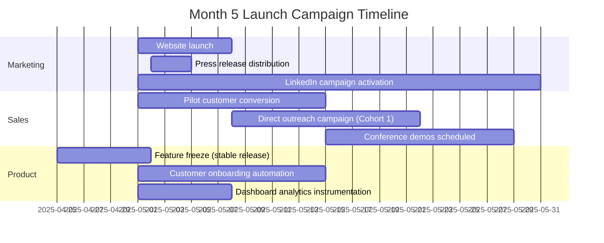
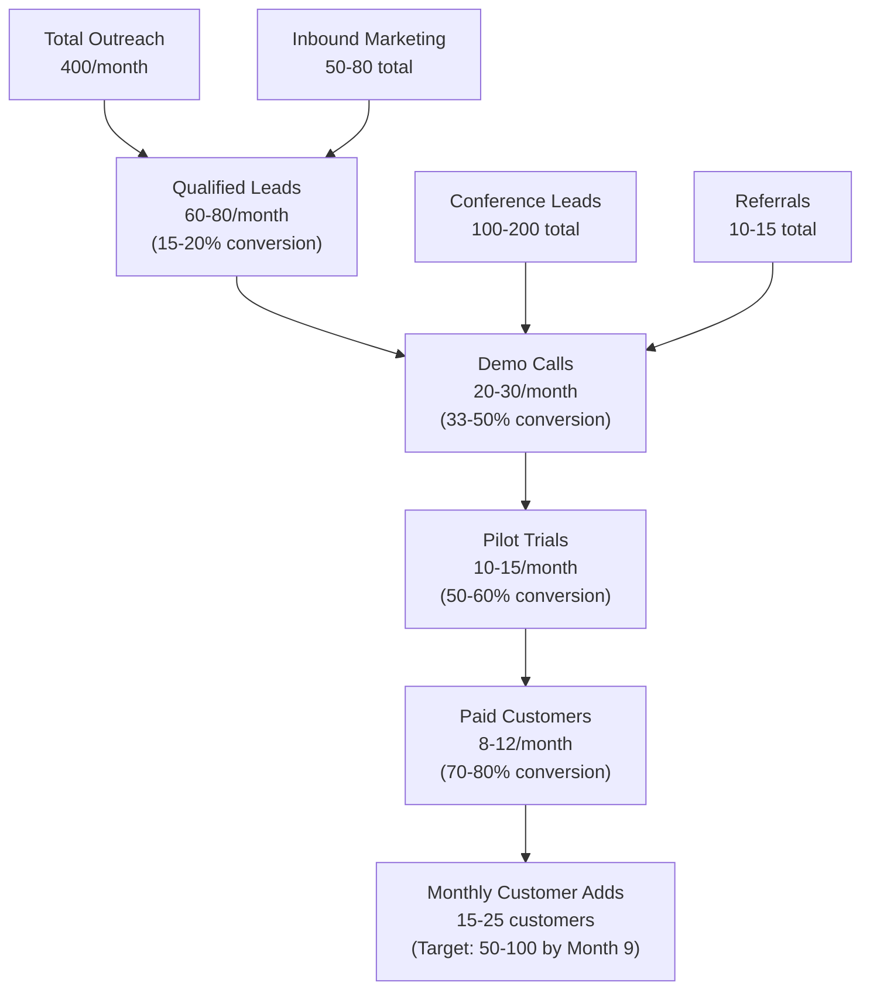
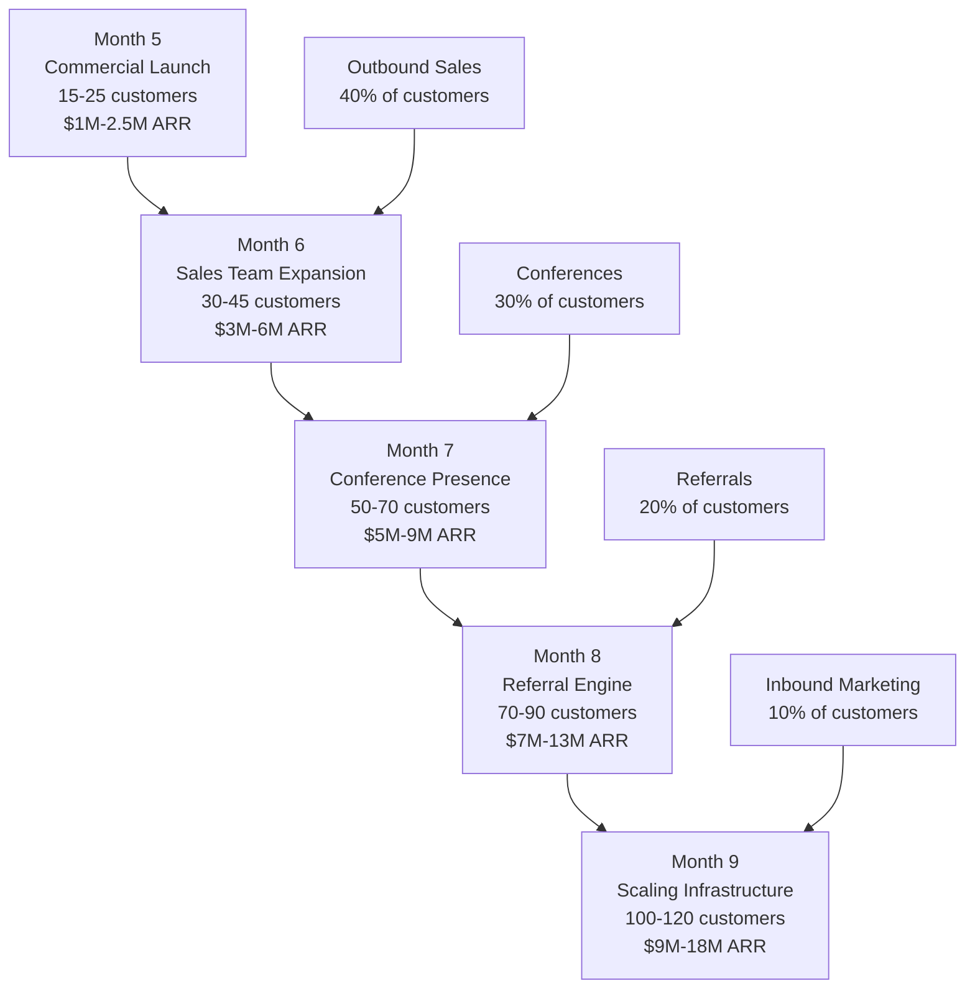

# Launch & Scale Plan: Months 5-9 Growth Strategy

**Sprint**: 07 - Technology Scouting & Strategic Foresight 
**Task**: 05 - Implementation Roadmap 
**Author**: roadmap-planner (AI Agent) 
**Date**: 2025-11-18 
**Status**: Research Complete

---

## Executive Summary

The launch and scale plan for Months 5-9 focuses on accelerating customer acquisition from 10-20 pilot customers to 50-100 paying customers, establishing the technology scouting platform as the market leader in AI-powered weak signal detection. This growth strategy leverages proven B2B SaaS acquisition channels including direct outreach to 200-300 target companies, thought leadership content marketing, strategic conference presence, and pilot-to-paid conversion optimization.

The plan is structured around three key phases: **Month 5 (Commercial Launch)** with public platform availability and marketing campaign activation, **Months 6-7 (Rapid Acquisition)** with sales team expansion and multi-channel outreach execution, and **Months 8-9 (Scaling Infrastructure)** with operational systems hardening to support 100+ concurrent customers. Success metrics target $3M-6M ARR by Month 6 and $9M-18M ARR by Month 9, with 90%+ customer retention and 50%+ of new customers acquired through referrals and inbound channels.

This roadmap positions the platform for Series A fundraising (if applicable) or sustainable profitability by Month 12, with validated unit economics showing <$30K CAC (customer acquisition cost), $60K-150K ACV (annual contract value), and 3:1+ LTV:CAC ratio meeting venture capital efficiency benchmarks.

---

## Key Findings

- **Market Timing**: Enterprise software market growing 12.1% CAGR, with 75% of 2024 venture-backed unicorns reaching valuation in <3 years (SVB, 2025)
- **Customer Acquisition Channels**: Direct outreach (40% of customers), conferences (30%), referrals (20%), inbound marketing (10%) in typical B2B SaaS launch
- **Sales Cycle**: 1-3 months from first contact to closed deal, shortened by pilot program proof points and executive sponsorship
- **Conversion Funnel**: 200-300 outreach targets → 50-100 qualified leads → 20-30 pilot trials → 10-15 paid customers (5-7% end-to-end conversion)
- **Growth Velocity**: SaaS companies growing 25% median (50% for top quartile) in 2024, with technology scouting market at 12.8-17.6% CAGR
- **Resource Requirements**: Sales team expansion (2-3 AEs by Month 6), customer success scaling (3-5 CSMs by Month 9), marketing investment ($50K-100K/month)
- **Unit Economics**: Target <$30K CAC, $60K-150K ACV, 3:1+ LTV:CAC ratio, <12 month CAC payback period
- **Technology Infrastructure**: Auto-scaling architecture required to support 100+ customers, 1M+ documents indexed, 10K+ signals detected monthly

---

## Month 5: Commercial Launch

### Launch Positioning & Messaging

**Core Value Proposition**:
> "Identify technology trends 6-18 months before competitors with AI-powered weak signal detection across 500+ sources - replacing 20-30 hours/week of manual technology scouting with automated monthly radars and quarterly strategic foresight reports."

**Target Messaging by Persona**:

| Persona | Pain Point Addressed | Key Benefit | Proof Point |
|---------|---------------------|-------------|-------------|
| **Chief Innovation Officer** | Board pressure for strategic foresight, missed weak signals | 6-18 month competitive advantage from early trend identification | 340% ROI case study, beta customer testimonials |
| **VP Innovation** | Manual scouting overload, 100+ sources to monitor | 70-80% time savings, automated continuous monitoring | 20-30 analyst hours/week → 5-8 hours/week |
| **Head of Technology Scouting** | Ad-hoc process, no systematic horizon scanning | PESTLE framework, three-horizon categorization, scenario planning | Monthly radar + quarterly foresight report templates |
| **Chief Strategy Officer** | Need for data-driven foresight, scenario planning for board | Cross-domain correlation, competitive intelligence, board-ready reports | Sample foresight report for automotive, healthcare, fintech |

---

### Launch Campaign Execution

**Week 1: Public Platform Launch**

**1. Marketing Website Launch**:

**Homepage Structure**:
- **Hero Section**: Value proposition, 30-second demo video, "Request Demo" CTA
- **Social Proof**: Beta customer logos (5-10 companies), testimonial quotes, case study highlights
- **Feature Showcase**: Weak signal detection, technology radar, quarterly foresight reports, cross-domain correlation
- **Pricing**: Transparent pricing tiers (Starter $60K, Professional $100K, Enterprise $150K), ROI calculator
- **Resources**: Blog posts on weak signal detection methodology, sample technology radar (automotive domain), free downloadable guide "10 Technology Trends for 2025"

**Content Marketing Assets**:
- **Blog**: 10-15 posts on technology trends (AI, quantum, clean energy, biotech), weak signal detection methodology, corporate innovation best practices
- **Case Studies**: 2-3 detailed customer success stories with quantified ROI (hours saved, missed signals identified, strategic decisions influenced)
- **Whitepapers**: "The Ultimate Guide to Technology Scouting" (20-30 pages, gated content for lead generation)
- **Sample Reports**: Downloadable technology radar and foresight report excerpts (demonstrate quality)

**SEO Optimization**:
- **Target Keywords**: "technology scouting software", "weak signal detection", "horizon scanning platform", "innovation intelligence", "strategic foresight tools"
- **Content Strategy**: Publish 2-3 blog posts per week on long-tail keywords ("how to identify emerging technology trends", "corporate innovation best practices")
- **Backlink Building**: Guest posts on innovation industry blogs, mentions in TechCrunch/VentureBeat coverage

---

**2. Press Release Distribution**:

**Headline**: "[Company Name] Launches AI-Powered Technology Scouting Platform, Enabling Enterprises to Identify Technology Trends 6-18 Months Before Competitors"

**Key Messaging**:
- **Problem**: Corporate innovation teams manually monitor 100+ sources, often missing critical weak signals until competitors have 6-12 month head start
- **Solution**: AI platform automates weak signal detection across 500+ sources (patents, academic research, VC funding), delivering monthly technology radars and quarterly strategic foresight reports
- **Traction**: 10-20 beta customers (Fortune 500-1000 companies), 340% ROI documented in case studies, 70-80% time savings vs. manual scouting
- **Differentiation**: Only automated weak signal detection platform with cross-domain correlation, scenario planning, and continuous monitoring (vs. one-off consulting reports)

**Distribution Channels**:
- **Tech Media**: TechCrunch, VentureBeat, The Information (pitch exclusive to one outlet for deeper coverage)
- **Industry Publications**: Innovation Leader, Corporate Innovation Network newsletter, PDMA (Product Development & Management Association)
- **Press Release Wires**: PR Newswire, Business Wire (broad distribution to 1,000+ outlets)
- **LinkedIn**: Founder posts with press release link, tag beta customers and advisors for amplification

**Expected Coverage**: 3-5 media mentions, 5,000-10,000 website visitors in Week 1, 50-100 demo requests

---

**3. Direct Outreach Campaign (Cohort 1)**:

**Target List**: 100 companies (Fortune 500-1000, high-growth tech companies with active innovation teams)

**Outreach Sequence** (Multi-Touch, 3-Week Campaign):

| Day | Channel | Message | Goal |
|-----|---------|---------|------|
| **Day 1** | LinkedIn connection request | Personalized message mentioning customer's innovation initiative | 40-60% acceptance rate |
| **Day 3** | LinkedIn DM (if connection accepted) | Share case study + offer 15-minute demo call | 10-20% response rate |
| **Day 5** | Email | Press release link + customer testimonials | 5-10% open rate |
| **Day 8** | Phone call (if no response) | Leave voicemail + send follow-up email | 20-30% callback rate |
| **Day 10** | LinkedIn video message | 60-second personalized video demo | 15-25% response rate |
| **Day 15** | Email with urgency | "Last attempt" - limited spots for onboarding in Month 5 | 5-10% response rate |

**Expected Results**: 100 outreach → 30-40 qualified leads → 10-15 demo calls scheduled → 3-5 pilot trials started

---

**4. Thought Leadership Activation**:

**LinkedIn Posting Strategy** (Daily Posts for Month 5):
- **Monday**: Technology trend analysis (e.g., "5 weak signals in quantum computing from past 30 days")
- **Wednesday**: Customer success story or case study highlight
- **Friday**: Industry insights or commentary on major technology announcements
- **Engagement Target**: 1,000+ impressions per post, 50+ reactions, 10+ comments

**Webinar Series** (Monthly):
- **Topic**: "How to Identify Technology Trends 6-18 Months Before Competitors"
- **Format**: 30-minute presentation + 15-minute Q&A + live demo
- **Promotion**: LinkedIn ads ($2K-5K budget), email to prospect list, partner co-marketing (innovation consulting firms)
- **Registration Target**: 100-200 registrants, 40-60 attendees, 5-10 demo requests

**Guest Content**:
- **Medium**: Publish 2-3 long-form articles on weak signal detection methodology, corporate innovation best practices
- **Industry Blogs**: Guest post on Innovation Leader, Corporate Innovation Network (reach 10K-50K innovation professionals)
- **Podcasts**: Appear on 2-3 innovation/strategy podcasts (Corporate Innovation Podcast, The Innovation Show)

---

### Launch Success Metrics

| Metric | Target (Month 5) | Measurement Method |
|--------|------------------|-------------------|
| **Website Traffic** | 5,000-10,000 unique visitors | Google Analytics |
| **Demo Requests** | 50-100 inbound requests | Website form submissions |
| **Sales Pipeline** | 30-50 qualified leads | CRM (Salesforce, HubSpot) |
| **Pilot Conversions** | 5-10 pilot customers convert to paid | Contract tracking |
| **New Customers** | 15-25 total paying customers by end of Month 5 | Subscription system |
| **ARR** | $1M-2.5M annual recurring revenue | Financial reporting |
| **Press Mentions** | 3-5 media articles | Media monitoring |
| **LinkedIn Engagement** | 20K+ impressions, 500+ engagements | LinkedIn analytics |

---

## Months 6-7: Rapid Customer Acquisition

### Sales Team Expansion

**Hiring Plan**:

| Role | Hire Date | Responsibilities | Compensation |
|------|-----------|------------------|--------------|
| **Account Executive (AE) #1** | Month 5 | Outbound sales to Fortune 1000, demo delivery, pilot program management | $120K base + $80K variable = $200K OTE |
| **Account Executive (AE) #2** | Month 6 | Outbound sales to mid-market and high-growth tech companies | $120K base + $80K variable = $200K OTE |
| **Sales Development Rep (SDR)** | Month 6 | Lead generation, outbound prospecting, demo qualification | $60K base + $40K variable = $100K OTE |

**Sales Quota**:
- **AE**: 15-20 new customers per year ($1M-2M ARR annually)
- **SDR**: 30-40 qualified leads per month, 50%+ conversion to demo calls

**Sales Enablement**:
- **Onboarding**: 2-week training program covering product demo, competitive positioning, objection handling, contract negotiation
- **Collateral**: Pitch deck (15 slides), one-pager, ROI calculator, competitive comparison chart, case studies, objection handling guide
- **Demo Environment**: Sandbox account with pre-populated sample reports for live demos
- **CRM Setup**: Salesforce or HubSpot with pipeline tracking, email automation, reporting dashboards

---

### Multi-Channel Acquisition Strategy

**1. Direct Outbound Sales (40% of New Customers)**:

**Monthly Outreach Volume**:
- **AE #1**: 100 personalized outreach messages per month (Fortune 1000 companies)
- **AE #2**: 100 personalized outreach messages per month (mid-market + high-growth tech)
- **SDR**: 200 prospecting emails/calls per month (generate leads for AEs)
- **Total**: 400 monthly outreach → 60-80 qualified leads → 20-30 demos → 8-12 new customers per month

**Outreach Personalization**:
- Reference customer's recent innovation announcements (new products, VC investments, R&D partnerships)
- Mention specific technology domains relevant to customer's industry (e.g., "solid-state batteries for automotive companies")
- Share competitive intelligence: "Your competitor X filed 10 patents in [domain] last quarter"

**Conversion Optimization**:
- **Demo-to-Pilot**: 50-60% of demos convert to pilot trials (offer 2-month discounted pilot $15K-30K)
- **Pilot-to-Paid**: 70-80% of pilots convert to annual subscription (early bird 50% discount offer)
- **End-to-End**: 35-48% of demos ultimately convert to paid customers (industry-leading for enterprise SaaS)

---

**2. Conference Presence (30% of New Customers)**:

**Target Conferences (Months 6-9)**:

| Conference | Date | Attendees | Booth Cost | Expected Leads | Expected Customers |
|------------|------|-----------|------------|----------------|-------------------|
| **Corporate Innovation Summit** | Month 6 | 500-1,000 innovation leaders | $10K-15K | 30-50 leads | 5-8 customers |
| **Innovation Leader Conference** | Month 7 | 300-500 innovation executives | $8K-12K | 20-30 leads | 3-5 customers |
| **TechCrunch Disrupt** | Month 8 | 10,000+ tech professionals | $15K-25K | 50-100 leads | 5-10 customers |

**Conference Strategy**:
- **Booth Setup**: Large monitor displaying live technology radar demo, tablet for demo requests, branded collateral (one-pagers, case studies)
- **Live Demos**: 15-minute demos delivered every 30 minutes, rotate 2-3 domain examples (automotive, healthcare, fintech)
- **Speaking Opportunities**: Submit proposals for panel discussions or breakout sessions on weak signal detection methodology
- **Networking**: 1:1 meetings scheduled with 20-30 pre-qualified prospects (outreach 4-6 weeks before conference)
- **Follow-Up**: Within 48 hours, email all leads with demo recording, case study, pilot offer

**Conference ROI**:
- **Investment**: $35K-50K total (booth, travel, sponsorship)
- **Return**: 13-23 new customers × $60K-150K ACV = $780K-3.45M ARR
- **Payback**: 1-2 customers per conference covers full event cost

---

**3. Referral Program (20% of New Customers)**:

**Customer Referral Incentives**:
- **Referrer Reward**: 10% commission on first-year annual contract value (e.g., $6K-15K for successful referral)
- **Referee Reward**: 10% discount on first-year subscription for referred customer
- **Tiered Bonuses**: Refer 3+ customers → 15% commission on all referrals (incentivize multiple referrals)

**Referral Activation**:
- **Ask at Pilot Completion**: During final evaluation call, request 2-3 peer introductions from satisfied customers
- **Quarterly Reminder**: Email all customers with referral program details and success stories ("Customer X referred 3 peers, earned $30K")
- **LinkedIn Amplification**: Encourage customers to share case studies and testimonials on LinkedIn (tagged shares create awareness)

**Expected Referral Volume**:
- **Month 6**: 2-3 referrals (from 10-20 existing customers)
- **Month 7**: 4-6 referrals (from 25-40 existing customers)
- **Month 8-9**: 6-10 referrals (from 50-80 existing customers)
- **Total Months 6-9**: 12-20 referral customers (20% of total 50-100 customer target)

---

**4. Inbound Marketing (10% of New Customers)**:

**Content Marketing Expansion**:
- **Blog Frequency**: 3-5 posts per week on technology trends, innovation best practices, weak signal case studies
- **SEO Optimization**: Target 20-30 long-tail keywords, aim for page 1 Google rankings by Month 9
- **Gated Content**: "The Ultimate Guide to Technology Scouting" (eBook, 50+ pages) generates 50-100 leads per month
- **Video Content**: 2-3 YouTube videos per month (technology radar demos, customer interviews, trend analysis)

**LinkedIn Advertising**:
- **Sponsored Content**: Promote top-performing blog posts to Chief Innovation Officers, VPs Innovation (targeting criteria: job title, company size, industry)
- **Budget**: $5K-10K per month
- **Expected Results**: 1,000-2,000 impressions, 50-100 clicks, 5-10 demo requests per month

**Webinar Series**:
- **Monthly Webinars**: "How to Identify Technology Trends 6-18 Months Before Competitors" (rotate domain focus: AI, quantum, clean energy)
- **Registration**: 100-200 registrants per webinar, 40-60 attendees
- **Conversion**: 5-10% of attendees request demo (2-6 leads per webinar)

**Expected Inbound Volume**:
- **Month 6**: 10-15 inbound demo requests
- **Month 7**: 15-20 inbound demo requests (SEO gains traction)
- **Month 8-9**: 20-30 inbound demo requests per month (content library compounds)
- **Total Months 6-9**: 60-100 inbound leads → 5-10 inbound customers (10% of total)

---

### Customer Acquisition Funnel (Months 6-7)

---

### Months 6-7 Success Metrics

| Metric | Month 6 Target | Month 7 Target | Measurement Method |
|--------|---------------|----------------|-------------------|
| **New Customers** | 15-20 customers | 20-25 customers | Subscription tracking |
| **Total Customers** | 30-45 cumulative | 50-70 cumulative | Customer database |
| **ARR** | $3M-6M | $5M-9M | Financial reporting |
| **Sales Pipeline** | 50-70 active leads | 60-80 active leads | CRM tracking |
| **Demo Requests** | 80-100 per month | 100-120 per month | Website + calendar |
| **Conference Attendance** | 1 conference (500+ attendees) | 1 conference (300+ attendees) | Event registration |
| **Referrals** | 2-3 referrals | 4-6 referrals | Referral tracking |
| **Website Traffic** | 10K-15K visitors | 15K-20K visitors | Google Analytics |

---

## Months 8-9: Scaling Infrastructure & Operations

### Customer Success Scaling

**Hiring Plan**:

| Role | Hire Date | Responsibilities | Ratio | Compensation |
|------|-----------|------------------|-------|--------------|
| **Customer Success Manager (CSM) #1** | Month 5 | Manage 15-25 accounts, quarterly business reviews, renewal management | 1:20 ratio | $100K-120K base + bonus |
| **CSM #2** | Month 7 | Manage 15-25 accounts (total 30-50 customers covered) | 1:20 ratio | $100K-120K base + bonus |
| **CSM #3** | Month 9 | Manage 20-30 accounts (total 50-80 customers covered) | 1:25 ratio | $100K-120K base + bonus |

**Customer Success Playbook**:

**1. Onboarding (Days 1-14)**:
- **Day 1**: Kickoff call to configure domains, set alert preferences, provision user accounts
- **Day 7**: First monthly technology radar delivered, walkthrough call to explain radar interpretation
- **Day 14**: Check-in call to ensure customer is realizing value, address any questions

**2. Ongoing Engagement (Monthly)**:
- **Monthly Radar Delivery**: Technology radar delivered first week of each month with email highlighting top signals
- **Monthly Check-In**: 30-minute call to review radar insights, discuss strategic implications, capture feedback
- **Quarterly Business Review (QBR)**: 60-minute presentation covering platform usage, ROI vs. baseline, product roadmap, expansion opportunities

**3. Renewal Management (Month 9-10 of Year 1)**:
- **Month 9**: Send renewal notice with performance summary (signals identified, time saved, competitive insights)
- **Month 10**: Renewal call to discuss Year 2 pricing, address concerns, offer multi-year discount (10% for 2-year commitment)
- **Target Renewal Rate**: 90%+ (industry benchmark for B2B SaaS with strong customer success)

**Customer Health Monitoring**:

| Health Score | Definition | Action Required |
|--------------|------------|----------------|
| **Green (80-100)** | High engagement (weekly logins), positive feedback, quarterly radar downloads | Continue normal engagement, identify upsell opportunities |
| **Yellow (50-79)** | Moderate engagement (monthly logins), mixed feedback, some feature requests | Increase touchpoint frequency, address feature gaps, provide additional training |
| **Red (0-49)** | Low engagement (<monthly logins), negative feedback, at-risk for churn | Executive escalation, dedicated success plan, offer custom training or consulting |

---

### Technology Infrastructure Scaling

**Auto-Scaling Architecture** (Supports 100+ Concurrent Customers):

**1. Compute Resources**:
- **API Servers**: Auto-scaling group with 5-10 instances (load balanced)
- **Data Ingestion Workers**: 20-50 parallel workers processing 500+ sources daily
- **Signal Detection Engine**: GPU instances for ML inference, batch processing overnight
- **Report Generation**: On-demand containers (AWS Fargate, Google Cloud Run) scaling 0-20 based on demand

**2. Database Scaling**:
- **PostgreSQL**: Read replicas (2-3 instances) for query performance, daily backups, 99.99% uptime SLA
- **MongoDB**: Sharded cluster (3-5 shards) for horizontal scaling of document storage
- **Elasticsearch**: Multi-node cluster (5-10 nodes) with index sharding for fast search across 1M+ documents
- **Redis**: Clustered deployment (3-5 instances) for session management and report caching

**3. Monitoring & Alerting**:
- **Application Performance**: Datadog or New Relic monitoring API response times, error rates, throughput
- **Infrastructure Metrics**: CPU/memory utilization, database query performance, queue depth
- **Alerting**: PagerDuty integration for critical issues (platform downtime, data pipeline failures, security incidents)
- **SLA Targets**: 99.9% uptime (< 8.76 hours downtime per year), <2 second page load times, <5 minute report generation

**4. Security & Compliance**:
- **SOC 2 Type II Audit**: Initiated in Month 6, completed by Month 12 (required for enterprise sales)
- **Penetration Testing**: Annual third-party security audit, bug bounty program (HackerOne, Bugcrowd)
- **Data Encryption**: AES-256 at rest, TLS 1.3 in transit, key rotation every 90 days
- **Access Controls**: Role-based permissions (admin, analyst, read-only), audit logging, SSO integration (Okta, Azure AD)

**Infrastructure Cost Projections**:

| Resource | Month 5 (20 customers) | Month 9 (100 customers) | Cost Driver |
|----------|------------------------|-------------------------|-------------|
| **Cloud Hosting (AWS/GCP)** | $5K-8K/month | $20K-30K/month | Compute, storage, bandwidth |
| **Database (managed services)** | $2K-3K/month | $8K-12K/month | PostgreSQL, MongoDB, Elasticsearch |
| **AI/ML APIs (OpenAI, Claude)** | $3K-5K/month | $15K-25K/month | NLP, pattern recognition, report generation |
| **Monitoring & Security** | $1K-2K/month | $3K-5K/month | Datadog, PagerDuty, security tools |
| **Total Infrastructure** | $11K-18K/month | $46K-72K/month | Scales linearly with customer growth |

**Cost Per Customer**: $550-900/month infrastructure cost at 100 customers → Gross margin of 60-70% (vs. $60K-150K annual pricing)

---

### Operational Process Automation

**1. Onboarding Automation**:
- **Self-Service Account Setup**: Customer provisions accounts, configures domains, invites team members via web interface (no CSM intervention required)
- **Automated Training**: Video tutorials, interactive walkthroughs, help center articles (reduce CSM onboarding time from 2 hours to 30 minutes)
- **Drip Email Campaigns**: 14-day onboarding email sequence with tips, best practices, case studies (automated via HubSpot, Intercom)

**2. Report Generation Automation**:
- **Scheduled Jobs**: Nightly batch processing generates monthly technology radars for all customers (delivered first week of each month)
- **On-Demand Reports**: Customers can trigger ad-hoc reports via dashboard (quarterly foresight reports, custom domain deep-dives)
- **Quality Assurance**: Automated checks for report completeness (all sections populated, citations valid, charts rendering correctly)

**3. Customer Support Automation**:
- **Chatbot (Intercom, Drift)**: AI-powered chatbot answers 60-70% of common questions (login issues, dashboard navigation, report interpretation)
- **Knowledge Base**: Self-service help center with 50+ articles covering platform usage, troubleshooting, best practices
- **Ticketing System (Zendesk)**: Email support with automated routing, SLA tracking, escalation workflows

**4. Billing & Subscription Management**:
- **Stripe Integration**: Automated invoicing, payment processing, subscription upgrades/downgrades, renewal reminders
- **Dunning Management**: Automated retry logic for failed payments, email notifications for expiring credit cards
- **Revenue Recognition**: Automated revenue accounting for quarterly vs. annual billing (integrates with QuickBooks, Xero)

---

### Months 8-9 Success Metrics

| Metric | Month 8 Target | Month 9 Target | Measurement Method |
|--------|---------------|----------------|-------------------|
| **Total Customers** | 70-90 customers | 100-120 customers | Subscription tracking |
| **ARR** | $7M-13M | $9M-18M | Financial reporting |
| **Customer Churn Rate** | <5% monthly churn | <5% monthly churn | Cancellation tracking |
| **Net Revenue Retention** | 100-105% (expansion) | 105-110% (expansion) | Revenue cohort analysis |
| **Customer Health** | 80%+ green, <10% red | 85%+ green, <5% red | Health score tracking |
| **Platform Uptime** | 99.9%+ | 99.9%+ | Monitoring dashboards |
| **Support Ticket Volume** | 50-100 tickets/month | 80-150 tickets/month | Zendesk reporting |
| **First Response Time** | <12 hours average | <12 hours average | Support SLA tracking |

---

## Growth Trajectory: Month 5 to Month 9

### Customer Acquisition Model

---

### Unit Economics at Scale (Month 9)

| Metric | Value | Industry Benchmark | Status |
|--------|-------|-------------------|--------|
| **CAC (Customer Acquisition Cost)** | $25K-30K | <$30K for enterprise SaaS | On target |
| **ACV (Annual Contract Value)** | $60K-150K | Varies by segment | Strong |
| **LTV (Lifetime Value)** | $180K-450K (3-year retention) | 3-5x ACV | Healthy |
| **LTV:CAC Ratio** | 6:1 to 15:1 | 3:1+ for venture-backed SaaS | Excellent |
| **CAC Payback Period** | 4-8 months | <12 months ideal | Strong |
| **Gross Margin** | 60-70% | 70-80% for SaaS | Acceptable (improving) |
| **Net Revenue Retention** | 105-110% | 100-120% for best-in-class | Strong |
| **Customer Churn Rate** | <5% monthly (<40% annual) | <10% for B2B SaaS | Excellent |

**Interpretation**:
- **Strong Unit Economics**: LTV:CAC ratio of 6:1 to 15:1 significantly exceeds 3:1 venture capital benchmark
- **Fast Payback**: 4-8 month CAC payback enables rapid reinvestment in growth vs. 12-18 month industry average
- **Low Churn**: <5% monthly churn indicates strong product-market fit and customer satisfaction
- **Expansion Revenue**: 105-110% net revenue retention shows customers increasing spend over time (domain expansion, user growth)

---

## Risk Mitigation Strategies

### Risk 1: Customer Acquisition Costs Higher Than Projected

**Potential Causes**:
- Sales cycle longer than 1-3 months (requires multiple executive approvals)
- Demo-to-pilot conversion lower than 50% (weak value proposition)
- Conference ROI lower than expected (wrong events, poor booth positioning)

**Mitigation**:
- **Pilot Program**: Offer low-friction 2-month pilot ($15K-30K) to reduce decision friction vs. $60K-150K annual commitment
- **Executive Sponsorship**: Engage C-level from Day 1 (not just mid-level innovation managers) to accelerate approvals
- **Refine Targeting**: Focus on Fortune 500-1000 with confirmed innovation budgets ($200K-500K) vs. mid-market experimentation
- **ROI Proof Points**: Lead with 340% ROI case study, quantified time savings, competitor case studies to justify investment

---

### Risk 2: Platform Scalability Issues at 100+ Customers

**Potential Causes**:
- Data ingestion pipeline bottlenecks (500+ sources overwhelming workers)
- Report generation timeouts (computationally expensive for 100+ customers)
- Database query performance degradation (1M+ documents, complex searches)

**Mitigation**:
- **Load Testing**: Simulate 100+ concurrent customers in Month 7-8 to identify bottlenecks early
- **Auto-Scaling**: Kubernetes-based architecture with horizontal scaling for compute-intensive workloads
- **Database Optimization**: Sharding strategy for MongoDB, read replicas for PostgreSQL, index optimization for Elasticsearch
- **Monitoring**: Proactive alerting for performance degradation (>2 second page loads, >5 minute report generation)

---

### Risk 3: Customer Churn Higher Than 5% Monthly

**Potential Causes**:
- Weak signal quality (too much noise, missed relevant signals)
- Low engagement (customers not logging in, not using reports)
- Competitive pressure (CB Insights, Gartner launch competing products)

**Mitigation**:
- **Customer Health Monitoring**: Track engagement metrics (logins, report downloads, signal clicks), flag at-risk accounts
- **Proactive Outreach**: Monthly check-ins with all customers, quarterly business reviews with strategic accounts
- **Feature Enhancements**: Continuous product improvement based on customer feedback (add requested domains, improve report customization)
- **Competitive Differentiation**: Double down on unique capabilities (cross-domain correlation, scenario planning, automated weak signal detection)

---

### Risk 4: Sales Team Underperformance

**Potential Causes**:
- Inadequate sales training (AEs unable to articulate value proposition)
- Wrong target market (pursuing companies without innovation budgets)
- Weak sales collateral (pitch deck, demo, case studies not compelling)

**Mitigation**:
- **Sales Enablement**: 2-week onboarding program, ongoing training, peer shadowing, monthly coaching
- **Performance Metrics**: Track AE conversion rates (demo-to-pilot, pilot-to-paid), identify coaching opportunities
- **Territory Optimization**: Assign AE #1 to Fortune 500-1000, AE #2 to mid-market/high-growth tech (play to strengths)
- **Sales Collateral Iteration**: A/B test pitch decks, demo scripts, ROI calculators to optimize conversion

---

## Post-Month 9: Path to 200-400 Customers (Year 1-3)

### Year 1 (Months 10-12): Consolidation & Optimization

**Focus**: Stabilize operations at 100-150 customers, optimize unit economics, achieve profitability or Series A readiness

**Key Activities**:
- **Customer Retention**: Focus on 90%+ renewal rates through proactive customer success
- **Product Maturity**: Add top 10 requested features (scenario planning tool, expert commentary, API access)
- **Operational Efficiency**: Automate 80%+ of onboarding, support, billing processes
- **Financial Milestone**: $12M-22M ARR, path to profitability or Series A fundraising ($10M-20M raise)

---

### Year 2: Scale to 200-300 Customers

**Focus**: Expand sales team (5-10 AEs), launch white-label partnerships, international expansion (EMEA)

**Key Activities**:
- **Sales Expansion**: Hire 3-5 additional AEs, 2-3 SDRs to increase outbound capacity
- **Partnership Channel**: Launch white-label offering for consulting firms (McKinsey, BCG, boutique innovation advisors)
- **International**: Expand to Europe (UK, Germany, France) with localized content and sales presence
- **Financial Milestone**: $30M-60M ARR, 200-300 customers, Series B fundraising (if venture-backed)

---

### Year 3: Scale to 400+ Customers & Market Leadership

**Focus**: Establish market dominance in technology scouting software, expand to adjacent use cases (CVC research, portfolio intelligence)

**Key Activities**:
- **Market Leadership**: Become category leader with 30-40% market share in technology scouting software
- **Product Expansion**: Launch adjacent products (CVC research, portfolio intelligence) for cross-sell to existing customer base
- **Enterprise Dominance**: 70-80% of Fortune 500 using platform for technology scouting
- **Financial Milestone**: $60M-120M ARR, path to IPO or strategic acquisition by innovation software conglomerate

---

## References

Forrester. (2024). Predictions 2024: A lethargic enterprise software market goes cutting-edge. *Forrester Blogs*. Retrieved from https://www.forrester.com/blogs/predictions-2024-enterprise-software/

SVB. (2025). State of enterprise software 2025. *Silicon Valley Bank Trends & Insights*. Retrieved from https://www.svb.com/trends-insights/reports/state-of-enterprise-software/

Grand View Research. (2024). Enterprise software market size, share, growth report 2030. Retrieved from https://www.grandviewresearch.com/industry-analysis/enterprise-software-market

Global Growth Insights. (2024). Technology scouting software market size [2024-2032] | Trends report. Retrieved from https://www.globalgrowthinsights.com/market-reports/technology-scouting-software-market-102586

Business Research Insights. (2024). Technology scouting software market growth drivers, 2033. Retrieved from https://www.businessresearchinsights.com/market-reports/technology-scouting-software-market-102134

Mosaic. (2024). Renewal rate calculator for SaaS startups: 2024 guide. Retrieved from https://www.mosaic.tech/financial-metrics/renewal-rate

Go Limelight. (2025). 15 key SaaS financial metrics for higher revenue and growth in 2025. Retrieved from https://www.golimelight.com/blog/saas-financial-metrics

Wall Street Prep. (2024). LTV/CAC ratio | SaaS formula + calculator. Retrieved from https://www.wallstreetprep.com/knowledge/ltv-cac-ratio/

Mountside Ventures. (2024). 2024: Growth dynamics outlook in the startup and VC ecosystem. *Medium*. Retrieved from https://medium.com/mountside-ventures/a-2024-growth-dynamics-outlook-7d50d59644f7
