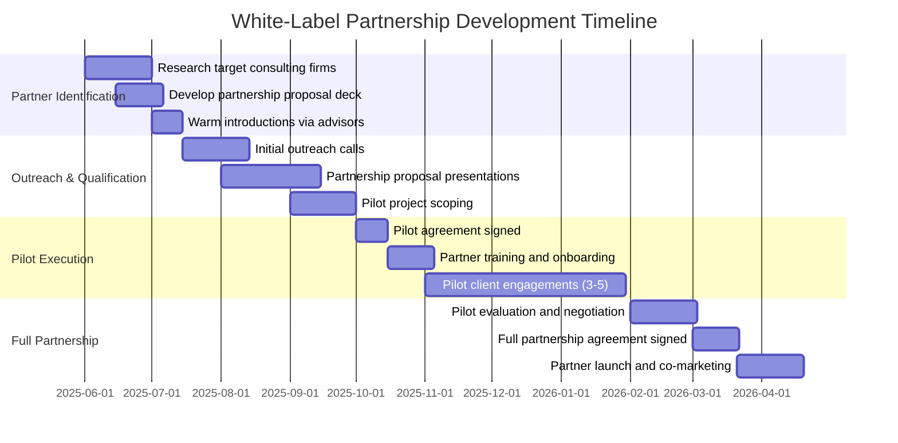

# Partnership & Channel Strategy

**Sprint**: 07 - Technology Scouting & Strategic Foresight 
**Task**: 05 - Implementation Roadmap 
**Author**: roadmap-planner (AI Agent) 
**Date**: 2025-11-18 
**Status**: Research Complete

---

## Executive Summary

The partnership and channel strategy focuses on establishing white-label partnerships with strategic consulting firms and industry associations to accelerate market penetration and expand total addressable market. This dual-channel approach leverages consulting firms (McKinsey, BCG, boutique innovation advisors) to deliver technology scouting services to their Fortune 500 clients, generating $500K-$1M annual licensing fees per partnership, while industry associations (Corporate Innovation Network, PDMA) provide access to 10,000-50,000 corporate innovation professionals for lead generation and thought leadership positioning.

White-label partnerships create a high-leverage growth channel where consulting firms rebrand the platform and resell to 50-100+ clients each, effectively multiplying go-to-market reach without proportional scaling of direct sales resources. This model follows proven SaaS white-label partnership strategies where technology providers enable consulting firms to expand service offerings while maintaining client relationships and capturing margin on implementation services.

The partnership roadmap targets 2-3 white-label partnerships by Year 2 (contributing $1.5M-3M ARR) and 5-10 industry association relationships for lead generation and brand building. Success metrics focus on partner revenue contribution (20-30% of total ARR by Year 3), partner satisfaction (90%+ renewal rates), and co-branded thought leadership (joint webinars, conference presentations, research reports).

---

## Key Findings

- **White-Label Market**: Consulting firms increasingly partner with technology providers to expand service offerings without R&D investment (LMS Portals, 2024)
- **Partnership Economics**: $500K-$1M annual licensing fee per consulting partner vs. $25K-30K CAC for direct sales (20-40x leverage)
- **Partner Loyalty**: White-label partners feel ownership vs. being sales channel, significantly boosting engagement (Journeybee, 2024)
- **Revenue Share Model**: Alternative to fixed licensing - 20-30% revenue share on consulting engagements using platform
- **Partner Selection Criteria**: Track record, service delivery partnerships, technological currency, client alignment (Unbench, 2024)
- **Industry Associations**: Corporate Innovation Network (5,000+ members), PDMA (3,000+ members) provide access to innovation decision-makers
- **Co-Marketing Benefits**: Joint webinars, conference presentations, research reports build credibility faster than solo marketing
- **Technology Currency**: Partners must stay current with technological advancements to avoid becoming millstone (That Company, 2024)
- **Implementation Support**: Partners require training, technical support, co-branded collateral to successfully deliver services
- **Competitive Risk**: Partners may eventually build proprietary technology (mitigate with exclusive contracts, deep integration, continuous innovation)

---

## White-Label Partnership Strategy

### Partnership Model Overview

**What is White-Label Partnership?**:

White-label solutions are pre-built products created by one company but rebranded and sold by another as their own. In this model, consulting firms license the technology scouting platform and rebrand it with their firm name, logo, and methodology branding, delivering strategic foresight services to their corporate clients while the technology provider operates the platform infrastructure.

**Value Proposition for Consulting Firms**:

1. **Expand Service Offerings**: Add AI-powered technology scouting to consulting portfolio without 2-3 year R&D investment ($5M-10M development cost)
2. **Maintain Client Relationships**: Consulting firm owns client relationship and captures implementation/advisory margin (platform is backbone, not customer-facing)
3. **Cost Efficiency**: $500K-$1M annual licensing fee vs. $5M-10M to build proprietary platform + ongoing engineering costs
4. **Fast Time-to-Market**: Launch technology scouting practice in 1-2 months vs. 2-3 years internal development
5. **Technology Currency**: Access latest AI/ML capabilities without hiring machine learning engineering team

**Value Proposition for Platform Provider**:

1. **Revenue Leverage**: $500K-$1M per partnership serves 50-100 consulting clients (vs. $25K-30K CAC per direct customer)
2. **Market Expansion**: Consulting firms bring Fortune 500 relationships and C-level access difficult to reach via direct sales
3. **Brand Building**: Association with McKinsey/BCG validates platform quality and accelerates enterprise adoption
4. **Recurring Revenue**: Multi-year licensing agreements (2-3 years typical) provide predictable revenue stream
5. **Reduced Sales Complexity**: Partner owns sales process, implementation, customer success (platform provider focuses on product development)

---

### Target Partner Profiles

**Tier 1: Top-Tier Strategy Consulting Firms**

| Firm Type | Examples | Client Base | Engagement Value | Partnership Potential |
|-----------|----------|-------------|------------------|---------------------|
| **Big 3 Consulting** | McKinsey, BCG, Bain | Fortune 500 CEOs, boards | $500K-$2M per strategic foresight engagement | High value but difficult to penetrate (long sales cycles, complex procurement) |
| **Big 4 Advisory** | Deloitte, PwC, EY, KPMG | Fortune 1000 across industries | $300K-$1M per innovation advisory engagement | Moderate value, more accessible than Big 3 |

**Partnership Approach**:
- **Entry Point**: Partner with specific practice (Innovation Advisory, Technology Strategy, Digital Transformation)
- **Pilot Project**: 6-month pilot with 3-5 consulting engagements to validate platform value
- **Full Partnership**: Multi-year exclusive or semi-exclusive licensing agreement after pilot success

**Expected Timeline**: 9-18 months from first contact to signed partnership (slow but high-value)

---

**Tier 2: Boutique Innovation Consulting Firms**

| Firm Type | Examples | Client Base | Engagement Value | Partnership Potential |
|-----------|----------|-------------|------------------|---------------------|
| **Innovation Consulting Boutiques** | Innosight, Fahrenheit 212, Jump Associates | Fortune 500-1000 innovation leaders | $200K-500K per engagement | High - faster decision-making, aligned client base |
| **Corporate Venturing Advisors** | 500 Startups, Plug and Play, Techstars (corporate programs) | Corporate VCs, innovation teams | $150K-300K advisory retainers | Moderate - overlap with CVC research offering |

**Partnership Approach**:
- **Value Proposition**: Differentiate services with AI-powered technology scouting (vs. manual consultant research)
- **Pilot Project**: 3-month pilot with 2-3 client engagements
- **Full Partnership**: Annual licensing agreement with revenue share or fixed fee

**Expected Timeline**: 3-6 months from first contact to signed partnership (faster than Tier 1)

---

**Tier 3: Technology Advisory & Research Firms**

| Firm Type | Examples | Client Base | Engagement Value | Partnership Potential |
|-----------|----------|-------------|------------------|---------------------|
| **Technology Research Firms** | Gartner, Forrester, IDC (specific practice areas) | IT leaders, CTOs, innovation teams | $100K-300K advisory subscriptions | Low - potential competitors (may build own platform) |
| **Industry Associations** | Corporate Innovation Network, PDMA | Innovation professionals (members) | $50K-150K sponsorship + member discounts | Moderate - lead generation vs. revenue partnership |

**Partnership Approach**:
- **Research Firms**: Co-branded research reports, joint webinars, technology radar collaboration (not full white-label)
- **Industry Associations**: Sponsor events, member discount programs, thought leadership content

**Expected Timeline**: 1-3 months (faster, lighter-weight partnerships)

---

### White-Label Partnership Economics

**Pricing Models**:

**Model 1: Fixed Annual Licensing Fee**

| Partnership Tier | Annual License Fee | Consulting Clients Served | Platform Revenue per Client | Consulting Firm Margin |
|------------------|-------------------|---------------------------|---------------------------|----------------------|
| **Small Partner** (1-10 clients) | $250K-500K | 5-10 clients | $25K-100K per client | Consulting firm charges $150K-500K total engagement (platform is component) |
| **Medium Partner** (10-50 clients) | $500K-750K | 20-50 clients | $10K-37.5K per client | Consulting charges $200K-750K per engagement |
| **Large Partner** (50-100+ clients) | $750K-$1M+ | 50-100+ clients | $7.5K-20K per client | Consulting charges $300K-$1M+ per engagement |

**Rationale**: Fixed fee provides revenue predictability for platform provider, cost certainty for consulting partner

---

**Model 2: Revenue Share**

| Partnership Tier | Revenue Share % | Consulting Engagement Value | Platform Share per Engagement | Upfront Licensing Fee |
|------------------|----------------|-----------------------------|-----------------------------|---------------------|
| **Small Partner** | 25-30% | $150K-500K per engagement | $37.5K-150K per engagement | $50K-100K (covers onboarding, training) |
| **Medium Partner** | 20-25% | $200K-750K per engagement | $40K-187.5K per engagement | $100K-200K |
| **Large Partner** | 15-20% | $300K-$1M+ per engagement | $45K-200K+ per engagement | $200K-300K |

**Rationale**: Revenue share aligns incentives (platform provider succeeds when consulting partner succeeds), lower upfront commitment

---

**Recommended Hybrid Model**:
- **Upfront Licensing Fee**: $200K-500K annually (covers platform access, training, technical support, co-branded collateral)
- **Usage-Based Pricing**: $5K-10K per consulting client served (incentivizes partner to expand platform usage)
- **Revenue Share on Add-Ons**: 20-30% revenue share on scenario planning workshops, custom research (higher-margin services)

**Example Economics** (Medium Partner Serving 30 Clients/Year):
- Upfront licensing: $350K
- Usage-based: 30 clients × $7.5K = $225K
- Total annual revenue: $575K
- Partner delivers $200K-500K engagements to clients (platform is 10-20% of total engagement value)

---

### Partnership Development Process

**Phase 1: Partner Identification & Outreach (Months 1-3)**

**Key Activities**:

**1. Partner Research** (Month 1):
- Identify 20-30 target consulting firms (Tier 1, 2, 3 mix)
- Research firm service offerings, client base, strategic priorities
- Map firm contacts (innovation practice leaders, technology partners, business development)

**2. Partnership Proposal Development** (Month 1-2):
- Create white-label partnership deck (15-20 slides):
  - Market opportunity (technology scouting market $5B-8B TAM)
  - Platform capabilities (weak signal detection, technology radar, foresight reports)
  - White-label model (rebranding, co-branded deliverables, technical support)
  - Economics (pricing models, ROI for consulting firm)
  - Case studies (direct customer success stories demonstrating platform value)
- Develop partnership agreement template (legal review)
- Create partner training materials (onboarding guide, technical documentation, demo scripts)

**3. Warm Introductions** (Month 2-3):
- Leverage advisors, investors, board members for introductions to consulting firm partners
- Attend industry conferences (Corporate Innovation Summit, strategy consulting events) for networking
- LinkedIn outreach to innovation practice leaders with partnership proposal

**4. Initial Qualification Calls** (Month 3):
- 30-minute discovery calls to assess partner fit:
  - Does consulting firm currently offer technology scouting services? (identify service gap)
  - What is client demand for strategic foresight? (validate market opportunity)
  - How does firm currently deliver these services? (understand competitive positioning)
  - What would make white-label partnership attractive? (customization requirements, pricing expectations)

**5. Partnership Proposal Presentations** (Month 4-5):
- 60-minute presentation to consulting firm leadership (practice leader, technology partner, business development)
- Live demo of platform with sample technology radar and foresight report
- Economic modeling: Show ROI of licensing platform vs. building proprietary solution
- Pilot project proposal: 3-6 month pilot with 3-5 client engagements to validate value

---

**Phase 2: Pilot Project Execution (Months 6-9)**

**Pilot Agreement Structure**:
- **Duration**: 3-6 months (flexible based on consulting engagement timelines)
- **Scope**: 3-5 consulting client engagements using platform
- **Pricing**: $50K-100K pilot fee (discounted from $250K-500K full annual licensing)
- **Success Criteria**:
  - Client satisfaction: 4/5 or higher rating on platform-delivered insights
  - Engagement quality: Platform insights incorporated into 80%+ of final consulting recommendations
  - Time savings: 50-70% reduction in technology scouting time for consulting team
  - Revenue impact: Consulting firm closes 2-3 additional engagements using platform differentiation

**Partner Training & Onboarding** (Week 1-3):
- **Week 1**: Platform overview training (4-hour workshop covering data sources, weak signal algorithms, report customization)
- **Week 2**: Consultant certification program (consultants complete 3-5 practice demos, receive "platform certified" credential)
- **Week 3**: Co-branded collateral development (customize technology radar templates, foresight report branding, client presentation decks)

**Pilot Client Engagements** (Weeks 4-24):
- **Engagement 1**: Joint delivery (platform team shadows consulting team to ensure successful first client experience)
- **Engagement 2-3**: Consulting team delivers independently with platform support on-call
- **Engagement 4-5**: Fully independent delivery (consulting team operates platform without support)

**Weekly Check-Ins**:
- 30-minute calls to review engagement progress, address technical issues, capture feedback
- Document lessons learned, feature requests, customization needs

**Pilot Evaluation** (Month 9):
- Review success criteria achievement (client satisfaction, engagement quality, time savings, revenue impact)
- Consultant feedback on platform usability, feature gaps, training quality
- Economic assessment: Did platform justify pilot investment? What is ROI for full partnership?

---

**Phase 3: Full Partnership Agreement (Month 10-12)**

**Negotiation & Contract Finalization**:
- **Pricing**: Negotiate annual licensing fee ($250K-$1M based on partner size and client volume projections)
- **Exclusivity**: Determine if partnership is exclusive (consulting firm is sole provider in specific geography/industry) or non-exclusive
- **Term**: Multi-year agreement (2-3 years typical) with annual renewal option
- **Support Commitments**:
  - **Platform Provider**: Technical support SLA (<24hr response), quarterly product roadmap reviews, annual feature enhancements
  - **Consulting Partner**: Minimum annual client volume (10-30 engagements), co-marketing commitments (joint webinars, case studies)

**Co-Marketing Launch** (Month 12):
- **Joint Press Release**: Announce partnership and combined offering (distributed to industry media, consulting firm client base)
- **Webinar Series**: "How [Consulting Firm] and [Platform] Are Transforming Technology Scouting" (targeted to Fortune 500 innovation leaders)
- **Case Study Development**: Document 1-2 pilot client success stories with quantified business impact
- **Conference Presentations**: Co-present at Corporate Innovation Summit, Innovation Leader Conference

---

### Partnership Success Metrics

| Metric | Year 1 Target | Year 2 Target | Year 3 Target | Measurement Method |
|--------|---------------|---------------|---------------|-------------------|
| **Active Partnerships** | 1-2 consulting firms | 2-4 consulting firms | 5-8 consulting firms | Partnership contracts |
| **Partner Revenue** | $500K-$1M | $1.5M-3M | $3M-6M | Licensing fees + revenue share |
| **Partner Client Volume** | 10-30 consulting engagements | 30-80 consulting engagements | 80-200 consulting engagements | Partner reporting |
| **Partner Satisfaction** | 4/5 or higher rating | 4.5/5 or higher | 4.5/5 or higher | Quarterly partner surveys |
| **Partner Renewal Rate** | 90%+ | 95%+ | 95%+ | Contract renewals |
| **Co-Branded Content** | 2-3 webinars, 1-2 case studies | 5-10 webinars, 3-5 case studies | 10-15 webinars, 5-10 case studies | Marketing assets |

---

## Industry Association Strategy

### Target Associations

**Corporate Innovation Network**:
- **Members**: 5,000+ corporate innovation professionals (Chief Innovation Officers, VPs Innovation, Technology Scouting Managers)
- **Benefits**: Access to quarterly member events, monthly webinars, email newsletter (10K+ subscribers), member directory
- **Sponsorship Cost**: $50K-100K annually (Gold/Platinum tier)
- **Lead Generation**: 50-100 qualified leads per year (1-2% of member base)

**PDMA (Product Development & Management Association)**:
- **Members**: 3,000+ product managers, innovation leaders, R&D executives
- **Benefits**: Annual conference (1,000+ attendees), regional events, journal advertising, webinar sponsorship
- **Sponsorship Cost**: $30K-60K annually
- **Lead Generation**: 30-60 qualified leads per year

**Additional Associations**:
- **Innovation Leader**: Media + community platform (20K+ innovation leaders)
- **Association of Strategic Planning (ASP)**: 2,000+ corporate strategy professionals
- **Technology Marketing Association**: 5,000+ technology executives (tangential but relevant)

---

### Association Partnership Activities

**1. Sponsorship Benefits**:
- **Conference Booth**: Exhibit at annual conferences (1,000-3,000 attendees), live platform demos, lead capture
- **Speaking Opportunities**: Keynote or breakout sessions on weak signal detection methodology, case studies
- **Webinar Series**: Quarterly webinars to association members (200-500 attendees per webinar)
- **Member Directory Listing**: Premium placement in member directory (online + print)
- **Email Newsletter**: Featured vendor spotlight (1-2x per year, 5K-10K subscribers)

**2. Member Discount Program**:
- **Offer**: 15-20% discount on Starter/Professional tiers for association members
- **Rationale**: Association endorsement validates platform quality, member discount drives conversions
- **Promotion**: Association promotes platform in member communications (email, website, events)
- **Expected Uptake**: 1-2% of member base converts to paying customers (50-100 customers per association)

**3. Co-Branded Research**:
- **Joint Reports**: "State of Technology Scouting 2025" survey of association members, co-branded report (association + platform)
- **Thought Leadership**: Monthly articles in association newsletter/blog on technology trends
- **Case Studies**: Feature association member success stories (with permission)

**4. Advisory Board Participation**:
- **Role**: Join association advisory board or special interest group (Innovation Technology, Strategic Foresight)
- **Benefits**: Direct access to innovation leader decision-makers, input on association strategic direction, speaking opportunities
- **Commitment**: 2-4 meetings per year, thought leadership contributions

---

### Association Partnership ROI

**Investment** (Per Association):
- **Sponsorship Fee**: $50K-100K annually
- **Event Participation**: $10K-20K (conference booth, travel, collateral)
- **Content Development**: $5K-10K (webinars, research reports, articles)
- **Total Annual Investment**: $65K-130K per association

**Expected Returns**:
- **Lead Generation**: 50-100 qualified leads per year
- **Customer Acquisition**: 5-10 paying customers (5-10% lead-to-customer conversion)
- **Revenue**: 5-10 customers × $60K-150K ACV = $300K-1.5M ARR
- **ROI**: $300K-1.5M revenue ÷ $65K-130K investment = 2.3x to 11.5x ROI

**Intangible Benefits**:
- **Brand Credibility**: Association endorsement signals platform quality and enterprise-readiness
- **Thought Leadership**: Regular webinars, articles, conference presentations build founder/company reputation as innovation thought leaders
- **Network Effects**: Association members refer platform to peers (5-10 referrals per year from association connections)

---

## Partnership Enablement & Support

### Partner Training Program

**Initial Certification** (Week 1-3 of Partnership):

**Week 1: Platform Fundamentals** (8 hours total):
- **Data Sources & Coverage**: Understand 500+ sources (patents, academic research, VC funding, industry news)
- **Weak Signal Detection**: How AI algorithms identify exponential growth patterns, cross-domain correlations, novelty
- **Technology Radar**: Interpret radar chart, horizon categorization (H1/H2/H3), confidence scoring
- **Foresight Reports**: Review sample quarterly reports, understand structure and strategic recommendations

**Week 2: Delivery & Customization** (8 hours total):
- **Customer Onboarding**: How to configure domains, set alert preferences, provision user accounts
- **Report Customization**: White-label branding, custom executive summaries, client-specific domain definitions
- **Platform Administration**: Manage customer accounts, troubleshoot common issues, escalate to technical support
- **Demo Delivery**: Practice 30-minute platform demo with feedback from platform team

**Week 3: Certification** (4 hours total):
- **Mock Consulting Engagement**: Deliver sample technology radar and foresight report to simulated client (platform team role-plays client)
- **Certification Exam**: 50-question assessment covering platform capabilities, weak signal methodology, customer success best practices
- **Certification Badge**: "Platform Certified Consultant" credential for LinkedIn, consulting firm website

**Ongoing Training**:
- **Quarterly Product Updates**: 1-hour webinars covering new features, data sources, algorithm improvements
- **Annual Recertification**: Consultants recertify annually to maintain credentials and stay current on platform evolution

---

### Technical Support for Partners

**Support Tiers**:

| Support Level | Response Time SLA | Channels | Included In |
|---------------|------------------|----------|-------------|
| **Standard** | <24 hours | Email, ticketing system | All partnerships |
| **Priority** | <4 hours | Email, phone, Slack | Large partners (50+ clients/year) |
| **Dedicated** | <1 hour | Dedicated CSM, phone, Slack | Strategic partnerships ($1M+ annual) |

**Support Scope**:
- **Technical Issues**: Platform bugs, data pipeline failures, report generation errors
- **Configuration Assistance**: Help with complex domain definitions, custom alert logic, API integration
- **Feature Requests**: Capture partner feature requests, prioritize in product roadmap
- **Training Refreshers**: Ad-hoc training for new consulting team members joining partner firm

---

### Co-Branded Collateral

**Provided to Partners**:

1. **White-Label Report Templates**:
   - Technology radar with consulting firm logo, branding, color scheme
   - Quarterly foresight report with consulting firm custom cover page, executive summary format
   - PowerPoint templates for client presentations

2. **Sales Collateral**:
   - Partner-specific pitch deck (consulting firm logo, joint value proposition)
   - One-pagers, case studies, ROI calculators (co-branded)
   - Demo scripts for consulting team to deliver platform demonstrations

3. **Marketing Assets**:
   - Joint webinar templates (co-branded slides, registration pages)
   - Email marketing templates for consulting firm to promote services to client base
   - Social media graphics (LinkedIn posts, Twitter images) featuring platform + consulting firm

4. **Legal Templates**:
   - Consulting engagement agreements with platform usage terms
   - Data processing agreements (GDPR compliance for client data)
   - Service level agreements (SLA) for platform availability, support response times

---

## Risk Mitigation for Partnerships

### Risk 1: Partner Builds Proprietary Technology

**Scenario**: Consulting firm uses platform for 1-2 years, then invests in building proprietary technology scouting solution to eliminate licensing fees

**Mitigation Strategies**:
1. **Exclusive Contract Provisions**: Multi-year exclusive agreements (2-3 years) with non-compete clauses (partner cannot build competing platform during term + 1-2 years after)
2. **Deep Integration**: Build custom features for strategic partners that create switching costs (custom domains, proprietary algorithms, integrated workflows)
3. **Continuous Innovation**: Maintain 12-18 month technology lead through continuous product development (AI algorithm improvements, new data sources, advanced features)
4. **Economic Deterrent**: Highlight $5M-10M cost and 2-3 year timeline to build proprietary platform (vs. $500K-$1M annual licensing fee)

---

### Risk 2: Partner Underperforms on Client Volume

**Scenario**: Partner commits to serving 30-50 clients per year but only delivers 10-15 clients (revenue underperformance)

**Mitigation Strategies**:
1. **Minimum Guarantees**: Include minimum annual client volume in contract (e.g., 20 clients minimum, partner pays for unfulfilled commitments)
2. **Performance Incentives**: Tiered pricing with volume discounts (encourages partner to exceed minimum commitments)
3. **Co-Marketing Investment**: Jointly invest in demand generation (webinars, conference sponsorships, case studies) to ensure partner has sufficient pipeline
4. **Quarterly Business Reviews**: Track partner performance against targets, provide support to address underperformance early

---

### Risk 3: Partner Quality Issues Damage Platform Brand

**Scenario**: Partner delivers poor-quality consulting services using platform, resulting in customer complaints that reflect negatively on platform brand

**Mitigation Strategies**:
1. **Certification Requirements**: Mandate consulting team certification before delivering client engagements (ensures minimum quality standards)
2. **Customer Feedback Loops**: Collect end-client feedback on platform quality (separate from consulting service feedback)
3. **Quality Audits**: Quarterly reviews of partner deliverables (sample technology radars, foresight reports) to ensure quality standards maintained
4. **Performance Clauses**: Contract provisions allowing termination if partner quality falls below acceptable thresholds (customer satisfaction <4/5)

---

## Partnership Roadmap Timeline

### Year 1: Foundation Building (1-2 Partnerships)

**Months 1-6**:
- Develop partnership proposal deck, agreement templates, training materials
- Identify 20-30 target consulting firms, initiate warm introductions
- Close 1-2 pilot partnerships with boutique innovation consulting firms (faster sales cycles)

**Months 7-12**:
- Execute pilot projects (3-6 months each), validate partner model
- Negotiate full partnership agreements with successful pilot partners
- Generate $500K-$1M partner revenue

---

### Year 2: Scaling (2-4 Partnerships)

**Months 13-18**:
- Close 1-2 additional partnerships (mix of boutique and Tier 1 consulting firms)
- Expand existing partner client volume (20-50 clients per partner)
- Launch co-marketing campaigns (joint webinars, case studies, conference presentations)

**Months 19-24**:
- Partner client volume scales to 30-80 consulting engagements across all partners
- Generate $1.5M-3M partner revenue
- Association partnerships deliver 50-100 qualified leads

---

### Year 3: Market Leadership (5-8 Partnerships)

**Months 25-36**:
- Close 3-4 additional partnerships (including 1-2 Tier 1 consulting firms)
- White-label partnerships contribute 20-30% of total ARR ($6M-18M of $30M-60M total ARR)
- Platform becomes de facto standard for consulting firms delivering technology scouting services

---

## References

LMS Portals. (2024). White-label solutions: The future of software reselling for consulting firms. Retrieved from https://www.lmsportals.com/post/white-label-solutions-the-future-of-software-reselling-for-consulting-firms

That Company. (2024). Unlock your business potential: The power of white label consultants. Retrieved from https://www.thatcompany.com/expert-white-label-consultants-your-ultimate-partner-for-business-growth

Unbench. (2024). White label partnership: Benefits & challenges. Retrieved from https://www.unbench.us/blog/white-label-partnership-benefits-and-challenges-of-outsourcing

BotPenguin. (2025). What is a white label partnership & how does it work? [2025]. Retrieved from https://botpenguin.com/blogs/what-is-a-white-label-partnership-and-how-does-it-work-2023

Journeybee. (2024). Co-branding: Why white label partner software defines partnerships. Retrieved from https://www.journeybee.io/resources/beyond-co-branding-why-white-label-partner-software-defines-winning-partnerships

Convrrt. (2024). White-label partnerships: Benefits, risks, & examples. Retrieved from https://blog.convrrt.com/white-label-partnerships/

Promodo. (2024). White label partnership program: How agencies can grow and scale services. Retrieved from https://www.promodo.com/blog/white-label-partnership

Dynamic Consultants Group. (2024). Microsoft white label consulting services. Retrieved from https://dynamicconsultantsgroup.com/partner/white-label-consulting
