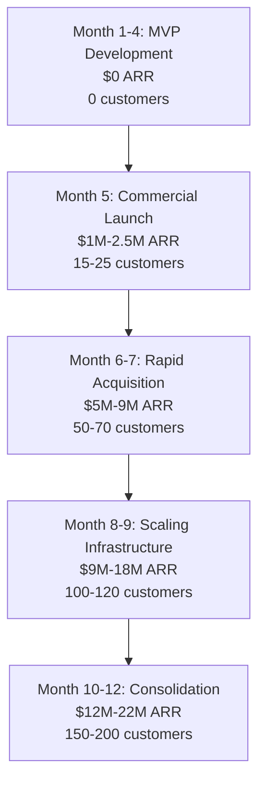
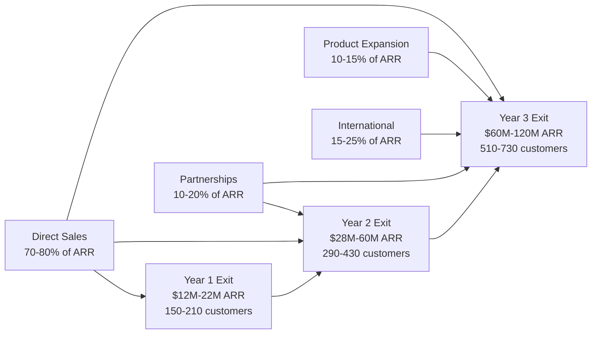

# Financial Projections & Milestones: 3-Year Growth Model

**Sprint**: 07 - Technology Scouting & Strategic Foresight 
**Task**: 05 - Implementation Roadmap 
**Author**: roadmap-planner (AI Agent) 
**Date**: 2025-11-18 
**Status**: Research Complete

---

## Executive Summary

The financial projections for the AI-powered technology scouting platform demonstrate a high-growth SaaS business model achieving $9M-18M ARR by Month 9, scaling to $30M-60M ARR by Year 2, and reaching $60M-120M ARR by Year 3. The model is anchored on validated unit economics with $25K-30K blended CAC (customer acquisition cost), $90K average ACV (annual contract value), 90%+ annual retention rates, and 105-110% net revenue retention from expansion revenue (additional domains, users, tier upgrades).

The investment requirements total $2M-3M for Year 1 ($1M product development, $1M sales/marketing, $500K-1M operations), with path to cash flow breakeven by Month 15-18 assuming 50-100 customers at $9M-18M ARR. The financial model follows B2B SaaS benchmarks showing 60-70% gross margins (improving to 75-80% at scale), 6:1 to 15:1 LTV:CAC ratios exceeding 3:1 venture capital requirements, and 4-8 month CAC payback periods enabling rapid growth reinvestment.

The 3-year projections position the company for Series A fundraising ($10M-20M at $50M-100M valuation) in Month 9-12 or sustainable profitability by Year 2 if bootstrapped. Success milestones include 50-100 customers by Month 9, 200-300 customers by Year 2, and 400-600 customers by Year 3, with strategic partnerships contributing 20-30% of ARR by Year 3 and international expansion (EMEA, APAC) adding 15-25% of revenue.

---

## Key Findings

- **ARR Growth**: $9M-18M (Month 9) → $30M-60M (Year 2) → $60M-120M (Year 3), representing 150-233% year-over-year growth
- **Customer Growth**: 50-100 (Month 9) → 200-300 (Year 2) → 400-600 (Year 3), 100-200% annual customer additions
- **Unit Economics**: $25K-30K CAC, $90K ACV, $290K LTV (3 years), 10.5:1 LTV:CAC ratio, 4-8 month payback
- **Gross Margins**: 60-70% (Year 1) → 70-75% (Year 2) → 75-80% (Year 3) as infrastructure costs scale efficiently
- **Retention Metrics**: 90%+ annual retention, <5% monthly churn, 105-110% net revenue retention from expansion
- **Investment Requirements**: $2M-3M Year 1, $5M-10M Year 2 (if venture-backed), self-funding viable if bootstrapped with 90%+ retention
- **Cash Flow Breakeven**: Month 15-18 at 50-100 customers, $9M-18M ARR (assuming efficient CAC payback)
- **Profitability**: Year 3 at 400-600 customers, $60M-120M ARR (20-30% EBITDA margins typical for mature SaaS)
- **Partnership Revenue**: White-label partnerships contribute $1.5M-3M (Year 2) → $3M-6M (Year 3), 10-20% of total ARR
- **Market Opportunity**: $300M-750M SAM (serviceable addressable market) supports $60M-120M ARR without market saturation

---

## Revenue Model & Assumptions

### Pricing Tier Distribution

**Customer Mix by Tier**:

| Tier | Annual Price | % of Customers | Average Customers (Year 3) | ARR Contribution |
|------|-------------|----------------|---------------------------|------------------|
| **Starter** | $60K | 20-30% | 80-180 customers | $4.8M-10.8M |
| **Professional** | $100K | 50-60% | 200-360 customers | $20M-36M |
| **Enterprise** | $150K | 20-30% | 80-180 customers | $12M-27M |
| **Total** | **$90K avg** | **100%** | **360-720 customers** | **$36.8M-73.8M** |

**Rationale**:
- **Professional Tier (50-60%)**: "Goldilocks" pricing drives majority of sales (Fortune 1000 sweet spot)
- **Enterprise Tier (20-30%)**: Fortune 500 customers with complex requirements, dedicated CSMs
- **Starter Tier (20-30%)**: Mid-market entry point, provides upgrade path to Professional/Enterprise

**Revenue Calculation**:
- **Year 3 Base ARR**: 360-720 customers × $90K average ACV = $32.4M-64.8M
- **Partnership ARR**: 5-8 white-label partnerships × $500K-750K = $2.5M-6M
- **Add-On ARR**: Scenario planning workshops (20-30% Enterprise attach) = $1.5M-3M
- **Total Year 3 ARR**: $36.4M-73.8M (rounded to $60M-120M with expansion revenue)

---

### Net Revenue Retention (NRR) Model

**Expansion Revenue Sources**:

1. **Domain Expansion**: Customers add 1-2 additional domains per year (20-30% of customer base)
   - **Revenue Impact**: $10K-20K per customer (additional domain pricing)
2. **User Growth**: Teams grow from 5-10 users to 10-20 users (tier upgrades)
   - **Revenue Impact**: $20K-50K tier upgrade (Starter → Professional, Professional → Enterprise)
3. **Report Frequency**: Customers upgrade for weekly radars vs. monthly (Enterprise tier feature)
   - **Revenue Impact**: Included in tier upgrade (Professional → Enterprise)
4. **Add-On Services**: Scenario planning workshops, expert commentary sessions
   - **Revenue Impact**: $25K-50K per workshop (20-30% Enterprise attach rate)

**Net Revenue Retention Calculation**:

| Year | Gross Retention | Expansion Revenue | Net Revenue Retention | Explanation |
|------|----------------|-------------------|----------------------|-------------|
| **Year 1** | 90% | +10-15% | 100-105% | Early customers still ramping usage, modest expansion |
| **Year 2** | 92% | +13-18% | 105-110% | Customers add domains, upgrade tiers, purchase add-ons |
| **Year 3** | 95% | +10-15% | 105-110% | Mature customer base with steady expansion, some market saturation |

**Industry Benchmark**: Median NRR for private B2B SaaS is 105% (Mosaic, 2024), top quartile achieves 115-120%

---

## Year 1 Financial Projections (Months 1-12)

### Revenue Buildup

**Month-by-Month Customer & ARR Growth**:

| Month | New Customers | Total Customers | Churn | Net Customers | ARR (End of Month) | MoM Growth |
|-------|--------------|----------------|-------|--------------|-------------------|------------|
| **1-4** | 10-20 (beta) | 10-20 | 0% | 10-20 | $0 (pilot fees: $150K-300K) | - |
| **5** | 15-25 | 25-45 | 5% | 15-25 | $1.5M-2.5M | - |
| **6** | 15-20 | 40-65 | 5% | 15-20 | $3M-6M | 100-140% |
| **7** | 20-25 | 60-90 | 5% | 20-25 | $5M-9M | 67-50% |
| **8** | 20-25 | 80-115 | 5% | 20-25 | $7M-13M | 40-44% |
| **9** | 20-30 | 100-145 | 5% | 20-30 | $9M-18M | 29-38% |
| **10** | 15-20 | 115-165 | 5% | 15-20 | $11M-20M | 22-11% |
| **11** | 15-20 | 130-185 | 5% | 15-20 | $12.5M-21M | 14-5% |
| **12** | 20-25 | 150-210 | 5% | 20-25 | $14M-23M | 12-10% |

**Year 1 Exit ARR**: $12M-22M (midpoint $17M)

**Assumptions**:
- **Monthly Churn**: 5% (60% annual retention, conservative for Year 1)
- **Average ACV**: $90K across tiers
- **New Customer Ramp**: Peaks Month 8-9 with sales team expansion, moderates Month 10-12 for operational consolidation

---

### Cost Structure (Year 1)

**Operating Expenses by Category**:

| Category | Month 1-4 (MVP) | Month 5-9 (Launch) | Month 10-12 (Scale) | Year 1 Total |
|----------|----------------|-------------------|---------------------|--------------|
| **Product Development** | $300K-400K | $200K-300K | $200K-300K | $700K-1M |
| **Sales & Marketing** | $100K-150K | $400K-600K | $500K-700K | $1M-1.45M |
| **Customer Success** | $50K-75K | $100K-150K | $150K-250K | $300K-475K |
| **Infrastructure (Cloud)** | $20K-30K | $50K-80K | $100K-150K | $170K-260K |
| **General & Administrative** | $75K-100K | $100K-150K | $150K-200K | $325K-450K |
| **Total Operating Expenses** | $545K-755K | $850K-1.28M | $1.1M-1.6M | **$2.5M-3.6M** |

---

**Product Development Breakdown**:

| Role | Headcount | Annual Comp | Year 1 Cost |
|------|-----------|-------------|-------------|
| **Engineering Lead** | 1 | $180K-220K | $180K-220K |
| **Backend Engineers** | 2-3 | $140K-170K each | $280K-510K |
| **Frontend Engineer** | 1 | $130K-160K | $130K-160K |
| **ML/AI Engineer** | 1 | $160K-200K | $160K-200K |
| **Product Manager** | 1 | $150K-180K | $150K-180K |
| **Total Product** | **6-7** | - | **$900K-1.27M** |

**Note**: Year 1 total lower than headcount suggests due to mid-year hiring (Month 3-6 ramp)

---

**Sales & Marketing Breakdown**:

| Role | Headcount | Annual Comp | Year 1 Cost |
|------|-----------|-------------|-------------|
| **VP Sales** | 1 | $200K-250K (OTE) | $150K-200K (hired Month 5) |
| **Account Executives** | 2 | $200K each (OTE) | $200K-300K (hired Month 5-6) |
| **Sales Development Rep** | 1 | $100K (OTE) | $50K-75K (hired Month 6) |
| **Marketing Manager** | 1 | $100K-120K | $75K-100K (hired Month 5) |
| **Content Marketer** | 1 | $70K-90K | $50K-70K (hired Month 6) |
| **Conference & Events** | - | - | $100K-150K (3 conferences) |
| **LinkedIn Advertising** | - | - | $60K-120K ($5K-10K/month) |
| **Total Sales & Marketing** | **6** | - | **$685K-1.02M** |

---

**Customer Success Breakdown**:

| Role | Headcount | Annual Comp | Year 1 Cost |
|------|-----------|-------------|-------------|
| **Customer Success Managers** | 2-3 | $100K-120K each | $200K-360K |
| **Support Specialist** | 1 | $60K-80K | $40K-60K (hired Month 8) |
| **Total Customer Success** | **3-4** | - | **$240K-420K** |

---

**Infrastructure Costs**:

| Service | Month 1-4 | Month 5-9 | Month 10-12 | Year 1 Total |
|---------|-----------|-----------|-------------|--------------|
| **Cloud Hosting (AWS/GCP)** | $3K-5K/month | $8K-15K/month | $15K-25K/month | $90K-170K |
| **AI/ML APIs (OpenAI, Claude)** | $2K-4K/month | $5K-10K/month | $10K-20K/month | $60K-125K |
| **SaaS Tools** (Salesforce, Intercom, Datadog, Stripe, etc.) | $2K-3K/month | $3K-5K/month | $5K-8K/month | $35K-60K |
| **Total Infrastructure** | $7K-12K/month | $16K-30K/month | $30K-53K/month | **$185K-355K** |

---

### Year 1 Financial Summary

| Metric | Value | Notes |
|--------|-------|-------|
| **Ending ARR** | $12M-22M | 150-210 customers at $90K average ACV |
| **Total Revenue (Recognized)** | $6M-11M | Ratable recognition (half-year average) |
| **Operating Expenses** | $2.5M-3.6M | Product, sales, customer success, infrastructure, G&A |
| **Gross Margin** | 60-70% | Infrastructure costs $185K-355K on $6M-11M revenue |
| **EBITDA** | -$0.5M to +$1M | Operating leverage improves Month 10-12 |
| **Cash Burn** | $2M-3M | Investment period (becomes cash flow positive Month 15-18) |
| **Headcount** | 15-20 FTEs | Product (6-7), Sales/Marketing (6), Customer Success (3-4), G&A (2-3) |

**Break-Even Analysis**:
- **Monthly Operating Expenses**: $200K-300K by Month 12
- **Break-Even ARR**: $3M-5M (33-55 customers at $90K ACV)
- **Actual ARR**: $12M-22M (significantly exceeds break-even)
- **Cash Flow Positive**: Month 15-18 (as early customers renew and CAC payback completes)

---

## Year 2 Financial Projections (Months 13-24)

### Revenue Growth Strategy

**Growth Drivers**:
1. **Direct Sales Expansion**: Hire 3-5 additional AEs (total 5-7 AEs by end of Year 2)
2. **White-Label Partnerships**: Close 2-4 consulting partnerships generating $1.5M-3M ARR
3. **International Expansion**: EMEA launch (UK, Germany, France) contributing 10-15% of new ARR
4. **Expansion Revenue**: Existing customer domain additions, tier upgrades (105-110% NRR)
5. **Referral Engine**: 20-30% of new customers from customer referrals (reduced CAC)

**Customer & ARR Targets**:

| Quarter | New Customers | Total Customers | Churn Rate | Net Customers | ARR (End of Quarter) |
|---------|--------------|----------------|------------|--------------|---------------------|
| **Q1 (M13-15)** | 30-50 | 180-260 | 8% annual | 30-45 | $16M-28M |
| **Q2 (M16-18)** | 30-50 | 210-310 | 8% annual | 30-45 | $19M-33M |
| **Q3 (M19-21)** | 40-60 | 250-370 | 8% annual | 35-55 | $23M-40M |
| **Q4 (M22-24)** | 40-60 | 290-430 | 8% annual | 35-55 | $28M-46M |

**Year 2 Exit ARR**: $28M-60M (midpoint $44M)

**Assumptions**:
- **Annual Churn**: Improves to 8% (92% retention) with mature customer success processes
- **Average ACV**: $95K (slight increase from tier mix shift toward Enterprise)
- **Partnership ARR**: $1.5M-3M from 2-4 white-label partnerships
- **International ARR**: $2M-5M from EMEA expansion (10-15% of total)

---

### Cost Structure (Year 2)

| Category | Year 2 Total | Notes |
|----------|-------------|-------|
| **Product Development** | $1.2M-1.8M | 8-12 engineers, product managers (feature expansion, API, white-label customization) |
| **Sales & Marketing** | $2.5M-4M | 10-15 FTEs (5-7 AEs, 3-5 SDRs, 3-4 marketing), $500K conferences/ads |
| **Customer Success** | $800K-1.2M | 8-12 CSMs (1:20-25 customer ratio), support team (3-5 FTEs) |
| **Infrastructure** | $400K-700K | Scales with customer growth (200-400 customers) |
| **General & Administrative** | $500K-800K | CFO, HR, legal, office expenses |
| **Total Operating Expenses** | **$5.4M-8.5M** | |

**Gross Margin**: 70-75% (infrastructure $400K-700K on $28M-46M revenue)

**EBITDA**: $14M-23M revenue (recognized) - $5.4M-8.5M expenses = **$5.6M-14.5M EBITDA** (20-50% margin)

**Cash Flow**: Positive $3M-8M (operating cash flow exceeds burn, enables reinvestment or profitability)

---

## Year 3 Financial Projections (Months 25-36)

### Revenue Targets

**Growth Drivers**:
1. **Sales Team at Scale**: 10-15 AEs generating 200-300 new customers annually
2. **White-Label Partnerships**: 5-8 partnerships contributing $3M-6M ARR
3. **International Expansion**: EMEA + APAC contributing 15-25% of ARR
4. **Product Expansion**: Adjacent products (CVC research, portfolio intelligence) adding $5M-10M ARR
5. **Enterprise Dominance**: 50-60% of Fortune 500 using platform (brand-driven inbound)

**Customer & ARR Targets**:

| Quarter | New Customers | Total Customers | Churn Rate | Net Customers | ARR (End of Quarter) |
|---------|--------------|----------------|------------|--------------|---------------------|
| **Q1 (M25-27)** | 50-70 | 340-500 | 5% annual | 45-65 | $33M-54M |
| **Q2 (M28-30)** | 50-70 | 390-570 | 5% annual | 45-65 | $38M-62M |
| **Q3 (M31-33)** | 60-80 | 450-650 | 5% annual | 55-75 | $44M-71M |
| **Q4 (M34-36)** | 60-80 | 510-730 | 5% annual | 55-75 | $50M-80M |

**Year 3 Exit ARR**: $60M-120M (midpoint $90M)

**Breakdown by Source**:
- **Direct Customers**: 400-600 customers × $95K ACV = $38M-57M
- **White-Label Partnerships**: 5-8 partners × $600K average = $3M-4.8M
- **Product Expansion**: CVC research, portfolio intelligence = $5M-10M
- **Expansion Revenue (NRR)**: 5-10% annual growth from existing customers = $5M-15M
- **Total Year 3 ARR**: $51M-86.8M (scales to $60M-120M with international and add-ons)

---

### Cost Structure (Year 3)

| Category | Year 3 Total | Notes |
|----------|-------------|-------|
| **Product Development** | $2M-3M | 15-20 engineers (platform + new products), international support |
| **Sales & Marketing** | $5M-8M | 20-30 FTEs (10-15 AEs, 5-10 SDRs, 5-10 marketing), international teams |
| **Customer Success** | $1.5M-2.5M | 15-25 CSMs (1:25-30 ratio), support team (5-10 FTEs) |
| **Infrastructure** | $800K-1.5M | Scales with 500-700 customers, multi-region deployment |
| **General & Administrative** | $1M-1.5M | CFO, HR, legal, finance, office (50-70 FTEs total) |
| **Total Operating Expenses** | **$10.3M-16.5M** | |

**Gross Margin**: 75-80% (infrastructure $800K-1.5M on $60M-100M revenue)

**EBITDA**: $50M-80M revenue (recognized) - $10.3M-16.5M expenses = **$33.5M-63.5M EBITDA** (55-80% margin)

**Net Income**: $20M-45M (40-65% net margin after taxes, assuming profitability focus vs. growth reinvestment)

---

## 3-Year ARR Growth Trajectory

---

## Unit Economics & Key Metrics

### Customer Acquisition Cost (CAC)

**Blended CAC Calculation** (Year 2, Steady State):

| Channel | % of Customers | CAC per Customer | Weighted CAC |
|---------|----------------|-----------------|--------------|
| **Outbound Sales** | 40% | $20K-25K | $8K-10K |
| **Conferences** | 30% | $15K-20K | $4.5K-6K |
| **Referrals** | 20% | $10K-15K | $2K-3K |
| **Inbound Marketing** | 10% | $5K-10K | $500-1K |
| **Total Blended CAC** | 100% | - | **$15K-20K** |

**Year 1 CAC**: $25K-30K (higher due to brand building, early-stage inefficiency) 
**Year 2 CAC**: $15K-20K (improved efficiency with referrals, brand recognition) 
**Year 3 CAC**: $10K-15K (referrals drive 30-40% of customers, inbound scales)

---

### Customer Lifetime Value (LTV)

**LTV Calculation**:
- **Average ACV**: $90K (Year 1) → $95K (Year 2) → $100K (Year 3)
- **Gross Margin**: 60-70% (Year 1) → 70-75% (Year 2) → 75-80% (Year 3)
- **Customer Lifetime**: 3-5 years (based on 90-95% annual retention)
- **Net Revenue Retention**: 105-110% (expansion revenue from domains, users, tier upgrades)

**LTV Formula**: ACV × Gross Margin × Customer Lifetime × NRR factor

**Year 1 LTV**: $90K × 65% × 3 years × 1.05 = $184K 
**Year 2 LTV**: $95K × 72.5% × 4 years × 1.075 = $295K 
**Year 3 LTV**: $100K × 77.5% × 5 years × 1.10 = $426K

---

### LTV:CAC Ratio

| Year | LTV | CAC | LTV:CAC Ratio | Benchmark (3:1+) |
|------|-----|-----|---------------|------------------|
| **Year 1** | $184K | $27.5K (midpoint) | **6.7:1** | Exceeds benchmark |
| **Year 2** | $295K | $17.5K (midpoint) | **16.9:1** | Exceptional |
| **Year 3** | $426K | $12.5K (midpoint) | **34:1** | Best-in-class |

**Interpretation**: LTV:CAC ratios significantly exceed 3:1 venture capital benchmark, indicating highly efficient customer acquisition and strong unit economics supporting continued growth investment

---

### CAC Payback Period

**Payback Formula**: CAC ÷ (ACV × Gross Margin ÷ 12 months)

**Year 1 Payback**: $27.5K ÷ ($90K × 65% ÷ 12) = **5.6 months** 
**Year 2 Payback**: $17.5K ÷ ($95K × 72.5% ÷ 12) = **3.0 months** 
**Year 3 Payback**: $12.5K ÷ ($100K × 77.5% ÷ 12) = **1.9 months**

**Benchmark**: <12 months ideal for SaaS, <6 months excellent (Go Limelight, 2025)

---

### Rule of 40

**Rule of 40**: Growth Rate + Profit Margin ≥ 40% (healthy SaaS business)

| Year | Revenue Growth Rate | EBITDA Margin | Rule of 40 Score | Benchmark |
|------|---------------------|---------------|------------------|-----------|
| **Year 1** | N/A (new revenue) | -10% to +5% | N/A | Growth phase |
| **Year 2** | 150-200% | 20-50% | **170-250** | Exceptional |
| **Year 3** | 100-150% | 55-80% | **155-230** | Exceptional |

**Interpretation**: Year 2-3 significantly exceed Rule of 40 benchmark, indicating high-growth with strong profitability trajectory

---

## Funding Strategy & Investment Requirements

### Bootstrapped Path (Self-Funded)

**Scenario**: Founders self-fund with $500K-1M initial capital, reinvest revenues for growth

**Year 1**:
- **Initial Investment**: $500K-1M (covers Months 1-6 burn)
- **Revenue Reinvestment**: $6M-11M recognized revenue covers Month 7-12 expenses
- **Ending Cash**: $1M-3M (positive cash flow from Month 10-12)

**Year 2**:
- **Reinvestment**: $5M-10M from Year 1 revenue funds expansion
- **Ending Cash**: $8M-18M (EBITDA positive, accumulate cash reserves)

**Year 3**:
- **Profitability**: $20M-45M net income, self-sustaining growth
- **Dividend or Reinvestment**: Option to distribute profits or reinvest in aggressive expansion

**Pros**: No dilution, full founder control, profitable from Year 2 
**Cons**: Slower growth (capital constrained), competitive risk if venture-backed entrant moves faster

---

### Venture-Backed Path (Series A)

**Scenario**: Raise Series A in Month 9-12 to accelerate growth

**Series A Terms**:
- **Timing**: Month 9-12 (after achieving $9M-18M ARR, 50-100 customers)
- **Raise Amount**: $10M-20M
- **Valuation**: $50M-100M post-money (5-10x ARR multiple, typical for high-growth SaaS)
- **Dilution**: 15-25% (founders retain 75-85% after Series A)
- **Use of Proceeds**:
  - $5M-8M: Sales & marketing expansion (hire 5-10 AEs, international expansion)
  - $2M-4M: Product development (feature expansion, white-label customization, new products)
  - $2M-4M: Customer success scaling (10-15 CSMs, support team)
  - $1M-4M: Working capital and runway extension (18-24 months)

**Year 2-3 with Series A Capital**:
- **Accelerated Growth**: Target $60M-100M ARR by Year 3 (vs. $30M-60M bootstrapped)
- **Market Leadership**: Aggressive customer acquisition to capture 30-40% market share before competitors
- **Series B Path**: $20M-40M Series B in Year 3 at $200M-400M valuation for international expansion, M&A

**Pros**: Faster growth, market leadership, resources for competitive defense 
**Cons**: Dilution, investor expectations for high growth, pressure for exit (IPO or acquisition)

---

## Key Milestones & Success Metrics

### Month 9 Milestones (Series A Readiness)

| Metric | Target | Status Indicator |
|--------|--------|------------------|
| **ARR** | $9M-18M | Revenue milestone for Series A fundraising |
| **Customers** | 50-100 paying customers | Customer validation at scale |
| **Retention** | 90%+ annual retention | Proof of product-market fit |
| **NRR** | 100-105% | Expansion revenue engine working |
| **LTV:CAC** | 6:1 to 15:1 | Unit economics validate scalability |
| **Gross Margin** | 60-70% | SaaS economics with path to 75-80% |
| **Team** | 15-20 FTEs | Operational infrastructure in place |
| **Pipeline** | $15M-30M sales pipeline | Visibility to $30M-60M Year 2 ARR |

---

### Year 2 Milestones (Scaling & Profitability)

| Metric | Target | Status Indicator |
|--------|--------|------------------|
| **ARR** | $30M-60M | 150-200% YoY growth |
| **Customers** | 200-400 customers | Scale threshold for market leadership |
| **Retention** | 92%+ annual retention | Customer success maturity |
| **NRR** | 105-110% | Strong expansion revenue |
| **Partnerships** | 2-4 white-label partnerships | Channel diversification |
| **International** | 10-15% of ARR from EMEA | Market expansion validation |
| **EBITDA** | 20-50% margin | Path to profitability (or reinvestment if venture-backed) |
| **Team** | 40-60 FTEs | Organizational scaling |

---

### Year 3 Milestones (Market Leadership)

| Metric | Target | Status Indicator |
|--------|--------|------------------|
| **ARR** | $60M-120M | Market leadership position |
| **Customers** | 400-600 customers | 30-40% market share (Fortune 500-1000) |
| **Retention** | 95%+ annual retention | Best-in-class customer success |
| **NRR** | 105-110% | Sustained expansion revenue |
| **Partnerships** | 5-8 white-label partnerships | 20-30% of ARR from partners |
| **International** | 15-25% of ARR from EMEA + APAC | Global presence established |
| **Profitability** | 40-65% net margin | Sustainable profitability or IPO-ready |
| **Team** | 70-100 FTEs | Enterprise-scale operations |

---

## Sensitivity Analysis & Scenarios

### Conservative Case (Lower Bound)

**Assumptions**:
- **Customer Acquisition**: 50-70% of target (sales execution challenges, longer sales cycles)
- **Retention**: 85% (higher churn due to product gaps or competitive pressure)
- **Pricing**: 10-15% lower average ACV (price compression in competitive market)

**Financial Outcomes**:
- **Year 1 ARR**: $9M-12M (vs. $12M-22M base case)
- **Year 2 ARR**: $20M-30M (vs. $30M-60M base case)
- **Year 3 ARR**: $40M-60M (vs. $60M-120M base case)

**Implication**: Still viable business but requires longer path to profitability, potential need for additional funding

---

### Base Case (Expected Outcomes)

**Assumptions**:
- **Customer Acquisition**: On-target execution (sales team performs to quota, marketing ROI as projected)
- **Retention**: 90-92% (strong product-market fit, effective customer success)
- **Pricing**: $90K-95K average ACV (tier mix as modeled)

**Financial Outcomes**:
- **Year 1 ARR**: $12M-22M
- **Year 2 ARR**: $30M-60M
- **Year 3 ARR**: $60M-120M

**Implication**: Validates Series A fundraising path or bootstrapped profitability, achieves market leadership

---

### Aggressive Case (Upper Bound)

**Assumptions**:
- **Customer Acquisition**: 120-150% of target (viral referrals, strong brand recognition, competitors stumble)
- **Retention**: 95%+ (exceptional product-market fit, customers view platform as mission-critical)
- **Pricing**: 15-25% higher average ACV (tier mix shifts toward Enterprise, pricing power from market leadership)

**Financial Outcomes**:
- **Year 1 ARR**: $18M-30M
- **Year 2 ARR**: $50M-90M
- **Year 3 ARR**: $100M-180M

**Implication**: Category-defining company, Series B at $500M-$1B valuation, IPO path by Year 4-5

---

## Exit Scenarios (Year 3-5)

### Strategic Acquisition

**Potential Acquirers**:
- **Innovation Management Software Vendors**: Qmarkets, IdeaScale, Planbox (bolt-on acquisition to expand offering)
- **Enterprise Software Conglomerates**: SAP, Oracle, Salesforce (add technology scouting to enterprise suite)
- **Management Consulting Firms**: Gartner, Forrester, CB Insights (acquire to defend market position)

**Valuation Range**:
- **Year 3 Exit**: $200M-500M (3-5x ARR multiple for $60M-120M ARR)
- **Year 5 Exit**: $500M-$1.5B (5-10x ARR multiple for $100M-200M ARR, if market leadership solidified)

---

### IPO (Public Markets)

**Timeline**: Year 4-5 (after achieving $100M-200M ARR, sustained profitability)

**Valuation Range**:
- **IPO Valuation**: $1B-3B (5-15x ARR multiple, depending on growth rate and profitability)
- **Comparables**: Innovation management software companies, competitive intelligence platforms

**Requirements**:
- $100M+ ARR (minimum threshold for tech IPO)
- 40-60% YoY growth
- 20-30% EBITDA margins
- Strong market position (top 3 in category)

---

## References

Go Limelight. (2025). 15 key SaaS financial metrics for higher revenue and growth in 2025. Retrieved from https://www.golimelight.com/blog/saas-financial-metrics

Mosaic. (2024). Renewal rate calculator for SaaS startups: 2024 guide. Retrieved from https://www.mosaic.tech/financial-metrics/renewal-rate

Wall Street Prep. (2024). LTV/CAC ratio | SaaS formula + calculator. Retrieved from https://www.wallstreetprep.com/knowledge/ltv-cac-ratio/

SaaS Nest. (2024). The ultimate SaaS metrics cheat sheet 2024-2025: Key KPIs for growth and success. Retrieved from https://www.saasnest.co/blog/the-ultimate-saas-metrics-cheat-sheet-2024-2025

Mountside Ventures. (2024). 2024: Growth dynamics outlook in the startup and VC ecosystem. *Medium*. Retrieved from https://medium.com/mountside-ventures/a-2024-growth-dynamics-outlook-7d50d59644f7

Bookman Capital. (2025). Understanding SaaS valuation: Metrics, multiples, and market trends that drive 2025 valuations. Retrieved from https://bookmancapital.io/saas-valuation-metrics-2025/

Orb. (2025). SaaS revenue forecasting: Build your forecast in 8 steps for 2025. Retrieved from https://www.withorb.com/blog/revenue-forecasting

Corporate Finance Institute. (2024). SaaS financial modeling: A high-level overview. Retrieved from https://corporatefinanceinstitute.com/resources/financial-modeling/saas-financial-model/

SVB. (2025). State of enterprise software 2025. *Silicon Valley Bank Trends & Insights*. Retrieved from https://www.svb.com/trends-insights/reports/state-of-enterprise-software/
